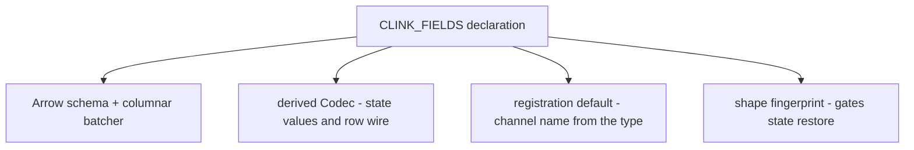

# 009: One declaration describes a type everywhere

**Status:** accepted, implemented 2026-08-27 (the v0.9 tree). The
implementation record: [Declared types](../internals/derived-types.md).
Two details refined at implementation and noted below in place.

## Context

A user's own record type crosses five of the engine's surfaces, and today
each crossing is declared separately:

| Declaration | What consumes it |
| --- | --- |
| `struct Trade { ... }` | the C++ type itself |
| `Codec<Trade>` | state values, the network bridges' row fallback |
| `register_type<Trade>("name", codec)` | the channel registry, cluster-wide by string name |
| `CLINK_ARROW_FIELDS(Trade, ...)` | Arrow schema: columnar wire, Parquet, state-as-data |
| `SchemaVersionTrait<Trade>` | state schema evolution |

Five statements of one fact. Four are mechanical, and the heaviest is the
codec: in `examples/heavy_pipeline_job.cpp`, nine lines of struct carry
forty-eight lines of hand-written `Codec<T>` whose body is nothing but a
field-by-field walk in declaration order. Nothing in it is a decision,
and every hand-written copy of it is a chance for the encode and decode
sides to disagree.

The raw material for deriving all of it already exists.
`CLINK_ARROW_FIELDS(T, a, b)` expands to descriptors built by
`make_arrow_field_descriptor("a", &T::a)`: each carries the field name
and the pointer to member, so the field's C++ type is recoverable at
compile time. The columnar machinery already consumes those descriptors
recursively (fixed-width integers, `float`, `double`, `bool` and
`std::string` as leaves; `std::optional`, `std::vector`, `std::map` and
nested described structs as composites), and the plain `register_type`
already auto-selects the generated columnar batcher for any described
type. The metadata is in place; it simply stops short of the codec, the
registration name and the evolution gate.

## Decision

One field-list declaration per type, and everything else derived from it:

```cpp
struct Trade {
    std::int64_t id{};
    std::string symbol;
    double price{};
};
CLINK_FIELDS(Trade, id, symbol, price);
```



`CLINK_FIELDS` is `CLINK_ARROW_FIELDS` renamed, because what it declares
stops being Arrow-specific; the old name remains as a deprecated alias.
The macro stays the **adapter** form - it annotates an existing struct
rather than defining one - and the trait it populates
(`ArrowFields<T>::descriptors()`) is the stable seam. The macro is one
frontend onto that trait; when C++26 static reflection is usable on our
toolchains, a reflection-based frontend can populate the same trait with
no macro and nothing downstream changes.

What the declaration derives:

1. **Arrow schema and columnar batcher.** Exists today, unchanged.
2. **`Codec<T>`.** Generated field-by-field in declaration order, with
   `encode_into` so the hot path appends without temporaries. The byte
   format is specified, not incidental (below).
3. **Registration defaults.** `register_type<Trade>(reg)` with the
   channel name defaulting to the type's declared name, and the codec
   and batcher supplied by the trait. The explicit-name and
   explicit-codec overloads remain for types that need them.
4. **A shape fingerprint.** A compile-time hash over the ordered
   `(field name, wire kind)` sequence, recursive into composites.
   Snapshots already carry `schema_version_v<T>` (a hand-bumped integer
   defaulting to 1); the fingerprint rides beside it, and a restore that
   sees a changed fingerprint under an unchanged version **refuses**
   instead of misreading bytes. The explicit version keeps expressing
   migration intent; the fingerprint is the gate that catches the bump
   nobody made. As implemented it rides a NEW snapshot metadata key
   (`clink.state_fingerprints`), because the snapshot format contract
   already declares added metadata keys a compatible change - simpler and
   safer for downgrade readers than the eof-guarded binary tail this
   record first sketched. A completed migration clears the migrated
   slots' stamps, which is what reduces the bind-time rule to "stored
   differs from live means refuse" with no version consultation.

### The derived encoding, specified

The moment state persists through the generated codec, its layout is a
durability contract, so it is written down and frozen rather than left
as an implementation detail:

- fixed-width integers: little-endian, natural width; `bool` one byte
  (0 or 1); `float`/`double` as the same-width integer via bit cast
- `std::string`: u32 little-endian length, then the bytes
- `std::optional<E>`: one presence byte, then the payload when present
- `std::vector<E>`: u32 little-endian count, then the elements
- `std::map<K, V>`: u32 little-endian count, then key/value pairs in the
  map's key order (deterministic by construction)
- nested described structs: their fields, recursively, in declared order
- no per-record header: schema version and fingerprint live in the slot
  metadata, as today

This deliberately matches the idiom the hand-written codecs already use
(little-endian fixed-width, u32 length-prefixed strings), so migrating a
type whose hand codec followed the idiom does not rewrite its bytes.
Decode fails closed: truncation yields `nullopt`, never a partial value.

Because field order in the declaration is now semantic - reordering the
macro's arguments rewrites every checkpoint byte - the encoding joins the
compatibility-domain inventory (`docs/internals/protocol-compatibility.md`)
on day one: a frozen-bytes fixture under `tests/fixtures/`, exercised by
`tests/test_format_fixtures.cpp`, written by one build and readable by
every later one. The fingerprint gate then turns the innocent-reorder
mistake from silent corruption into a refused restore.

### A completeness guard

The adapter form's one genuine hazard is the field somebody forgot: a
member missing from the list is silently absent from the wire, the
snapshot and every Parquet file. For aggregate types the arity is
checkable without reflection (the brace-initialisability probe), so the
macro gains a `static_assert` that the descriptor count equals the
member count, with an explicit opt-out macro for the rare partial
description done on purpose. Non-aggregates cannot be counted before
C++26 and keep today's behaviour.

## Alternatives rejected

**A defining macro** (`CLINK_RECORD(Trade, (int64_t, id), ...)`), which
restates each field's type. The compiler already knows the types through
the member pointers, so the type list adds a second source of truth that
can drift, and a defining macro cannot annotate a type that already
exists - the common case in an established codebase - and fights
templates, private members, methods and non-default constructors.
Diagnostics land inside the macro expansion instead of on the user's
line.

**Silent aggregate reflection** (deriving fields with no declaration at
all, PFR-style). Field names are load-bearing here - they are the Arrow
column names and the future SQL surface - and a silent derivation makes
adding or reordering a struct member a silent change to persisted bytes.
The explicit list is one line, and that line is the statement of intent
a durability format deserves. Under C++26 reflection an implicit
frontend may become an opt-in convenience; the explicit form stays the
recommendation for any type that persists.

## Consequences

- Adopting a type costs one line, not five declarations and ~50 lines of
  codec. The measured acceptance case: `heavy_pipeline_job.cpp` loses
  its two hand codecs entirely, and a consumer example runs one
  declared type through wire, keyed state, Parquet and a restore.
- A second encoding family enters the compatibility inventory and must
  be honoured forever. That is the price of deriving a durability
  format, and it is paid once, in fixtures, rather than per type.
- The generated codec must not cost throughput on the paths that keep
  hot state: parity with a representative hand codec on
  `clink_serde_bench` is an acceptance gate, not an afterthought.
- The macro survives until reflection arrives. That is accepted: the
  trait seam means the macro's eventual removal is a frontend swap, not
  a migration.

## Delivery (v0.9)

1. Derived `Codec<T>` + the encoding fixture + the inventory entry, with
   serde-bench parity measured.
2. Registration defaults and the fingerprint gate at restore, including
   the snapshot-tail evolution and its fixture.
3. The `CLINK_FIELDS` rename (alias kept), examples and consumer
   examples migrated, docs updated - capabilities row only when shipped.

Each phase lands with its tests and fixtures in the same change, per the
repository's working conventions.
