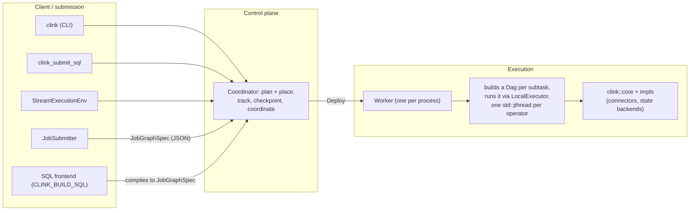

# Architecture and component stack

> The layered structure of clink, from the in-process engine core through the connector and state-backend impls, the cluster control plane, the SQL frontend, and the client and daemon binaries, and how a job moves from submission to running operators.

## Overview

clink is an Arrow-native, stateful stream processing engine written in modern C++ (C++23). Its model of typed operator DAGs, in-band watermarks, in-band checkpoint barriers, keyed state, and exactly-once checkpointing is inspired by Apache Flink, reworked in C++ around columnar execution and JVM-free deployment. This page is the entry point to the internals reference. It orients you to the major layers and how they fit together, then links out to the dedicated pages for each subsystem. The codebase is structured so that the same operator and DAG abstractions serve both a single-process in-memory run and a distributed multi-process cluster: the engine core knows nothing about the cluster, and the cluster reuses the core's `Dag` and `LocalExecutor` to run each subtask.

## Where it lives

| Layer | Location | What it is |
|-------|----------|------------|
| Engine core | `include/clink/core/`, `include/clink/operators/`, `include/clink/runtime/`, `src/runtime/` | Types, operators, the `Dag`, the in-process `LocalExecutor`, channels, state plumbing. Compiled (with `src/`) into `libclink_core`. |
| Connectors and backends | `impls/` | Optional source/sink connectors and state backends, each a separate static library (`clink::kafka`, `clink::s3`, `clink::rocksdb`, and so on). |
| Cluster control plane | `include/clink/cluster/`, `src/cluster/` | `Coordinator`, `Worker`, the binary TCP protocol, planning, placement, rescale, HA. |
| SQL frontend | `include/clink/sql/`, `src/sql/` | Parser, AST, binder, optimizer, physical planner. Built behind `CLINK_BUILD_SQL` (off by default). |
| Public API | `include/clink/api/`, `include/clink/application/`, `include/clink/job/` | `Pipeline`, `DataStream<T>`, descriptors, `JobSubmitter`, the `CLINK_REGISTER_JOB` plugin contract. |
| HTTP and observability | `include/clink/http/`, `include/clink/metrics/` | The JSON API, dashboard, Prometheus exposition. Built behind `CLINK_BUILD_HTTP` (on by default). |
| Binaries | `tools/` | `clink` (client CLI), `clink_node` (the coordinator/worker daemon), `clink_submit_sql`, and the standalone client binaries. |

Key types to start from:

- `include/clink/core/stream_element.hpp` defines `StreamElement<T>`, the in-band envelope on every channel.
- `include/clink/core/types.hpp` defines the strong identifiers `OperatorId`, `PartitionId`, `CheckpointId` and `operator_id_from_uid`.
- `include/clink/operators/operator_base.hpp` defines the `Operator<In, Out>`, `Source<T>`, and `Sink<T>` interfaces.
- `include/clink/runtime/dag.hpp` defines `Dag`, which builds the topology and owns the type-erased operator runners.
- `include/clink/runtime/local_executor.hpp` defines `LocalExecutor`, the one-thread-per-operator in-process runtime.
- `include/clink/cluster/job_graph.hpp` defines `JobGraphSpec`, the serialised, parser-agnostic description of a job.

## How it works

### The layering



Everything below the control plane is the engine core. `clink::core` has no dependency on the cluster, the connectors, or SQL. The connectors and state backends in `impls/` depend on the core and register themselves with an operator registry. The cluster control plane sits above the core: it accepts a `JobGraphSpec`, decides how to lay it out across workers, and hands each worker a chain of operator descriptors that the worker rebuilds into a `Dag` and runs with the very same `LocalExecutor` used for in-process jobs.

### The data plane: operators, channels, and the DAG

At the bottom is a typed dataflow graph. Operators are interfaces, not user closures. `Operator<In, Out>` (in `include/clink/operators/operator_base.hpp`) declares `process(const StreamElement<In>&, Emitter<Out>&)` plus optional hooks for watermarks, barriers, timers, and flush. `Source<T>` and `Sink<T>` are the endpoints. Built-in operators (`MapOperator`, `FilterOperator`, `KeyByOperator`, the window operators, `ReduceOperator`, the join and CEP operators) implement these interfaces.

Every channel between two stages carries a `StreamElement<T>`, a variant of four kinds:

| Kind | Payload | Meaning |
|------|---------|---------|
| `Data` | `Batch<T>` of `Record<T>` | user records |
| `Watermark` | `Watermark` | event-time progress |
| `Barrier` | `CheckpointBarrier` | a checkpoint cut |
| `Drain` | `DrainMarker` | an upstream subtask is winding down for rescale |

All four flow in-band on the same channel because correct semantics require time, checkpoints, and rescale signals to be ordered against the data they cover. A watermark sent out of band could race ahead of records it logically covers; a barrier sent out of band would break the Chandy-Lamport alignment that underpins exactly-once. The transport is `BoundedChannel<StreamElement<T>>` (`include/clink/runtime/bounded_channel.hpp`); a full channel blocks the producer, which is the only backpressure mechanism. Default capacity is 1024 elements, settable per-DAG via `Dag::set_default_channel_capacity`.

`Dag` (`include/clink/runtime/dag.hpp`) is the builder and owner. Its `add_source<T>`, `add_operator<In, Out>`, and `add_sink<T>` methods wire operators together by allocating the connecting channels and returning a `StageHandle<T>` that carries the upstream's output channel so the next stage can attach. It also offers branching (`fork`, `add_split`), merging (`union_streams`), keyed sharding (`add_sharded_keyed`), interval joins (`interval_join`), side outputs (`side_output`), and a blocking exchange for batch boundaries. For each stage `Dag` constructs a type-erased `detail::OperatorRunner`: a closure that, given a `RuntimeContext` and a stop predicate, drives one operator from its input channel into an `Emitter` until upstream closes. The runner closure is where the per-operator loop lives: it polls the input, fires due timers, routes data through the columnar fast path or `process()`, snapshots state when a barrier passes, and acks checkpoints. The same runner serves both the in-process and cluster paths.

### The in-process runtime: LocalExecutor

`LocalExecutor` (`include/clink/runtime/local_executor.hpp`, `src/runtime/local_executor.cpp`) runs a `Dag` by spawning one `std::jthread` per runner and giving each its own `RuntimeContext`. Communication is exclusively through the bounded channels the `Dag` owns. `run()` is start, await, return; `start()` and `await_termination()` split it; `cancel()` asks every operator to stop by closing channels. Worker-thread exceptions are captured into `operator_errors()` rather than crashing the process. For bounded jobs `run_to_completion()` validates termination first, and `take_savepoint()` captures final keyed state for a batch-to-stream bootstrap. This is deliberately the simplest possible runtime; the same `Dag` and channels could host a more sophisticated scheduler.

### Submission and the cluster control plane

A job is described by a `JobGraphSpec` (`include/clink/cluster/job_graph.hpp`): a list of `OperatorSpec` entries, each carrying an `op_type` string, an `out_channel` type, a `parallelism`, and a free-form `params` map of `key=value` strings consumed by the operator's registered factory. The spec is parser-agnostic and serialises to and from JSON (`to_json` / `from_json`, which auto-validates). It is the single interchange format: the fluent API, the programmatic Table API, and the SQL frontend all produce the same `JobGraphSpec`.

The control plane is two roles, both served by one binary, `clink_node` (`tools/clink_node.cpp`), selected with `--role=coordinator` or `--role=worker`:

- `Coordinator` (`include/clink/cluster/coordinator.hpp`) is the cluster's source of truth. Workers register with it; it accepts a submitted `JobGraphSpec`, plans it (`JobPlanner`, `include/clink/cluster/job_planner.hpp`) into a `JobPlan` of deployment tasks, places each task on a worker with a free slot (greedy first-fit), assigns key-group ranges per subtask, sends `Deploy` messages, tracks completion and acks, coordinates checkpoints, and runs a watchdog that declares lost workers on heartbeat timeout.
- `Worker` (`include/clink/cluster/worker.hpp`) hosts execution slots. On `Deploy` it rebuilds the operator chain for its subtask, wiring inbound and outbound `NetworkBridgeSource`/`NetworkBridgeSink` stages for cross-process edges, then runs the chain through a `LocalExecutor`, exactly as in-process. It heartbeats the coordinator and registers per-subtask callbacks for checkpoint commit, abort, and source-barrier injection.

The two communicate over a binary, length-prefixed TCP protocol (`include/clink/cluster/protocol.hpp`, `messages.hpp`) carrying `Register`, `Deploy`, `Heartbeat`, `SubtaskFinished`, `TriggerCheckpoint`, `CommitCheckpoint`, `AbortCheckpoint`, `CancelJob`, `RescaleJob`, and `PeerUpdate` among others.

### How a job flows from submission to running operators

```
  1. build       Pipeline / Table API / SQL  ->  JobGraphSpec (JSON)
  2. submit      JobSubmitter (TCP) or POST /api/v1/jobs[/spec]  ->  Coordinator
  3. plan        JobPlanner expands parallelism, cuts chains, assigns key groups
  4. place       Coordinator picks a worker slot per subtask (first-fit), resolves peers
  5. deploy      Coordinator sends Deploy(OperatorChainSpec) to each chosen worker
  6. build       Worker rebuilds a Dag for the subtask, wiring network bridges
  7. run         Worker runs the Dag via LocalExecutor (one jthread per operator)
  8. operate     sources produce; barriers, watermarks, data flow in-band; sinks emit
  9. checkpoint  coordinator triggers barriers into sources; subtasks snapshot + ack; coordinator commits
 10. finish      sources reach EOS, SubtaskFinished propagates, coordinator marks the job done
```

A compiled job plugin (`CLINK_REGISTER_JOB`) is a `.so` that exports `clink_job_build`, which returns the `JobGraphSpec` JSON. The coordinator dlopens the same `.so` on every worker so user operator types resolve consistently. A spec-only job, such as one compiled by the SQL frontend, references only built-in operator factories already registered on every worker and is submitted as JSON with no plugin (`POST /api/v1/jobs/spec`, or the `JobSubmitter` path).

### The SQL frontend

When built with `CLINK_BUILD_SQL=ON`, the SQL frontend (`include/clink/sql/`) is a compiler in front of the cluster, not a separate runtime. `libpg_query` parses the text; an AST builder normalises it into `clink::sql::ast`; a binder type-checks against a `Catalog` and lowers to a `LogicalPlan`; an optimizer applies projection pushdown; a physical planner lowers the logical tree to a `JobGraphSpec` of registered operators. `clink::sql::install(reg)` registers the SQL operator factories, which `clink_node` calls at startup when the frontend is linked. The result submits through the same HTTP path as a compiled plugin.

### What the connectors and backends are

The `impls/` modules are optional libraries layered on the core. Each is gated by a `CLINK_WITH_<NAME>` CMake option (default `AUTO`: built when its dependency is found). Connectors register source and sink operator factories; state backends (`clink::rocksdb`, `clink::rocksdb_s3`) implement the `StateBackend` interface. The core ships header-only connectors (file, Parquet, text) directly under `include/clink/connectors/`. Connectors are documented separately; see [../connectors/README.md](../connectors/README.md).

## Key types and APIs

| Type / function | Location | Responsibility |
|-----------------|----------|----------------|
| `StreamElement<T>` | `core/stream_element.hpp` | The in-band channel envelope (Data, Watermark, Barrier, Drain). |
| `Operator<In, Out>`, `Source<T>`, `Sink<T>` | `operators/operator_base.hpp` | The operator interfaces every built-in and user operator implements. |
| `Dag` | `runtime/dag.hpp` | Builds the topology, owns operators, channels, and the type-erased runners. |
| `detail::OperatorRunner` | `runtime/dag.hpp` | The per-operator drive loop reused by both runtimes. |
| `LocalExecutor` | `runtime/local_executor.hpp` | The in-process runtime: one `std::jthread` per operator. |
| `RuntimeContext` | `runtime/runtime_context.hpp` | Per-operator handle to state, timers, metrics, side outputs, checkpoint acks. |
| `JobConfig` | `runtime/job_config.hpp` | Per-run config: state backend, restore source, execution mode, checkpoint mode. |
| `JobGraphSpec`, `OperatorSpec` | `cluster/job_graph.hpp` | The serialised, parser-agnostic job description. |
| `Coordinator` | `cluster/coordinator.hpp` | Plan, place, deploy, track, coordinate checkpoints, watchdog. |
| `Worker` | `cluster/worker.hpp` | Host slots, rebuild a subtask `Dag`, run it via `LocalExecutor`. |
| `JobSubmitter` | `application/job_submitter.hpp` | Client-side submit of a `JobGraphSpec` over the control protocol. |
| `operator_id_from_uid` | `core/types.hpp` | Derives the stable `OperatorId` from a `.uid(...)` for state restore. |

## Configuration and knobs

These set the shape of the stack. Subsystem-specific knobs are documented on the relevant pages.

| Knob | Where | Default | Effect |
|------|-------|---------|--------|
| `CLINK_BUILD_SQL` | CMake | off | Build the SQL frontend and `clink_submit_sql`. |
| `CLINK_BUILD_HTTP` | CMake | on | Build the HTTP/JSON API and dashboard into `clink_node`. |
| `CLINK_BUILD_TESTS` / `CLINK_BUILD_EXAMPLES` | CMake | on | Build the test suites and in-tree examples. |
| `CLINK_BUILD_BENCH` | CMake | off | Build the benchmarks. |
| `CLINK_WITH_<NAME>` | CMake | `AUTO` | Per-impl gate: `AUTO` builds when the dep is found, `ON` makes a missing dep a hard error, `OFF` always skips. RocksDB is always built and cannot be turned off. |
| `--role=coordinator|worker` | `clink_node` | (required) | Select coordinator or worker mode. |
| `--port` | `clink_node` (coordinator) | `6123` (`kDefaultCoordinatorPort`) | Control-plane listener port. |
| `--http-port` | `clink_node` | `0` (disabled) | Enable the HTTP API and dashboard on this port. |
| `--heartbeat-timeout-ms` | `clink_node` (coordinator) | `5000` | How long without a heartbeat before a worker is declared lost. |
| `--watchdog-interval-ms` | `clink_node` (coordinator) | `200` | Watchdog liveness re-evaluation cadence. |
| Default channel capacity | `Dag` | `1024` | Per-channel queue depth; the backpressure threshold. |

The coordinator defaults shown are the `clink_node` command-line defaults; `Coordinator::Config` and `Worker::Config` carry their own in-code defaults used by the in-process and test paths.

## Guarantees and caveats

- The engine core is independent of the cluster, connectors, and SQL. In-process jobs run with no coordinator or worker.
- The same `Dag`, operator runners, and `LocalExecutor` drive both in-process and per-subtask cluster execution, so behaviour does not fork between the two.
- Exactly-once is provided by snapshot-on-barrier plus two-phase-commit sinks, and applies only to sinks that implement the 2PC contract (directly or via `CommittingSink`): the file, Parquet (local and object-store), raw-S3 multipart, Postgres `PREPARE TRANSACTION`, and transactional Kafka sinks. Other sinks are at-least-once, or effectively-once in `mode='upsert'`. See [./checkpointing.md](./checkpointing.md) and [./sink-committer-framework.md](./sink-committer-framework.md).
- The failure posture is self-heal-by-default once checkpointing is configured: with a checkpoint directory set, `max_restarts_on_worker_loss` resolves to a bounded default (10) and the job restarts from its last completed checkpoint; without one the posture is fail-fast. An explicit value overrides either way. See [./fault-tolerance-and-rescale.md](./fault-tolerance-and-rescale.md).
- The columnar fast path is taken only when an operator opts in and the input batch carries an Arrow sidecar; row-form inputs fall back to `process()`. See [./columnar-execution.md](./columnar-execution.md).
- The async, disaggregated-state path activates only when both the operator opts in and the state backend can genuinely defer reads; otherwise execution stays on the synchronous path. See [./async-state-execution.md](./async-state-execution.md).
- The SQL frontend and the HTTP API are build-gated (`CLINK_BUILD_SQL` off by default, `CLINK_BUILD_HTTP` on by default but disabled unless `--http-port` is set).
- Several capabilities carry their own correctness caveats called out in the project README Status section and on the per-subsystem pages; consult those before relying on a feature in production.

## Related

- [./operator-model.md](./operator-model.md) - the operator interfaces and the DAG builder in depth.
- [./task-lifecycle.md](./task-lifecycle.md) - the per-subtask runtime and the operator runner loop.
- [./jobs-and-scheduling.md](./jobs-and-scheduling.md) - parallelism, planning, and slot placement.
- [./distributed-runtime.md](./distributed-runtime.md) - the coordinator, worker, and control protocol.
- [./network-stack.md](./network-stack.md) - cross-process data exchange and bridges.
- [./time-and-windowing.md](./time-and-windowing.md) - watermarks, windows, and CEP.
- [./state-and-backends.md](./state-and-backends.md) - keyed state and the state backends.
- [./checkpointing.md](./checkpointing.md) - barriers, alignment, and the coordinator.
- [./fault-tolerance-and-rescale.md](./fault-tolerance-and-rescale.md) - failover, rescale, and schema evolution.
- [./columnar-execution.md](./columnar-execution.md) - the Arrow-native columnar path.
- [./async-state-execution.md](./async-state-execution.md) - async execution and disaggregated state.
- [./sql-frontend.md](./sql-frontend.md) - the SQL compiler internals.
- [../connectors/README.md](../connectors/README.md) - the source and sink connector reference.
