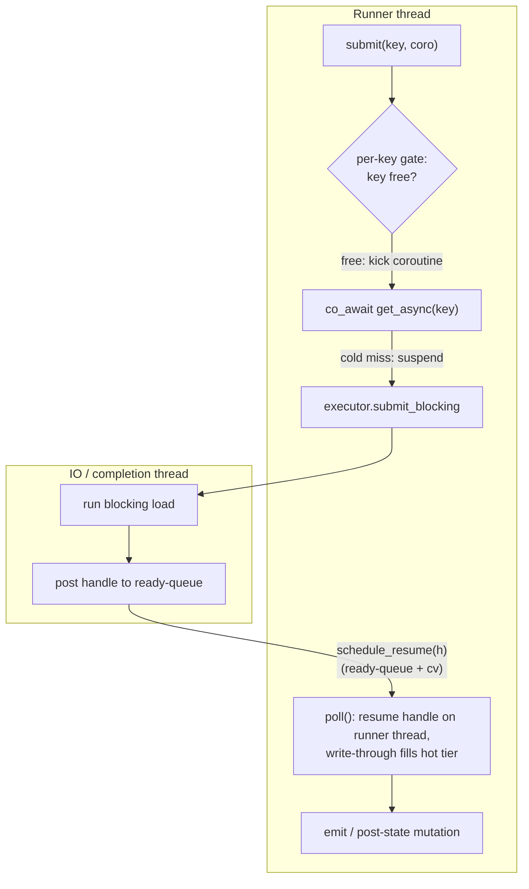

# Async execution and disaggregated state

> A coroutine substrate that lets keyed operators issue non-blocking state reads and enrichment lookups, backed by a remote state tier with a bounded in-memory hot cache.

## Overview

A keyed operator normally reads its state synchronously: a `get` returns the value or blocks the runner thread until it does. That is fine when state lives in process RAM, but a disaggregated backend keeps the bulk of its state in a remote tier (an object store), so a cold read can take a network round-trip. The async substrate exists so a single slow read does not stall the runner. A record whose read misses the hot tier suspends its own coroutine, the load runs off-thread, and the runner keeps making progress on other keys; the suspended record resumes on the runner thread once its value arrives.

The same coroutine primitive (`clink::async::Task<T>`) also drives enrichment lookups against external services through the io_uring HTTP client, with retry, circuit-breaking and a PID controller available as composable utilities.

The disaggregated state tier is `RemoteReadBackend`: a hot in-memory tier in front of a durable remote tier (`RemotePool`), with a blocking load on a cold miss, working-set eviction once a byte budget is exceeded, and snapshot/restore that commits only the delta and restores lazily.

## Where it lives

| Area | File | Type / responsibility |
| --- | --- | --- |
| Coroutine primitive | `include/clink/async/task.hpp` | `Task<T>` / `Task<void>`: lazy-start, move-only, awaitable coroutine |
| Completion source | `include/clink/async/completion_executor.hpp` | `CompletionExecutor` interface; `ThreadPoolCompletionExecutor` (portable default) |
| io_uring reactor | `include/clink/async/io_uring_reactor.hpp`, `src/async/io_uring_reactor.cpp` | `IoUringReactor`: SQE/CQE ring, sleep/read/write/accept/connect awaitables (Linux only) |
| io_uring executor | `include/clink/async/io_uring_completion_executor.hpp` | `IoUringCompletionExecutor`: fd reads via io_uring, opaque work via a thread pool |
| HTTP client | `include/clink/async/http_pool.hpp`, `src/async/http_pool.cpp` | `HttpPool`: coroutine HTTP/1.1 with keep-alive pooling (Linux only) |
| Resilience utilities | `include/clink/async/circuit_breaker.hpp`, `retry_policy.hpp`, `pid_controller.hpp` | `CircuitBreaker`, `retry()` / `RetryPolicy`, `PidController` |
| Per-subtask controller | `include/clink/runtime/async_execution_controller.hpp` | `AsyncExecutionController`: per-key gate, epoch manager, cross-thread ready-queue |
| Disaggregated backend | `include/clink/state/remote_read_backend.hpp` | `RemoteReadBackend`: hot tier + remote tier, `get_async`, eviction, async persist |
| Read coalescer | `include/clink/state/coalescing_backend.hpp` | `CoalescingBackend`: decorator collapsing per-record reads into one `get_many_async` |
| Lookup operator | `include/clink/operators/async_lookup_operator.hpp` | `AsyncLookupOperator<In,Out>`: drives a `Task<Out>`-returning lookup per record |
| Runner wiring | `include/clink/runtime/dag.hpp` | Wires the controller, resume scheduler, flush hook and resume order |

## How it works

There are two related but distinct uses of the substrate: async state reads inside keyed operators, and async enrichment lookups against external services. Both are built on `Task<T>`.

### The Task coroutine

`Task<T>` (`include/clink/async/task.hpp`) is a minimal C++20 coroutine return type. It is lazy-start (`initial_suspend` returns `suspend_always`, so the body does not run until something resumes it), move-only (RAII over the `std::coroutine_handle`, destroyed on drop), and exception-safe (an uncaught throw inside the body is captured on the promise and rethrown from `get()`). The public surface is `resume()`, `done()`, `get()`, `has_exception()` and `valid()`.

A `Task<T>` is itself awaitable, so a coroutine can `co_await another_task()` to chain async work. The awaiter records the awaiting coroutine as a continuation on the awaited task's promise, and the `FinalAwaiter` (in `detail::PromiseBase`) hands control back to that continuation at `final_suspend` via symmetric transfer. A scheduler (the operator, or the `AsyncExecutionController`) is responsible for driving the outermost task forward.

### The async state read path

The controlling component is `AsyncExecutionController` (`include/clink/runtime/async_execution_controller.hpp`), one per keyed-operator subtask. Its design rests on a single rule: coroutines are only ever resumed on the runner thread. That keeps the per-key gate, the in-flight table, the parked-waiter FIFOs and the epoch bookkeeping runner-thread-private and lock-free. The only cross-thread surface is `schedule_resume(handle)`, which a foreign IO thread calls to hand a suspended handle back through a mutex-guarded ready-queue and wake the runner.

Three mechanisms make this correct:

- **Per-key gate.** At most one in-flight computation per key. A second record for a busy key parks FIFO and is promoted when the in-flight one completes (`finish_record_`), so same-key reads always observe prior same-key writes regardless of completion timing. Distinct keys overlap freely. The default in-flight cap is `kDefaultMaxInFlight = 6000`; `submit()` returns false at the cap so the caller applies backpressure.
- **Epoch manager.** Records are tagged with the epoch they arrive in. `on_watermark(on_release)` closes the current epoch, opens a new one, and queues the release action. `try_release_()` runs that action (forward the watermark downstream and fire due event-time timers) only once the epoch has finished, that is every record that arrived before the watermark has completed its post-state stage, and every earlier epoch has already released. Releases run in epoch order on the runner thread, so an async operator never forwards a watermark or fires a timer while an earlier record is still pending. See ./time-and-windowing.md.
- **Barrier drain.** `drain_for_barrier()` drains all in-flight and parked records to quiescence before the caller runs `capture()`/`snapshot()`, so the captured cut is consistent (no torn, double-counted or lost state). See ./checkpointing.md.

A faulted record body is caught in `wrap_()`, recorded as `first_error_`, and the record is still accounted so its key releases and its epoch advances; `poll()` / `drain()` then rethrow on the runner thread so it follows the normal operator-failure path.

The operator opt-in is declared on `Operator` / `CoOperator` in `include/clink/operators/operator_base.hpp`: `supports_async()`, plus `process_async()`, which the runner calls instead of `process()` when `supports_async()` is true **and** the bound state backend reports `supports_async_get()`. The single-input and co-operator runners in `include/clink/runtime/dag.hpp` construct the controller, wire the backend's resume scheduler to it (via a `weak_ptr` so a late completion after teardown is a safe no-op), route watermarks and barriers through the controller, and route data through `process_async`. The default leaves every operator on the synchronous `process()` path, byte-for-byte unchanged.

In the SQL frontend (`src/sql/install.cpp`) the production adopters are `AggregateRowOp` (GROUP BY) and `EquiJoinRowOp` (stream-stream equi-join). They compute an `effective_async_` flag in `open()` from whether the bound backend defers reads, then return it from `supports_async()`, and their `process_async` issues one `co_await kv.get_async(key)` per record. See ./sql-frontend.md.

### Read coalescing

`coalesce_reads()` is a second opt-in. When true (and async is active), the runner wraps the per-subtask backend in a `CoalescingBackend` (`include/clink/state/coalescing_backend.hpp`) and registers its `flush()` as the controller's flush hook. Each record's `co_await kv.get_async(key)` then lands in the decorator, which does not issue a read immediately: it registers `(op, key)` into a pending batch and suspends the record. When the controller is otherwise stuck (every in-flight record suspended on its read, nothing ready), `drain()` calls the flush hook first, which issues one inner `get_many_async` for the whole pending batch and scatters each result back to its waiting record. So N records reading N distinct keys collapse into one batched (and, on a content-addressed pool, hash-coalesced) round-trip instead of N. This is safe because the per-key gate guarantees every pending read in a batch is for a distinct key, and the flush runs on the runner thread. `AggregateRowOp` and `EquiJoinRowOp` both set `coalesce_reads()` to true.

### Deadline-aware ordering

`deadline_aware()` is a third, independent opt-in. When true, the runner flips the controller to `ResumeOrder::Priority` and wires the backend's deadline-aware hand-back. The operator tags each read via `get_async(key, order_key)` (lower order_key resumes sooner, for example a deadline in milliseconds). `poll()` then `stable_sort`s a batch of already-ready, distinct-key completions by `order_key` before resuming them. Reordering is always safe: the per-key gate makes every ready completion a distinct key, and epoch/watermark releases are count-based and happen after the resume loop, so resume order cannot change which records belong to an epoch or when a watermark releases. `coalesce_reads()` and `deadline_aware()` are mutually defeating, the coalescer resumes batches inline rather than through the priority queue, so declaring both logs a warning (`dag.hpp`) and the deadline ordering is inert.

### The disaggregated state backend

`RemoteReadBackend` (`include/clink/state/remote_read_backend.hpp`) is the backend whose reads can genuinely block on a remote tier. State is two tiers: a hot in-memory tier (recent writes plus filled-on-read keys, held in an `InMemoryStateBackend`) and a cold remote tier reached through a `RemoteLoader`. It has two constructions:

- **Loader-only.** Cold reads go through an arbitrary `RemoteLoader` callable; snapshot/restore capture the hot tier only; there is no durable remote write-back. Used for read-through caching over an external loader, and for tests.
- **Pool-backed (production).** State is durable in a `RemotePool`. Cold reads fetch `(op, key)` from the pool as of the last committed checkpoint; snapshot commits only the delta since the last checkpoint; restore is lazy (cold reads serve the restored checkpoint, nothing is loaded eagerly), which is the fast-recovery and fast-rescale win.

`get(op, key)` (synchronous) returns a hot hit immediately, otherwise does a blocking remote load with the lock released and fills the result through into the hot tier. `get_async(op, key[, order_key])` is the non-blocking twin: a hot hit `co_return`s with no suspension; on a cold miss with a wired resume scheduler it suspends on a `RemoteLoad` awaiter whose `await_suspend` posts the blocking load to the completion executor and, on completion, calls `post_resume_` to hand the handle back to the runner; `await_resume` (on the runner) does the write-through under the lock. If no resume scheduler is wired, `get_async` degrades to a safe inline blocking load. `get_many_async` serves hot hits immediately then fetches all cold misses in one batched call with a single suspension (`RemoteLoadMany`).

The completion source behind the awaiter is the `CompletionExecutor` (`include/clink/async/completion_executor.hpp`). The default is a per-backend `ThreadPoolCompletionExecutor` sized by `io_threads` (default `kDefaultIoThreads = 8`); a shared or io_uring-backed executor can be injected at construction. `submit_blocking` runs an opaque callable (the production case, an S3 GET through the AWS SDK) on a worker thread; `submit_read` does a file-descriptor read. The executor never resumes a coroutine and never touches the hot tier; it only runs the load off-thread and posts the handle.

### Working-set eviction

A non-zero `hot_max_bytes` makes the working set genuinely exceed RAM. The hot tier carries LRU bookkeeping (`lru_` front is most-recently-used, `index_` maps the composed `(op,key)` to its node). Once `hot_bytes_` exceeds the budget, `maybe_evict_()` evicts least-recently-used **clean** keys back to the pool (clean meaning already durable at the last committed checkpoint), re-fetched on next read. A key that is dirty (written since the last checkpoint) or deleted is never evicted, so eviction never loses state; if every over-budget key is dirty the tier transiently exceeds budget and the next snapshot reclaims it. The futile skip-scan past pinned entries is bounded by `kMaxPinnedSkips = 256` so a write burst stays O(n) on the runner thread rather than O(n^2); productive evictions are uncapped.

### Async persist

Pool-backed snapshot splits into `capture(id)` (the operator-thread phase: detach a point-in-time copy of the delta into a pending commit, pin its keys so a read during the off-thread commit window still sees this checkpoint's effect) and `persist(handle)` (the worker-thread phase: durably commit the delta to the pool, advance `last_ckpt_`, release the pins, then re-run eviction). `supports_async_persist()` is true only when pool-backed. This moves the slow S3 commit off the operator and checkpoint-barrier threads onto the snapshot worker. The reasoning and pin lifecycle is in ./checkpointing.md; restore, rescale and lazy materialisation are in ./fault-tolerance-and-rescale.md and ./state-and-backends.md.

### The io_uring reactor and HTTP lookups

On Linux with liburing, `IoUringReactor` (`include/clink/async/io_uring_reactor.hpp`) owns one submission/completion ring and runs a single dispatch loop. Awaitables (`sleep_for`, `read_async`, `write_async`, `accept_async`, `connect_async`) submit SQEs from any thread under a submit mutex; `run()` reaps CQEs on the loop thread, copies the kernel result into the per-op `OperationState`, and resumes the awaiting coroutine on the loop thread. `stop()` posts a NOP SQE to wake a blocked `io_uring_wait_cqe`. If the submission queue is full, the awaiter resumes immediately with `-ENOMEM` rather than deadlocking. The header compiles to an empty namespace off Linux or without `CLINK_HAS_URING`.

`HttpPool` (`include/clink/async/http_pool.hpp`, `src/async/http_pool.cpp`) composes the socket awaitables into a coroutine HTTP/1.1 client with keep-alive connection pooling (capped by `max_connections`, default 16). It supports GET and POST with `Content-Length` bodies; it does not do chunked transfer-encoding, TLS, HTTP/2, or DNS (the host must be a dotted-quad IPv4 string), and a request over the connection cap fast-fails with `status = 0`.

`AsyncLookupOperator<In,Out>` (`include/clink/operators/async_lookup_operator.hpp`) drives a `std::function<async::Task<Out>(const In&)>` per record: it kicks each lookup's `Task<Out>`, keeps in-flight tasks in an ordered queue, and emits completed results in input order (or any order when `ordered = false`). The user expresses concurrency through `co_await` inside the lookup body, so a single thread can hold many in-flight lookups. Its watermark/barrier path currently spin-waits with a short sleep plus `resume()` to let suspended awaitables advance; this operator is not wired to the `AsyncExecutionController`.

### Resilience utilities

These are standalone, header-only, and composed by callers rather than wired automatically:

- `CircuitBreaker` (`circuit_breaker.hpp`): three-state breaker (Closed, Open, HalfOpen). `allow_call()` gates traffic; after `failure_threshold` consecutive failures (default 5) it trips Open; after `cooldown` (default 30s) it admits a single HalfOpen probe; success closes it, failure re-opens it. Lock-protected so concurrent lookups can share one breaker; emits transition metrics.
- `retry()` with `RetryPolicy` (`retry_policy.hpp`): wraps a callable in retry-with-backoff. `max_attempts` (default 1, no retry), `initial_backoff` (50 ms), `backoff_multiplier` (2.0), `max_backoff` (30 s), and a `should_retry` predicate (default: retry on any `std::exception`). The current implementation sleeps on the calling thread; an async variant is noted as future work in the source.
- `PidController` (`pid_controller.hpp`): a textbook PID controller with anti-windup and a clamped output, intended to drive adaptive rescaling decisions from a measured signal (for example a queue-fill ratio) towards a setpoint. It is pure math and is independent of operators and IO.

## Key types and APIs

- `clink::async::Task<T>` / `Task<void>`: lazy-start awaitable coroutine; `resume()`, `done()`, `get()`, `has_exception()`.
- `clink::async::CompletionExecutor`: `submit_blocking(job)` and `submit_read(fd, buf, len, done)`. `ThreadPoolCompletionExecutor` is the portable default; `IoUringCompletionExecutor` adds io_uring fd reads (Linux).
- `clink::async::IoUringReactor`: `run()`, `stop()`, and the sleep/read/write/accept/connect awaitables (Linux + `CLINK_HAS_URING`).
- `clink::async::HttpPool`: `request()`, `get()`, `post()` returning `Task<HttpResponse>` (Linux + `CLINK_HAS_URING`).
- `clink::AsyncExecutionController`: `submit(key, make_coro)`, `on_watermark(on_release)`, `schedule_resume(handle[, order_key])`, `poll()`, `drain()`, `drain_for_barrier()`, `set_flush_hook()`, `set_resume_order()`.
- `clink::RemoteReadBackend`: synchronous `StateBackend` surface plus `get_async`, `get_many_async`, `supports_async_get()`, `supports_async_persist()`, `capture()`/`persist()`, and `set_async_resume_scheduler` / `set_deadline_resume_scheduler`.
- `clink::CoalescingBackend`: `StateBackend` decorator with `flush()` and `flush_pending_reads()`.
- Operator opt-ins (`Operator` / `CoOperator`): `supports_async()`, `process_async()`, `coalesce_reads()`, `deadline_aware()`.

## Configuration and knobs

| Knob | Where | Default | Effect |
| --- | --- | --- | --- |
| `CLINK_HAS_URING` | CMake (`CMakeLists.txt`), Linux only when liburing is found | unset off Linux | Compiles the io_uring reactor and HTTP pool; otherwise their headers are empty namespaces |
| `kDefaultIoThreads` | `completion_executor.hpp` | 8 | Default thread-pool size for the completion executor |
| `kDefaultMaxInFlight` | `async_execution_controller.hpp` | 6000 | In-flight record cap before `submit()` applies backpressure |
| `io_threads` | `disagg-local://` query, `remote-read://` query | 1 (`disagg-local`), 8 (`remote-read`) | Sizes the per-backend completion executor |
| `hot_max_bytes` | `disagg-local://` / `remote-read://` query | a quarter of physical RAM, floor 64 MiB (`default_remote_hot_max_bytes`); `=0` forces unbounded | Hot-tier byte budget; non-zero enables LRU eviction back to the pool |
| `CircuitBreakerConfig` | constructed by the caller | `failure_threshold = 5`, `cooldown = 30s` | Trip threshold and cooldown |
| `RetryPolicy` | constructed by the caller | `max_attempts = 1`, `initial_backoff = 50ms`, `backoff_multiplier = 2.0`, `max_backoff = 30s` | Retry count and backoff schedule |

The `disagg-local://` scheme is registered in `src/state/state_backend_factory.cpp`; it builds a `RemoteReadBackend` over an in-process `InMemoryRemotePool`. The S3-backed `remote-read://<bucket>/<prefix>` scheme is registered by the S3 connector (`impls/s3/src/register_state_backend.cpp`) over an `S3RemotePool`. See ./state-and-backends.md.

## Guarantees and caveats

- **Threading contract.** Coroutines resume only on the runner thread; the controller's per-key state is lock-free by that invariant. A completion landing after subtask teardown is a safe no-op (the resume scheduler holds a `weak_ptr`).
- **Config-gated activation.** The async path activates only when an operator returns `supports_async()` true and the bound backend returns `supports_async_get()` true. Otherwise the operator runs the unchanged synchronous `process()` path. `coalesce_reads()` and `deadline_aware()` are further independent opt-ins; declaring both makes the deadline ordering inert (logged at wire-up).
- **Production adopters.** Among shipped operators the auto-on production adopters of async state are the SQL `GROUP BY` (`AggregateRowOp`) and stream-stream equi-join (`EquiJoinRowOp`). `AsyncLookupOperator` and `HttpPool` are the enrichment path and are not wired to the `AsyncExecutionController`.
- **io_uring is optional and Linux-only.** Without liburing the reactor, the io_uring completion executor and the HTTP pool are not built; the `Task`, controller, thread-pool executor and resilience utilities still work. The `IoUringCompletionExecutor` is built and tested but is deliberately not selected by the state-backend factory: no production loader is fd-level (the disaggregated tier is S3 over HTTP, which rides `submit_blocking`).
- **Eviction never loses state.** Only clean (already-durable) keys are evicted; dirty and deleted keys stay hot until the next checkpoint commits them. The pinned-skip scan is bounded, so the hot tier may transiently exceed its budget when its LRU tail is all-pinned.
- **Per-backend budgeting.** `default_remote_hot_max_bytes()` is per keyed-operator subtask. A node running many keyed operators with the default can oversubscribe RAM; per-operator or global budgeting is a deferred follow-on, and a caller can pass an explicit `hot_max_bytes` to bound it.
- **HTTP client limits.** `HttpPool` does not support chunked transfer-encoding, TLS, HTTP/2, or DNS resolution, and fast-fails past the connection cap.
- **`disagg-local://` is not durable.** Its pool is process RAM, so there is no cross-process failover or rescale and no remote-IO latency to overlap; it exists to make the async/disaggregated path reachable for correctness coverage without an object store. The throughput win needs the real S3-backed `remote-read://` tier.

## Related

- ./state-and-backends.md (keyed state, the `RemotePool`, and other backends)
- ./checkpointing.md (barriers, the capture/persist split, and the async-persist worker)
- ./fault-tolerance-and-rescale.md (lazy restore, rescale and schema evolution)
- ./operator-model.md (the operator opt-in surface and the runner)
- ./task-lifecycle.md (the local runtime and the runner loop)
- ./time-and-windowing.md (watermarks, epochs and event-time timers)
- ./sql-frontend.md (`AggregateRowOp` and `EquiJoinRowOp`, the production async adopters)
- ../connectors/README.md (the S3 connector that registers the `remote-read://` backend)
