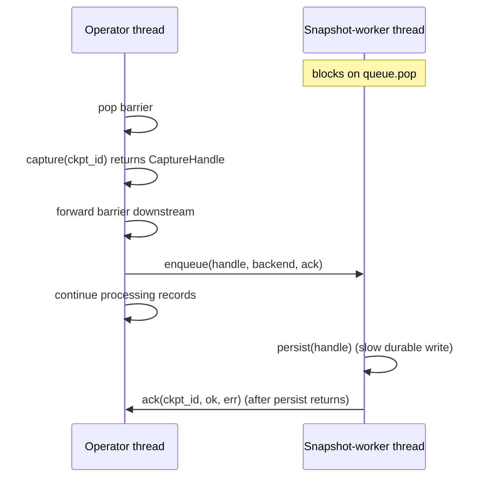

# Checkpointing and barriers

> How clink takes a globally consistent snapshot of a running job by flowing in-band barriers through the dataflow, snapshotting state on barrier receipt, and committing two-phase-commit sinks once every subtask has acked.

## Overview

A checkpoint is a globally consistent cut across a running job: every operator's keyed state, every source's read position, and every sink's pre-committed output, all corresponding to the same logical point in the stream. clink takes that cut with markers called barriers that travel in-band with the data. A coordinator periodically injects a barrier into the sources; each operator snapshots its state when the barrier passes through and acknowledges; once every subtask has acked, the checkpoint is complete and can be used as a recovery point. This is the substrate for fault tolerance and rescale (see [fault-tolerance-and-rescale.md](./fault-tolerance-and-rescale.md)); this page documents how the cut itself is produced and made durable.

## Where it lives

| Path | What it is |
|------|------------|
| `include/clink/checkpoint/checkpoint_barrier.hpp` | `CheckpointBarrier`: the in-band marker (id, terminal flag, alignment `Mode`) |
| `include/clink/checkpoint/checkpoint_coordinator.hpp` | `CheckpointCoordinator`: barrier creation, per-operator ack tracking, periodic trigger (local / single-process path) |
| `src/checkpoint/checkpoint_coordinator.cpp` | Coordinator implementation |
| `include/clink/runtime/multi_input_alignment.hpp` | `MultiInputAlignment`: the Chandy-Lamport alignment state machine for N-input operators |
| `include/clink/runtime/snapshot_worker.hpp` | `SnapshotWorker`: off-thread durable-write + ack |
| `include/clink/state/durable_file_write.hpp` | `write_fsync_rename` and `CLINK_STATE_FSYNC` |
| `include/clink/runtime/dag.hpp` | Barrier flow through source / single-input / multi-input / sink runners; the snapshot-on-barrier and unaligned-capture logic |
| `include/clink/operators/operator_base.hpp` | Source `snapshot_offset`/`restore_offset`/`notify_checkpoint_complete`/`notify_checkpoint_aborted`/`inject_pending_barrier`; sink `on_barrier`/`on_commit`/`on_abort`/`commit_group` hooks |
| `include/clink/connectors/file_2pc_sink.hpp` | `FileSink2PC<T>`: the canonical two-phase-commit sink |
| `include/clink/connectors/parquet_2pc_sink.hpp` | `ParquetSink2PC<T>`: a fsync-durable Parquet 2PC sink |
| `src/cluster/job_manager.cpp` | Cluster-side ack tracking, `COMPLETED-N` marker, `CommitCheckpoint`/`AbortCheckpoint` broadcast, commit-group gating |

The coordinator in `checkpoint/` drives the in-process (single-`LocalExecutor`) path. In a cluster the JobManager owns the equivalent ack-tracking and commit-broadcast logic; the per-operator runner mechanics in `dag.hpp` are identical on both paths.

## How it works

### The barrier

`CheckpointBarrier` is a value type carrying three fields: a `CheckpointId`, a `terminal` flag, and an alignment `Mode` (`Aligned` or `Unaligned`). It travels as a `StreamElement` on the same channels as data and watermarks, so it observes the same FIFO ordering as records. The barrier defines an epoch boundary: every record that precedes the barrier on a channel belongs to checkpoint N, and everything after belongs to N+1.

A barrier is `terminal` when a source emits it after `produce()` returns false. Terminal barriers flow downstream like any other barrier, but sinks treat them as both pre-commit and commit in one step (there is no recovery scenario past end-of-stream), so they finalise locally with no coordinator round-trip.

### The coordinator: barrier creation and ack tracking

`CheckpointCoordinator` is the single source of truth for the in-process checkpoint lifecycle. Operators register as participants via `register_operator(OperatorId)`. `trigger()` allocates the next `CheckpointId` under a lock, records the full set of registered operators as the checkpoint's pending-ack set in `in_flight_`, stamps the configured `default_mode` (or a per-trigger override, or a `ModeResolver` decision) onto a fresh barrier, and returns it.

`acknowledge(id, op)` removes one operator from that checkpoint's pending set. When the set empties, the coordinator calls `backend_->snapshot(id)`, records `last_completed_`, fires the `OnComplete` callback, and drops the in-flight entry. `abort(id, reason)` marks an in-flight checkpoint aborted (idempotent) and fires `OnAbort`. An ack for an unknown or already-aborted id is ignored.

`start_periodic_trigger()` spins a background thread that fires `trigger()` every `interval` and pushes the resulting barrier into each bound source injector (`set_source_injectors`). An `interval` of 0 disables periodic checkpointing.

### Injecting barriers into sources

Barriers enter the dataflow only at sources, and only between `produce()` calls, so there is no race between record emission and offset capture. The mechanism (`add_source` in `dag.hpp`, and the hooks on `Source` in `operator_base.hpp`):

1. The coordinator (or, in a cluster, the JobManager's trigger loop) calls a per-source injector, which calls `source->inject_pending_barrier(b)`. This appends the barrier to a mutex-guarded `pending_barriers_` queue on the source.
2. The source runner loop drains that queue between `produce()` calls via `drain_pending_barriers()`. For each pending barrier it: calls `source->snapshot_offset(backend, op_id, ckpt_id)` to persist the source's read position, then `emitter.emit_barrier(b)` to push the barrier downstream, then fires the ack callback.

Because draining runs on the same thread as `produce()`, the persisted offset and the emitted barrier reach durability atomically with respect to the record stream: every record emitted before the barrier was emitted before `snapshot_offset` ran. The runner stamps each barrier with the job-global mode derived from `JobConfig::unaligned_checkpoints` (or a per-operator override) so sources stay mode-agnostic and downstream operators read the policy off the barrier itself.

### Snapshot-on-barrier at a single-input operator

When a single-input operator runner pops a barrier and a state backend is present (`add_operator` in `dag.hpp`):

- Only the chain's **checkpoint owner** (the most-downstream operator sharing the backend in a fused chain) snapshots and acks. Non-owners stage their timer slice into the shared backend and forward the barrier. This keeps a shared backend single-writer per barrier, which a delta-commit backend such as `RemoteReadBackend` requires.
- The owner snapshots its timers (`snapshot_timers`), then snapshots state, then forwards the barrier downstream by calling `op->process()` (so any user `on_barrier` hook runs and the barrier reaches the output channel), then acks.
- If the operator is on the async-state path, the runner first calls `aec->drain_for_barrier()` to bring all in-flight async reads to quiescence so the captured cut reflects every record admitted before the barrier (no torn state). See [async-state-execution.md](./async-state-execution.md).

### The async snapshot worker

The expensive part of a checkpoint is the durable write, not building the in-memory state slice. `SnapshotWorker` (`snapshot_worker.hpp`) splits the two so record processing runs ahead of disk I/O while preserving the ack-after-durable invariant.

A worker is constructed per operator subtask only when the backend `supports_async_persist()` (FileBacked and disk-backed changelog; InMemory, RAM-only changelog and RocksDB stay on the synchronous path and never build one). The split:



`StateBackend::capture(ckpt_id)` produces a detached point-in-time blob cheaply on the operator thread; the barrier is forwarded immediately because the blob already reflects state at the barrier point. The worker calls `StateBackend::persist` (the slow `write_fsync_rename`) on its own thread and fires the ack **only after persist returns**, so an async checkpoint is never reported durable before its bytes are on stable storage.

The queue is FIFO, single-consumer, capacity 1: an operator may have at most one captured-but-not-persisted checkpoint queued behind the one being written. `enqueue` blocks once the worker falls a checkpoint behind, which bounds how far processing runs ahead of durability and provides backpressure for free. Teardown distinguishes a clean end-of-stream (`drain_and_join` persists and acks the backlog so a checkpoint the coordinator awaits still completes) from a cancel (`cancel_and_join` drops not-yet-started captures without acking; an un-acked checkpoint is simply never marked complete). If capture itself throws on the operator thread, the runner acks the failure inline.

### Barrier alignment at multi-input operators

A multi-input operator (join, co-process, union) receives the same barrier on each input channel, but not at the same time. `MultiInputAlignment` is the per-operator state machine that decides when to forward the barrier and which inputs to pause. The operator drives it by calling `on_barrier(input_index, barrier)` and reads back a `BarrierAdvance { forward, barrier, unaligned_first }`. The barrier's stamped `Mode`, pinned on first delivery of a given id, selects behaviour per-checkpoint.

#### Aligned mode (default, Chandy-Lamport)

```
input 0:  -- r r r || ---------------------  (barrier arrives, input 0 PAUSED)
input 1:  -- r r r r r r || ----------------  (records before barrier still flow)
                         ^ barrier on every alive input -> ALIGNED
forward:  -- r r r r r r || ----------------  barrier forwarded, inputs unpaused
```

On the first input to deliver barrier N, that input is paused (`input_paused(i)` returns true and the runner stops polling it). Records still arriving on the other inputs are records that precede the barrier on those channels and so belong to checkpoint N; they are processed normally. When every alive input has delivered N, `check_alignment_` forwards the barrier (preserving the stamped mode), unpauses all inputs, and records the align-wait time as a metric. Closed inputs implicitly satisfy any barrier and contribute `Watermark::max()` to the watermark min, so a finished input never wedges alignment. In-flight records are **not** persisted in aligned mode, because by the time the barrier forwards every input has reached it.

#### Unaligned mode (barriers overtake in-flight records)

```
input 0:  -- r r r || ---------------------  (barrier arrives FIRST)
                   |  forward immediately, no pause
input 1:  -- r r r [a b c] -----------------  (a b c are in-flight, NOT yet consumed)
forward:  -- r r r || ----------------------  barrier forwarded on first delivery
capture:           +- drain input 1's in-flight [a b c] into snapshot state
```

When the barrier is stamped `Unaligned`, the first input's delivery forwards the barrier immediately and never pauses, and the advance carries `unaligned_first = true`. The runner then drains the not-yet-delivered inputs' in-flight records and serialises them into the state backend under a per-operator key (for example the interval join writes `__interval_join_left_inflight__` / `__interval_join_right_inflight__` via `serialize_records_`). On restart those buffers are read back and replayed through local pending queues before the main poll loop resumes, so the records that the barrier overtook are not lost. This trades larger snapshots for faster checkpoint completion under backpressure. Subsequent deliveries of the same barrier id are absorbed silently and the alignment bookkeeping is GC'd once every alive input has been accounted for.

A union operator carries no state, so under unaligned mode it just lets the barrier overtake: the records still queued on the other inputs are forwarded on later iterations and, from the downstream operator's perspective, arrive after the barrier and so belong to the next epoch. Capture happens at the downstream stateful operator, not at union.

Per-checkpoint mode is decided by the first delivery and pinned for that id, so aligned and unaligned semantics never mix mid-flight for one checkpoint even if a later same-id delivery carried a different stamp. `apply_barrier_mode_override` lets a per-operator `JobConfig` override re-stamp a barrier (for example to force a stateful operator that does not implement in-flight capture to stay aligned while the rest of the job runs unaligned). Async multi-input operators force-align the popped/in-flight tail via `drain_for_barrier` while keeping the unaligned fast path for the unpopped other-channel records; an operator that cannot capture in-flight records is gated by `can_unalign` so an unaligned barrier degrades to aligned rather than losing data.

### Exactly-once: two-phase-commit sinks

Snapshot-on-barrier makes operator state recoverable; getting end-to-end exactly-once also requires that output is only published when the checkpoint that produced it is globally durable. That is the two-phase-commit (2PC) sink protocol. `FileSink2PC<T>` (`file_2pc_sink.hpp`) is the canonical implementation:

- **`on_data(batch)`** appends records to an in-progress staging file (`staging/sub<N>-pending.tmp`).
- **`on_barrier(b)` (the pre-commit / phase 1)** closes the in-progress file, atomically renames it to a checkpoint-tagged staging path (`staging/sub<N>-<id>.dat`), and stores that path in state under `_2pc_pending_<sub>_<id>`. The bytes are now pre-committed but not yet visible as output. The sink runner snapshots its state slice and acks.
- **`on_commit(id)` (phase 2)** atomically renames the staging file into `committed/`, then erases the state key. This is the only step that makes output visible.
- **`on_abort(id)`** deletes the staging file and erases the state key (idempotent).

`ParquetSink2PC<T>` (`parquet_2pc_sink.hpp`) follows the same staging-then-rename protocol but each pre-committed transaction is a complete, self-describing Parquet file written via `write_fsync_rename`, so a committed file is durable across an OS/power crash and readable by any standard Parquet consumer. The plain (non-2PC) `ParquetSink` and S3 sinks do not implement this contract; see [../connectors/README.md](../connectors/README.md) for which connectors are 2PC.

#### The commit phase and commit groups (cluster path)

Phase 2 is driven by the JobManager (`src/cluster/job_manager.cpp`):

1. As subtasks ack (`handle_subtask_checkpointed_`), the JM erases each from the checkpoint's pending set.
2. When the pending set empties, the JM advances `latest_completed_checkpoint_id`, writes a durable `COMPLETED-<id>` marker to the checkpoint directory, then broadcasts `CommitCheckpoint` to every TaskManager hosting tasks for the job. The marker is written **before** the broadcast, so a crash mid-broadcast still lets recovery find `COMPLETED-N` and commit on restart.
3. Each TaskManager dispatches `CommitCheckpoint` to the commit callbacks its sinks registered, which calls `Sink::on_commit(id)`. Non-2PC sinks ignore it.

A **commit group** lets several sinks commit atomically or all abort together. A sink declares membership with `set_commit_group(name)`. The JM tracks `commit_group_progress` per `(checkpoint, group)`: a member's failed ack aborts the whole group, in which case the JM broadcasts `AbortCheckpoint` (calling `Sink::on_abort`) to every TM hosting a member, sent before the commit broadcast so aborted-group sinks no-op on the following `CommitCheckpoint`. Idempotence of `on_commit`/`on_abort` is required because a recovery-time commit for an already-committed checkpoint may legitimately fire: at startup `FileSink2PC::open()` runs recovery, committing any leftover staging file whose tracked `checkpoint_id` corresponds to a `COMPLETED-N` marker.

### Fsync durability

A checkpoint is only honestly durable-before-ack if its bytes are on stable storage, not merely in the kernel page cache. `write_fsync_rename` (`durable_file_write.hpp`) provides that: it writes the temp file and fsyncs it **through the same descriptor that wrote it** (so a writeback error is not missed), atomically renames to the final path, then fsyncs the parent directory so the rename itself survives a crash. A successful return means both the bytes and the directory entry that names them are durable. The file fsync is strict (a failure throws, so the caller can ack the checkpoint as failed); the directory fsync is best-effort (its worst case is recovery falling back to the previous retained checkpoint, never corruption). This runs off the operator thread on the snapshot worker for async-capable backends, so the fsync cost is off the record-processing hot path.

Durability is on by default and disabled with `CLINK_STATE_FSYNC=0` (or `false`), which falls back to flush-then-rename for fsync-hostile CI or pure-throughput benchmarks where the durability contract is not under test. The variable is read once per snapshot, not per record, so the toggle is dynamic.

### Source-offset replay

The source side of exactly-once is `snapshot_offset` / `restore_offset` on `Source` (`operator_base.hpp`). `snapshot_offset(backend, op_id, ckpt_id)` persists whatever read position the source needs to resume from; it runs inside the barrier drain so the offset is captured atomically with the barrier. `restore_offset(backend, op_id)` is called by the source runner **before** `open()` on startup, so the source resumes from the recovered position. The defaults are no-ops: a source that does not override these replays from the start on restart (at-least-once at the source boundary). Sources that do override participate in pipeline-wide exactly-once. At end-of-stream a bounded source can request one final JM-coordinated checkpoint that durably commits the tail (records since the last completed periodic checkpoint) and blocks until it commits before the runner returns, so the job cannot be reported complete with an uncommitted tail; a crash in that window leaves the source unfinished and is recovered by restart-and-replay.

`Source` also exposes `notify_checkpoint_complete(ckpt_id)` / `notify_checkpoint_aborted(ckpt_id)` - the source-side mirror of a 2PC sink's `on_commit` / `on_abort`. Where `snapshot_offset` is a replayable offset (Kafka, Parquet, File), a crash simply resumes from it and these hooks are unused. But a source whose resume is an *irreversible broker consume* - an AMQP / JetStream / Pulsar ack, a cursor advance - cannot ack at the barrier: if the checkpoint later aborts, the broker will not redeliver an already-acked message, so that message is lost. Such a source records the position at `snapshot_offset` and defers the actual ack until `notify_checkpoint_complete` confirms the capturing checkpoint is globally durable; `notify_checkpoint_aborted` releases the pinned messages for redelivery. The cluster source runner (`plugin_impl.hpp`) drives both from the same `CommitCheckpoint` / `AbortCheckpoint` dispatch the 2PC sinks use (`register_commit_callbacks` / `register_abort_callbacks`), weak-capturing the source so a late notification during teardown is a safe no-op. The RabbitMQ, NATS and Pulsar sources adopt this; each keeps every broker call on the `produce()` thread (the notification only hands work across), so the non-thread-safe client connection is untouched from the dispatch thread. Both deployment shapes wire the notifications: the default (non-fused) subtask path via `register_commit_callbacks` in `plugin_impl.hpp`, and the par-1 chain-fusion path (`CLINK_PLAN_FUSE_PAR1=1`) via the `TypeOps::fused_source_commit_hooks` seam - the fused-chain dispatch in `task_manager.cpp` recovers the typed source and registers its commit/abort callbacks into the same per-subtask committer/aborter buckets `handle_commit_checkpoint_` / `handle_abort_checkpoint_` dispatch, then drops them when the runner exits. (Fused 2PC *sinks* still commit only at terminal in the fusion path - a separate limitation.)

## Key types and APIs

| Type / function | Responsibility |
|-----------------|----------------|
| `CheckpointBarrier` | In-band marker: `id()`, `is_terminal()`, `mode()` |
| `CheckpointCoordinator::trigger()` / `trigger(mode)` | Allocate id, record pending acks, return a stamped barrier |
| `CheckpointCoordinator::register_operator` / `acknowledge` / `abort` | Participant registration and ack/abort lifecycle |
| `CheckpointCoordinator::start_periodic_trigger` / `set_source_injectors` | Periodic in-process trigger (local path) |
| `CheckpointCoordinator::set_mode_resolver` | Per-checkpoint adaptive mode seam (e.g. backpressure-driven) |
| `MultiInputAlignment::on_barrier` | Chandy-Lamport alignment; returns `forward` / `unaligned_first` |
| `MultiInputAlignment::pending_inputs_for` | Inputs not yet delivering a barrier (which channels to drain on unaligned capture) |
| `SnapshotWorker` | Off-thread `persist` + ack; FIFO capacity-1 queue with backpressure |
| `StateBackend::capture` / `persist` / `snapshot` | Detached blob capture; off-thread durable write; synchronous snapshot |
| `state::detail::write_fsync_rename` | Crash-safe durable write (file + dir fsync, atomic rename) |
| `Source::inject_pending_barrier` / `take_pending_barrier` | Barrier handoff into the source's drain loop |
| `Source::snapshot_offset` / `restore_offset` | Source-offset persistence and replay |
| `Source::notify_checkpoint_complete` / `notify_checkpoint_aborted` | Source-side commit/abort hooks for irreversible-consume sources (messaging acks) |
| `Sink::on_barrier` / `on_commit` / `on_abort` | 2PC pre-commit / commit / rollback hooks |
| `Sink::set_commit_group` / `commit_group` | Atomic-commit group membership |

## Configuration and knobs

| Knob | Where | Default | Effect |
|------|-------|---------|--------|
| `CheckpointCoordinatorConfig::interval` | `checkpoint_coordinator.hpp` | `0` (disabled) | Periodic trigger cadence (in-process path) |
| `CheckpointCoordinatorConfig::timeout` | `checkpoint_coordinator.hpp` | `60000` ms | Checkpoint timeout field |
| `CheckpointCoordinatorConfig::default_mode` | `checkpoint_coordinator.hpp` | `Aligned` | Mode stamped on issued barriers absent an override |
| `JobConfig::unaligned_checkpoints` | `job_config.hpp` | `false` | Job-global alignment policy; sources stamp barriers from it |
| `JobConfig::barrier_mode_overrides_by_operator` | `job_config.hpp` | empty | Per-operator mode override re-stamped on passing barriers |
| `interval_ms` (cluster job submit) | `protocol.hpp` / `job_manager.cpp` | `0` (disabled) | Cluster periodic-checkpoint cadence; `> 0` with a checkpoint dir enables it |
| `CLINK_STATE_FSYNC` (env) | `durable_file_write.hpp` | on (unset) | Set to `0`/`false` to fall back to flush+rename |

## Guarantees and caveats

- **What is guaranteed.** Operator state at a barrier is captured into a globally consistent cut; for backends that support it the durable write happens off-thread and the ack is never sent before persist returns (ack-after-durable). With fsync on, snapshot bytes and their directory entry are on stable storage before the ack. The coordinator/JM completes a checkpoint only when every registered subtask has acked.
- **Exactly-once is sink-contract-gated.** End-to-end exactly-once applies only to sinks that implement the `on_barrier` / `on_commit` contract. `FileSink2PC` is the canonical example; `ParquetSink2PC` adds fsync durability. The plain `ParquetSink` and S3 sinks are not 2PC (see the root README Status section and [../connectors/README.md](../connectors/README.md)).
- **Source replay is opt-in.** Sources that do not override `snapshot_offset` / `restore_offset` replay from the start on restart (at-least-once at the source boundary, not exactly-once).
- **Unaligned checkpoints are partial.** Unaligned mode is honoured at multi-input operators that implement in-flight capture; an operator that cannot capture (gated by `can_unalign`) degrades an unaligned barrier to aligned. Async single-input operators force-align (drain to quiescence) regardless of the barrier mode, which is lossless for a single input. Terminal barriers are always treated as aligned (no more records are coming).
- **Adaptive mode is a seam, not wired end-to-end.** `set_mode_resolver` and the per-operator override map exist, but plumbing a live backpressure signal up to the resolver is left to the hosting runtime; only `JobConfig`-driven static selection is wired.
- **The async snapshot worker is backend-gated.** It runs only for backends reporting `supports_async_persist()` (FileBacked, disk-backed changelog). InMemory, RAM-only changelog and RocksDB stay on the synchronous on-thread snapshot path.
- **fsync best-effort on the directory.** The file fsync is strict; the directory fsync is best-effort and may be a no-op on filesystems that reject fsync on a directory fd. Setting `CLINK_STATE_FSYNC=0` removes the durability guarantee entirely (process-crash survival only).

## Related

- [fault-tolerance-and-rescale.md](./fault-tolerance-and-rescale.md): how completed checkpoints drive restart-from-checkpoint, rescale (key-group repartitioning) and schema evolution.
- [state-and-backends.md](./state-and-backends.md): the `StateBackend` `capture` / `persist` / `snapshot` / `restore` contract that checkpointing snapshots through.
- [async-state-execution.md](./async-state-execution.md): `AsyncExecutionController::drain_for_barrier` and force-alignment of async operators at a barrier.
- [time-and-windowing.md](./time-and-windowing.md): watermarks, which share the in-band channel and the same alignment machinery as barriers.
- [operator-model.md](./operator-model.md) and [task-lifecycle.md](./task-lifecycle.md): the operator runners in `dag.hpp` that drive barrier flow and snapshot-on-barrier.
- [distributed-runtime.md](./distributed-runtime.md): the JobManager ack tracking, `COMPLETED-N` markers and `CommitCheckpoint`/`AbortCheckpoint` broadcast on the cluster path.
- [../connectors/README.md](../connectors/README.md): which source/sink connectors implement the 2PC and source-offset contracts.
