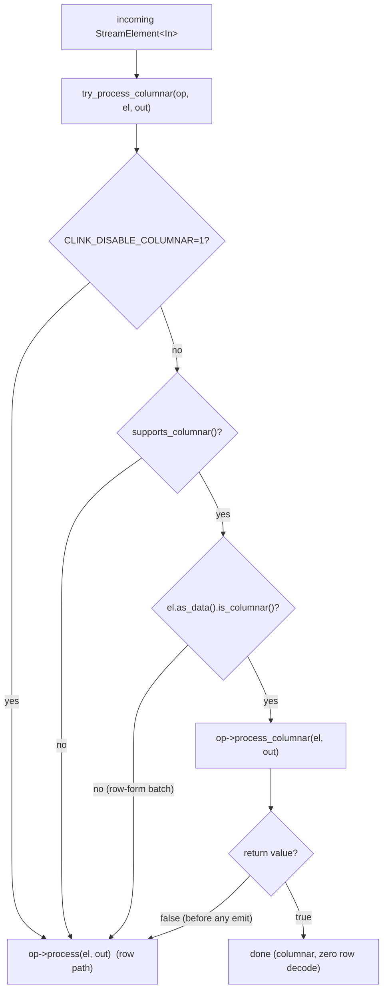

# Arrow-native columnar execution

> An optional fast path in which data travels as an Apache Arrow `RecordBatch` carried alongside the row vector on `Batch<T>`, letting opt-in operators run vectorised column work with no per-row materialisation.

## Overview

clink is Arrow-native: every data frame on the operator-to-operator wire is an Arrow IPC stream, and state snapshots are Arrow IPC blobs. On top of that wire format there is a columnar *execution* path. A `Batch<T>` can carry an `arrow::RecordBatch` sidecar in addition to (or instead of) its `std::vector<Record<T>>`. A producer that sets the sidecar and leaves the row vector empty hands a columnar-aware operator the typed Arrow columns directly; that operator reads the buffers and emits another columnar batch, so no `Record<T>` is ever built. A row operator downstream is unaffected: the first time it touches a row accessor, the sidecar is lazily decoded into rows once.

The path is strictly opt-in and degrades cleanly. The default for every operator is row-based and byte-for-byte unchanged. Importantly, columnar processing only fires when a batch is *born* columnar from a columnar-native source (for example a Parquet source carrying a typed schema). A row-form source, such as the default JSON-from-Kafka decode, produces row batches and takes the row path. This page is precise about that boundary.

## Where it lives

| Area | File | Role |
| --- | --- | --- |
| Sidecar on the batch | `include/clink/core/record.hpp` | `Batch<T>` columnar surface: `is_columnar()`, `arrow()`, lazy `materialize_rows_()`, `with_arrow()` |
| Wire seam | `include/clink/core/arrow_batcher.hpp` | `ArrowBatcher<T>` (schema/build/parse), built-in batchers, binary fallback, IPC serialise/deserialise |
| Generic user-type batcher | `include/clink/core/columnar_batcher.hpp` | `CLINK_ARROW_FIELDS` + `make_columnar_arrow_batcher<T>()` for plain or nested structs (recurses into nested structs, `std::vector`, `std::map`, `std::optional`) |
| Operator hook | `include/clink/operators/operator_base.hpp` | `supports_columnar()` / `process_columnar()` virtuals and their contract |
| Runner dispatch | `include/clink/runtime/dag.hpp` | `detail::try_process_columnar()`, called from serial and parallel runners |
| Wire framing | `include/clink/runtime/network/wire.hpp`, `include/clink/runtime/network/network_channel.hpp` | `Kind::ArrowBatch`, send/recv of the IPC payload |
| Columnar shuffle | `include/clink/runtime/subtask_emitter.hpp` | `partition_columnar_()` keeps each per-subtask sub-batch columnar |
| Example operators / sources | `include/clink/operators/columnar_filter_operator.hpp`, `include/clink/operators/columnar_vector_source.hpp` | Reference int64 columnar filter and source |
| SQL Row columnar | `include/clink/sql/row_columnar_batcher.hpp`, `src/sql/install.cpp` | `make_row_columnar_arrow_batcher`, `make_row_wire_batcher`, columnar SQL operators |
| Parquet source | `include/clink/connectors/parquet_source.hpp` | Produces columnar batches via the batcher's `parse` |

## How it works

### The sidecar on `Batch<T>`

`Batch<T>` (in `record.hpp`) is two representations of the same data. It holds a `std::vector<Record<T>>` and, optionally, a `std::shared_ptr<arrow::RecordBatch>` plus a row count and a `MaterializeFn` closure:

| Field | Type | Notes |
| --- | --- | --- |
| `records_` | `vector<Record<T>>` | row form; may be empty |
| `arrow_` | `shared_ptr<RecordBatch>` | columnar sidecar; may be null |
| `arrow_rows_` | `size_t` | row count, answered without decoding |
| `materialize_` | `fn(const RecordBatch&) -> vector<Record<T>>` | lazy decoder |

Two constructors distinguish the cases. The row constructor takes a `vector<Record<T>>`. The columnar constructor takes `(shared_ptr<RecordBatch>, rows, MaterializeFn)` and leaves `records_` empty until needed. The surface:

- `is_columnar()` returns true iff `arrow_ != nullptr`. A columnar-aware operator tests this to opt into the fast path.
- `arrow()` hands back the `RecordBatch`.
- `size()` / `empty()` answer from `arrow_rows_` without decoding any rows.
- Any row accessor (`operator[]`, `begin`/`end`, `records()`) calls `materialize_rows_()`, which runs `materialize_(*arrow_)` exactly once, fills `records_`, and increments a process-wide `detail::batch_materialize_counter()`. That counter is the test/benchmark hook proving a path did zero row decode; a pure columnar chain never increments it.
- `with_arrow(rb, rows)` builds a sibling columnar batch over a *different* `RecordBatch` reusing this batch's `materialize_` closure. The shuffle and columnar operators use it to emit derived columnar batches (a filter result, a per-subtask gather) without naming the row type's batcher.

A pure-row batch (`arrow_ == null`) behaves exactly as before: every row API and every existing operator keep working unchanged.

### `ArrowBatcher<T>`: the wire seam

`ArrowBatcher<T>` (in `arrow_batcher.hpp`) is the conversion seam between `Batch<T>` and `arrow::RecordBatch`. Like `Codec<T>`, it is a set of `std::function` closures rather than a class hierarchy:

- `schema() -> shared_ptr<arrow::Schema>`
- `build(const Batch<T>&) -> shared_ptr<arrow::RecordBatch>`
- `parse(const arrow::RecordBatch&) -> optional<Batch<T>>`

Batchers are stored on the `TypeRegistry` next to `Codec<T>` and threaded through bridge and channel construction. Every built-in batcher prepends a shared nullable `event_time:int64` column (`arrow_event_time_field()`); a null cell means the record had no event time.

There are three tiers of batcher:

1. Built-in columnar batchers for concrete shapes, hand-written one per shape. `int64_arrow_batcher()` emits `{event_time:int64(null), value:int64}`; `string_arrow_batcher()` emits `{event_time, value:utf8}`. There are also `int32`/`uint32`/`uint64` primitive batchers (via the `detail::primitive_arrow_batcher` template), and keyed shapes `int64_keyed_arrow_batcher()` (`{event_time, key:int64, value:int64}`) and `string_keyed_arrow_batcher()` (`{event_time, key:utf8, value:int64}`) that back the keyed-aggregation paths.

2. The generic struct batcher, `make_columnar_arrow_batcher<T>()` in `columnar_batcher.hpp`. A user describes a struct once at namespace scope with `CLINK_ARROW_FIELDS(Trade, id, symbol, px)`; the generator folds over that field list at compile time to synthesise schema/build/parse, emitting one typed Arrow column per field (`{event_time, id:int64, symbol:utf8, px:float64}`). Leaf field types are mapped by `ArrowColumnTraits` (fixed-width integers 8 to 64 bit signed and unsigned, `float`, `double`, `bool`, `std::string`). Composite fields recurse: a `std::optional<E>` becomes a nullable column, a `std::vector<E>` an Arrow `list`, a `std::map<K,V>` an Arrow `map`, and a nested struct that *also* has a `CLINK_ARROW_FIELDS` description an Arrow `struct` - to arbitrary depth (`build`/`read` drive the nested `arrow::MakeBuilder` tree via `detail::arrow_datatype`/`append_value`/`read_value`). An unmapped leaf is a readable compile error. This makes the wire and Parquet layout genuinely columnar and externally typed; it does *not* auto-vectorise operators (an operator that understands the schema is still bespoke).

3. The universal binary fallback, `make_default_arrow_batcher<T>(Codec<T>)`. Its schema is `{event_time:int64(null), value_bytes:binary}`; the `value_bytes` column carries each record's `Codec<T>::encode` output verbatim, and `parse` decodes it via `Codec<T>::decode`. No columnar win, but every type rides unified Arrow IPC framing automatically.

Selection between tiers 2 and 3 is automatic. `make_auto_arrow_batcher<T>(codec)` returns the generated typed batcher when `HasArrowFields<T>` (the `CLINK_ARROW_FIELDS` opt-in), else the binary fallback. The codec-only registration paths (`TypeRegistry::register_typed`, `PluginRegistry::register_type`) and the codec-only network-channel constructors route through it, so describing a struct with `CLINK_ARROW_FIELDS` is sufficient to get typed columns through the ordinary registration API - the explicit `register_columnar_typed` / `register_columnar_type` helpers are only a statement of intent (and a compile error on an undescribed type). An explicit `ArrowBatcher<T>` passed to the 3-arg registration overrides the choice.

### Opting an operator into columnar processing

`Operator<In, Out>` (in `operator_base.hpp`) exposes two virtuals, both no-op by default:

```cpp
[[nodiscard]] virtual bool supports_columnar() const noexcept { return false; }
virtual bool process_columnar(const StreamElement<In>&, Emitter<Out>&) { return false; }
```

The dispatch lives in `detail::try_process_columnar()` (`dag.hpp`), called by every operator runner so the serial single-input path and the parallel wire-stage path cannot drift. The fast path is taken iff:

```
supports_columnar()  &&  element.is_data()  &&  element.as_data().is_columnar()
                     &&  process_columnar(element, out) == true
```

The order matters. `process_columnar` returns `false` to mean "I cannot take this batch columnar, fall back to `process()`", which the runner then does. The hard contract: an operator may return `false` *only before emitting anything*, because a `false` return triggers a re-run on `process()`. Once it emits, it owns the batch and must return `true`. Operators decide up front, from schema and type checks, whether they can handle the batch.

A typical `process_columnar` body (see `ColumnarFilterOperator`):

```
process_columnar(element, out):
  if not data or not columnar:            return false   # fall back
  rb = element.as_data().arrow()
  if schema/columns not as expected:      return false   # fall back, no emit yet
  ... vectorised column work over rb ...
  out.emit_data(Batch<Out>{ derived_rb, n, materialize_ })   # emit columnar
  return true
```



Watermarks and barriers never go through `process_columnar`; the runner routes those to `process()` (or the operator's `on_watermark` / `on_barrier`), so a columnar operator still implements `process()` for control elements and for the row-only fallback.

### Reference example: the int64 columnar filter

`ColumnarFilterOperator` (`columnar_filter_operator.hpp`) keeps rows where `value >= threshold`. On a columnar batch with the `{event_time, value:int64}` schema it builds a boolean selection mask over the value buffer with a dense, autovectorisable scan, then runs Arrow's registered `filter` selection kernel to gather the passing rows of *both* columns into a new `RecordBatch` (so `event_time` rides along), and emits that as a columnar `Batch<int64>` with zero row materialisation. On a row-only batch or an unexpected schema it returns `false` and falls back to the identical row predicate in `process()`.

A note this operator records candidly: the comparison mask is hand-rolled rather than using a `greater_equal` compute kernel, because in this Arrow package the default registry exposes only the core selection kernels (`filter` is present) and the public `arrow::compute::Initialize()` that would register the arithmetic and comparison kernels is not an exported symbol. So the selection (gather) is vectorised by Arrow; the comparison is a plain scan.

### Producing columnar batches at the source

A columnar-native source builds an Arrow `RecordBatch` directly and emits a columnar `Batch<T>` over it. `ColumnarVectorSource` (`columnar_vector_source.hpp`) builds an `{event_time(all null), value:int64}` batch from a vector of int64 and emits `Batch<int64>{rb, n, materialize_}` where `materialize_` wraps `int64_arrow_batcher().parse`.

`ParquetSource<T>` (`parquet_source.hpp`) reads each Arrow `RecordBatch` from the file's `RecordBatchReader` and calls `batcher_.parse(*rb)`. When the configured batcher's `parse` returns a columnar batch (sidecar set), the source emits columnar data. For the SQL Row channel the batcher is `make_row_columnar_arrow_batcher`, whose `parse` builds a `Batch<Row>` carrying the typed `RecordBatch` as a sidecar with rows materialised lazily, so a Parquet-sourced query rides the columnar operator fast paths instead of decoding every row at the source.

The read is column-pruned (schema-on-read): when the batcher's schema names a subset of the file's columns, the source resolves each by name (types must match exactly), reads only those columns from the file, and remaps to the batcher's order if the projected reader yields file order. The SQL planner's projection-pushdown hint (`projected_columns` on the source op) narrows the `parquet_row_source` factory's batcher to exactly the queried columns, so a narrow query over a wide Parquet file skips the unread columns entirely; the same mechanism lets a declared-narrower table read a wider file. A batcher column missing from the file errors naming the column. Connector details live in [../connectors/README.md](../connectors/README.md).

### Columnar across the wire and the shuffle

The wire carries data as `Kind::ArrowBatch = 7` (`wire.hpp`). On send (`network_channel.hpp`), every data frame goes through `batcher_.build(batch)` and `arrow_batch_to_ipc()`; on receive, `arrow_batch_from_ipc()` decodes the IPC blob, the schema is checked against the receiver's registered batcher (mismatch rejects the frame), and `batcher_.parse()` produces the `Batch<T>`. Whether columnar survives the wire depends on the batcher:

- A built-in or struct columnar batcher's `parse` rebuilds a columnar batch, so columnar survives a network hop into the receiving operator.
- The SQL Row channel uses `make_row_wire_batcher` (`row_columnar_batcher.hpp`). Its `build` ships a columnar batch's typed `RecordBatch` verbatim (no materialise, no re-encode) and falls back to per-record JSON in a `value_bytes:binary` column for a row-form batch. Its `parse` recognises the binary-fallback layout and JSON-decodes it, but hands a typed columnar frame downstream *as* a columnar `Batch<Row>` (zero data copy, same column arrays) so the receiving filter/project/aggregate/window chain rides the columnar fast path after the shuffle. Its `schema` is intentionally empty so the receiver skips the fixed-schema equality gate, since the columnar schema varies per edge; frames are validated structurally inside `parse`. The per-column typed set is int64 / int32 / float / double / bool / decimal128 / string, plus `list<float32>` (a VECTOR_SEARCH embedding, carried as a contiguous Arrow list rather than a stringified JSON array); any other column type falls back to a utf8 stringification.

The keyed shuffle preserves columnar form too. `SubtaskEmitter` (`subtask_emitter.hpp`) forwards a columnar batch unchanged on a single output. On a hash partition it calls `partition_columnar_()`: it does one typed decode to obtain the per-row values the partitioner needs, computes each row's target subtask with the *same* partitioner as the row path (so routing and state placement are identical), and gathers each subtask's rows with Arrow's `filter` kernel into a sub-`RecordBatch` wrapped via `batch.with_arrow(...)`. It falls back to a row split if the columnar gather cannot proceed. The only observable difference between the columnar and row split is the sub-batch shape.

### SQL columnar operators

The SQL runtime (`src/sql/install.cpp`) implements `process_columnar` on several Row operators so a columnar-sourced query stays columnar end-to-end:

- `AggregateRowOp` (GROUP BY) reads only the columns it needs (group keys, each aggregate's input column, the changelog marker) straight from the sidecar into a narrow row, or runs a fully vectorised group fold for `COUNT` / integer `SUM` / integer `AVG` over a pure-append batch that builds no per-record `Row` at all. It declares `supports_columnar()` true only when the synchronous in-memory state path is active; with async/disaggregated state it routes through `process_async` instead (see [./async-state-execution.md](./async-state-execution.md)).
- A columnar windowed fold, the columnar row filter / project, and `ColumnarRowComputeKeyOp` (which appends a `__key` column to the sidecar so the keyed shuffle stays columnar) round out the SQL columnar surface.
- `json_string_to_row_columnar` is a bridge operator: it decodes JSON the same way as `json_string_to_row` but *attaches* a typed Arrow sidecar built from the table's `schema_columns`, emitting a columnar batch only when every record round-trips exactly (otherwise byte-equivalent row-form decode). The SQL planner emits it in place of `json_string_to_row` when a Kafka table sets the `columnar_decode` option.

### Snapshots and Parquet

The same Arrow IPC machinery underpins state snapshots. The in-memory, changelog, and sharded in-memory backends serialise their keyed state as Arrow IPC streams (see [./state-and-backends.md](./state-and-backends.md) and [./checkpointing.md](./checkpointing.md)); schema-evolution metadata is carried in the IPC schema metadata. Parquet sinks and sources reuse the `ArrowBatcher<T>` seam directly, so files written by clink are externally readable column-by-column (pyarrow, duckdb, polars) and a columnar batch is written without a row round-trip. Parquet connector configuration is documented in [../connectors/README.md](../connectors/README.md).

## Key types and APIs

| Type / function | File | Responsibility |
| --- | --- | --- |
| `Batch<T>` columnar surface | `core/record.hpp` | `is_columnar()`, `arrow()`, `with_arrow()`, lazy `materialize_rows_()`, columnar constructor |
| `detail::batch_materialize_counter()` | `core/record.hpp` | Process-wide count of lazy sidecar decodes; test/benchmark proof of a no-decode path |
| `ArrowBatcher<T>` | `core/arrow_batcher.hpp` | `schema` / `build` / `parse` closures bridging `Batch<T>` and `arrow::RecordBatch` |
| `int64_arrow_batcher`, `string_arrow_batcher`, primitive/keyed batchers | `core/arrow_batcher.hpp` | Built-in typed columnar schemas |
| `make_default_arrow_batcher<T>` | `core/arrow_batcher.hpp` | Binary `value_bytes` fallback wrapping `Codec<T>` |
| `CLINK_ARROW_FIELDS`, `make_columnar_arrow_batcher<T>` | `core/columnar_batcher.hpp` | Per-field typed columns for a described plain struct |
| `make_auto_arrow_batcher<T>` | `core/columnar_batcher.hpp` | Auto-selects typed (if `HasArrowFields<T>`) vs binary; used by the codec-only register/channel paths |
| `arrow_batch_to_ipc`, `arrow_batch_from_ipc` | `core/arrow_batcher.hpp` | IPC serialise/deserialise used by the network channel |
| `supports_columnar()`, `process_columnar()` | `operators/operator_base.hpp` | The opt-in operator hook and its no-double-emit contract |
| `detail::try_process_columnar()` | `runtime/dag.hpp` | Shared runner dispatch into the fast path |
| `partition_columnar_()` | `runtime/subtask_emitter.hpp` | Columnar-preserving keyed shuffle |
| `make_row_columnar_arrow_batcher`, `make_row_wire_batcher` | `sql/row_columnar_batcher.hpp` | Schema-driven typed Row batcher and the sidecar-preserving Row wire batcher |
| `ColumnarFilterOperator`, `ColumnarVectorSource` | `operators/columnar_filter_operator.hpp`, `operators/columnar_vector_source.hpp` | Reference columnar operator and source |

## Configuration and knobs

| Knob | Default | Effect |
| --- | --- | --- |
| `CLINK_HAS_ARROW` (CMake define on `clink_core`) | defined (`=1`) | Arrow is a required dependency; the whole columnar surface compiles in. Set unconditionally in `CMakeLists.txt`. |
| `find_package(Arrow REQUIRED)` / `CLINK_PINNED_ARROW_VERSION` | required, version-pinned | Build fails if the resolved Arrow version differs from `scripts/versions.env`. |
| `CLINK_DISABLE_COLUMNAR` (env var) | unset | When `=1`, `try_process_columnar()` always returns false so every operator takes `process()`. Diagnostic/benchmark A/B lever only; it can only make the engine slower and has no correctness effect, since `process()` is the authoritative path the columnar path must already match. |
| `columnar_decode` (SQL table WITH-option) | off | Makes the SQL planner emit `json_string_to_row_columnar` (attaches a sidecar) instead of `json_string_to_row` for a Kafka table. |
| `schema_columns` (connector/source param) | none | The typed column schema the Row columnar batchers (`make_row_columnar_arrow_batcher`, Parquet Row source/sink) are built from. |

## Guarantees and caveats

- Columnar is opt-in and transparent. A pure-row batch and every existing operator behave byte-for-byte as before. A columnar batch consumed by a row operator decodes lazily once.
- The fast path fires only when a batch is born columnar. A columnar batch must originate from a columnar-native source: a Parquet (or other Arrow-native file) source carrying a typed schema, the in-tree `ColumnarVectorSource`, or the SQL `json_string_to_row_columnar` bridge when `columnar_decode` is enabled. The default JSON-from-Kafka decode produces *row* batches, so a Kafka-JSON-sourced query takes the row path even when downstream operators implement `process_columnar`. The Row wire batcher preserves columnar across a shuffle but does not manufacture columnar from rows: a row-form batch crossing a task boundary is shipped as binary JSON and arrives row-form. To exercise the columnar operator fast paths, feed the query from a typed columnar source.
- `process_columnar` must not emit before returning `false`. A `false` return re-runs `process()`, so emitting and then returning `false` would double-emit. This is an explicit operator contract, not an engine safety net.
- Coverage is partial. The built-in columnar operators target specific shapes (for example the int64 filter is int64-only, a single `>=`). The SQL columnar operators cover GROUP BY ingest and the vectorised fold for `COUNT` / integer `SUM` / integer `AVG`, a columnar window fold, columnar filter/project, and key computation; other operators run row-based. `AggregateRowOp` disables columnar when its async/disaggregated state path is active.
- Arrow compute kernel availability is limited in this package. Only the core selection kernels (notably `filter`) are registered; arithmetic and comparison kernels are not auto-registered because `arrow::compute::Initialize()` is not exported. Columnar operators that need a comparison hand-roll a dense scan and use Arrow only for the gather. A true comparison-kernel mask is unblocked only by an Arrow build that exports `Initialize()` or auto-registers the kernels.
- The generic struct batcher (`make_columnar_arrow_batcher<T>`) makes the wire and Parquet layout columnar and externally typed, but it does not vectorise operators. An operator that processes that struct's columns is still hand-written. The field enumeration via `CLINK_ARROW_FIELDS` is a stand-in until a compiler offers C++26 static reflection; the trait table and generator stay as they are when that lands.

## Related

- [./architecture.md](./architecture.md) - Arrow-native component stack and where columnar sits.
- [./operator-model.md](./operator-model.md) - the operator interface that `supports_columnar` / `process_columnar` extend.
- [./network-stack.md](./network-stack.md) - the Arrow IPC wire, `Kind::ArrowBatch`, and the shuffle.
- [./checkpointing.md](./checkpointing.md) and [./state-and-backends.md](./state-and-backends.md) - Arrow IPC state snapshots.
- [./async-state-execution.md](./async-state-execution.md) - the async path that takes over from `process_columnar` for disaggregated GROUP BY state.
- [./sql-frontend.md](./sql-frontend.md) - how the planner wires columnar Row operators and the `columnar_decode` option.
- [../connectors/README.md](../connectors/README.md) - Parquet and other Arrow-native source/sink connectors.
