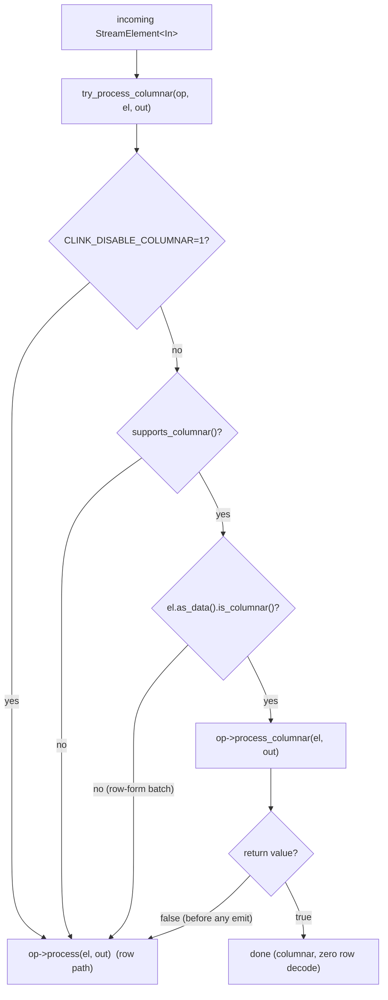

# Arrow-native columnar execution

> An optional fast path in which data travels as an Apache Arrow `RecordBatch` carried alongside the row vector on `Batch<T>`, letting opt-in operators run vectorised column work with no per-row materialisation.

## Overview

clink is Arrow-native: every data frame on the operator-to-operator wire is an Arrow IPC stream, and state snapshots are Arrow IPC blobs. On top of that wire format there is a columnar *execution* path. A `Batch<T>` can carry an `arrow::RecordBatch` sidecar in addition to (or instead of) its `std::vector<Record<T>>`. A producer that sets the sidecar and leaves the row vector empty hands a columnar-aware operator the typed Arrow columns directly; that operator reads the buffers and emits another columnar batch, so no `Record<T>` is ever built. A row operator downstream is unaffected: the first time it touches a row accessor, the sidecar is lazily decoded into rows once.

The path is strictly opt-in and degrades cleanly. The default for every operator is row-based and byte-for-byte unchanged. Importantly, columnar processing only fires when a batch is *born* columnar from a columnar-native source (for example a Parquet source carrying a typed schema). A row-form source, such as the default JSON-from-Kafka decode, produces row batches and takes the row path. This page is precise about that boundary.

## Where it lives

| Area | File | Role |
| --- | --- | --- |
| Sidecar on the batch | `include/clink/core/record.hpp` | `Batch<T>` columnar surface: `is_columnar()`, `arrow()`, lazy `materialize_rows_()`, `with_arrow()` |
| Wire seam | `include/clink/core/arrow_batcher.hpp` | `ArrowBatcher<T>` (schema/build/parse), built-in batchers, binary fallback, IPC serialise/deserialise |
| Generic user-type batcher | `include/clink/core/columnar_batcher.hpp` | `CLINK_ARROW_FIELDS` + `make_columnar_arrow_batcher<T>()` for plain or nested structs (recurses into nested structs, `std::vector`, `std::map`, `std::optional`) |
| Operator hook | `include/clink/operators/operator_base.hpp` | `supports_columnar()` / `process_columnar()` virtuals and their contract |
| Terminal sink hook | `include/clink/operators/operator_base.hpp`, `detail::try_sink_columnar()` in `include/clink/runtime/dag.hpp` | `Sink::supports_columnar()` / `on_data_columnar()`, so a columnar chain is not undone at the last hop |
| Runner dispatch | `include/clink/runtime/dag.hpp` | `detail::try_process_columnar()`, called from serial and parallel runners |
| Wire framing | `include/clink/runtime/network/wire.hpp`, `include/clink/runtime/network/network_channel.hpp` | `Kind::ArrowBatch`, send/recv of the IPC payload |
| Columnar shuffle | `include/clink/runtime/subtask_emitter.hpp` | `partition_columnar_()` keeps each per-subtask sub-batch columnar |
| Example operators / sources | `include/clink/operators/columnar_filter_operator.hpp`, `include/clink/operators/columnar_vector_source.hpp` | Reference int64 columnar filter and source |
| SQL Row columnar | `include/clink/sql/row_columnar_batcher.hpp`, `src/sql/install.cpp` | `make_row_columnar_arrow_batcher`, `make_row_wire_batcher`, columnar SQL operators |
| Born-columnar output | `include/clink/sql/row_columnar_output.hpp`, `enable_columnar_output()` in `src/sql/physical_plan.cpp` | `RowColumnarOutput` builds an operator's output as typed Arrow columns; the planner decides when that pays |
| Parquet source | `include/clink/connectors/parquet_source.hpp` | Produces columnar batches via the batcher's `parse` |

## How it works

### The sidecar on `Batch<T>`

`Batch<T>` (in `record.hpp`) is two representations of the same data. It holds a `std::vector<Record<T>>` and, optionally, a `std::shared_ptr<arrow::RecordBatch>` plus a row count and a `MaterializeFn` closure:

| Field | Type | Notes |
| --- | --- | --- |
| `records_` | `vector<Record<T>>` | row form; may be empty |
| `arrow_` | `shared_ptr<RecordBatch>` | columnar sidecar; may be null |
| `arrow_rows_` | `size_t` | row count, answered without decoding |
| `materialize_` | `fn(const RecordBatch&) -> vector<Record<T>>` | lazy decoder |

Two constructors distinguish the cases. The row constructor takes a `vector<Record<T>>`. The columnar constructor takes `(shared_ptr<RecordBatch>, rows, MaterializeFn)` and leaves `records_` empty until needed. The surface:

- `is_columnar()` returns true iff `arrow_ != nullptr`. A columnar-aware operator tests this to opt into the fast path.
- `arrow()` hands back the `RecordBatch`.
- `size()` / `empty()` answer from `arrow_rows_` without decoding any rows.
- Any row accessor (`operator[]`, `begin`/`end`, `records()`) calls `materialize_rows_()`, which runs `materialize_(*arrow_)` exactly once, fills `records_`, and increments a process-wide `detail::batch_materialize_counter()`. That counter is the test/benchmark hook proving a path did zero row decode; a pure columnar chain never increments it. It is also published on `/metrics` as **`clink_batch_materializations_total`**, sampled at scrape time so the hot path keeps costing one relaxed increment - see "Verifying the path actually fires" below, because this is the number that catches a chain being undone.
- `with_arrow(rb, rows)` builds a sibling columnar batch over a *different* `RecordBatch` reusing this batch's `materialize_` closure. The shuffle and columnar operators use it to emit derived columnar batches (a filter result, a per-subtask gather) without naming the row type's batcher.

A pure-row batch (`arrow_ == null`) behaves exactly as before: every row API and every existing operator keep working unchanged.

### What the JSON decode costs, and what was tried

`json_string_to_row_columnar` is the largest single stage on a Kafka JSON pipeline
(34% of worker CPU on nexmark q0 after the July 2026 fixes). Its on-demand walk is
~126 ns per record on a 6-column nexmark bid row, measured in isolation with
`clink_hotpath_bench decode` minus `clink_hotpath_bench buildonly` - the latter being
the `Batch<std::string>` assembly the runner does, which is 22 ns per record and not
the bridge's to answer for.

What moved it, in order of what it was worth:

| change | effect |
|--------|-------:|
| compare keys with an inline byte loop instead of calling `memcmp` | +11.6% |
| `escaped_key()` instead of `unescaped_key()` - no unescape pass, no copy into simdjson's string buffer | +5% |
| split the column lookup's cold scan out of line so the hot path inlines | +2% |
| **total** | **+19%** |

Two things were tried and REJECTED on measurement, recorded so they are not retried
blind:

- **`iterate_many()` over the concatenated batch.** This is simdjson's API for streams
  of small documents and it amortises `stage1` (the SIMD structural prescan, 15% of
  decode self time) from once per record to once per batch. It measured *slower* -
  5.85M rec/s against 6.26M - because streaming mode carries its own per-document
  bookkeeping that costs more than the `stage1` it saves at ~120-byte documents. Tried
  with `batch_size` at both 1MB and the exact buffer length.
- **Caching `arrow::Type::type` and the decimal scale per column** to avoid reaching
  through `eff` in the field loop. Measured neutral; `arrow::DataType::id()` is already
  an inline member read. Kept only because it makes `append_ondemand`'s signature
  honest about what it needs.

Two costs are near the floor for this shape: `stage1` at 15% is what per-record
`iterate()` charges, and the 9% `memmove` is copying each line into a buffer with
SIMDJSON_PADDING slack, which cannot be avoided without assuming readable bytes past
a `std::string`'s end.

**The positional hint is the one hazard here.** The decoder remembers which column each
field POSITION matched last time and tries that first, which is what makes the lookup
one comparison on a homogeneous stream. The guess is always verified against the name,
and a miss falls through to the scan - but a future edit that trusted it would silently
file values under the wrong column. The suite could not catch that until
`ReorderedSameTypedFieldsLandInTheRightColumns` was added: every other field-order test
uses columns of DIFFERENT types, so a mis-filed value fails the type check, bails the
batch to the row fallback and produces the right answer anyway. That test uses two
int64 columns, where nothing else can save it, and it was confirmed to fail against an
unverified-guess mutation.

### Per-group state in a windowed aggregate

A windowed `GROUP BY` allocates one `AggState` per aggregate per group, so that struct's
size is a memory budget rather than a detail. It had reached **264 bytes** by accretion:
every aggregate family that needed per-group storage had added its container inline, so a
`COUNT(*)` - which uses one `int64` - still carried two `std::map`s, two `std::vector`s, a
`Decimal`, and two `JsonValue`s for MIN/MAX it never touches.

The rarely-used members now live in `AggStateExtras` behind a `std::unique_ptr`, allocated
on first use by the families that need them (COUNT(DISTINCT), STRING_AGG, retractable
MIN/MAX, PERCENTILE, ARRAY_AGG, exact decimal SUM, UDAF accumulators). Writers go through
`extras()`, which allocates; readers through `extras_read()`, which returns a shared empty
instance so a read never allocates to find nothing.

    sizeof(AggState)          264 -> 104 bytes
    per-group state cost      681 -> 454 bytes   (real operator, measured end to end)

Measured with `benchmarks/clink_window_state_bench`, which runs the query through the
embedded engine and differences peak RSS between many groups and one, so everything that
does not scale with the group count cancels. It drives the REAL operator deliberately: the
hot-path bench's q12 shape is a hand-written model of this state and cannot validate a
change to it.

`static_assert(sizeof(AggState) <= 112)` guards the result. The struct did not reach 264
bytes through one bad decision but through several reasonable ones with nobody watching
the total, so the next addition now has to be deliberate.

**What is left, for whoever picks this up.** 454 bytes per group is still far more than
an int64 key and a counter need. The remainder is container overhead rather than the
accumulator: a `std::map` node per open window, the `Row group_values` each bucket keeps
so the emit can reconstruct the group columns, and the keyed-state entry itself. The two
`JsonValue`s for MIN/MAX are 64 of the remaining 104 bytes and could move to extras too,
at the cost of making a non-retractable MIN/MAX allocate per group - not obviously a good
trade, and unmeasured.

### Projection pushdown into the JSON bridge

The optimizer computes which source columns a query actually reads
(`set_scan_projection` in `src/sql/optimizer.cpp`). That hint used to be written onto the
SOURCE operator only, and for a Kafka JSON table the source is `kafka_source_string`, which
emits raw text and cannot act on it - so the operator that could, the columnar JSON bridge,
never saw it. nexmark q12 reads two of six declared columns and decoded, carried and
shuffled all six.

| | before | after |
|---|---:|---:|
| shuffle split, 256-row batch, 4 targets | 88.9 ns/row | **49.1 ns/row** |
| JSON decode (34% of a Kafka JSON profile) | 6.67M rec/s | **8.44M rec/s** |

**Narrowing `schema_columns` would have been a regression, not a win.** The columnar
decoder is safe because of a faithfulness gate: it requires each JSON object to match the
DECLARED schema exactly and bails the batch on any undeclared field, because the row decode
it is proved against would have kept that field. Narrow the declared schema and every
unprojected field becomes undeclared, so every batch bails, pays a partial columnar parse
plus a full row re-parse, and after `kFallbackThreshold` consecutive failures the damper
stops attempting columnar on 63 of every 64 batches.

So the schema stays at full width and `projected_columns` is a separate param governing only
what gets BUILT:

- **declared and projected** - parsed, type-checked, appended to a builder, present in the
  emitted Arrow schema.
- **declared but unprojected** - parsed, type-checked, required to be present, then
  discarded. No builder is created and the field is omitted from the schema.
- **undeclared** - still bails the batch, exactly as before. Projection must not turn a
  faithfulness check into a pass.

Both decode arms make the same decision, and the row fallback takes the same projection via
`row_json_text_format_for_columns_projected`. That helper exists because the older
`row_json_text_format_projected` honours declared decimals but not declared FLOATs, and a
FLOAT column has to be coerced on both carriers - a divergence there is invisible to a
`%g`-formatted comparison.

**One hazard to know about if you touch this.** `wrap_columnar_`'s materialise closure used
to map `resolved[ci]` to `b.column(ci + 1)` positionally. `resolved[]` holds every DECLARED
column, including unprojected ones (the gate needs them), while the batch holds only the
projected ones - so the positional mapping ran off the end of the batch and segfaulted
inside Arrow's lazy column boxing. Any code that pairs the declared schema with the emitted
batch by index has the same bug waiting in it.

### The keyed shuffle's split

`gather_columnar_by_target` (`include/clink/runtime/columnar_split.hpp`) partitions one
columnar batch into a sub-batch per destination subtask without materialising rows. On
the two-node rig it was 19.3% of all worker CPU on nexmark q12, the largest non-library
compute item in the engine and twice the cost of the window aggregation it feeds.

It builds one INDEX list per target in a single pass and calls `arrow::compute::Take`
once per target. The earlier shape built a boolean mask per target and called
`Filter` per target, which appended `n_out` booleans for every row (one of them true) and
then walked the whole batch again for each destination - so at parallelism 4 it scanned
the batch four times to move each row once. Measured with
`benchmarks/clink_shuffle_split_bench`, 1024-row batches:

| targets | mask + Filter | index + Take | |
|---|---:|---:|---:|
| 2 | 20.9 ns/row | 14.4 ns/row | -31% |
| 4 | 34.8 ns/row | 21.8 ns/row | -37% |
| 8 | 60.0 ns/row | 37.0 ns/row | -38% |
| 16 | 108.0 ns/row | 68.6 ns/row | -36% |

Both still grow with the destination count, because each destination needs its own gather
and its own output allocation; the change is a consistent constant factor, not a change in
asymptotics.

Order within a destination is preserved by construction: indices are appended in row order
and `Take` emits in index order, which is what `Filter` did.

**This function routes a keyed shuffle, so a mistake in it is silent** - a misrouted
record does not throw, it lands in the wrong subtask's keyed state and corrupts an
aggregate. It had no direct tests until `tests/test_columnar_split.cpp`, which compares it
against a reference split computed from the same inputs (content and order per
destination, not just counts), and covers skew, out-of-range targets, refusal on a
row-only batch, and the no-materialisation property. Those tests pass against BOTH the old
and new implementations, and three of them fail against a routing shifted by one slot.

### Verifying the path actually fires

A columnar chain that is quietly undone costs MORE than never having been columnar:
the pipeline builds the Arrow batch and then builds the rows as well. Nothing about
the query's results changes, so it will not show up as a test failure - only as CPU.

Scrape `clink_batch_materializations_total` on a running job. On a pipeline that is
columnar end to end it stays at zero; a count that tracks the batch count means some
stage is touching a row accessor. Two real instances, both found this way:

- A **duplicate factory registration** replaced the counting `BlackholeRowSink` with a
  per-record `FunctionSink`, so nexmark q0 materialised every batch (14,377 of 14,377)
  and a sink whose body is `count_ += batch.size()` cost 0.37 us per record - 16% of
  all worker CPU. Registration is latest-wins, and nothing distinguished the two
  implementations; identifying it took a stack trace from inside `materialize_rows_()`.
  `OperatorRegistry` now logs whenever a registration replaces an existing factory.
- The planner's `ingests_columnar` gate in `src/sql/physical_plan.cpp` listed
  `"window_row"`, which is not an operator type at all, while the three that do build
  `WindowRowOp` were absent - so producers in front of a tumbling window were held back
  to row output. That gate must be kept in step with `supports_columnar()` in
  `install.cpp` by hand; there is no compile-time link between them, which is exactly
  why it drifted.

A related habit worth keeping: an opt-in that cannot be observed will eventually be
found to have done nothing. `clink_node --version` and the node startup log both report
the process allocator for the same reason (`CLINK_WITH_JEMALLOC`), reading the version
from the loaded library rather than from a build variable.

`clink_dataplane_local_hits_total` and `clink_dataplane_socket_fallbacks_total` answer
the adjacent question for the wire: whether a shuffle edge between two subtasks in the
same process hands the element over in memory or pays to encode, socket and decode it.
On a single-worker job the fallback count should be zero.

### `ArrowBatcher<T>`: the wire seam

`ArrowBatcher<T>` (in `arrow_batcher.hpp`) is the conversion seam between `Batch<T>` and `arrow::RecordBatch`. Like `Codec<T>`, it is a set of `std::function` closures rather than a class hierarchy:

- `schema() -> shared_ptr<arrow::Schema>`
- `build(const Batch<T>&) -> shared_ptr<arrow::RecordBatch>`
- `parse(const arrow::RecordBatch&) -> optional<Batch<T>>`

Batchers are stored on the `TypeRegistry` next to `Codec<T>` and threaded through bridge and channel construction. Every built-in batcher prepends a shared nullable `event_time:int64` column (`arrow_event_time_field()`); a null cell means the record had no event time.

There are three tiers of batcher:

1. Built-in columnar batchers for concrete shapes, hand-written one per shape. `int64_arrow_batcher()` emits `{event_time:int64(null), value:int64}`; `string_arrow_batcher()` emits `{event_time, value:utf8}`. There are also `int32`/`uint32`/`uint64` primitive batchers (via the `detail::primitive_arrow_batcher` template), and keyed shapes `int64_keyed_arrow_batcher()` (`{event_time, key:int64, value:int64}`) and `string_keyed_arrow_batcher()` (`{event_time, key:utf8, value:int64}`) that back the keyed-aggregation paths.

2. The generic struct batcher, `make_columnar_arrow_batcher<T>()` in `columnar_batcher.hpp`. A user describes a struct once at namespace scope with `CLINK_ARROW_FIELDS(Trade, id, symbol, px)`; the generator folds over that field list at compile time to synthesise schema/build/parse, emitting one typed Arrow column per field (`{event_time, id:int64, symbol:utf8, px:float64}`). Leaf field types are mapped by `ArrowColumnTraits` (fixed-width integers 8 to 64 bit signed and unsigned, `float`, `double`, `bool`, `std::string`). Composite fields recurse: a `std::optional<E>` becomes a nullable column, a `std::vector<E>` an Arrow `list`, a `std::map<K,V>` an Arrow `map`, and a nested struct that *also* has a `CLINK_ARROW_FIELDS` description an Arrow `struct` - to arbitrary depth (`build`/`read` drive the nested `arrow::MakeBuilder` tree via `detail::arrow_datatype`/`append_value`/`read_value`). An unmapped leaf is a readable compile error. This makes the wire and Parquet layout genuinely columnar and externally typed; it does *not* auto-vectorise operators (an operator that understands the schema is still bespoke).

3. The universal binary fallback, `make_default_arrow_batcher<T>(Codec<T>)`. Its schema is `{event_time:int64(null), value_bytes:binary}`; the `value_bytes` column carries each record's `Codec<T>::encode` output verbatim, and `parse` decodes it via `Codec<T>::decode`. No columnar win, but every type rides unified Arrow IPC framing automatically.

Selection between tiers 2 and 3 is automatic. `make_auto_arrow_batcher<T>(codec)` returns the generated typed batcher when `HasArrowFields<T>` (the `CLINK_ARROW_FIELDS` opt-in), else the binary fallback. The codec-only registration paths (`TypeRegistry::register_typed`, `PluginRegistry::register_type`) and the codec-only network-channel constructors route through it, so describing a struct with `CLINK_ARROW_FIELDS` is sufficient to get typed columns through the ordinary registration API - the explicit `register_columnar_typed` / `register_columnar_type` helpers are only a statement of intent (and a compile error on an undescribed type). An explicit `ArrowBatcher<T>` passed to the 3-arg registration overrides the choice.

### Opting an operator into columnar processing

`Operator<In, Out>` (in `operator_base.hpp`) exposes two virtuals, both no-op by default:

```cpp
[[nodiscard]] virtual bool supports_columnar() const noexcept { return false; }
virtual bool process_columnar(const StreamElement<In>&, Emitter<Out>&) { return false; }
```

The dispatch lives in `detail::try_process_columnar()` (`dag.hpp`), called by every operator runner so the serial single-input path and the parallel wire-stage path cannot drift. The fast path is taken iff:

```
supports_columnar()  &&  element.is_data()  &&  element.as_data().is_columnar()
                     &&  process_columnar(element, out) == true
```

The order matters. `process_columnar` returns `false` to mean "I cannot take this batch columnar, fall back to `process()`", which the runner then does. The hard contract: an operator may return `false` *only before emitting anything*, because a `false` return triggers a re-run on `process()`. Once it emits, it owns the batch and must return `true`. Operators decide up front, from schema and type checks, whether they can handle the batch.

A typical `process_columnar` body (see `ColumnarFilterOperator`):

```
process_columnar(element, out):
  if not data or not columnar:            return false   # fall back
  rb = element.as_data().arrow()
  if schema/columns not as expected:      return false   # fall back, no emit yet
  ... vectorised column work over rb ...
  out.emit_data(Batch<Out>{ derived_rb, n, materialize_ })   # emit columnar
  return true
```


```mermaid
flowchart TD
  IN["incoming StreamElement&lt;In&gt;"] --> TPC["try_process_columnar(op, el, out)"]
  TPC --> C1{"CLINK_DISABLE_COLUMNAR=1?"}
  C1 -->|yes| ROW["op-&gt;process(el, out)  (row path)"]
  C1 -->|no| C2{"supports_columnar()?"}
  C2 -->|no| ROW
  C2 -->|yes| C3{"el.as_data().is_columnar()?"}
  C3 -->|"no (row-form batch)"| ROW
  C3 -->|yes| PC["op-&gt;process_columnar(el, out)"]
  PC --> R{"return value?"}
  R -->|"false (before any emit)"| ROW
  R -->|"true"| DONE["done (columnar, zero row decode)"]
```

### The terminal hook: columnar into a sink

`Sink<In>` carries the same pair, `supports_columnar()` / `on_data_columnar()`, dispatched by `detail::try_sink_columnar()` from both sink runners under the same `CLINK_DISABLE_COLUMNAR` switch (`detail::columnar_enabled()`). Without it a columnar chain is undone at the last hop: `on_data` takes a `Batch<In>` and the first row accessor materialises the whole sidecar.

That mattered more than it sounds. The discard sink was a `FunctionSink<Row>` iterating the batch to call a callback with an empty body, so every record became a name-keyed `FlatMap` first. Measured on the q0 chain, materialisation cost **+0.54s on top of a 1.02s decode**. `BlackholeRowSink` now answers the hook and counts via `batch.size()`, which the sidecar answers without decoding.

The hook also unblocks the producer side: `enable_columnar_output()` treats a columnar-capable sink as a columnar consumer, lifting the rule that forbade the operator in front of a sink from emitting born-columnar. Note what this is *not* - a production win. `blackhole` exists to measure the engine without sink cost; a real Kafka or Parquet sink must still serialise per record. The seam is what a Parquet sink would use to write a `RecordBatch` directly.

Watermarks and barriers never go through `process_columnar`; the runner routes those to `process()` (or the operator's `on_watermark` / `on_barrier`), so a columnar operator still implements `process()` for control elements and for the row-only fallback.

### Reference example: the int64 columnar filter

`ColumnarFilterOperator` (`columnar_filter_operator.hpp`) keeps rows where `value >= threshold`. On a columnar batch with the `{event_time, value:int64}` schema it builds a boolean selection mask over the value buffer with a dense, autovectorisable scan, then runs Arrow's registered `filter` selection kernel to gather the passing rows of *both* columns into a new `RecordBatch` (so `event_time` rides along), and emits that as a columnar `Batch<int64>` with zero row materialisation. On a row-only batch or an unexpected schema it returns `false` and falls back to the identical row predicate in `process()`.

A note this operator records candidly: the comparison mask is hand-rolled rather than using a `greater_equal` compute kernel, because in this Arrow package the default registry exposes only the core selection kernels (`filter` is present) and the public `arrow::compute::Initialize()` that would register the arithmetic and comparison kernels is not an exported symbol. So the selection (gather) is vectorised by Arrow; the comparison is a plain scan.

### Producing columnar batches at the source

A columnar-native source builds an Arrow `RecordBatch` directly and emits a columnar `Batch<T>` over it. `ColumnarVectorSource` (`columnar_vector_source.hpp`) builds an `{event_time(all null), value:int64}` batch from a vector of int64 and emits `Batch<int64>{rb, n, materialize_}` where `materialize_` wraps `int64_arrow_batcher().parse`.

`ParquetSource<T>` (`parquet_source.hpp`) reads each Arrow `RecordBatch` from the file's `RecordBatchReader` and calls `batcher_.parse(*rb)`. When the configured batcher's `parse` returns a columnar batch (sidecar set), the source emits columnar data. For the SQL Row channel the batcher is `make_row_columnar_arrow_batcher`, whose `parse` builds a `Batch<Row>` carrying the typed `RecordBatch` as a sidecar with rows materialised lazily, so a Parquet-sourced query rides the columnar operator fast paths instead of decoding every row at the source.

The read is column-pruned (schema-on-read): when the batcher's schema names a subset of the file's columns, the source resolves each by name (types must match exactly), reads only those columns from the file, and remaps to the batcher's order if the projected reader yields file order. The SQL planner's projection-pushdown hint (`projected_columns` on the source op) narrows the `parquet_row_source` factory's batcher to exactly the queried columns, so a narrow query over a wide Parquet file skips the unread columns entirely; the same mechanism lets a declared-narrower table read a wider file. A batcher column missing from the file errors naming the column. Connector details live in [../connectors/README.md](../connectors/README.md).

### Columnar across the wire and the shuffle

The wire carries data as `Kind::ArrowBatch = 7` (`wire.hpp`). On send (`network_channel.hpp`), every data frame goes through `batcher_.build(batch)` and `arrow_batch_to_ipc()`; on receive, `arrow_batch_from_ipc()` decodes the IPC blob, the schema is checked against the receiver's registered batcher (mismatch rejects the frame), and `batcher_.parse()` produces the `Batch<T>`. Whether columnar survives the wire depends on the batcher:

- A built-in or struct columnar batcher's `parse` rebuilds a columnar batch, so columnar survives a network hop into the receiving operator.
- The SQL Row channel uses `make_row_wire_batcher` (`row_columnar_batcher.hpp`). Its `build` ships a columnar batch's typed `RecordBatch` verbatim (no materialise, no re-encode) and falls back to per-record JSON in a `value_bytes:binary` column for a row-form batch. Its `parse` recognises the binary-fallback layout and JSON-decodes it, but hands a typed columnar frame downstream *as* a columnar `Batch<Row>` (zero data copy, same column arrays) so the receiving filter/project/aggregate/window chain rides the columnar fast path after the shuffle. Its `schema` is intentionally empty so the receiver skips the fixed-schema equality gate, since the columnar schema varies per edge; frames are validated structurally inside `parse`. The per-column typed set is int64 / int32 / float / double / bool / decimal128 / string, plus `list<float32>` (a VECTOR_SEARCH embedding, carried as a contiguous Arrow list rather than a stringified JSON array); any other column type falls back to a utf8 stringification.

The keyed shuffle preserves columnar form too. `SubtaskEmitter` (`subtask_emitter.hpp`) forwards a columnar batch unchanged on a single output. On a hash partition it calls `partition_columnar_()`: it does one typed decode to obtain the per-row values the partitioner needs, computes each row's target subtask with the *same* partitioner as the row path (so routing and state placement are identical), and gathers each subtask's rows with Arrow's `filter` kernel into a sub-`RecordBatch` wrapped via `batch.with_arrow(...)`. It falls back to a row split if the columnar gather cannot proceed. The only observable difference between the columnar and row split is the sub-batch shape.

The cluster deployment's keyed edges (a chain's Hash output group routed through `Dag::add_split` and per-peer network bridges) partition columnar batches without any row decode at all. `add_split` accepts an optional `columnar_split` hook; the three Hash wiring sites (`attach_typed_group_output` in `runner_helpers.hpp`, its type-erased mirror in `type_registry.hpp`, and the legacy typed-chain path in `worker.cpp`) build it with `make_keyed_columnar_split` (`runtime/columnar_split.hpp`) whenever the channel registered a *columnar key extractor* (`KeyExtractorRegistry::register_columnar_extractor` / `PluginRegistry::register_columnar_key_extractor`). The SQL Row channel registers one that reads the `__key` int64 column `row_compute_key` appended to the sidecar, so the per-row partition keys come straight from Arrow memory; the key-group routing (`key_group_for_key` -> `subtask_for_key_group`) is byte-identical to the row selector, which is a correctness requirement rather than an optimisation - a stream can interleave columnar and row-form batches (per-batch decode fallback) and both carriers must agree on key -> subtask ownership. Any batch that cannot be keyed columnar (no sidecar, `__key` absent) falls back to the per-record row split.

### SQL columnar operators

The SQL runtime (`src/sql/install.cpp`) implements `process_columnar` on several Row operators so a columnar-sourced query stays columnar end-to-end:

- `AggregateRowOp` (GROUP BY) reads only the columns it needs (group keys, each aggregate's input column, the changelog marker) straight from the sidecar into a narrow row, or runs a fully vectorised group fold for `COUNT` / integer `SUM` / integer `AVG` over a pure-append batch that builds no per-record `Row` at all. It declares `supports_columnar()` true only when the synchronous in-memory state path is active; with async/disaggregated state it routes through `process_async` instead (see [./async-state-execution.md](./async-state-execution.md)).
- A columnar windowed fold, the columnar row filter / project, and `ColumnarRowComputeKeyOp` (which appends a `__key` column to the sidecar so the keyed shuffle stays columnar) round out the SQL columnar surface.
- `json_string_to_row_columnar` is a bridge operator: it decodes JSON and *attaches* a typed Arrow sidecar built from the table's `schema_columns`, emitting a columnar batch only when every record round-trips exactly (otherwise byte-equivalent row-form decode, with an adaptive damper: after 8 consecutive fallback batches it stops attempting the columnar parse and probes every 64th batch, so a systematically unfaithful stream pays ~1.6% wasted parse instead of up to 2x). The SQL planner emits it BY DEFAULT for a Kafka JSON table; `columnar_decode='false'` opts out to the plain row bridge.

  It walks each document once with **simdjson on-demand**, dispatching each field straight to its resolved column's builder - no intermediate `JsonObject`, no per-column search of a sorted vector, and one grown-once padded buffer reused across records. DECIMAL columns take their exact digits from `raw_json_token()` during that same walk, so there is no second scan of the line to recover them. Anything the walk cannot decide it refuses, falling back to the older DOM path and then to rows; both are already proved against the row decode, so a refused case is slow rather than wrong.

  This is worth knowing when reading old commentary: the DOM path it replaced *claimed* to decode "directly into typed Arrow column builders" while in fact building a full generic `JsonObject` per record and binary-searching it once per column. Profiling ranked `memcmp` at 974 self-weight, `from_dom` at 383 and pair-vector growth at 382, against simdjson's own stage1+stage2 at 410 - roughly 10% of decode. The parser was never the cost; the DOM around it was. Measured at **1.96M -> 4.88M rec/s** on 4M nexmark bid lines.

  The columnar-capable types are int64, int32, double, **float**, **decimal128**, bool and utf8. Float and decimal were excluded until D4 inc4 for a reason worth keeping in mind when adding a type: the faithfulness contract is measured against *the row decode this operator falls back to*, and that decode was not schema-aware, so it kept every JSON number as a full-precision double and never produced a dec-string - a columnar float32 truncation or exact dec-string was therefore a visible difference. Both bridges now build their decoder from the same `schema_columns` (`row_json_text_format_for_columns`), so declared FLOAT columns round to float precision and declared DECIMAL columns are ingested exactly and quantised to scale on *either* carrier. Adding a further type means making both sides agree first, not just widening the switch.

### Born-columnar operator output

Everything above is about *ingest*: a producer attaches a sidecar and a capable operator reads columns instead of rows. An operator's own OUTPUT was row form regardless, so an operator that produced rows paid for a name-keyed `FlatMap<string, JsonValue>` per emitted row: one string key copy per column per row, a pair-vector allocation per row, and the malloc churn both imply.

`RowColumnarOutput` (`include/clink/sql/row_columnar_output.hpp`) closes that. An operator appends its output values straight into one typed Arrow builder per declared output column and emits the finished `RecordBatch` as a columnar `Batch<Row>`; the column names live in the schema, once, instead of in every row, and no `Row` is built at all. Two properties make it safe:

- The per-cell conversion is `row_columnar_detail::append_json_cell`, the *same* function the row-batch converter (`build_column`) uses. The two carriers therefore produce identical Arrow cells by construction rather than by a test noticing they drifted.
- The emitted batch carries `row_materialize_fn()`, so a row consumer downstream decodes it lazily exactly once and sees the rows it would have received anyway. Correctness never depends on the consumer being columnar.

Whether emitting columnar is *faster* does depend on the consumer, because a row consumer pays the Arrow build and then the materialise. So the decision belongs to the planner, which can see the chain, and not to the operator, which cannot. `enable_columnar_output()` in `src/sql/physical_plan.cpp` promotes a producer's stashed typed output schema to a live `columnar_output` param only when every consumer of that producer ingests columnar; a producer feeding a sink directly is left row form, since no sink connector reads Arrow batches today.

Two operators emit born-columnar output:

- `EquiJoinRowOp` (append-only INNER joins). An OUTER join marks every row with a changelog kind, which the declared output schema has no column for, so it stays row form by construction. If a marked row reaches an INNER join anyway, `bail_columnar_to_rows_` converts what has been accumulated back to rows in emission order and drops the carrier for the rest of the operator's life: a wrong planner gate costs speed, never correctness.
- `WindowRowOp`'s watermark-driven fire. The declared schema must name every field a fired pane produces, including the window bounds `finalize_window_` always emits, or the operator refuses it and stays row form - a column list missing a produced field would silently drop it. A pane whose group column was *absent* from its records also bails, because the row path omits such a column while a fixed column list would emit it as null, and those are different rows. The timer and async fire paths are row form.

Emission size decides whether the carrier pays at all. A `RecordBatch` costs a fixed amount per batch and saves per row, so `ColumnarOutputDamper` learns from the previous emissions: it backs off after four consecutive emissions below `kColumnarOutputMinRows` (64) and re-probes every 64th batch, mirroring the source-side decode damper. Measured on the 4M-row embedded shapes: an equi-join under a filter emits thousands of rows per batch and takes **-11% CPU**; a windowed fire emits a handful of panes per watermark and **lost 12%** when it built a batch for them, which is what the damper exists to prevent (it returns that shape to parity). `CLINK_DISABLE_COLUMNAR_OUTPUT=1` keeps every operator's output row form, the A/B lever for this axis.

### Snapshots and Parquet

The same Arrow IPC machinery underpins state snapshots. The in-memory, changelog, and sharded in-memory backends serialise their keyed state as Arrow IPC streams (see [./state-and-backends.md](./state-and-backends.md) and [./checkpointing.md](./checkpointing.md)); schema-evolution metadata is carried in the IPC schema metadata. Parquet sinks and sources reuse the `ArrowBatcher<T>` seam directly, so files written by clink are externally readable column-by-column (pyarrow, duckdb, polars) and a columnar batch is written without a row round-trip. Parquet connector configuration is documented in [../connectors/README.md](../connectors/README.md).

## Key types and APIs

| Type / function | File | Responsibility |
| --- | --- | --- |
| `Batch<T>` columnar surface | `core/record.hpp` | `is_columnar()`, `arrow()`, `with_arrow()`, lazy `materialize_rows_()`, columnar constructor |
| `detail::batch_materialize_counter()` | `core/record.hpp` | Process-wide count of lazy sidecar decodes; test/benchmark proof of a no-decode path |
| `ArrowBatcher<T>` | `core/arrow_batcher.hpp` | `schema` / `build` / `parse` closures bridging `Batch<T>` and `arrow::RecordBatch` |
| `int64_arrow_batcher`, `string_arrow_batcher`, primitive/keyed batchers | `core/arrow_batcher.hpp` | Built-in typed columnar schemas |
| `make_default_arrow_batcher<T>` | `core/arrow_batcher.hpp` | Binary `value_bytes` fallback wrapping `Codec<T>` |
| `CLINK_ARROW_FIELDS`, `make_columnar_arrow_batcher<T>` | `core/columnar_batcher.hpp` | Per-field typed columns for a described plain struct |
| `make_auto_arrow_batcher<T>` | `core/columnar_batcher.hpp` | Auto-selects typed (if `HasArrowFields<T>`) vs binary; used by the codec-only register/channel paths |
| `arrow_batch_to_ipc`, `arrow_batch_from_ipc` | `core/arrow_batcher.hpp` | IPC serialise/deserialise used by the network channel |
| `supports_columnar()`, `process_columnar()` | `operators/operator_base.hpp` | The opt-in operator hook and its no-double-emit contract |
| `detail::try_process_columnar()` | `runtime/dag.hpp` | Shared runner dispatch into the fast path |
| `partition_columnar_()` | `runtime/subtask_emitter.hpp` | Columnar-preserving keyed shuffle |
| `make_row_columnar_arrow_batcher`, `make_row_wire_batcher` | `sql/row_columnar_batcher.hpp` | Schema-driven typed Row batcher and the sidecar-preserving Row wire batcher |
| `append_json_cell`, `make_cell_builder` | `sql/row_columnar_batcher.hpp` | The single Row-cell to Arrow-cell mapping both carriers share |
| `RowColumnarOutput`, `ColumnarOutputDamper`, `columnar_row_batch` | `sql/row_columnar_output.hpp` | Born-columnar operator output and its emission-size damper |
| `ColumnarFilterOperator`, `ColumnarVectorSource` | `operators/columnar_filter_operator.hpp`, `operators/columnar_vector_source.hpp` | Reference columnar operator and source |

## Configuration and knobs

| Knob | Default | Effect |
| --- | --- | --- |
| `CLINK_HAS_ARROW` (CMake define on `clink_core`) | defined (`=1`) | Arrow is a required dependency; the whole columnar surface compiles in. Set unconditionally in `CMakeLists.txt`. |
| `find_package(Arrow REQUIRED)` / `CLINK_PINNED_ARROW_VERSION` | required, version-pinned | Build fails if the resolved Arrow version differs from `scripts/versions.env`. |
| `CLINK_DISABLE_COLUMNAR` (env var) | unset | When `=1`, `try_process_columnar()` always returns false so every operator takes `process()`. Diagnostic/benchmark A/B lever only; it can only make the engine slower and has no correctness effect, since `process()` is the authoritative path the columnar path must already match. |
| `CLINK_DISABLE_COLUMNAR_OUTPUT` (env var) | unset | When `=1`, the planner enables no born-columnar operator output, so every operator emits row form. Diagnostic/benchmark A/B lever for the emission axis; like `CLINK_DISABLE_COLUMNAR` it can only make the engine slower and has no correctness effect. |
| `columnar_output` (operator param) | set by the planner | A producer's typed output schema. Written by `enable_columnar_output()` only when every consumer of that producer ingests columnar; absent means row-form output. Not a user-facing option. |
| `columnar_decode` (SQL table WITH-option) | on | The SQL planner emits `json_string_to_row_columnar` (attaches a sidecar) for a Kafka JSON table by default; set `'false'` to opt out to the row-form `json_string_to_row`. |
| `schema_columns` (connector/source param) | none | The typed column schema the Row columnar batchers (`make_row_columnar_arrow_batcher`, Parquet Row source/sink) are built from. |

## Guarantees and caveats

- Columnar is opt-in and transparent. A pure-row batch and every existing operator behave byte-for-byte as before. A columnar batch consumed by a row operator decodes lazily once.
- The fast path fires only when a batch is born columnar. A columnar batch must originate from a columnar-native source: a Parquet (or other Arrow-native file) source carrying a typed schema, the in-tree `ColumnarVectorSource`, or the SQL `json_string_to_row_columnar` bridge - the default for Kafka JSON tables, so the common Kafka pipeline is born columnar for capable schemas; a `columnar_decode='false'` table (or an incapable schema / unfaithful batch) takes the row path. The Row wire batcher preserves columnar across a shuffle but does not manufacture columnar from rows: a row-form batch crossing a task boundary is shipped as binary JSON and arrives row-form. Since the born-columnar output work, an append-only INNER join and a windowed fire are also origins of columnar batches when the planner has enabled it.
- `process_columnar` must not emit before returning `false`. A `false` return re-runs `process()`, so emitting and then returning `false` would double-emit. This is an explicit operator contract, not an engine safety net.
- Coverage is partial. The built-in columnar operators target specific shapes (for example the int64 filter is int64-only, a single `>=`). The SQL columnar operators cover GROUP BY ingest and the vectorised fold for `COUNT` / integer `SUM` / integer `AVG`, a columnar window fold, columnar filter/project, and key computation; other operators run row-based. `AggregateRowOp` disables columnar when its async/disaggregated state path is active.
- Arrow compute kernel availability is limited in this package. Only the core selection kernels (notably `filter`) are registered; arithmetic and comparison kernels are not auto-registered because `arrow::compute::Initialize()` is not exported. Columnar operators that need a comparison hand-roll a dense scan and use Arrow only for the gather. A true comparison-kernel mask is unblocked only by an Arrow build that exports `Initialize()` or auto-registers the kernels.
- The generic struct batcher (`make_columnar_arrow_batcher<T>`) makes the wire and Parquet layout columnar and externally typed, but it does not vectorise operators. An operator that processes that struct's columns is still hand-written. The field enumeration via `CLINK_ARROW_FIELDS` is a stand-in until a compiler offers C++26 static reflection; the trait table and generator stay as they are when that lands.

## Related

- [./architecture.md](./architecture.md) - Arrow-native component stack and where columnar sits.
- [./operator-model.md](./operator-model.md) - the operator interface that `supports_columnar` / `process_columnar` extend.
- [./network-stack.md](./network-stack.md) - the Arrow IPC wire, `Kind::ArrowBatch`, and the shuffle.
- [./checkpointing.md](./checkpointing.md) and [./state-and-backends.md](./state-and-backends.md) - Arrow IPC state snapshots.
- [./async-state-execution.md](./async-state-execution.md) - the async path that takes over from `process_columnar` for disaggregated GROUP BY state.
- [./sql-frontend.md](./sql-frontend.md) - how the planner wires columnar Row operators and the `columnar_decode` option.
- [../connectors/README.md](../connectors/README.md) - Parquet and other Arrow-native source/sink connectors.
