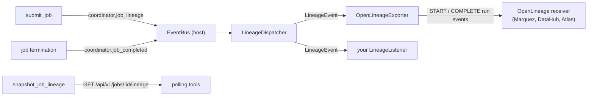

# Data lineage

clink can describe, for every job, the external datasets it reads from and writes
to, and emit that description to an external lineage system. The intent is
integration: an operator running a metadata catalogue or a lineage store wants to
know that "job 42 reads Kafka topic `orders` and writes ClickHouse table
`db.sales`" without parsing clink internals. The feature has two halves, kept
deliberately separate:

- **Capture** is engine-internal and vendor-neutral. It derives a small lineage
  graph from the submitted job and exposes it over HTTP and on the event bus.
- **Export** is pluggable. A `LineageListener` translates the graph plus run-state
  into whatever an external system speaks. A built-in exporter ships the
  [OpenLineage](https://openlineage.io) run-event format, which DataHub, Apache
  Atlas, Marquez and others ingest; bespoke backends implement the listener
  interface directly.

The two are connected by one in-process event and one structured graph, so the
engine never depends on any particular lineage backend.

## The lineage model

The graph is a graph of connectors and datasets, not of physical operators. It is
shaped after the OpenLineage data model (a `(namespace, name)` dataset identity
plus open, additive facets) so the common adapter is a near-trivial mapping.

| Type | What it is |
| --- | --- |
| `LineageDataset` | One external data entity. `ns` is the storage system's address (`kafka://broker:9092`, `postgres://db:5432`, `s3://bucket`, `file`); `name` is the entity within it (a topic, a table, an object key, a path); `facets` is open string metadata (connector family, record format, channel hint, delivery mode); `schema` is the column list (name + friendly type) when the op carries one. |
| `LineageVertex` | One connector: a source or a sink. Keyed by the graph-local operator `id`, with the stable `uid` when set. Source vertices also carry `boundedness` (`bounded` / `unbounded` / `unknown`). |
| `LineageEdge` | A coarse source-vertex to sink-vertex dependency. |
| `LineageGraph` | `sources`, `sinks`, `edges`. `to_json()` / `from_json()` round-trip it. |

Defined in `include/clink/lineage/lineage_graph.hpp`.

## Capture

`extract_lineage(const JobGraphSpec&)` (`src/lineage/lineage_graph.cpp`) is a pure
function of the submitted job spec. It needs no SQL context and no runtime, so it
covers both SQL-submitted and programmatic-API jobs through one path:

- **Source / sink classification** mirrors the planner and `snapshot_job_graph`: a
  source is an operator with no inputs; a sink is an operator nothing reads from.
  Side-output and split input refs (`id::tag`, `id.N`) resolve to the upstream id.
- **Edges** are real reachability over the operator DAG, not all-to-all. For each
  source, a forward walk collects every sink it can reach. A linear job yields one
  edge; a two-input join yields two.
- **Dataset identity** comes from each operator's `type` (the connector factory
  name) and `params` (the connector options). `connector_family()` strips the
  channel and direction tokens from the factory type (`kafka_2pc_sink_string` to
  `kafka`, `s3_parquet_string_source` to `s3_parquet`), and `dataset_for()` maps
  the family plus its params to a `(namespace, name)` pair.

### Dataset identity normalisation

`build_params` does not carry the `connector` key into the operator params, so the
family is read from the factory `type`. The namespace and name are then drawn from
the connector's locator params:

| Connector family | namespace | name |
| --- | --- | --- |
| kafka | `kafka://<brokers>` | topic |
| pulsar / nats / rabbitmq | `<scheme>://<service url or host>` | topic / subject / queue |
| kinesis / firehose / dynamodb | `<scheme>://<region>` | stream / table |
| pubsub | `pubsub://<project>` | topic / subscription |
| redis | `redis://<host:port>` | stream / key / channel |
| postgres / mysql / clickhouse / cassandra | `<scheme>://<host:port>` (host/port parsed from a libpq conninfo when present) | `<database>.<table>` |
| s3 / s3_parquet | `s3://<bucket>` | key / prefix |
| gcs_parquet / azure_parquet / webhdfs_parquet | `gs://` / `azure://` / `webhdfs://` + bucket or host | key / prefix / path |
| file / filesystem / parquet | `file` | path |
| iceberg | catalog uri or warehouse | `<namespace>.<table>` |
| delta | `delta` | path / table |
| elasticsearch / opensearch / splunk / prometheus / influxdb / http | `<scheme>://<host or url>` | index / job / measurement / url |
| (anything else) | `<family>://<authority>` from the common locator keys | first present of topic / table / path / key / ... |

The generic fallback guarantees that a connector not enumerated above still
produces a usable identity. Adding a connector means adding a branch to
`dataset_for()`; the family list it mirrors lives in `src/sql/physical_plan.cpp`.

## Lifecycle and exposure

The capture side rides the existing in-process `EventBus`
(`include/clink/runtime/event_bus.hpp`), the same bus that backs the
`/api/v1/events` SSE stream:

- At submit, `Coordinator::submit_job` publishes `coordinator.job_lineage` with the lineage
  graph (payload `{"job_id":N,"job_name":"...","lineage":{...}}`). Best-effort: a
  job is never failed because of lineage.
- At termination, the existing `coordinator.job_completed` event carries the outcome
  (payload `{"job_id":N,"job_name":"...","status":"...","errors":<count>}`, plus
  an `"error"` string on failure). The `job_name` and `error` keys are additive;
  `errors` stays a count for existing consumers.

The graph is also available to poll, for tools that prefer pull over the event
stream:

```
GET /api/v1/jobs/:id/lineage
  -> {"job_id":N,"available":true,"lineage":{"sources":[...],"sinks":[...],"edges":[...]}}
```

served by `Coordinator::snapshot_job_lineage`, a mirror of `snapshot_job_graph`
that reads the retained `JobGraphSpec` and runs the extractor. `available` is
false when the job exists but no graph was retained.

## Column-level lineage

For SQL jobs, lineage also records which source column(s) feed each sink column.
This is only knowable at SQL compile time (the column mapping lives in the bound
plan; the Coordinator sees only the lowered operator graph), so it is captured in
the planner and carried on the spec to the Coordinator:

- **Capture** (`src/sql/column_lineage.cpp`, run from `PhysicalPlanner::compile`).
  A recursive tracer walks the bound `LogicalSink` tree. For each sink output
  column it traces backwards to the source `(table, column)` it derives from:
  `Scan` is the base case; `Project` parses the output's `expr_json` and recurses
  on each `{"col":...}` leaf; `Aggregate` maps a group-key output to its source
  column and an aggregate output to its `input_column`; `Filter` passes through;
  `EquiJoin`/`IntervalJoin` map the output column ordinal to the owning child by
  position (left columns then right). Source datasets are identified with the
  same `dataset_from_family` helper the lowered-op path uses, so the captured
  input refs line up with the source vertices.
- **Carry**: `JobGraphSpec::column_lineage`, a JSON object keyed by sink op id,
  serialised with the spec (so it survives HA restart) exactly like `name`.
- **Attach**: `extract_lineage` reads it onto the sink `LineageDataset` as a
  `column_lineage` list, round-tripped by the model's `to_json`/`from_json`.

Each field records its `output` column, the `inputs` (`{namespace, name, field}`
referencing a source dataset), and a `transformation`: `IDENTITY` (a straight
copy), `TRANSFORMATION` (a computed expression) or `AGGREGATION` (through a GROUP
BY aggregate). The export side maps this to the OpenLineage `columnLineage`
dataset facet.

## Export

A `LineageListener` (`include/clink/lineage/lineage_listener.hpp`) is the export
hook. Listeners are **host-side** components, constructed inside the `clink_node`
process, never on the job-plugin `.so` path: a `.so` links its own private
`EventBus` singleton and would never see the host's events.



- `LineageDispatcher` subscribes to the bus, reconstructs a structured
  `LineageEvent` (`JobStarted` carries the graph; `JobCompleted` carries the
  status), and fans it out to its listeners. It runs on the publish thread, so a
  listener that does network I/O must not block there.
- `LineageListenerRegistry` is a named-factory registry mirroring the engine's
  other registries. `register_builtin_lineage_listeners()` registers the
  `openlineage` factory when the build includes the HTTP client.

### The OpenLineage exporter

`OpenLineageExporter` (`src/lineage/openlineage_exporter.cpp`) maps a
`JobStarted` to a START run event (sources as inputs, sinks as outputs) and a
`JobCompleted` to a COMPLETE / FAIL / ABORT, correlated by a job-derived `runId`.
A FAIL event carries the first failure as an OpenLineage `errorMessage` run
facet. Datasets carry a `schema` facet (column name + type) when the connector
op declares one; output datasets also carry a `columnLineage` facet when column
lineage was captured (`fields → { <out>: { inputFields:[{namespace,name,field}],
transformationType } }`). Delivery is asynchronous: `on_event` serialises the
event and pushes it onto a bounded outbox; a worker thread POSTs from the outbox
so the publish thread is never blocked. Overflow drops the oldest queued event
and counts the drop.

The OpenLineage job name is the submitter's job name (`JobGraphSpec::name`),
carried through to both events; it falls back to `job_<id>` only when the job was
submitted unnamed. The name is set per submission path: the `?name=` query (or a
`name` in the spec body) for `POST /api/v1/jobs/spec` and `/api/v1/jobs`, and the
per-statement name for SQL. The name also rides the retained graph and the HA
manifest, so it survives a leader takeover.

Enable it on the Coordinator:

```
clink_node --role=coordinator --http-port=8081 \
  --lineage-listener=openlineage \
  --lineage-endpoint=http://marquez:5000 \
  --lineage-namespace=prod
```

`--lineage-endpoint` is http only (the built-in client is plain HTTP). The
capture side (the HTTP endpoint and the event stream) is always on; the listener
flag only wires an outbound exporter. Under HA only the leader submits jobs, so
there is no double-emit and no leadership gating is needed.

## Scope

Lineage is dataset-level for every job and column-level for SQL jobs. Known
limits:

- **Lookup-join dimension columns.** A `connector='lookup'` dimension is an async
  function, not a source operator, so its columns are opaque: dimension-derived
  sink columns trace only as far as the probe side, not the dimension.
- **Window-synthetic columns.** `window_start` / `window_end` have no upstream
  source column and carry no column-lineage entry.
- **Sub-expression precision.** A computed expression records every leaf source
  column it reads as an input with `transformation=TRANSFORMATION`; it does not
  distinguish which operand of a nested expression each column feeds.
- **Cross-job dataset stitching.** Correlating one job's sink topic with another
  job's source topic is left to the external lineage system, which already does
  this by `(namespace, name)`.

## Source files

| File | Role |
| --- | --- |
| `include/clink/lineage/lineage_graph.hpp`, `src/lineage/lineage_graph.cpp` | The model, `extract_lineage`, `connector_family`, `dataset_for` / `dataset_from_family`, column-lineage types + JSON round-trip. |
| `include/clink/lineage/lineage_listener.hpp`, `src/lineage/lineage_listener.cpp` | `LineageEvent`, `LineageListener`, the registry, and the `LineageDispatcher` EventBus bridge. |
| `include/clink/lineage/openlineage_exporter.hpp`, `src/lineage/openlineage_exporter.cpp` | The built-in OpenLineage HTTP exporter (run events + `columnLineage` facet). |
| `include/clink/sql/column_lineage.hpp`, `src/sql/column_lineage.cpp` | The SQL column-lineage tracer (`capture_column_lineage`), run from `PhysicalPlanner::compile`. |
| `src/cluster/coordinator.cpp` | `snapshot_job_lineage` and the `coordinator.job_lineage` emit in `submit_job`. |
| `tools/clink_node.cpp` | The `GET /api/v1/jobs/:id/lineage` route and the dispatcher wiring (`--lineage-*` flags). |
| `tests/test_lineage.cpp`, `tests/test_column_lineage.cpp` | Unit tests for the model + dispatcher, and the SQL column-lineage tracer. |
