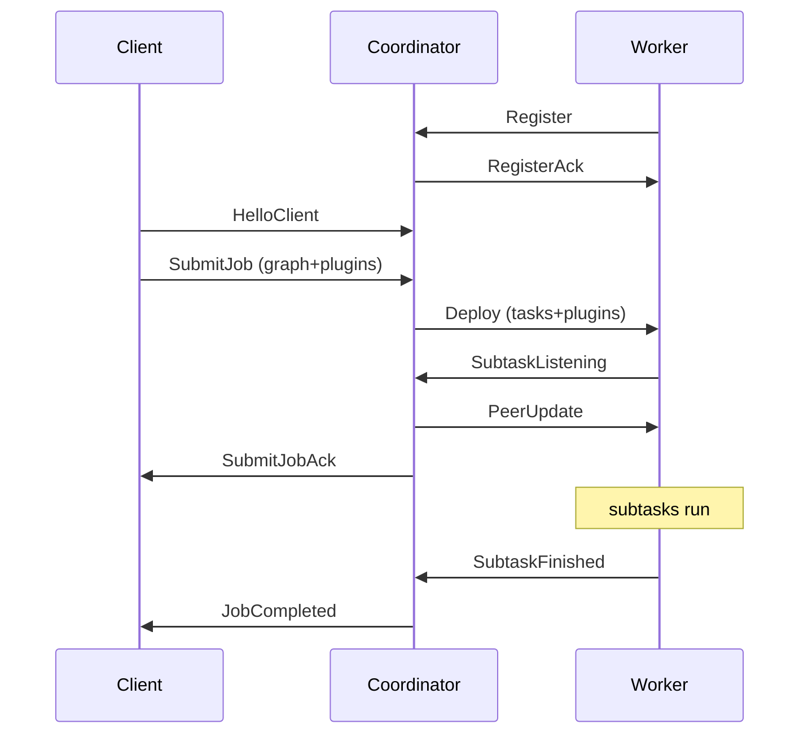

# Distributed runtime and the cluster control plane

> The control plane is a Coordinator process plus one or more Worker processes that talk a small binary protocol over TCP to deploy, run, checkpoint and recover jobs.

## Overview

A clink cluster has exactly one active Coordinator (coordinator) and any number of Workers (workers). The coordinator is the single source of truth for deployment: it accepts job submissions from clients, plans them into per-subtask deployment tasks, hands those tasks to workers, tracks liveness and checkpoint progress, and reports completion. Each worker is a worker that registers with the coordinator, receives deployment tasks, runs them, and reports back. All three roles (coordinator, worker, client) speak one binary, length-prefixed framing defined in `include/clink/cluster/protocol.hpp`.

Jobs are not built into the cluster binaries. A job is a compiled shared library that the client ships with the submission; the coordinator caches it and re-ships it inside every deployment, and each worker `dlopen`s it before running tasks. This is the job-as-plugin model (`CLINK_REGISTER_JOB`).

The single binary `tools/clink_node.cpp` runs as either a coordinator (`--role=coordinator`) or a worker (`--role=worker`); clients submit through the `clink::application::JobSubmitter` library rather than through `clink_node`.

## Where it lives

| Concern | File(s) |
| --- | --- |
| Wire protocol, message kinds, framing | `include/clink/cluster/protocol.hpp`, encode/decode in `include/clink/cluster/messages.hpp` |
| Coordinator (accept, watchdog, dispatch, recovery) | `include/clink/cluster/coordinator.hpp`, `src/cluster/coordinator.cpp` |
| Worker (register, deploy, run, heartbeat) | `include/clink/cluster/worker.hpp`, `src/cluster/worker.cpp` |
| HA leader election (file coordinator) | `include/clink/cluster/ha_coordinator.hpp`, `src/cluster/ha_coordinator.cpp` |
| HA leader election (optional etcd coordinator) | `impls/etcd/include/clink/etcd/etcd_ha_coordinator.hpp` |
| coordinator endpoint discovery for workers | `include/clink/cluster/service_discovery.hpp` |
| Client submission library | `include/clink/application/job_submitter.hpp`, `src/application/job_submitter.cpp` |
| Plugin contract and registry | `include/clink/plugin/plugin.hpp`, `include/clink/plugin/plugin_impl.hpp` |
| Job-as-plugin macro | `include/clink/job/register_job.hpp` |
| Plugin loader and ABI gate | `include/clink/cluster/plugin_loader.hpp`, `src/cluster/plugin_loader.cpp`, generated `include/clink/plugin/abi_version.hpp` (from `.in`) |
| Process entry point | `tools/clink_node.cpp` |

## How it works

### The wire protocol

Every message on a control connection is a length-prefixed frame: a 4-byte big-endian length followed by a payload, and the payload's first byte is a `MessageKind` (`include/clink/cluster/protocol.hpp`). String fields inside a payload are themselves `[u32 length BE][bytes]`, and all multi-byte integers are big-endian. The framing is built by `MessageBuilder` and read by `MessageReader` in the same header; `encode_frame(kind, msg)` (in `include/clink/cluster/messages.hpp`) writes the kind byte, then the body, then prepends the length.

`MessageReader` owns its payload by value and bounds-checks every read (`read_string`, `consume_byte_` throw on truncation). Many decoders treat trailing fields as optional by guarding on `r.eof()` so an older peer that sends a shorter frame is handled gracefully. For example `decode_register` reads `slot_count` and `http_port` only if more bytes remain.

`MessageKind` values are grouped by direction:



(*`RescaleOperator = 12` and `Savepoint = 13` are distinct values: the client-loop dispatch matches on the `MessageKind` byte, so every client -> coordinator request kind must be unique. `CancelJob = 103` is deliberately overloaded for both the coordinator -> worker cancel broadcast and the client -> coordinator cancel request; it is disambiguated by connection direction, not by a shared value with another client request.)

### Connection routing: the first frame

The coordinator's accept loop (`accept_loop_` in `src/cluster/coordinator.cpp`) wraps each accepted file descriptor into a `network::Connection` via an injected `AcceptFactory` (plain TCP by default; a TLS factory when configured). It then reads one frame and dispatches on the kind in `handle_first_frame_`:

- `Register` -> the connection becomes a long-lived worker connection. The coordinator records the `WorkerConnection`, replies `RegisterAck`, and spawns a per-worker reader thread (`start_reader_for_`).
- `HelloClient` -> the connection becomes a client connection, owned as a `shared_ptr` and serviced by a per-client thread (`handle_client_loop_`) that reads `SubmitJob`, `ListJobs`, `CancelJob`, `RescaleJob`, `RescaleOperator` and `Savepoint` frames.
- Anything else is a protocol violation and the connection is dropped.

```
client                         Coordinator                        Worker
  |                                |                                  |
  |                                |<----- Register ------------------|
  |                                |------ RegisterAck -------------->|
  |--- HelloClient --------------->|                                  |
  |--- SubmitJob (graph+plugins)-->|                                  |
  |                                |--- Deploy (tasks+plugins) ------>|
  |                                |<---- SubtaskListening -----------|
  |                                |---- PeerUpdate ----------------->|
  |<-- SubmitJobAck ---------------|        (subtasks run)            |
  |                                |<---- SubtaskFinished ------------|
  |<-- JobCompleted ---------------|                                  |
```

### Worker registration and lifecycle

`Worker::connect_to_coordinator` (`src/cluster/worker.cpp`) opens the coordinator connection (plain TCP by default, via an injectable `ConnectFactory`), sends `Register` (carrying `worker_id`, `data_host`, `slot_count`, and an advertised HTTP port), and waits for `RegisterAck`. It then starts a reader thread (`reader_loop_`) and, if `heartbeat_interval > 0`, a heartbeat thread (`heartbeat_loop_`) that sends a `Heartbeat` frame on each tick (default interval 500 ms, `Worker::Config::heartbeat_interval`).

`reader_loop_` dispatches inbound coordinator frames: `Deploy`, `PeerUpdate`, `CancelJob`, `StartJob`, `TriggerCheckpoint`, `CommitCheckpoint`, `AbortCheckpoint`, `FinalCheckpointAssigned` and `BeginRescale`. When the coordinator connection drops (`read_frame` returns no value), the loop sets `disconnected_`, wakes any subtasks blocked waiting for a `PeerUpdate`, and returns.

On `Deploy` (`handle_deploy_`), the worker allocates (or reuses) a per-job `JobBundle`, loads any plugin libraries shipped with the deploy into that bundle's registry, registers a pending-task record per subtask, stashes the job's checkpoint config, and spawns one task thread per `DeploymentTask`. For the built-in generic subtask role (`kGenericSubtaskRole`, the string `"__clink_subtask"` in `include/clink/cluster/job_planner.hpp`), each task thread runs `run_generic_subtask_`, which:

1. parses the `OperatorChainSpec` out of `DeploymentTask::extra_config`,
2. binds one inbound network bridge per input edge,
3. sends `SubtaskListening` reporting the bound port(s) (sources send an empty `edge_ports` list, which the coordinator uses purely as a "ready" tick),
4. waits for the coordinator's `PeerUpdate` (bounded by `peer_update_timeout`, default 30 s), then
5. builds and runs the operator chain through the local executor.

The two-phase listen/peer-update handshake is how the coordinator resolves the actual `host:port` each upstream subtask should connect to: subtasks bind ephemeral ports first, report them, and the coordinator fans the resolved peer addresses back out once every subtask of the job has reported. See [./network-stack.md](./network-stack.md) for the data-plane bridges and [./task-lifecycle.md](./task-lifecycle.md) for what runs inside a subtask.

### Port discovery and peer resolution

The coordinator tracks per-job port state in `JobState`. Each `SubtaskListening` (`handle_subtask_listening_`) records the listening port keyed by the four-tuple `(downstream_role, downstream_subtask, upstream_role, upstream_subtask)` so that a multi-input subtask (union or join) which binds several inbound listeners can be matched to the correct upstream for each. When `received_listenings == expected_listenings`, the coordinator resolves every task's `peers[]` against that port map and broadcasts `PeerUpdate` per worker (`send_peer_updates_locked_`). Subtasks with no peers still receive an empty `PeerUpdate` as a "go" signal.

### Heartbeats, the watchdog and lost-worker detection

Each worker's reader thread on the coordinator side stamps `last_seen` on every frame received (`start_reader_for_`), so any message, not just `Heartbeat`, counts as liveness. A dedicated watchdog thread (`watchdog_loop_`) wakes every `Config::watchdog_interval` (default 100 ms) and declares a worker lost when `now - last_seen > Config::heartbeat_timeout` (default 2000 ms). Because a healthy worker heartbeats every 500 ms, several missed heartbeats are needed before a false positive.

When a worker is marked lost (`mark_worker_lost_locked_`):

- it is added to `lost_worker_ids_` and its read side is shut down,
- for each job that had pending tasks on the lost worker, the coordinator either folds those tasks into a restart or, if no restart is possible, synthesises a `worker lost (heartbeat timeout)` error per pending subtask and counts them as completed,
- surviving workers of a touched job are sent `CancelJob` so their subtasks wind down cooperatively (role handlers poll `was_cancelled()`; the local executor's cancel token is flipped).

Whether a restart is attempted is gated by `effective_max_restarts(job.checkpoint)` (`include/clink/cluster/protocol.hpp`): with a checkpoint directory set and no explicit override, the default is `kDefaultSelfHealRestarts` (10) self-heal attempts; without checkpointing it is 0 (fail-fast, since there is nothing to restore from). An explicit `max_restarts_on_worker_loss` of 0 forces fail-fast even when checkpointing is on; an explicit N caps the attempts. The watchdog also enforces a `restart_drain_timeout` (default 30 s): if a job sits in `awaiting_restart` while a survivor neither drains nor dies, the watchdog fails the job rather than wedge or risk double-running a slow-but-alive subtask. The full restart-from-checkpoint mechanism, including the second-worker-loss-during-drain handling, is documented in [./fault-tolerance-and-rescale.md](./fault-tolerance-and-rescale.md).

### Checkpoint coordination

The coordinator owns a `checkpoint_trigger_loop_` thread. For each job with a checkpoint directory and a positive `interval_ms`, it allocates the next checkpoint id, seeds a pending-ack set from the live task set, and broadcasts `TriggerCheckpoint` to every worker hosting the job. Each worker injects a barrier into its source subtasks; as subtasks snapshot they reply `SubtaskCheckpointed`. When the pending set for an id empties, the coordinator writes a `COMPLETED-<id>` marker under the checkpoint dir and advances `latest_completed_checkpoint_id`. Sinks implementing two-phase commit then receive `CommitCheckpoint` (or `AbortCheckpoint` if a commit group could not commit atomically). Bounded sources at clean end-of-stream use `RequestFinalCheckpoint`/`FinalCheckpointAssigned` to obtain one job-wide final checkpoint id so the post-last-checkpoint tail is durably committed before completion. The barrier mechanics and 2PC sink protocol are covered in [./checkpointing.md](./checkpointing.md).

### HA leader election

For a single active coordinator, clink supports standby coordinators that hold the control port closed until they win an election. The abstraction is `HaCoordinator` (`include/clink/cluster/ha_coordinator.hpp`): `start()` spawns a poll thread that tries to acquire leadership, `is_leader()` and an `on_become_leader` callback report transitions, and `current_leader_endpoint()` lets a worker discover where the active coordinator is.

Two implementations exist:

- **File coordinator** (default, `src/cluster/ha_coordinator.cpp`). `make_file_ha_coordinator(ha_dir)` takes an exclusive `fcntl` write lock on `<ha_dir>/leader.lock` (non-blocking `F_SETLK`) and, on success, bumps a monotonic epoch and atomically writes `<ha_dir>/active-leader.json` (write to `.tmp`, then rename) with the leader's advertised `host`, `port`, `epoch` and timestamp. The OS releases the lock when the holding process exits or crashes, which lets a standby acquire it. The poll interval defaults to 200 ms. This is intended for a shared filesystem on a single machine or a cluster with shared storage.
- **etcd coordinator** (optional, `impls/etcd/include/clink/etcd/etcd_ha_coordinator.hpp`). `make_etcd_ha_coordinator(EtcdHaConfig)` performs etcd v3 leader election: grant a lease (default TTL 10 s), keep it alive on a background thread, atomic-put the leader key, and have standbys watch the key. Lease loss is the failure-detection primitive, so a frozen leader loses leadership after at most the lease TTL. The leader key is namespaced by `cluster_name`. The factory is only compiled when the cluster is built with the etcd impl (`CLINK_WITH_ETCD` / linked as `clink_etcd`); `tools/clink_node.cpp` guards the call with `#ifdef CLINK_LINKED_ETCD` and prints a loud error if `--etcd-endpoints` is given without it.

In `clink_node`, passing `--ha-dir` (or `--etcd-endpoints`) puts the coordinator in HA mode: `coordinator.start()` is deferred until `on_become_leader` fires, at which point the coordinator binds the control port and calls `recover_persisted_jobs()`. A standby coordinator just sits on the coordinator poll thread.

#### Job persistence and recovery

When HA is active the coordinator persists each submitted job. `set_ha_dir` creates `<ha_dir>/jobs/` and `<ha_dir>/history/`. On submit, the coordinator writes `<ha_dir>/jobs/<job_id>/manifest.json` plus the plugin `.so` bytes (`persist_job_manifest_`). On takeover, `recover_persisted_jobs()` scans `<ha_dir>/jobs/`, re-reads each manifest, reloads its plugins into a fresh `JobBundle`, and re-submits the job with `restore_from` set to the latest `COMPLETED-N` marker found on disk for that job. It is idempotent (already-running ids are skipped) and pins each recovered job's state-backend URI to the one it originally ran with (`pin_recovered_state_backend`) so a cluster default configured after the job was submitted cannot silently rebind it. Terminal-state records are also persisted to `<ha_dir>/history/` and reloaded into a bounded in-memory ring (`reload_history_from_disk_`).

A `--ha-dir` worker in `clink_node` discovers the leader by polling `active-leader.json` (or etcd) for up to 10 s and connects to it. Every `clink_node` worker - HA or not - exits with code 2 on coordinator disconnect: there is no worker-side re-register path, so a disconnected worker is a zombie, and exiting is what lets a supervisor (Kubernetes `restartPolicy`, compose `restart:`, the HA wrapper) restart it into a fresh registration. In HA the restarted process re-reads `active-leader.json` to find the new leader; in non-HA it reconnects to the same address. On the Coordinator side, a worker re-registering under an existing id (a restarted process with a stable name, e.g. a StatefulSet pod) atomically replaces its old session: the old connection's reader thread is joined during registration, off the reader thread itself. workers can also discover the coordinator endpoint through the simpler `ServiceDiscovery` abstraction (`include/clink/cluster/service_discovery.hpp`): static config, environment variables, or a file containing `host:port`.

### The client submission path

A client does not run `clink_node`. It links `clink::application::JobSubmitter` (`include/clink/application/job_submitter.hpp`) and calls `submit(graph_json, plugin_paths, opts)`. The submitter (`src/application/job_submitter.cpp`):

1. reads each plugin file into memory and content-hashes it,
2. opens a TCP connection to the coordinator,
3. sends `HelloClient` then `SubmitJob` (graph JSON + plugin binaries + `CheckpointConfig`),
4. waits for `SubmitJobAck` (bounded by `ack_timeout`, default 10 s),
5. if `wait_for_completion`, waits for `JobCompleted` (bounded by `wait_timeout`, default 60 s),
6. closes the connection and returns a `SubmitResult`.

If the client connection drops while the job is still running, the coordinator clears the job's `notify_client_conn` pointer and the job continues; only the ability to push `JobCompleted` back is lost. `list_jobs()` uses the same `HelloClient`-then-request pattern and returns both running and recently-completed jobs (`completion_signalled` distinguishes them).

On the coordinator side, `handle_submit_` decodes the message, allocates a per-job `JobBundle`, writes each plugin to the coordinator's local cache and `dlopen`s it into the bundle (so the planner can see plugin-defined op types), optionally rejects on a state schema-evolution incompatibility, then calls `submit_job(...)` which plans the graph and dispatches `Deploy` messages. Job planning and slot assignment are covered in [./jobs-and-scheduling.md](./jobs-and-scheduling.md).

### The job-as-plugin model

A clink job is a single shared library. The contract (`include/clink/job/register_job.hpp`) is declared with one macro at file scope:

```cpp
void define_job(clink::api::Pipeline& env) {
    env.from_elements<int64_t>({1, 2, 3, 4, 5})
       .map<int64_t>([](int64_t v) { return v * 2; })
       .sink(/* ... */);
}
CLINK_REGISTER_JOB("my-job", "1.0", "demo", define_job);
```

`CLINK_REGISTER_JOB` expands `CLINK_DECLARE_PLUGIN` (the ABI handshake getters) and emits the job exports: `clink_plugin_register`, `clink_job_build` (returns the captured `JobGraphSpec` JSON), and `clink_job_check_restore_compatibility` (the state schema-evolution pre-deploy check). The user's `build_fn` runs under `std::call_once`, so:

- in the **submitter** process, `dlopen` fires `build_fn` once and `clink_job_build` returns the JSON the submitter uploads alongside the `.so`;
- in the **coordinator** and each **worker** process, the load re-fires `build_fn` and the side-effect registrations populate that job's `JobBundle` registry, so inline operator types such as `_inline_map_<n>` resolve identically on every side.

The same `.so` is therefore dlopen'd on every process that touches the job: the submitter, the coordinator (for planning and validation), and each worker (to run it). Cross-process matching of inline operator types relies on `build_fn` registering operators in a deterministic order - which holds because every load starts from fresh per-`.so` static state (see below), so the inline-name counter always restarts at zero and re-mints the same names the submitter's graph JSON references.

`build_fn` runs under `std::call_once`, so it fires **once per `.so` module instance**. That is a foot-gun for the long-lived coordinator and worker, which load the *same* `.so` for *every* job that uses it, each into a different per-job `JobBundle`: `dlopen` refcounts by inode, so re-opening the same path returns the same instance whose `call_once` has already fired, and the second job's bundle would receive no registrations (`plan_job` then rejects with "no source factory registered"). `PluginLoader::load_into` therefore `dlopen`s a **unique per-load copy** of the `.so` - a distinct inode is a distinct module with fresh static state (fresh `once_flag` *and* fresh inline-name counter) - and unlinks the copy immediately after opening (the mapping stays valid; handles live for the process lifetime). The submitter uses `clink_job_build` in a one-shot process and is unaffected.

#### Plugin loading and the ABI gate

`PluginLoader` (`src/cluster/plugin_loader.cpp`) `dlopen`s a `.so` with `RTLD_NOW | RTLD_LOCAL` (a unique per-load copy for `load_into`, see above), resolves the extern "C" handshake symbols (`clink_plugin_abi_fingerprint`, `clink_plugin_abi_version`, `clink_plugin_abi_hash`, `clink_plugin_target_triple`, `clink_plugin_metadata`, `clink_plugin_register`), and gates the load on two checks:

- **ABI compatibility.** The default gate compares `clink_plugin_abi_fingerprint()` to `cluster_abi_fingerprint()` - both return `kAbiFingerprint`, a **structural fingerprint** computed at clink configure time (`CMakeLists.txt`) as `SHA256` over the content of the public header tree (`include/clink/**.hpp`) plus the ABI-relevant compile options (`CLINK_USE_FLAT_HASH_MAP`) and the manual `CLINK_ABI_VERSION`, then baked into the generated `include/clink/plugin/abi_version.hpp`. Equal fingerprints load; a difference is a hard refusal. Because it hashes header content, it rotates when the ABI/behaviour surface actually changes - a data member added to a boundary type, a virtual added or reordered on `Operator`/`Source`/`Sink`, an inline/template body, a toggled ABI option - but **not** on the majority of commits that touch only `.cpp` / tests / docs / build scaffolding. So a cluster patch rebuild keeps loading existing plugins, while a real ABI change auto-invalidates them with no one remembering to bump anything. It errs toward over-invalidation (hashes the whole public tree, not a curated subset) - the safe direction for a load gate. `CLINK_ABI_VERSION` folds in as a manual force-rotate for a semantic break the header text can't capture. The decision is factored into the pure `check_plugin_abi()` for testing. Two fallbacks preserve safety: a plugin built before the fingerprint symbol existed (`clink_plugin_abi_fingerprint` absent) and **strict mode** (`CLINK_STRICT_PLUGIN_ABI=1`) both revert to the historic exact commit-hash comparison (`kAbiHash`, from `git rev-parse HEAD`). The commit hash is otherwise informational (reported in logs, `LoadedPlugin`, and `clink_node --version`).
- **Target triple.** The plugin's target triple (`darwin-arm64` / `linux-x86_64` / `linux-arm64`) must match the cluster's, or the load is refused. This gate is unconditional - it is a genuine binary-compat axis independent of the ABI fingerprint.

`RTLD_LOCAL` keeps the plugin's symbols out of the global namespace. Because `clink_core` is statically linked into both the host and the `.so`, each side has its own copy of any process-wide singleton, so plugin registrations must be routed through the `PluginRegistry`/`JobBundle` view passed into `clink_plugin_register` rather than a `Registry::default_instance()` resolved inside the `.so`.

### Security: the "safe to expose" baseline

The default posture is loopback + plain TCP + no auth - correct for a trusted single host, unsafe on a shared or public network. The baseline that makes a cluster safe to expose:

- **Frame caps.** Every wire frame is length-prefixed by an attacker-controllable `u32`. The readers cap it at `kMaxFrameBytes` (256 MiB, `network/wire.hpp`) and drop the connection on anything larger, closing the memory-amplification DoS where a peer that claims 4 GiB makes the reader allocate 4 GiB and OOM the process. Always on.
- **Token auth on the HTTP control plane.** Set `CLINK_AUTH_TOKEN` on the node (`clink_node` reads it for both the coordinator and worker HTTP servers) and every request must carry `Authorization: Bearer <token>` or gets 401 before its handler runs - the dashboard, the `/api/v1` routes, and SQL submission over HTTP (`POST /api/v1/jobs/spec`). Clients present it automatically from the same env var (`clink run` / the SQL submitter and the queryable-state reader call `HttpClient::set_bearer_token`). Unset leaves auth off (backward compatible). The token rides an env var, not a flag, so it does not leak in `ps`; a CORS preflight (`OPTIONS`) is allowed through so a browser can present credentials on the real request.
- **Control-plane TLS/mTLS.** The coordinator/worker control connections run through injectable accept/connect factories; a TLS factory (build-gated, `clink::tls`) encrypts and can mutually authenticate the control plane. Pair it with `bind_host=0.0.0.0` for multi-host.
- **Secret indirection (`env://`).** A connector option may reference a secret as `env://VAR` instead of embedding it, so a job spec or persisted catalog stores a reference, not a plaintext password or key. `BuildContext::param_or` resolves it from the environment at deploy time; an unset variable yields empty (a clear failure, never a leak). `password='env://PGPASSWORD'` is the shape.

Remaining hardening, still trusted-network today: the inter-operator **data plane** reuses the same TLS-capable connection factories as the control plane but is not TLS by default, so run it on a trusted network segment until data-plane TLS is wired on by default. A concrete safe-to-expose recipe today: `CLINK_AUTH_TOKEN` set, control plane on TLS, connector secrets via `env://`, data plane on a private network.

## Key types and APIs

| Type / function | Responsibility |
| --- | --- |
| `MessageKind`, `MessageBuilder`, `MessageReader` (`protocol.hpp`) | The wire vocabulary and the length-prefixed, big-endian framing primitives |
| `encode_frame` / `decode_*` (`messages.hpp`) | Serialise/parse each message body around a leading kind byte |
| `Coordinator` (`coordinator.hpp`) | Accept connections, plan and deploy jobs, run the watchdog and checkpoint trigger, recover persisted jobs |
| `Coordinator::Config` | `watchdog_interval`, `heartbeat_timeout`, `bind_host`, `advertise_host`, restart and slot-wait policy, optional autoscaler |
| `Coordinator::JobState` | Per-job in-memory state: tasks by worker, port map, checkpoint acks, restart bookkeeping, commit groups, rescale coordinator |
| `Worker` (`worker.hpp`) | Register, run deployed tasks via role handlers, heartbeat, dispatch checkpoint/commit/rescale frames |
| `RoleHandler` / `kGenericSubtaskRole` | Per-role task entry point; the built-in generic role runs any planned operator chain |
| `DeploymentTask`, `PeerAddress` (`protocol.hpp`) | One subtask's placement, bind port, peers, restore directives and key-group range |
| `CheckpointConfig`, `effective_max_restarts` (`protocol.hpp`) | Per-job checkpoint/restore/restart and state-backend settings, and the restart-policy resolution |
| `HaCoordinator`, `make_file_ha_coordinator`, `make_etcd_ha_coordinator` | Leader election and leader-endpoint discovery |
| `ServiceDiscovery` and subclasses | worker-side discovery of the coordinator endpoint (static, env var, file) |
| `JobSubmitter` (`job_submitter.hpp`) | Programmatic client: connect, `HelloClient` + `SubmitJob`, await ack/completion |
| `PluginRegistry` (`plugin.hpp`) | Registration sink for a job/plugin's types, sources, operators, sinks, selectors and key extractors |
| `CLINK_REGISTER_JOB`, `CLINK_DECLARE_PLUGIN` | Emit the job/plugin C-ABI exports |
| `PluginLoader` (`plugin_loader.hpp`) | `dlopen`, verify the ABI gate, run the register hook |

## Configuration and knobs

Coordinator (`Coordinator::Config`, defaults from `include/clink/cluster/coordinator.hpp`):

- `watchdog_interval` = 100 ms; how often worker liveness is re-evaluated.
- `heartbeat_timeout` = 2000 ms; a worker is lost after this with no message.
- `bind_host` = `127.0.0.1`; control-plane bind address (set `0.0.0.0` for multi-host, and pair with TLS).
- `advertise_host` = empty -> defaults to `bind_host`; the host published in resolved peer addresses.
- `max_restarts` = 0; per-subtask retry attempts for non-checkpointed jobs.
- `restart_drain_timeout` = 30000 ms; bound on a survivor drain before the job is failed.
- `submit_wait_for_slots` = 0 ms; how long submit waits for spare slots (0 = reject immediately).
- `default_state_backend_uri` = empty; cluster-wide default backend for jobs that chose none.
- Default control port `kDefaultCoordinatorPort` = 6123; history ring `kCoordinatorHistoryCap` = 128.

Worker (`Worker::Config`):

- `heartbeat_interval` = 500 ms.
- `slot_count` = 1; concurrent tasks this worker can host.
- `peer_update_timeout` = 30000 ms; max wait for `PeerUpdate` before aborting a task.
- `http_port` = 0; advertised read-API port (0 = no HTTP, coordinator proxy skips it).
- `checkpoint_num_retained` = 1 (clamped to >= 1); completed checkpoints kept per job.

Per-job `CheckpointConfig` (`protocol.hpp`): `checkpoint_dir` (empty disables checkpointing), `interval_ms` (0 disables periodic triggers), `restore_from_dir` + `restore_from_checkpoint_id`, `max_restarts_on_worker_loss` (`kRestartAuto` resolves to self-heal when checkpointing is on, else fail-fast), `alignment` (default `Aligned`), and `state_backend_uri`.

`clink_node` (`tools/clink_node.cpp`) flags: `--role={coordinator|worker}`, `--id` (worker), `--coordinator-host`/`--coordinator-port`, `--ha-dir`, `--etcd-endpoints`/`--etcd-cluster`/`--etcd-lease-ttl-s`, `--http-port`, `--slots`, `--sql-catalog-dir` (coordinator, see below), and TLS flags. The etcd path additionally requires building with the etcd impl (`CLINK_WITH_ETCD`, linked as `clink_etcd`).

### SQL over HTTP

When the coordinator is built with the SQL frontend linked (`CLINK_LINKED_SQL`, the default), three HTTP endpoints let a client compile and run SQL without the `clink_submit_sql` CLI:

- `POST /api/v1/jobs/sql?mode=explain|compile|submit[&parallelism=N][&name=foo]` - the request body is raw SQL text (one or more statements; no JSON wrapper, so SQL quoting is untouched). DDL (`CREATE TABLE`/`VIEW`, `ALTER`, `RENAME`, `DROP`) is applied to a coordinator-held session catalog so it is visible to later statements and later requests. For each `INSERT` / `CREATE MATERIALIZED VIEW` (and an explicit `EXPLAIN`) the mode decides the action: `explain` returns the `LogicalPlan` tree text, `compile` returns the compiled `JobGraphSpec` JSON as a string, `submit` runs it and returns the job id. Errors return `400` with `{ok:false,error,position}` (1-based byte offset). `ANALYZE` is rejected over HTTP (it runs a local scan; use the CLI).
- `GET /api/v1/catalog` - the session catalog: every registered table / view / materialized view with its columns, kind, connector and primary key.
- `GET /api/v1/connectors` - the SQL connector vocabulary (the `WITH (connector='...')` values), with best-effort source/sink flags and a category.

The session catalog is in-memory by default (lost on coordinator restart). Passing `--sql-catalog-dir <dir>` loads any persisted table definitions at startup and auto-saves subsequent DDL there. The endpoints reuse the same `clink::sql` entry points as the CLI (`parse` -> `Binder` -> `optimize` -> `PhysicalPlanner`), so the compiled spec is identical; submission is the same `coordinator.submit_job` path as `POST /api/v1/jobs/spec`. `POST /api/v1/jobs/spec?name=<job>&state_backend=<uri>` takes a `JobGraphSpec` JSON body; the optional `state_backend` query (percent-encoded, so a URI carrying its own `?...` query round-trips) sets the job's `CheckpointConfig.state_backend_uri`, else the cluster `--default-state-backend` applies. `clink_submit_sql --state-backend <uri>` is the CLI front for it.

## Guarantees and caveats

- **Single active coordinator.** There is one coordinator at a time. HA provides standby failover via leader election, not active-active. The file coordinator requires a shared filesystem and relies on OS lock release on process death; the header notes that pathological cases (for example an NFS hang) can leak stale ownership.
- **etcd is optional and build-gated.** The etcd coordinator only exists when the cluster is built with the etcd impl; otherwise `--etcd-endpoints` is rejected at startup. The HA fencing epoch is written to the leader file/key but, per the `ha_coordinator.hpp` note, is not yet propagated into the wire protocol.
- **Transport security.** The control plane defaults to loopback and plain TCP. TLS is wired through injectable accept/connect factories in `clink_node` (and is itself build-gated); any deployment beyond a trusted local network should enable it.
- **ABI gate is a structural fingerprint.** By default a plugin and the cluster must agree on a SHA-256 over the public header contents plus the ABI-relevant build options and `CLINK_ABI_VERSION`, and on the target triple - so a cluster rebuild that does not change the ABI surface (a `.cpp`, doc, or test-only change) keeps existing plugin binaries deployable. `CLINK_STRICT_PLUGIN_ABI=1` restores the legacy exact-commit-hash comparison. There is no sandbox: a crash in plugin code terminates the worker process, after which the coordinator restarts the job per its restart policy (the contract is "trust your own plugins").
- **Plugins are not unloaded.** `PluginLoader` tracks handles but keeps them loaded for the process lifetime; `dlclose` with registered closures pointing back into plugin code is deferred.
- **Exactly-once depends on the source and sink.** worker-loss recovery rolls the whole job back to its last completed checkpoint and replays; whether that is exactly-once end to end depends on the source's replay support and on sinks implementing two-phase commit. See [./checkpointing.md](./checkpointing.md) and the connector docs at [../connectors/README.md](../connectors/README.md).
- **Restart bounds.** Self-heal is bounded (default 10 attempts) so a persistently failing job stops looping; an explicit `max_restarts_on_worker_loss` overrides this. A hung-but-heartbeating survivor is escalated to a job failure on `restart_drain_timeout` rather than force-restarted.
- **Determinism requirement for jobs.** Inline operator type names are minted per environment, so cross-process matching relies on `build_fn` registering operators in a stable order.

## Related

- [./architecture.md](./architecture.md) - where the control plane sits in the component stack.
- [./jobs-and-scheduling.md](./jobs-and-scheduling.md) - graph planning, slot assignment and how a `SubmitJob` becomes `DeploymentTask`s.
- [./task-lifecycle.md](./task-lifecycle.md) - what runs inside a deployed subtask.
- [./network-stack.md](./network-stack.md) - the data-plane bridges set up via `SubtaskListening`/`PeerUpdate`.
- [./checkpointing.md](./checkpointing.md) - barriers, `TriggerCheckpoint`/`CommitCheckpoint` and the 2PC sink protocol.
- [./fault-tolerance-and-rescale.md](./fault-tolerance-and-rescale.md) - the restart-from-checkpoint path, rescale choreography and schema evolution.
- [./state-and-backends.md](./state-and-backends.md) - state-backend URIs and restore semantics referenced by `CheckpointConfig`.
- [../connectors/README.md](../connectors/README.md) - source and sink connectors and their replay/commit guarantees.
