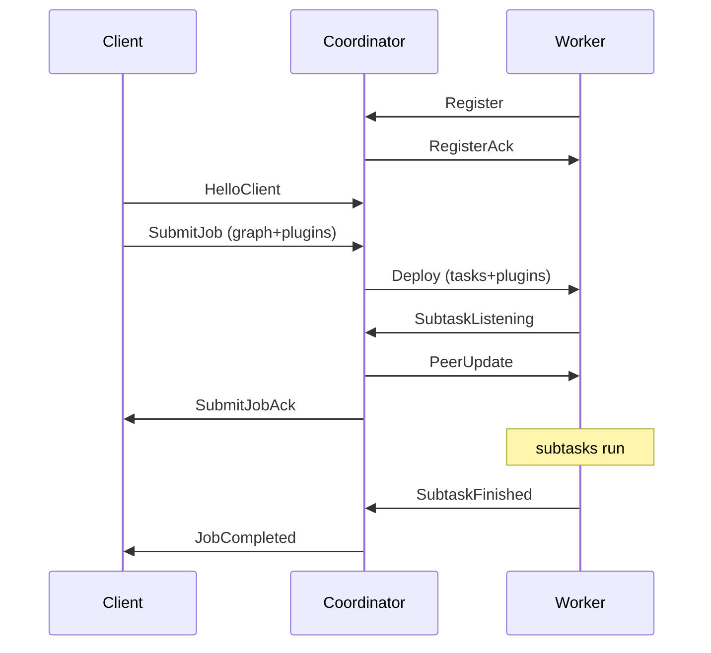

# Distributed runtime and the cluster control plane

> The control plane is a Coordinator process plus one or more Worker processes that talk a small binary protocol over TCP to deploy, run, checkpoint and recover jobs.

## Overview

A clink cluster has exactly one active Coordinator (coordinator) and any number of Workers (workers). The coordinator is the single source of truth for deployment: it accepts job submissions from clients, plans them into per-subtask deployment tasks, hands those tasks to workers, tracks liveness and checkpoint progress, and reports completion. Each worker is a worker that registers with the coordinator, receives deployment tasks, runs them, and reports back. All three roles (coordinator, worker, client) speak one binary, length-prefixed framing defined in `include/clink/cluster/protocol.hpp`.

Jobs are not built into the cluster binaries. A job is a compiled shared library that the client ships with the submission; the coordinator caches it and re-ships it inside every deployment, and each worker `dlopen`s it before running tasks. This is the job-as-plugin model (`CLINK_REGISTER_JOB`).

Plugin bytes are content-addressed and ship at most once per receiver (item 30). A submission sends hash-only references first (`PluginBinary` with empty bytes); the coordinator resolves them from its cache and answers `missing_plugin_hashes` on the ack for anything it lacks, which the submitter uploads in one retry on the same connection - so every submit after a module's first carries no plugin bytes at all. On the deploy side the coordinator remembers, per worker connection, which hashes it has shipped and sends references thereafter; a re-registered worker starts from an empty set and receives full bytes again, matching its pid-keyed cache starting empty. A reference a receiver cannot resolve fails the submit or deploy loudly - it is a claim about the peer's cache, never permission to run without the module. `clink_coordinator_plugin_bytes_shipped_total`, `..._plugin_ships_deduped_total` and `..._submit_plugin_cache_hits_total` make the traffic visible.

On ELF the repository's own job modules are split-debug stripped after linking (`cmake/ClinkPluginDebugSplit.cmake`): the DWARF - which measured ~102 MB of a ~104 MB module against 2.6 MB of code - moves whole into `<module>.so.debug` beside the artefact, and the shipped module (~5 MB) carries a `.gnu_debuglink` naming it, so gdb and `llvm-symbolizer` resolve symbols from the same directory. The dynamic symbol table survives stripping, so the `clink_plugin_*` handshake, `CLINK_REGISTER_JOB` entry points and the ABI-hash check are unaffected; a submit measures ~0.45 s against ~2.7 s fat. The `job_plugin_ships_stripped` test pins the property (no `.debug_info` section, hard size budget). Consumers building their own modules against an installed clink get the same win from the same two commands: `objcopy --only-keep-debug job.so job.so.debug && objcopy --strip-unneeded --add-gnu-debuglink=job.so.debug job.so`. Keep the `.so.debug` from the build that shipped - crash addresses from any cached copy of the module symbolise against it. macOS modules are left alone: their DWARF never links into the module in the first place.

The single binary `tools/clink_node.cpp` runs as either a coordinator (`--role=coordinator`) or a worker (`--role=worker`); clients submit through the `clink::application::JobSubmitter` library rather than through `clink_node`.

## Task placement co-locates a pipeline instance

`assign_task_placement` (`include/clink/cluster/coordinator.hpp`, implemented in
`src/cluster/coordinator.cpp`) assigns a worker to every planned task, grouping the tasks that
share a **subtask index** and placing each group entirely on one worker.

Tasks sharing a subtask index are joined by FORWARD edges: subtask *i* of the source feeds
subtask *i* of the bridge feeds subtask *i* of the projection. The data plane hands a batch
across a forward edge as a pointer when both ends live in one process (`LocalDataPlane`) and
serialises it over a socket when they do not, so placement alone decides whether a forward edge
costs a pointer copy or a network round trip.

It used to place one task at a time, greedy first-fit, in plan order. Plan order is
operator-major - every subtask of the source, then every subtask of the bridge - so filling one
worker's slots before touching the next scattered each instance across hosts. Measured on a
3-worker rig at parallelism 12, nexmark q0 (four operators, forward edges only, **no shuffle at
all**) sent 16 of its 24 data-plane edges over TCP:

    before   local=8   socket=16   67% of edges serialised
    after    local=24  socket=0     0%

and its CPU-per-event was 2.05x worse at parallelism 12 than at 4, where the same sweep on a
single host was flat to within 5%.

Two properties worth knowing:

- **A hash-shuffled edge is unaffected.** Subtask *i* sends to every downstream subtask
  regardless of placement, so co-location can only convert forward edges. Measured over
  loopback, a forward-edge-only query (q0) gained about 20% CPU efficiency while a
  shuffle-dominated one (q12) was neutral. Over a real network the forward-edge gain is larger
  than the loopback figure, because that is the cost being avoided.
- **Placement is deterministic.** Workers are visited in sorted worker-id order rather than in
  the coordinator registry's order, which is an `unordered_map` and neither sorted nor stable
  across processes. Placement was previously unrepeatable across deploys of the same plan, which
  also made any measurement of it unrepeatable.

An instance larger than any single worker's free capacity is split across whatever is free:
splitting is worse than co-locating and much better than refusing to deploy. Running out of
capacity entirely is a reported failure, not a silent partial placement.

`tests/test_task_placement.cpp` pins the contract, including the split and out-of-capacity
paths. It was verified against a faithful reproduction of the old behaviour - and note that a
first attempt at that reproduction passed, because iterating group-by-group co-locates by
accident; it is the operator-major PLAN order that scatters an instance.

## Where it lives

| Concern | File(s) |
| --- | --- |
| Wire protocol, message kinds, framing | `include/clink/cluster/protocol.hpp`, encode/decode in `include/clink/cluster/messages.hpp` |
| Coordinator (accept, watchdog, dispatch, recovery) | `include/clink/cluster/coordinator.hpp`, `src/cluster/coordinator.cpp` |
| Worker (register, deploy, run, heartbeat) | `include/clink/cluster/worker.hpp`, `src/cluster/worker.cpp` |
| HA leader election (file coordinator) | `include/clink/cluster/ha_coordinator.hpp`, `src/cluster/ha_coordinator.cpp` |
| HA leader election (optional etcd coordinator) | `impls/etcd/include/clink/etcd/etcd_ha_coordinator.hpp` |
| coordinator endpoint discovery for workers | `include/clink/cluster/service_discovery.hpp` |
| Client submission library | `include/clink/application/job_submitter.hpp`, `src/application/job_submitter.cpp` |
| Plugin contract and registry | `include/clink/plugin/plugin.hpp`, `include/clink/plugin/plugin_impl.hpp` |
| Job-as-plugin macro | `include/clink/job/register_job.hpp` |
| Plugin loader and ABI gate | `include/clink/cluster/plugin_loader.hpp`, `src/cluster/plugin_loader.cpp`, generated `include/clink/plugin/abi_version.hpp` (from `.in`) |
| Process entry point | `tools/clink_node.cpp` |

## How it works

### The wire protocol

Every message on a control connection is a length-prefixed frame: a 4-byte big-endian length followed by a payload, and the payload's first byte is a `MessageKind` (`include/clink/cluster/protocol.hpp`). String fields inside a payload are themselves `[u32 length BE][bytes]`, and all multi-byte integers are big-endian. The framing is built by `MessageBuilder` and read by `MessageReader` in the same header; `encode_frame(kind, msg)` (in `include/clink/cluster/messages.hpp`) writes the kind byte, then the body, then prepends the length.

`MessageReader` owns its payload by value and bounds-checks every read (`read_string`, `consume_byte_` throw on truncation). Many decoders treat trailing fields as optional by guarding on `r.eof()` so an older peer that sends a shorter frame is handled gracefully. For example `decode_register` reads `slot_count` and `http_port` only if more bytes remain.

`MessageKind` values are grouped by direction:


```mermaid
sequenceDiagram
  participant C as Client
  participant coordinator as Coordinator
  participant worker as Worker
  worker->>coordinator: Register
  coordinator->>worker: RegisterAck
  C->>coordinator: HelloClient
  C->>coordinator: SubmitJob (graph+plugins)
  coordinator->>worker: Deploy (tasks+plugins)
  worker->>coordinator: SubtaskListening
  coordinator->>worker: PeerUpdate
  coordinator->>C: SubmitJobAck
  Note over worker: subtasks run
  worker->>coordinator: SubtaskFinished
  coordinator->>C: JobCompleted
```

(*`RescaleOperator = 12` and `Savepoint = 13` are distinct values: the client-loop dispatch matches on the `MessageKind` byte, so every client -> coordinator request kind must be unique. `CancelJob = 103` is deliberately overloaded for both the coordinator -> worker cancel broadcast and the client -> coordinator cancel request; it is disambiguated by connection direction, not by a shared value with another client request.)

### Connection routing: the first frame

The coordinator's accept loop (`accept_loop_` in `src/cluster/coordinator.cpp`) wraps each accepted file descriptor into a `network::Connection` via an injected `AcceptFactory` (plain TCP by default; a TLS factory when configured). It then reads one frame and dispatches on the kind in `handle_first_frame_`:

- `Register` -> the connection becomes a long-lived worker connection. The coordinator records the `WorkerConnection`, replies `RegisterAck`, and spawns a per-worker reader thread (`start_reader_for_`).
- `HelloClient` -> the connection becomes a client connection, owned as a `shared_ptr` and serviced by a per-client thread (`handle_client_loop_`) that reads `SubmitJob`, `ListJobs`, `CancelJob`, `RescaleJob`, `RescaleOperator` and `Savepoint` frames.
- Anything else is a protocol violation and the connection is dropped.

```
client                         Coordinator                        Worker
  |                                |                                  |
  |                                |<----- Register ------------------|
  |                                |------ RegisterAck -------------->|
  |--- HelloClient --------------->|                                  |
  |--- SubmitJob (graph+plugins)-->|                                  |
  |                                |--- Deploy (tasks+plugins) ------>|
  |                                |<---- SubtaskListening -----------|
  |                                |---- PeerUpdate ----------------->|
  |<-- SubmitJobAck ---------------|        (subtasks run)            |
  |                                |<---- SubtaskFinished ------------|
  |<-- JobCompleted ---------------|                                  |
```

### Worker registration and lifecycle

`Worker::connect_to_coordinator` (`src/cluster/worker.cpp`) opens the coordinator connection (plain TCP by default, via an injectable `ConnectFactory`), sends `Register` (carrying `worker_id`, `data_host`, `slot_count`, and an advertised HTTP port), and waits for `RegisterAck`. It then starts a reader thread (`reader_loop_`) and, if `heartbeat_interval > 0`, a heartbeat thread (`heartbeat_loop_`) that sends a `Heartbeat` frame on each tick (default interval 500 ms, `Worker::Config::heartbeat_interval`).

`reader_loop_` dispatches inbound coordinator frames: `Deploy`, `PeerUpdate`, `CancelJob`, `StartJob`, `TriggerCheckpoint`, `CommitCheckpoint`, `AbortCheckpoint`, `FinalCheckpointAssigned`, `BeginRescale`, `CutoverPeerUpdate` and `CutoverRebind` (the last three are the hot-rescale control surface: an arming `BeginRescale` names the cutover checkpoint and the worker replies with `BeginRescaleAck` reporting what it armed; `CutoverRebind` binds new inbound listeners for the post-cutover subtasks; `CutoverPeerUpdate` carries per-feeding-task endpoint lists that swap the held output groups onto the new peers - see [./fault-tolerance-and-rescale.md](./fault-tolerance-and-rescale.md)). When the coordinator connection drops (`read_frame` returns no value), the loop sets `disconnected_`, wakes any subtasks blocked waiting for a `PeerUpdate`, and returns.

On `Deploy` (`handle_deploy_`), the worker allocates (or reuses) a per-job `JobBundle`, loads any plugin libraries shipped with the deploy into that bundle's registry, registers a pending-task record per subtask, stashes the job's checkpoint config, and spawns one task thread per `DeploymentTask`. For the built-in generic subtask role (`kGenericSubtaskRole`, the string `"__clink_subtask"` in `include/clink/cluster/job_planner.hpp`), each task thread runs `run_generic_subtask_`, which:

1. parses the `OperatorChainSpec` out of `DeploymentTask::extra_config`,
2. binds one inbound network bridge per input edge,
3. sends `SubtaskListening` reporting the bound port(s) (sources send an empty `edge_ports` list, which the coordinator uses purely as a "ready" tick),
4. waits for the coordinator's `PeerUpdate` (bounded by `peer_update_timeout`, default 30 s), then
5. builds and runs the operator chain through the local executor.

The two-phase listen/peer-update handshake is how the coordinator resolves the actual `host:port` each upstream subtask should connect to: subtasks bind ephemeral ports first, report them, and the coordinator fans the resolved peer addresses back out once every subtask of the job has reported. See [./network-stack.md](./network-stack.md) for the data-plane bridges and [./task-lifecycle.md](./task-lifecycle.md) for what runs inside a subtask.

### Port discovery and peer resolution

The coordinator tracks per-job port state in `JobState`. Each `SubtaskListening` (`handle_subtask_listening_`) records the listening port keyed by the four-tuple `(downstream_role, downstream_subtask, upstream_role, upstream_subtask)` so that a multi-input subtask (union or join) which binds several inbound listeners can be matched to the correct upstream for each. When `received_listenings == expected_listenings`, the coordinator resolves every task's `peers[]` against that port map and broadcasts `PeerUpdate` per worker (`send_peer_updates_locked_`). Subtasks with no peers still receive an empty `PeerUpdate` as a "go" signal.

### Heartbeats, the watchdog and lost-worker detection

Each worker's reader thread on the coordinator side stamps `last_seen` on every frame received (`start_reader_for_`), so any message, not just `Heartbeat`, counts as liveness. A dedicated watchdog thread (`watchdog_loop_`) wakes every `Config::watchdog_interval` (default 100 ms) and declares a worker lost when `now - last_seen > Config::heartbeat_timeout` (default 2000 ms). Because a healthy worker heartbeats every 500 ms, several missed heartbeats are needed before a false positive.

When a worker is marked lost (`mark_worker_lost_locked_`):

- it is added to `lost_worker_ids_` and its read side is shut down,
- for each job that had pending tasks on the lost worker, the coordinator either folds those tasks into a restart or, if no restart is possible, synthesises a `worker lost (heartbeat timeout)` error per pending subtask and counts them as completed,
- surviving workers of a touched job are sent `CancelJob` so their subtasks wind down cooperatively (role handlers poll `was_cancelled()`; the local executor's cancel token is flipped).

Whether a restart is attempted is gated by `effective_max_restarts(job.checkpoint)` (`include/clink/cluster/protocol.hpp`): with a checkpoint directory set and no explicit override, the default is `kDefaultSelfHealRestarts` (10) self-heal attempts; without checkpointing it is 0 (fail-fast, since there is nothing to restore from). An explicit `max_restarts_on_worker_loss` of 0 forces fail-fast even when checkpointing is on; an explicit N caps the attempts. The watchdog also enforces a `restart_drain_timeout` (default 30 s): if a job sits in `awaiting_restart` while a survivor neither drains nor dies, the watchdog fails the job rather than wedge or risk double-running a slow-but-alive subtask. The full restart-from-checkpoint mechanism, including the second-worker-loss-during-drain handling, is documented in [./fault-tolerance-and-rescale.md](./fault-tolerance-and-rescale.md).

### Checkpoint coordination

The coordinator owns a `checkpoint_trigger_loop_` thread. For each job with a checkpoint directory and a positive `interval_ms`, it allocates the next checkpoint id, seeds a pending-ack set from the live task set, and broadcasts `TriggerCheckpoint` to every worker hosting the job. Each worker injects a barrier into its source subtasks; as subtasks snapshot they reply `SubtaskCheckpointed`. When the pending set for an id empties, the coordinator writes a `COMPLETED-<id>` marker under the checkpoint dir and advances `latest_completed_checkpoint_id`. Sinks implementing two-phase commit then receive `CommitCheckpoint` (or `AbortCheckpoint` if any subtask failed its snapshot). Bounded sources at clean end-of-stream use `RequestFinalCheckpoint`/`FinalCheckpointAssigned` to obtain one job-wide final checkpoint id so the post-last-checkpoint tail is durably committed before completion. The barrier mechanics and 2PC sink protocol are covered in [./checkpointing.md](./checkpointing.md).

### HA leader election

For a single active coordinator, clink supports standby coordinators that hold the control port closed until they win an election. The abstraction is `HaCoordinator` (`include/clink/cluster/ha_coordinator.hpp`): `start()` spawns a poll thread that tries to acquire leadership, `is_leader()` and an `on_become_leader` callback report transitions, and `current_leader_endpoint()` lets a worker discover where the active coordinator is.

Two implementations exist:

- **File coordinator** (default, `src/cluster/ha_coordinator.cpp`). `make_file_ha_coordinator(ha_dir)` takes an exclusive `fcntl` write lock on `<ha_dir>/leader.lock` (non-blocking `F_SETLK`) and, on success, bumps a monotonic epoch and atomically writes `<ha_dir>/active-leader.json` (write to `.tmp`, then rename) with the leader's advertised `host`, `port`, `epoch` and timestamp. The OS releases the lock when the holding process exits or crashes, which lets a standby acquire it. The poll interval defaults to 200 ms. This is intended for a shared filesystem on a single machine or a cluster with shared storage.

  **The HA directory must be on a filesystem that honours POSIX write locks.** The whole fencing scheme reduces to that one primitive: if a second process is granted the same lock, every coordinator sharing the directory believes it leads, each announces an epoch above the last, and nothing reports an error. Bind mounts (including Docker Desktop's), 9p and virtiofs shares, and NFS exports mounted `nolock` are the usual offenders, and the symptom is two live leaders rather than a failure.

  On `start()` the coordinator therefore proves the primitive instead of assuming it: it holds the lock and forks a child that asks for the same one. The fork is necessary because POSIX record locks are per-process, so a second descriptor in the same process reports success on any filesystem. A directory that grants both makes the coordinator refuse to stand for leadership, with an error naming the likely cause; `--ha-allow-unsafe-locks` overrides that and warns instead. A probe that cannot run (another coordinator holds the probe file, which is normal when two start together) is inconclusive and does not condemn the directory.

  The check covers exclusion between processes ON ONE HOST at startup. It cannot detect a mount that honours locks locally but not between hosts - the NFS behaviour that matters most for a multi-node deployment - so a coordinator on such a mount passes the probe and can still split brain against one on another host. Use the etcd coordinator where leadership must hold across hosts.
- **etcd coordinator** (optional, `impls/etcd/include/clink/etcd/etcd_ha_coordinator.hpp`). `make_etcd_ha_coordinator(EtcdHaConfig)` performs etcd v3 leader election: grant a lease (default TTL 10 s), keep it alive on a background thread, atomic-put the leader key, and have standbys watch the key. Lease loss is the failure-detection primitive, so a frozen leader loses leadership after at most the lease TTL. The leader key is namespaced by `cluster_name`. The factory is only compiled when the cluster is built with the etcd impl (`CLINK_WITH_ETCD` / linked as `clink_etcd`); `tools/clink_node.cpp` guards the call with `#ifdef CLINK_LINKED_ETCD` and prints a loud error if `--etcd-endpoints` is given without it.

In `clink_node`, passing `--ha-dir` (or `--etcd-endpoints`) puts the coordinator in HA mode: `coordinator.start()` is deferred until `on_become_leader` fires, at which point the coordinator binds the control port and calls `recover_persisted_jobs()`. A standby coordinator just sits on the coordinator poll thread.

The takeover path is integration-tested end to end in `tests/integration/test_coordinator_ha_failover.cpp`: a coordinator-only loss (standby recovers the persisted job and drives new checkpoints) and the compound loss where the leader and a worker are SIGKILLed together with no window between them. The compound test asserts the property a consumer actually depends on - the standby restores from the last `COMPLETED-N` marker (a non-zero `restore_from_ckpt`, checked against the recovery log line, since a from-scratch re-run regenerates the same checkpoint ids and atomically overwrites the same committed filenames) and the committed output stays each-record-exactly-once.

#### Worker control-session recovery

`clink_node --role=worker` is a long-lived process containing a `WorkerSupervisor`. A `Worker` object is deliberately a single-use control and task session: it owns task threads, per-job registries, checkpoint waits and network endpoints that have a clean reset boundary only at destruction. When its coordinator connection ends, the supervisor removes the session from the HTTP surface, immediately cancels and fences all of its subtasks, joins every task and control thread, destroys the session, rediscovers the coordinator, and registers a fresh `Worker` under the same stable worker id. The next session is never published before the old one has fully drained, so restored subtasks cannot overlap work from the superseded session.

Discovery and transport failures retry indefinitely with bounded exponential backoff and full jitter (`--reconnect-initial-backoff-ms`, default 100; `--reconnect-max-backoff-ms`, default 5000). `--reconnect-discovery-timeout-ms` bounds each discovery pass. A temporary coordinator connection-cap refusal is retryable; an incompatible protocol, malformed handshake or non-retryable registration refusal stops the process with code 2 because another retry cannot repair it. The supervisor remembers the highest coordinator epoch it has admitted and refuses a discovered or handshaking endpoint below it, including an unfenced epoch 0 downgrade.

EOF is not sufficient failure detection: a one-way partition can leave a TCP socket apparently writable. Protocol v2 therefore sequences worker heartbeats and makes a v2 coordinator return a fenced `HeartbeatAck`. A v2 worker ends its session after `--coordinator-heartbeat-timeout-ms` without any coordinator frame (default 3000 ms). The acknowledgement is capability-gated for rolling upgrades: a v2 coordinator never sends it to a v1 worker, and a v2 worker connected to a v1 coordinator retains EOF-based detection.

The worker HTTP listener belongs to the supervisor rather than a session and keeps the same port across recovery. `/api/v1/health` and session-backed routes return 503 while discovery, backoff or draining is active; `/api/v1/config` remains available. Recovery is observable through `clink_worker_control_connection_attempts_total`, `clink_worker_control_disconnects_total`, `clink_worker_control_reconnects_total` and `clink_worker_control_connected`. An external process supervisor remains the final boundary for a worker binary crash, host loss, fatal handshake, or an operator that cannot honour cancellation. It is no longer the normal response to coordinator failover.

#### Shutdown

`clink_node` installs a SIGTERM/SIGINT handler and calls `Worker::stop()` or `Coordinator::stop()` on the way out.

`Worker::stop()` flips every registered per-subtask cancel token before joining the task threads - the same flip `CancelJob` performs. That matters because a running subtask's `LocalExecutor` watches `JobConfig::external_cancel_token` and nothing else; it has no view of the Worker. Setting the worker's own `stop_` flag reaches the pending-task waiters and the EOS waits, but not a runner that is mid-stream. Until 2026-08-03 `stop()` did only the latter, so SIGTERM exited an idle worker promptly and hung a busy one indefinitely - the reverse of what a container grace period needs.

Cancelling rather than draining is deliberate. The subtasks are going away with the process either way, and a cancelled subtask runs its normal teardown, so a 2PC sink aborts its pending transaction instead of leaving it for recovery. What clink does NOT do on SIGTERM is take a final checkpoint or drain the sources: records since the last checkpoint are replayed on restart. There is no "stop with savepoint" path.

The joins are unbounded on purpose. Once cancellation is signalled, a subtask that will not exit is a bug in that operator, and detaching a thread still touching the Worker's members during destruction trades a diagnosable hang for a use-after-free.

#### Limits on what a peer can make a node do

Frame IO is one shared implementation (`include/clink/cluster/frame_io.hpp`), and it does not trust the peer. A frame longer than `kMaxFrameBytes` (256 MiB) is refused on the header alone, and the body is read in 64 KiB chunks so memory tracks the bytes that have actually arrived rather than the number the header claimed. Both matter: a cap alone still lets four bytes cause a 256 MiB allocation.

`MessageReader::read_count` bounds every container length by the bytes remaining in the frame. An element cannot cost less than a byte on the wire, so a larger count is malformed by construction - no arbitrary limit is involved.

Each of the four frame-handling loops - the coordinator's accept loop, its per-client and per-worker readers, and `Worker::reader_loop_` - wraps a single frame in a try. A frame that does not decode costs the peer its connection, is logged, and increments `clink_malformed_frames_total`. This is load-bearing rather than defensive: the decoders throw by design on a malformed payload, and an exception leaving a thread function is `std::terminate`, so before this a single malformed frame killed the process.

None of that bounds the number of connections, the rate of frames, or aggregate memory across peers. See `docs/production-hardening-plan.md`, W14.

#### Protocol version negotiation

Every node declares two numbers at the handshake: `protocol_version`, the wire protocol it speaks, and `min_compatible_protocol_version`, the oldest peer it will talk to. `check_protocol_compatibility` (`include/clink/cluster/protocol.hpp`) accepts only when each side falls inside the other's range, and the coordinator applies it at both `Register` and `HelloClient` while the worker applies it to the `RegisterAck`. The check is symmetric on purpose: "the coordinator can read the worker" does not imply the reverse, and a one-sided handshake admits a pairing that half-works.

This is deliberately NOT the mechanism that handles a message merely gaining a field. That is the additive-tail idiom - encoders append at the end, decoders read `r.eof() ? default : read()` - and it must keep working without negotiation, because it is what lets a cluster be rolled one node at a time. `kClusterProtocolVersion` is bumped for a change additive tails cannot express: a field changing meaning or width, a `MessageKind` repurposed, a semantic contract changed under an unchanged encoding, or a capability whose new frame kind must be gated to peers that understand it. Bumping it for an additive tail alone would refuse the very upgrade the idiom exists to allow.

A peer built before versioning sends no fields, which decode as `0` and are read as version 1. Refusals name both versions and say which end to upgrade, and increment `clink_protocol_mismatches_total`. A refused client receives a `SubmitJobAck` nack; CLI tools other than `clink submit` surface its message through `protocol_rejection_message` rather than reporting an unexpected frame kind.

Raising `kMinCompatibleClusterProtocolVersion` is an end-of-support decision, not a routine bump: it strands every peer below it, loudly and at the handshake.

#### Fencing: a coordinator that has lost leadership cannot act

Losing leadership is not something a leader can detect on its own. A coordinator partitioned from the coordination store, or paused past its lease, keeps every worker connection open, keeps its in-memory job state, and keeps its checkpoint timer running. Fencing is what stops it acting on that stale belief.

Every coordinator-to-worker control frame carries the sending coordinator's epoch: `RegisterAck`, `Deploy`, `PeerUpdate`, `CancelJob`, `TriggerCheckpoint`, `CommitCheckpoint`, `AbortCheckpoint`, `FinalCheckpointAssigned`, `BeginRescale`, `CutoverPeerUpdate` and `CutoverRebind`. `clink_node` calls `Coordinator::set_epoch` from the become-leader callback before the listener opens, and `Coordinator::fenced_frame_` stamps the epoch as it encodes, so no send site can forget it.

A worker binds the epoch carried by the `RegisterAck` that admitted it. `Worker::accept_epoch_` then drops any later frame carrying a **lower** epoch, incrementing `clink_worker_fenced_frames_total` and logging at error - a non-zero count is a split-brain signal. A **higher** epoch re-binds the worker rather than being refused: a failover that keeps the connection up presents that way, and refusing it would fence the worker off from the legitimate new leader.

Epoch `0` means "unfenced". A non-HA coordinator never sets one, so a single-coordinator cluster behaves exactly as it did before fencing existed. The field is appended at the tail of each message body and read with the additive idiom the rest of the protocol uses (`r.eof() ? 0 : r.read_u64_be()`), so a node running a pre-fencing build decodes as `0` and a cluster keeps working while it is rolled.

Control-plane metadata is fenced too: the job manifest and the history record each carry `"coordinator_epoch"`, the active-leader file carries `"epoch"`, and a write from a lower epoch than the one already stored is refused. The check is a genuine compare-and-set (`fenced_metadata_cas_write`): the epoch read, the `metadata_write_allowed` rule and the fsync-plus-rename all run inside one per-target critical section, held as `flock(LOCK_EX)` on a `<path>.wlock` beside the record. Two racing writers can no longer both pass the check - the second one's read happens only after the first one's rename is complete, so the interleave where a superseded coordinator read a stale epoch and then renamed its record over the real leader's cannot occur. The lock is the same primitive family as the leader lock itself, released by the kernel when its holder dies, so the fenced path adds no dependency and no stale-lock recovery problem; the lock file is created once and never unlinked, because unlink-and-recreate lets a later writer lock a fresh inode while an earlier one still holds the old. The race is pinned by `CoordinatorFencing.TwoWritersCannotStraddleTheCasWindow`, which stretches the historic window with an in-section fault delay and proves a concurrent writer waits instead of slipping inside.

#### Job persistence and recovery

When HA is active the coordinator persists each submitted job. `set_ha_dir` creates `<ha_dir>/jobs/` and `<ha_dir>/history/`. On submit, the coordinator writes `<ha_dir>/jobs/<job_id>/manifest.json` plus the plugin `.so` bytes (`persist_job_manifest_`). On takeover, `recover_persisted_jobs()` scans `<ha_dir>/jobs/`, re-reads each manifest, reloads its plugins into a fresh `JobBundle`, and re-submits the job with `restore_from` set to the latest `COMPLETED-N` marker found on disk for that job. It is idempotent (already-running ids are skipped) and pins each recovered job's state-backend URI to the one it originally ran with (`pin_recovered_state_backend`) so a cluster default configured after the job was submitted cannot silently rebind it. A recovery that fails ONLY for capacity - the takeover raced the workers' new control sessions, so no slots had registered within `submit_wait_for_slots` - is parked rather than dropped: the id joins `pending_recovery_ids_` and a retry thread re-runs `recover_one_persisted_job_` from the manifest whenever a worker registers (the same already-running guard makes the retry idempotent). Every other recovery failure still logs and drops, since re-running it would fail the same way. Terminal-state records are also persisted to `<ha_dir>/history/` and reloaded into a bounded in-memory ring (`reload_history_from_disk_`).

A `--ha-dir` worker rediscovers the leader from `active-leader.json` (or etcd) before every session; a non-HA worker reconnects to its configured address. On the Coordinator side, a worker re-registering under an existing stable id atomically replaces its old session: the old connection's reader thread is joined off the reader thread itself, its in-flight subtasks are folded into checkpoint recovery, and its capacity gauges are retired before the new session contributes slots. Workers embedded outside `clink_node` can also discover the coordinator endpoint through the simpler `ServiceDiscovery` abstraction (`include/clink/cluster/service_discovery.hpp`): static config, environment variables, or a file containing `host:port`.

### The client submission path

A client does not run `clink_node`. It links `clink::application::JobSubmitter` (`include/clink/application/job_submitter.hpp`) and calls `submit(graph_json, plugin_paths, opts)`. The submitter (`src/application/job_submitter.cpp`):

1. reads each plugin file into memory and content-hashes it,
2. opens a TCP connection to the coordinator,
3. sends `HelloClient` then `SubmitJob` (graph JSON + plugin binaries + `CheckpointConfig`),
4. waits for `SubmitJobAck` (bounded by `ack_timeout`, default 10 s),
5. if `wait_for_completion`, waits for `JobCompleted` (bounded by `wait_timeout`, default 60 s),
6. closes the connection and returns a `SubmitResult`.

If the client connection drops while the job is still running, the coordinator clears the job's `notify_client_conn` pointer and the job continues; only the ability to push `JobCompleted` back is lost. `list_jobs()` uses the same `HelloClient`-then-request pattern and returns both running and recently-completed jobs (`completion_signalled` distinguishes them).

On the coordinator side, `handle_submit_` decodes the message, allocates a per-job `JobBundle`, writes each plugin to the coordinator's local cache and `dlopen`s it into the bundle (so the planner can see plugin-defined op types), optionally rejects on a state schema-evolution incompatibility, then calls `submit_job(...)` which plans the graph and dispatches `Deploy` messages. Job planning and slot assignment are covered in [./jobs-and-scheduling.md](./jobs-and-scheduling.md).

`submit_job` gates every submission before planning or allocation. After configuration coherence comes the connector-availability gate (`check_connector_availability` in `src/cluster/connector_availability.cpp`): an op type no registry knows, whose name matches clink's compiled connector vocabulary, is refused with the connector named, the connectors this binary does have (read from the capability registry, never a hardcoded list) and the `CLINK_WITH_*` flag that adds the missing one. Availability is decided by the registries the job would deploy against - the bundle's when the job carries one, so plugin registrations count - and the gate runs in whichever process owns the submission: a local `clink run` submits through an in-process coordinator and checks the local binary, while a distributed submission is gated on the target cluster's coordinator, never the submitting CLI's binary. Op types matching no connector vocabulary pass through for deploy to resolve, so plugin and inline operators are unaffected. Then the delivery-guarantee gate (`check_delivery_guarantee`, `src/cluster/guarantee_gate.cpp`) rejects a job that ASKED for a guarantee the pipeline cannot provide, and the graph-level lint rejects structural errors.

### The job-as-plugin model

A clink job is a single shared library. The contract (`include/clink/job/register_job.hpp`) is declared with one macro at file scope:

```cpp
void define_job(clink::api::Pipeline& env) {
    env.from_elements<int64_t>({1, 2, 3, 4, 5})
       .map<int64_t>([](int64_t v) { return v * 2; })
       .sink(/* ... */);
}
CLINK_REGISTER_JOB("my-job", "1.0", "demo", define_job);
```

`CLINK_REGISTER_JOB` expands `CLINK_DECLARE_PLUGIN` (the ABI handshake getters) and emits the job exports: `clink_plugin_register`, `clink_job_build` (returns the captured `JobGraphSpec` JSON), and `clink_job_check_restore_compatibility` (the state schema-evolution pre-deploy check). Graph capture runs once per mapped module, while registration is deliberately repeatable:

- in the **submitter** process, `clink_job_build` returns the once-captured JSON the submitter uploads alongside the `.so`;
- in the **coordinator** and each **worker** process, every `clink_plugin_register` call runs `build_fn` against that job's fresh `JobBundle` registry, so inline operator types such as `_inline_map_<n>` resolve identically on every side even when the process reuses an existing module mapping.

The same `.so` is therefore dlopen'd on every process that touches the job: the submitter, the coordinator (for planning and validation), and each worker (to run it). Cross-process matching of inline operator types relies on `build_fn` registering operators in a deterministic order. Every registration gets a fresh `Pipeline` environment, whose inline-name counter starts at zero and re-mints the same names the submitter's graph JSON references.

`PluginLoader::load_into` maps a source path once and invokes its registration hook for every target bundle. Successful C++ modules remain mapped for the process lifetime. This is intentional: type-erased factories, module statics, TLS and failure paths that partially populate a registry make `dlclose` unsafe to prove in the general case, and Linux can defer some C++ module teardown until process exit even after an apparent close. The loader's path/content-hash cache bounds this to one mapping per admitted plugin rather than one per job or worker control session; the operating system reclaims the mappings when the process exits. A failed ABI or target gate is still closed because registration has not run and no module-owned closure can have escaped.

#### Plugin loading and the ABI gate

`PluginLoader` (`src/cluster/plugin_loader.cpp`) `dlopen`s a `.so` with `RTLD_NOW | RTLD_LOCAL`, resolves the extern "C" handshake symbols (`clink_plugin_abi_fingerprint`, `clink_plugin_abi_version`, `clink_plugin_abi_hash`, `clink_plugin_target_triple`, `clink_plugin_metadata`, `clink_plugin_register`), and gates the load on two checks:

- **ABI compatibility.** The default gate compares `clink_plugin_abi_fingerprint()` to `cluster_abi_fingerprint()` - both return `kAbiFingerprint`, a **structural fingerprint** computed at clink configure time (`CMakeLists.txt`) as `SHA256` over the content of the public header tree (`include/clink/**.hpp`) plus the ABI-relevant compile options (`CLINK_USE_FLAT_HASH_MAP`) and the manual `CLINK_ABI_VERSION`, then baked into the generated `include/clink/plugin/abi_version.hpp`. Equal fingerprints load; a difference is a hard refusal. Because it hashes header content, it rotates when the ABI/behaviour surface actually changes - a data member added to a boundary type, a virtual added or reordered on `Operator`/`Source`/`Sink`, an inline/template body, a toggled ABI option - but **not** on the majority of commits that touch only `.cpp` / tests / docs / build scaffolding. So a cluster patch rebuild keeps loading existing plugins, while a real ABI change auto-invalidates them with no one remembering to bump anything. It errs toward over-invalidation (hashes the whole public tree, not a curated subset) - the safe direction for a load gate. `CLINK_ABI_VERSION` folds in as a manual force-rotate for a semantic break the header text can't capture. The decision is factored into the pure `check_plugin_abi()` for testing. Two fallbacks preserve safety: a plugin built before the fingerprint symbol existed (`clink_plugin_abi_fingerprint` absent) and **strict mode** (`CLINK_STRICT_PLUGIN_ABI=1`) both revert to the historic exact commit-hash comparison (`kAbiHash`, from `git rev-parse HEAD`). The commit hash is otherwise informational (reported in logs, `LoadedPlugin`, and `clink_node --version`).
- **Target triple.** The plugin's target triple (`darwin-arm64` / `linux-x86_64` / `linux-arm64`) must match the cluster's, or the load is refused. This gate is unconditional - it is a genuine binary-compat axis independent of the ABI fingerprint.

`RTLD_LOCAL` keeps the plugin's symbols out of the global namespace. Because `clink_core` is statically linked into both the host and the `.so`, each side has its own copy of any process-wide singleton, so plugin registrations must be routed through the `PluginRegistry`/`JobBundle` view passed into `clink_plugin_register` rather than a `Registry::default_instance()` resolved inside the `.so`.

### Security: the "safe to expose" baseline

The default posture is loopback + plain TCP + no auth - correct for a trusted single host, unsafe on a shared or public network. The baseline that makes a cluster safe to expose:

- **Frame caps.** Every wire frame is length-prefixed by an attacker-controllable `u32`. The readers cap it at `kMaxFrameBytes` (256 MiB, `network/wire.hpp`) and drop the connection on anything larger, closing the memory-amplification DoS where a peer that claims 4 GiB makes the reader allocate 4 GiB and OOM the process. Always on.
- **Token auth on the HTTP control plane.** Set `CLINK_AUTH_TOKEN` on the node (`clink_node` reads it for both the coordinator and worker HTTP servers) and every request must carry `Authorization: Bearer <token>` or gets 401 before its handler runs - the console, the `/api/v1` routes, and SQL submission over HTTP (`POST /api/v1/jobs/spec`). Clients present it automatically from the same env var (`clink run` / the SQL submitter and the queryable-state reader call `HttpClient::set_bearer_token`). Unset leaves auth off (backward compatible). The token rides an env var, not a flag, so it does not leak in `ps`; a CORS preflight (`OPTIONS`) is allowed through so a browser can present credentials on the real request.
- **Control-plane TLS/mTLS.** The coordinator/worker control connections run through injectable accept/connect factories; a TLS factory (build-gated, `clink::tls`) encrypts and can mutually authenticate the control plane. Pair it with `bind_host=0.0.0.0` for multi-host.
- **Secret indirection (`env://`).** A connector option may reference a secret as `env://VAR` instead of embedding it, so a job spec or persisted catalog stores a reference, not a plaintext password or key. `BuildContext::param_or` resolves it from the environment at deploy time; an unset variable yields empty (a clear failure, never a leak). `password='env://PGPASSWORD'` is the shape.

Remaining hardening, still trusted-network today: the inter-operator **data plane** reuses the same TLS-capable connection factories as the control plane but is not TLS by default, so run it on a trusted network segment until data-plane TLS is wired on by default. A concrete safe-to-expose recipe today: `CLINK_AUTH_TOKEN` set, control plane on TLS, connector secrets via `env://`, data plane on a private network.

## Key types and APIs

| Type / function | Responsibility |
| --- | --- |
| `MessageKind`, `MessageBuilder`, `MessageReader` (`protocol.hpp`) | The wire vocabulary and the length-prefixed, big-endian framing primitives |
| `encode_frame` / `decode_*` (`messages.hpp`) | Serialise/parse each message body around a leading kind byte |
| `Coordinator` (`coordinator.hpp`) | Accept connections, plan and deploy jobs, run the watchdog and checkpoint trigger, recover persisted jobs |
| `Coordinator::Config` | `watchdog_interval`, `heartbeat_timeout`, `bind_host`, `advertise_host`, restart and slot-wait policy, optional autoscaler |
| `Coordinator::JobState` | Per-job in-memory state: tasks by worker, port map, checkpoint acks, restart bookkeeping, commit groups, rescale coordinator |
| `Worker` (`worker.hpp`) | Register, run deployed tasks via role handlers, heartbeat, dispatch checkpoint/commit/rescale frames |
| `RoleHandler` / `kGenericSubtaskRole` | Per-role task entry point; the built-in generic role runs any planned operator chain |
| `DeploymentTask`, `PeerAddress` (`protocol.hpp`) | One subtask's placement, bind port, peers, restore directives and key-group range |
| `CheckpointConfig`, `effective_max_restarts` (`protocol.hpp`) | Per-job checkpoint/restore/restart and state-backend settings, and the restart-policy resolution |
| `HaCoordinator`, `make_file_ha_coordinator`, `make_etcd_ha_coordinator` | Leader election and leader-endpoint discovery |
| `Coordinator::set_epoch` / `epoch()`, `Worker::bound_epoch()` / `fenced_frame_count()` | Fencing epoch: stamped on every control frame, enforced worker-side |
| `kClusterProtocolVersion`, `check_protocol_compatibility` | Wire-protocol version negotiation at the handshake |
| `read_frame`, `kMaxFrameBytes`, `MessageReader::read_count` | Bounded frame and container decoding; refuses a peer-chosen allocation |
| `ServiceDiscovery` and subclasses | worker-side discovery of the coordinator endpoint (static, env var, file) |
| `JobSubmitter` (`job_submitter.hpp`) | Programmatic client: connect, `HelloClient` + `SubmitJob`, await ack/completion |
| `PluginRegistry` (`plugin.hpp`) | Registration sink for a job/plugin's types, sources, operators, sinks, selectors and key extractors |
| `CLINK_REGISTER_JOB`, `CLINK_DECLARE_PLUGIN` | Emit the job/plugin C-ABI exports |
| `PluginLoader` (`plugin_loader.hpp`) | `dlopen`, verify the ABI gate, run the register hook |

## Configuration and knobs

Coordinator (`Coordinator::Config`, defaults from `include/clink/cluster/coordinator.hpp`):

- `watchdog_interval` = 100 ms; how often worker liveness is re-evaluated.
- `heartbeat_timeout` = 2000 ms; a worker is lost after this with no message.
- `bind_host` = `127.0.0.1`; control-plane bind address (set `0.0.0.0` for multi-host, and pair with TLS).
- `advertise_host` = empty -> defaults to `bind_host`; the host published in resolved peer addresses.
- `max_restarts` = 0; per-subtask retry attempts for non-checkpointed jobs.
- `restart_drain_timeout` = 30000 ms; bound on a survivor drain before the job is failed.
- `submit_wait_for_slots` = 0 ms; how long submit waits for spare slots (0 = reject immediately).
- `default_state_backend_uri` = empty; cluster-wide default backend for jobs that chose none.
- Default control port `kDefaultCoordinatorPort` = 6123; history ring `kCoordinatorHistoryCap` = 128. The cap bounds BOTH surfaces of a terminal job: the public `CompletedJobRecord` in the ring and the internal `JobState` behind it are evicted together (oldest first), so the coordinator's per-job memory does not grow with jobs ever run. A running job is never evicted, `job_errors` answers from the ring after the state is gone, and `snapshot_job` returns nothing for a job older than the ring - the same answer it gives for an unknown id.

Worker (`Worker::Config`):

- `heartbeat_interval` = 500 ms.
- `slot_count` = 1; concurrent tasks this worker can host.
- `peer_update_timeout` = 30000 ms; max wait for `PeerUpdate` before aborting a task.
- `http_port` = 0; advertised read-API port (0 = no HTTP, coordinator proxy skips it).
- `checkpoint_num_retained` = 1 (clamped to >= 1); completed checkpoints kept per job.

Per-job `CheckpointConfig` (`protocol.hpp`): `checkpoint_dir` (empty disables checkpointing), `interval_ms` (0 disables periodic triggers), `restore_from_dir` + `restore_from_checkpoint_id`, `max_restarts_on_worker_loss` (`kRestartAuto` resolves to self-heal when checkpointing is on, else fail-fast), `alignment` (default `Aligned`), and `state_backend_uri`.

### OTLP export (OpenTelemetry)

`clink_node coordinator|worker --otlp-endpoint=host[:port]` (default port 4318) ships the full `MetricsRegistry` snapshot and the engine's lifecycle spans to an OpenTelemetry collector's OTLP/HTTP JSON endpoints (`/v1/metrics`, `/v1/traces`) every `--otlp-interval-ms` (default 10000). Off unless the flag is given: no exporter thread runs and the span sites are no-ops. The wire encoding is hand-rolled protobuf-JSON (`include/clink/metrics/otlp_export.hpp`, no opentelemetry-cpp dependency); transport is plain HTTP, so a TLS hop belongs to a collector agent next to the process. Spans are coarse engine transitions, never per-record: `clink.checkpoint` (trigger to completion, with job and checkpoint ids), `clink.submit` (gates to deployed, with job id, task count and the restore point when there is one), `clink.recovery` (one per HA-recovered job, with outcome `recovered`/`parked`/`failed` - parked is the capacity retry, not an error), and `clink.rescale` (request to rescaled-deploys for the drain and replan modes; arm to completion with `mode=hot_cutover` for the in-place path). The exporter's own health is visible in `clink_otlp_exports_total`, `clink_otlp_export_failures_total` and `clink_otlp_spans_dropped_total` (bounded span buffer, drop-oldest). The Prometheus `/metrics` endpoint is unaffected and remains the primary scrape surface.

### Checking a configuration before deploying it

`clink lint` (`tools/clink_lint.cpp`) applies the same checks a submission is
gated on, without contacting a cluster. It takes the same flags as `clink run`
and `clink_node`, so a command line can be pasted in as-is, and reports every
setting that would be accepted and then ignored (`--checkpoint-interval-ms`
with no `--checkpoint-dir`, a half-set restore pair, `--capture-records` with
no `--capture-dir`) along with combinations that contradict each other.

With `--graph-json=<file>` it also lints the operators (`lint_job_graph` in
`config_lint.hpp`), which is a different question from whether recovery will
happen: whether the operators as declared can do what they say.

- **A keyed operator above `kNumKeyGroups` (128) is an error.**
  `key_group_range_for_subtask` divides 128 groups among the subtasks, so above
  128 the surplus ones get an empty range: no records, a slot each, and any keyed
  state written through them dropped by the range filter at restore. That is the
  shape of F38, and it is a property of the graph, checkable before a record
  moves. The coordinator refuses such a submission.
- **Rescale bounds the runtime cannot reach are a warning.**
  `request_operator_rescale` validates a target through `rescale_parent_mapping`,
  which takes integer multiples and divisors only, so a range whose ends are not
  integer factors of the current parallelism is a range every request against
  which is refused. The warning names the values that ARE reachable.
- **Rescale bounds with no periodic checkpointing are a warning.** A rescale
  restores the new subtasks from a completed checkpoint, so without one the
  request is refused and the autoscaler cannot act either.
- **A graph larger than the cluster is an error**, when the caller passes
  `--available-slots`. Only reported when asked: the coordinator has its own
  capacity check at submission and duplicating it would give two messages for one
  fact.

Exit codes rather than text are the interface: 0 clean, 1 at least one error,
2 bad usage. Warnings print but do not fail the command - a gate that refuses
legitimate deployments gets switched off.

The flag parsing and `CheckpointConfig` assembly live in
`tools/cli_config_args.hpp`, shared with `clink run`. That sharing is
load-bearing: a linter that parsed flags its own way could reach a different
verdict from the gate it claims to preview, and a clean lint would stop
meaning the submission will be accepted.

`clink_node` (`tools/clink_node.cpp`) flags: `--role={coordinator|worker}`, `--id` (worker), `--coordinator-host`/`--coordinator-port`, `--ha-dir`, `--etcd-endpoints`/`--etcd-cluster`/`--etcd-lease-ttl-s`, `--http-port`, `--slots`, `--sql-catalog-dir` (coordinator, see below), and TLS flags. The etcd path additionally requires building with the etcd impl (`CLINK_WITH_ETCD`, linked as `clink_etcd`).

### SQL over HTTP

**Serving a console same-origin.** The coordinator's HTTP server carries no
embedded UI (the ops console lives in its own repository,
[clink-fe](https://github.com/orhaugh/clink-fe)); `clink_node
--http-static-dir=<dir>` mounts a built console bundle at `/` beside the
JSON API, so one port serves both and the console needs no CORS setup and
no separate web server. Serving rules (`include/clink/http/static_files.hpp`,
unit-tested): files resolve under a canonicalised root with content types by
extension; an extensionless miss falls back to `index.html` (browser-history
deep links land on the SPA router); a missed asset with an extension is a
real 404; anything escaping the root - `..` segments, symlinks pointing out -
is refused. The catch-all registers after every API route, and handlers
match in registration order, so it can never shadow `/api/v1` or `/metrics`.
Without the flag, `/` answers with a JSON signpost to the API. Wildcard
routes are a first-class `HttpServer` feature now: a trailing `*` in a route
pattern matches any tail and surfaces it as `path_params["*"]`.

When the coordinator is built with the SQL frontend linked (`CLINK_LINKED_SQL`, the default), three HTTP endpoints let a client compile and run SQL without the `clink_submit_sql` CLI:

- `POST /api/v1/jobs/sql?mode=explain|compile|submit[&parallelism=N][&name=foo]` - the request body is raw SQL text (one or more statements; no JSON wrapper, so SQL quoting is untouched). DDL (`CREATE TABLE`/`VIEW`, `ALTER`, `RENAME`, `DROP`) is applied to a coordinator-held session catalog so it is visible to later statements and later requests. For each `INSERT` / `CREATE MATERIALIZED VIEW` (and an explicit `EXPLAIN`) the mode decides the action: `explain` returns the `LogicalPlan` tree text, `compile` returns the compiled `JobGraphSpec` JSON as a string, `submit` runs it and returns the job id. Errors return `400` with `{ok:false,error,position}` (1-based byte offset). `ANALYZE` is rejected over HTTP (it runs a local scan; use the CLI).
- `GET /api/v1/catalog` - the session catalog: every registered table / view / materialized view with its columns, kind, connector and primary key.
- `GET /api/v1/connectors` - the SQL connector vocabulary (the `WITH (connector='...')` values), with best-effort source/sink flags and a category.

The session catalog is in-memory by default (lost on coordinator restart). Passing `--sql-catalog-dir <dir>` loads any persisted table definitions at startup and auto-saves subsequent DDL there. The endpoints reuse the same `clink::sql` entry points as the CLI (`parse` -> `Binder` -> `optimize` -> `PhysicalPlanner`), so the compiled spec is identical; submission is the same `coordinator.submit_job` path as `POST /api/v1/jobs/spec`. `POST /api/v1/jobs/spec?name=<job>&state_backend=<uri>` takes a `JobGraphSpec` JSON body; the optional `state_backend` query (percent-encoded, so a URI carrying its own `?...` query round-trips) sets the job's `CheckpointConfig.state_backend_uri`, else the cluster `--default-state-backend` applies. `clink_submit_sql --state-backend <uri>` is the CLI front for it.

## Guarantees and caveats

- **Single active coordinator.** There is one coordinator at a time. HA provides standby failover via leader election, not active-active. The file coordinator requires a shared filesystem and relies on OS lock release on process death; the header notes that pathological cases (for example an NFS hang) can leak stale ownership.
- **etcd is optional and build-gated.** The etcd coordinator only exists when the cluster is built with the etcd impl; otherwise `--etcd-endpoints` is rejected at startup.
- **Fencing is coordinator-to-worker only.** Worker-to-coordinator frames carry no epoch, so a superseded coordinator can still receive and act on status from workers it no longer owns. It cannot make them do anything, which is the dangerous direction, but its own view is not fenced.
- **The metadata guard depends on the HA directory honouring file locks.** The compare-and-set (see the fencing section above) serialises writers with `flock`, the same family of primitive as the leader lock; on a filesystem that grants everyone the lock (bind mounts, `nolock` NFS), neither the leadership fence nor the metadata CAS excludes anything - which is exactly what the start-time lock probe refuses to run on.
- **Transport security.** The control plane defaults to loopback and plain TCP. TLS is wired through injectable accept/connect factories in `clink_node` (and is itself build-gated); any deployment beyond a trusted local network should enable it.
- **ABI gate is a structural fingerprint.** By default a plugin and the cluster must agree on a SHA-256 over the public header contents plus the ABI-relevant build options and `CLINK_ABI_VERSION`, and on the target triple - so a cluster rebuild that does not change the ABI surface (a `.cpp`, doc, or test-only change) keeps existing plugin binaries deployable. `CLINK_STRICT_PLUGIN_ABI=1` restores the legacy exact-commit-hash comparison. There is no sandbox: a crash in plugin code terminates the worker process, after which the coordinator restarts the job per its restart policy (the contract is "trust your own plugins").
- **Admitted C++ plugins remain mapped for the process lifetime.** `dlclose` cannot prove that module-owned factories, TLS, statics or partially registered closures are gone, and Linux teardown exposed that assumption as a process-exit crash. The loader reuses one mapping per source path/content-hash and reruns registration into each isolated job bundle, so reconnects and repeated jobs do not grow mappings. Failed pre-registration ABI/target checks are still closed safely.
- **Exactly-once depends on the source and sink.** worker-loss recovery rolls the whole job back to its last completed checkpoint and replays; whether that is exactly-once end to end depends on the source's replay support and on sinks implementing two-phase commit. See [./checkpointing.md](./checkpointing.md) and the connector docs at [../connectors/README.md](../connectors/README.md).
- **Restart bounds.** Self-heal is bounded (default 10 attempts) so a persistently failing job stops looping; an explicit `max_restarts_on_worker_loss` overrides this. A hung-but-heartbeating survivor is escalated to a job failure on `restart_drain_timeout` rather than force-restarted.
- **Determinism requirement for jobs.** Inline operator type names are minted per environment, so cross-process matching relies on `build_fn` registering operators in a stable order.

## Related

- [./architecture.md](./architecture.md) - where the control plane sits in the component stack.
- [./jobs-and-scheduling.md](./jobs-and-scheduling.md) - graph planning, slot assignment and how a `SubmitJob` becomes `DeploymentTask`s.
- [./task-lifecycle.md](./task-lifecycle.md) - what runs inside a deployed subtask.
- [./network-stack.md](./network-stack.md) - the data-plane bridges set up via `SubtaskListening`/`PeerUpdate`.
- [./checkpointing.md](./checkpointing.md) - barriers, `TriggerCheckpoint`/`CommitCheckpoint` and the 2PC sink protocol.
- [./fault-tolerance-and-rescale.md](./fault-tolerance-and-rescale.md) - the restart-from-checkpoint path, rescale choreography and schema evolution.
- [./state-and-backends.md](./state-and-backends.md) - state-backend URIs and restore semantics referenced by `CheckpointConfig`.
- [../connectors/README.md](../connectors/README.md) - source and sink connectors and their replay/commit guarantees.
