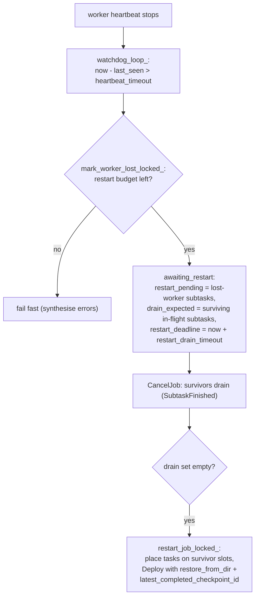
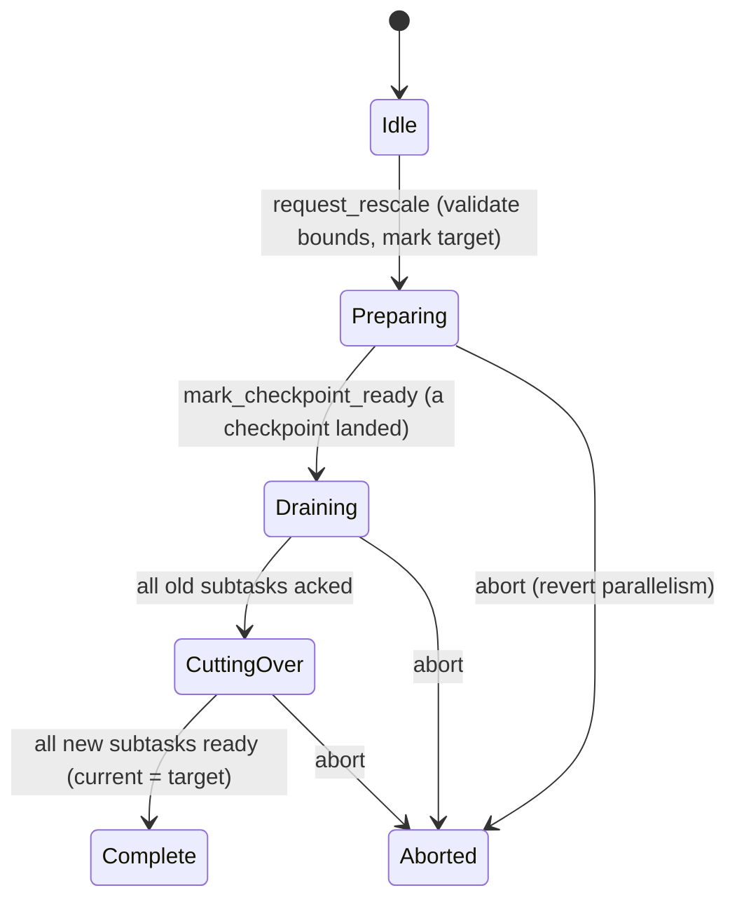

# Fault tolerance, rescale and schema evolution

> How clink recovers a job after a Worker is lost, changes a running operator's parallelism, and migrates keyed state across a schema change, all anchored on completed checkpoints.

## Overview

A clink job survives infrastructure failure and reconfiguration by redeploying its operators from a previously completed checkpoint rather than from scratch. Three related mechanisms share that foundation. Restart-from-checkpoint failover detects a lost Worker (worker), drains the survivors, and redeploys the affected subtasks. Rescale repartitions keyed state across a new subtask count using key groups, scaling up or down by integer factors. State schema evolution lets a job whose state layout has changed restore from an older savepoint by running each stored value through a registered migration before any operator reads it. All three depend on the checkpoint machinery (see [./checkpointing.md](./checkpointing.md)) and the keyed-state backends (see [./state-and-backends.md](./state-and-backends.md)).

## Where it lives

| Area | Files |
| --- | --- |
| Failover and the watchdog | `src/cluster/coordinator.cpp` (`watchdog_loop_`, `mark_worker_lost_locked_`, `restart_job_locked_`), `include/clink/cluster/coordinator.hpp` (`Coordinator::Config`) |
| Restart policy resolution | `include/clink/cluster/protocol.hpp` (`CheckpointConfig`, `effective_max_restarts`, `kRestartAuto`, `kDefaultSelfHealRestarts`) |
| Key groups (rescale partitioning) | `include/clink/runtime/key_groups.hpp` |
| Operator-level rescale state machine | `include/clink/cluster/rescale_coordinator.hpp`, `src/cluster/rescale_coordinator.cpp` |
| Cutover deployment planning | `include/clink/cluster/rescale_dispatch.hpp`, `src/cluster/rescale_dispatch.cpp` |
| Whole-job rescale | `src/cluster/coordinator.cpp` (`rescale_job`, `restart_job_locked_` rescale branch) |
| Schema version trait + maps + migration registry | `include/clink/state/schema_version.hpp`, `src/state/schema_version.cpp` |
| Restore-time migration + compatibility check | `include/clink/state/state_migration_on_restore.hpp`, `src/state/state_migration_on_restore.cpp`, `src/runtime/local_executor.cpp` |
| Pre-deploy compatibility gate | `include/clink/cluster/restore_compat_gate.hpp`, `src/cluster/restore_compat_gate.cpp`, `tools/clink_check_savepoint.cpp` |
| Savepoints (online + offline) | `src/cluster/coordinator.cpp` (`take_savepoint`), `include/clink/state_processor/savepoint.hpp` |

## How it works

### Restart-from-checkpoint failover

Every registered worker heartbeats the Coordinator. A watchdog thread (`Coordinator::watchdog_loop_`) wakes every `watchdog_interval` (default 100ms) and marks any worker whose last message is older than `heartbeat_timeout` (default 2000ms) as lost via `mark_worker_lost_locked_`. Healthy workers are expected to heartbeat at roughly `heartbeat_timeout / 3` so a single dropped message does not trigger a false positive.

When a worker is declared lost, `mark_worker_lost_locked_` walks every job that had a subtask on that worker and decides, per job, whether to restart. The decision is gated on `effective_max_restarts(job.checkpoint)`:

- A non-empty `checkpoint_dir` and `job.restart_attempts < effective_max_restarts(...)` means the job can recover. It is moved into the `awaiting_restart` state.
- Otherwise the coordinator fails fast: it synthesises a `worker lost (heartbeat timeout)` error per pending subtask, counts them toward completion, and surfaces the failure to the client.

On the recovery path the coordinator must first drain the surviving subtasks before it can safely redeploy. The lost-worker subtasks go into `restart_pending`; the still-in-flight subtasks on surviving workers go into `restart_drain_expected`. The watchdog then broadcasts `CancelJob` to every surviving worker hosting that job. Each survivor's role handler is expected to observe `was_cancelled()`, exit, and report a normal `SubtaskFinished`, which decrements the expected-drain set. Once the drain set empties (or it was already empty because the survivors had finished), `restart_job_locked_` runs and rebuilds the deployment.



`restart_job_locked_` rebuilds a `DeploymentTask` template per subtask (preserving `role`, `subtask_idx`, `extra_config`, and peer topology while clearing resolved host/port), places the tasks round-robin across survivor workers with free slots, resets the job's transient coordination state, and emits one `DeployMsg` per worker. The restore handle on every Deploy is the coordinator's own coordination directory and last acknowledged id:

```cpp
deploy_msg.restore_from_dir = job.checkpoint.checkpoint_dir;
deploy_msg.restore_from_checkpoint_id = job.latest_completed_checkpoint_id;
```

If no survivor has a free slot, the restart is aborted with a `no slot available` error per subtask and the job is failed.

The drain is bounded. When a job enters `awaiting_restart` the coordinator sets `restart_deadline = now + restart_drain_timeout` (default 30000ms). A watchdog scan that runs every tick, independent of any new worker loss, fails any job whose drain has outrun its deadline. This catches a survivor that is hung but still heartbeating, so it neither acks the cancel nor dies. Failing is the safe escalation here, because force-restarting could double-run a slow-but-alive subtask against shared state.

Two edge cases are handled explicitly. A second worker lost while the job is already draining folds its subtasks into the in-progress restart (they move from `restart_drain_expected` to `restart_pending`) without consuming an extra restart attempt, since it is the same restart now covering both losses. A subtask error or a bounded-source end-of-stream final-checkpoint timeout follows the same `awaiting_restart` machinery but redeploys the full topology from `tasks_by_worker` rather than just the in-flight set, because the failing subtask may have peers that already finished.

#### The restart-policy default

`CheckpointConfig::max_restarts_on_worker_loss` defaults to the sentinel `kRestartAuto`. `effective_max_restarts` resolves it at every restart decision:

- `kRestartAuto` with a `checkpoint_dir` set resolves to `kDefaultSelfHealRestarts` (10): the job self-heals up to ten times before failing loudly rather than looping forever.
- `kRestartAuto` with no `checkpoint_dir` resolves to 0: fail fast, because there is no checkpoint to restore from.
- An explicit `0` forces fail-fast even with checkpointing.
- An explicit `N` caps the attempts at `N`.

Storing the sentinel rather than the resolved value means the user's intent (auto versus explicit) round-trips through HA recovery.

### Rescale: changing parallelism on a running job

Rescale relies on key groups (`include/clink/runtime/key_groups.hpp`). Every keyed record is bucketed into one of `kNumKeyGroups = 128` groups by a stable FNV-1a hash of its serialised key:

```
key_group = fnv1a_64(key_bytes) mod 128
subtask   = key_group * parallelism / 128
```

`subtask_for_key_group` gives every subtask a contiguous slice of groups, and `key_group_range_for_subtask` is its inverse. Because groups, not raw keys, are the unit of ownership, changing parallelism redistributes whole slices rather than rehashing individual keys, and the snapshot loader can read or filter exactly the state that belongs to a new subtask's range.

clink has two rescale paths that share this math.

**Whole-job rescale** (`Coordinator::rescale_job`) changes the parallelism of one or more roles at once. It requires a `checkpoint_dir` and at least one completed checkpoint, validates that each new parallelism is an integer multiple (scale-up) or divisor (scale-down) of the current value, and checks free slot capacity if the change net-grows usage. It then stages `rescale_overrides`, marks the job `awaiting_restart`, sets the drain deadline, and broadcasts `CancelJob`. The same drain-then-`restart_job_locked_` machinery used by failover fires, but now the rescale branch resizes the per-role template set, rewrites peer fan-out for the new subtask count, and tags each new subtask with its restore mapping and key-group range. The per-subtask restore mapping is:

- **Scale-up** (`new_p > old_p`): `k = new_p / old_p` new subtasks per parent. `restore_from_subtask_idx = new_idx / k`, `restore_from_parent_count = 1`. Each new subtask reads its parent's snapshot and filters it down to its own key-group slice on read.
- **Scale-down** (`new_p < old_p`): `k_down = old_p / new_p` parents per new subtask. `restore_from_subtask_idx = new_idx * k_down`, `restore_from_parent_count = k_down`. The snapshot loader concatenates the `k_down` contiguous parent slices into one merged state.

**Operator-level adaptive rescale** is driven by the per-operator `RescaleCoordinator` (`include/clink/cluster/rescale_coordinator.hpp`). Its purpose is to run a graceful cutover under a coordinator state machine rather than a full job restart. An operator is registered with its current parallelism plus `[min_parallelism, max_parallelism]` bounds taken from the `OperatorSpec`; `min == 0 && max == 0` means the operator is not scalable and rescale requests are rejected. The state machine is:



`Coordinator::request_operator_rescale` validates the request and refuses if the job has no coordinator, or if periodic checkpointing is not configured (`checkpoint_dir` empty or `interval_ms <= 0`), because the `Preparing -> Draining` transition is driven by a checkpoint landing and would otherwise wait forever. The actual cutover deployment math lives in `plan_operator_cutover` (`rescale_dispatch.cpp`), which computes the same key-group ranges and `restore_from_*` mapping as the whole-job path and places the new subtasks greedily onto workers with free slots. `Coordinator::dispatch_begin_rescale_locked_` sends `BeginRescale` to every worker hosting the operator; each worker fires its drain callbacks so the running subtask emits a `DrainMarker` and shuts down. The coordinator itself is purely the state record: each transition is mutex-protected and the coordinator RPC handlers update it via `mark_checkpoint_ready`, `mark_old_drained`, and `mark_new_ready`.

#### Sources as operator state

Key-group filtering only narrows keyed state. State with no key, source offsets and broadcast slots, is operator-list state and carries the reserved leading byte `kOperatorStateKeyPrefix = 0xFF` (deliberately `>= kNumKeyGroups` so it can never collide with a real key group). The rescale restore filter narrows a row only when its first byte is a valid key group, so any key carrying the operator-state prefix is exempt and every new subtask restores it whole. That gives broadcast and union semantics for free, but it also means source offset state is not repartitioned across a parallelism change the way keyed state is. Source replay correctness across a rescale depends on the source implementation, the same caveat that applies to plain restart (see the connector notes in [../connectors/README.md](../connectors/README.md)).

### State schema evolution

When the byte layout of a state value changes, an old savepoint's bytes are no longer directly readable by the new operator. clink resolves this with versioned migration applied at restore time, before any operator reads its state.

**Versioning.** `SchemaVersionTrait<T>` is a compile-time trait, defaulting to version 1, that a user specialises to bump the version on a breaking shape change. At snapshot time the engine stamps each `(operator, state_type, slot)` with its version into a `StateVersionMap`. The map is packed into the Arrow IPC schema metadata of the snapshot under the key `clink.state_versions` (see `src/state/in_memory_state_backend.cpp`). A v1-format snapshot has no such metadata, and restore tolerates its absence by treating an unstamped entry as version 1.

**Migration registry.** `StateMigrationRegistry` stores single-step migration functions keyed by `(state_type, from_version)`. A migration function is pure: it maps input bytes to output bytes and never touches the live state map. `migrate()` plans a chain of single steps via BFS over the registered edges, so a v1-to-v3 migration composes a v1-to-v2 and a v2-to-v3 step automatically. The registry also supports Arrow-aware auto-migration: if both versions of a `state_type` have a registered Arrow schema and the change is additive (new fields nullable, existing fields preserved or widened to a non-narrowing integer), the registry synthesises the migration without user code.

**Restore-time migration.** `migrate_restored_state` (`src/state/state_migration_on_restore.cpp`) is called from `LocalExecutor::start` after the backend has restored but before any operator runs. For each expected `(op, state_type)` whose stored version differs from the expected version, it scans the operator's state, runs each value through the registry chain, and writes the migrated values back. It is slot-aware: an entry naming a slot filters the backend scan by that slot's key prefix so a sibling slot under the same operator stays byte-identical. The migrated versions are then re-stamped onto the backend (merged, not replaced, so sibling slots the current generation left unchanged keep their stamps) so the next snapshot records the new versions and a re-restore is a no-op. On a fresh start with no restore, the expected versions are simply stamped so future snapshots record them.

**Two layers of safety.** The same per-`(op, state_type)` comparison feeds both a pre-deploy gate and the restore-time migrator, so the two cannot drift:

```
              StateVersionMap (stored)   StateVersionMap (expected)
                        \                     /
                         v                   v
                   check_restore_compatibility(stored, expected, registry)
                        |                          |
            (pre-deploy gate, fail fast)     (restore-time migrator)
                        |                          |
   check_restore_compatibility_via_plugins   migrate_restored_state
   at SubmitJob / HA-recovery in coordinator          in LocalExecutor::start
```

`check_restore_compatibility` returns a list of `(op, state_type, from, to)` pairs the registry cannot bridge; an empty list means the restore is compatible. The coordinator calls `check_restore_compatibility_via_plugins` at job submission: it reads subtask 0's stored version map and asks each job `.so` (where the job's `StateMigrationRegistry` lives) whether it can migrate to its expected versions, rejecting the deploy on a definite incompatibility. This gate is best-effort by design: if it cannot read the savepoint, load a `.so`, or find the exported check, it returns empty and lets the deploy proceed, since `migrate_restored_state` still guarantees correctness (or throws) at restore. The offline `clink check-savepoint` CLI exposes the same inspection for operators without a running coordinator.

### Savepoints

A savepoint is a checkpoint taken on demand and intended to be restored from later. `Coordinator::take_savepoint` assigns a fresh checkpoint id, registers a pending ack for every subtask, broadcasts `TriggerCheckpoint`, and blocks until `latest_completed_checkpoint_id` advances past it (default timeout 30000ms). It requires a `checkpoint_dir`. The resulting `.snap` blob is the same Arrow-IPC snapshot format the runtime produces during periodic checkpointing.

Because the format is shared, clink also exposes an offline State Processor API (`include/clink/state_processor/savepoint.hpp`). `Savepoint::load_from_file` reads a `.snap` blob into an in-memory backend; typed `keyed_state<K, V>(op, slot, kc, vc)` views read and mutate the stored entries; `write_to_file` persists a new savepoint a later job can restore from. This is the path for bulk state migration across a schema change, offline inspection or audit, and seeding a fresh job with pre-populated state. The v1 scope is deliberately tight: keyed state only (broadcast and operator-list state are not surfaced, and timers live in the timer service, not the backend), the whole savepoint is materialised in RAM while open, and there is no schema check on the codec pair, so the codecs must match the originating job's.

### State diff and inspection (time travel)

`include/clink/state_processor/state_diff.hpp` layers a comparison primitive over the Savepoint: `collect_entries` scans a savepoint into a structured `op -> slot -> (key -> entry)` model (parsing the stored-key layout `[key-group byte][slot]['|'][user-key bytes]`), `merge_entries` unions the per-subtask files of one checkpoint (key groups are disjoint across subtasks), and `diff_entries` reports per-slot added/removed/changed keys with bounded concrete samples, alongside `diff_versions` for state-schema stamp changes.

Two CLI verbs ride it. `clink state-diff --a=<f.snap> --b=<f.snap>` (or `--dir=<checkpoint-root> --from=N --to=M`, merging every subtask file per id) prints exactly which keys appeared, vanished or changed between two checkpoints or savepoints of a job - keys and values rendered readably (an 8-byte key doubles as its little-endian int64 reading, printable bytes as text, the rest as hex), `--json` for machines, exit code 0 identical / 1 differs / 2 error, diff(1)-style. `clink state-cat` dumps one snapshot's contents the same way. Both read the canonical Arrow-IPC snapshot blobs (checkpoints and savepoints from the file-backed default), accept a RocksDB checkpoint DIRECTORY wherever a snapshot file is accepted (rendered through the RocksDB Arrow export, RocksDB-linked builds), and accept CHANGELOG snapshots, replayed to the canonical form on load - a changelog+rocksdb external-materialisation snapshot resolves its handles through `--materialisation-store=<rocksdb path>`. `clink state-export --from=<snapshot-or-rocksdb-dir> --out=<file> [--format=arrow|parquet]` writes the state as an open dataset, validated by loading it before writing. `arrow` (the default) is the canonical IPC stream - exact fidelity, restorable, openable by any Arrow consumer or clink state tool. `parquet` (inferred when `--out` ends in `.parquet`) is the analytics projection: the DECODED entry table (`op_id`, `key_group`, `slot`, `user_key`, `value_bytes`, one row per entry, versions in the file metadata) via `state_processor::write_state_parquet` (`include/clink/state_processor/parquet_export.hpp`), directly queryable in DuckDB / Spark / pyarrow with slot names and user keys as first-class columns. `--format=iceberg` (Iceberg-linked builds) commits the same decoded table as ONE snapshot of an Apache Iceberg table via `clink::iceberg::export_state_iceberg` - `--warehouse` and `--table` replace `--out`, the table is created when missing, and repeated exports accumulate as snapshots, so the lake table's own history time-travels across exports. All formats also take `--job=<id> [--coordinator=host:port]` to fetch a RUNNING job's whole keyed state through the coordinator's live-export route (per-subtask atomic view, not a checkpoint-consistent cut), and `--dir=<root> --id=N` instead of `--from`, merging every subtask's `checkpoint-N.snap` into one export via `merge_snapshot_bytes` (key groups are disjoint across subtasks, so the keyed union is exact; a duplicated operator-state offset row resolves to the greater value, the scale-down restore policy). `clink state-query --from=<snapshot-or-rocksdb-dir> --sql="SELECT ..."` (SQL-frontend builds; also `--dir/--id`) runs SQL over the state IN-PROCESS through the embedded engine: the decoded entries are rendered to a temp Parquet (`write_state_query_parquet`: `op_id`, `key_group`, `slot`, `user_key` as text with an `0x`-hex fallback, `key_int`/`value_int` as the 8-byte int64 readings, `value` as text) and exposed as a table named `state`; results print as NDJSON with retracting plans (GROUP BY, DISTINCT) netted client-side to their final rows, multiplicity preserved.

Its first demonstration exposed a real restore-correctness gap - the default (non-async) SQL `GROUP BY` held its accumulators only in operator memory, so checkpoints carried no aggregate state and any restore silently zeroed the running totals - fixed by the write-behind flush described in the SQL frontend's aggregate operator (dirty buckets persist to the `agg` KeyedState slot in the runner's pre-snapshot hook, and reload at `open()`).

### Record capture (the flight recorder)

`include/clink/runtime/record_capture.hpp` adds the input side of time travel: when a job names a capture directory (`CheckpointConfig.capture_dir`; embedded: `clink run --capture-dir`), every single-input operator runner tees what it hands the operator into a bounded per-epoch buffer and, as each checkpoint barrier passes, writes the epoch to `<capture_dir>/op-<id>/subtask-<idx>/epoch-<checkpoint id>.cap` (the terminal end-of-stream barrier's tail lands in `final.cap`). Epoch N therefore holds exactly what flowed between checkpoint N-1 and checkpoint N - restore checkpoint N-1, feed epoch N, and the operator reproduces its path to checkpoint N: the deterministic-replay contract `clink replay` builds on.

The epoch payload (format v2) is an ordered EVENT stream, not just records: data records, watermarks (with idleness), and the clock positions at which the runner fired due processing-time timers (recorded only when a timer was actually due, so quiet loops record nothing). That is what makes replay full-fidelity - watermark-driven window fires and timer fires reproduce at their true stream positions. v1 files (records only) remain readable and replay data-only. Data records are bounded by `capture_records` (default 10,000); control events get their own 4x budget so a truncated epoch keeps its watermark spine. Past a cap the epoch keeps counting but stops storing, and the file header records both the truncation and the true data count, so a replay can tell a complete epoch from a sampled one. The plain record framing is shared with the unaligned-checkpoint in-flight capture (`Dag::serialize_records_` delegates to it); capture config rides the existing checkpoint plumbing (`CheckpointConfig -> DeployMsg -> RunnerContext -> JobConfig`, trailing wire fields), and both the single-op runner path and the fused-chain DagBuilder path arm the tee. Capture is best-effort by design - a write failure disarms that runner's capture, never the job. `clink capture-cat` inspects epochs (codec-agnostic framing walk renders watermark/clock events inline; `--dir` lists every epoch under a root with counts).

### Deterministic replay (`clink replay`)

The capture layer also writes each armed operator's build spec next to its epochs (`op.json`: factory type, params, channels, uid), which makes replay self-contained. `clink replay --capture-dir=<d> --checkpoint-dir=<d> --op=<id> --epoch=N` rebuilds that one operator from its sidecar via the operator registry, restores its keyed state from checkpoint N-1 through the state-processor Savepoint (`--epoch=1` starts fresh; `--epoch=final` takes `--state-from`), puts the operator's TimerService on a manual clock, then feeds the captured event stream through the production paths: data and watermarks via `process()` (the operator's own dispatch runs its real watermark logic), captured clock positions via `fire_due_timers` (the runner's between-pops poll, reproduced at the captured position). Every emission prints (changelog kinds prefixed, like the print sink). Two runs are byte-identical - the record-level "explain why this output happened" loop, offline, no cluster.

Omitting `--op` replays the WHOLE JOB: every captured operator (and every subtask) for the epoch, each from its own captured input - which embeds the production interleaving, so the sweep stays deterministic even around multi-input stages - with a per-operator summary and loud skips. `--verify` composes with both forms: each selected epoch replays twice and the emissions byte-compare (the determinism gate; see [replay-determinism.md](./replay-determinism.md)). The engine is a library, `clink::sql::EpochReplay` (`include/clink/sql/replay.hpp`): `load()` resolves the capture/state once, `run()` replays it any number of times, so tools and tests share one implementation.

Cross-version A/B ("what would the fix have produced?"): `--out=<file>` dumps every emission one-per-line, `--plugin=<so>` dlopens a candidate job plugin first (ABI-gated by the same `PluginLoader` a cluster deploy uses) so the operator rebuilds from THAT build, and `clink replay-diff <a> <b>` compares two dumps - identical (exit 0) or the first divergence plus every differing emission index (exit 1). Replay the epoch through the current build and through the candidate, diff, and the behavioural delta of the change on real production bytes is explicit before anything deploys.

Incident to regression test in one command: `--emit-test=<dir>` materialises a self-contained bundle - the epoch's capture, the starting snapshot, the golden emissions as of now, a `bundle.json` manifest, and a generated gtest source whose whole body is one call to `clink::sql::run_replay_regression(bundle_dir)`, so the emitted test can never drift from the replay implementation. Check the bundle in, add the `.cpp` to a test target linking `clink::sql`, and the production incident is a permanent, byte-exact regression test.

Retention: `clink capture-push --dir=<capture-root> --to=<uri>` ships a capture tree (layout preserved) to any Arrow-filesystem URI - `s3://bucket/jobs/<job>/capture` beside the checkpoints is the natural home - and `clink capture-fetch --from=<uri> --dir=<local>` pulls it back onto any machine for replay. `--epoch=N` narrows either direction to one epoch's `.cap` files (`op.json` sidecars always ride along), which is both the "reproduce THIS incident on my laptop" fetch and the retention policy that keeps interesting epochs only. S3 lifecycle follows the engine's single owner (`ensure_arrow_s3_initialised` + explicit finalise before exit). Verified live against MinIO: push, epoch-filtered fetch, byte-identical tree, deterministic replay of the fetched capture.

Scope and honesty: Row-channel operators (the SQL frontend's set - GROUP BY, windowed GROUP BY, filter, project, DISTINCT, TOP-N, the keyer). v2 captures replay watermark-driven window fires and processing-time timer fires at their production positions; v1 captures (recorded by older builds) replay data records only, and the tool says so. A truncated epoch replays its stored prefix and says so. Multi-input operators (joins) and non-Row channels are rejected with a clear message. `--flush` opts into the end-of-stream flush.

## Key types and APIs

| Type / function | Responsibility |
| --- | --- |
| `Coordinator::watchdog_loop_` | Periodic liveness scan; declares workers lost, drives restart drains and the drain-timeout escalation |
| `Coordinator::mark_worker_lost_locked_` | Per-job restart-or-fail decision on worker loss; builds the drain and redeploy sets |
| `Coordinator::restart_job_locked_` | Rebuilds the deployment from templates, places tasks on survivor slots, emits Deploy frames pointing at the last completed checkpoint |
| `effective_max_restarts(CheckpointConfig)` | Resolves `kRestartAuto` to self-heal (10) with checkpointing or fail-fast (0) without |
| `key_group_for_key` / `subtask_for_key_group` / `key_group_range_for_subtask` | The 128-group partitioning primitive and its inverse used by rescale restore |
| `Coordinator::rescale_job` | Whole-job parallelism change via the drain-then-restart machinery |
| `RescaleCoordinator` | Per-operator rescale state machine (`Idle`/`Preparing`/`Draining`/`CuttingOver`/`Complete`/`Aborted`) |
| `plan_operator_cutover` | Computes new-subtask key-group ranges, restore mapping, and worker placement for an operator cutover |
| `SchemaVersionTrait<T>` / `StateVersionMap` | Compile-time version trait and the `(op, state_type, slot) -> version` map stamped into snapshots |
| `StateMigrationRegistry` | Registers single-step migrations, plans multi-step chains, and synthesises additive Arrow migrations |
| `check_restore_compatibility` / `migrate_restored_state` | The shared compatibility decision and the in-place restore-time transform |
| `check_restore_compatibility_via_plugins` | coordinator-side best-effort pre-deploy gate |
| `Coordinator::take_savepoint` | On-demand checkpoint a later run can restore from |
| `clink::state_processor::Savepoint` | Offline read/transform/write API over a savepoint's keyed state |

## Configuration and knobs

| Knob | Where | Default | Effect |
| --- | --- | --- | --- |
| `watchdog_interval` | `Coordinator::Config` | 100ms | How often the watchdog re-evaluates worker liveness |
| `heartbeat_timeout` | `Coordinator::Config` | 2000ms | A worker is declared lost after this much silence |
| `restart_drain_timeout` | `Coordinator::Config` | 30000ms | Upper bound on the `awaiting_restart` drain; on expiry the watchdog fails the job |
| `max_restarts` | `Coordinator::Config` | 0 | Per-failing-task retry budget (distinct from worker-level restarts) |
| `max_restarts_on_worker_loss` | `CheckpointConfig` | `kRestartAuto` | Resolves to 10 (self-heal) with a checkpoint dir, 0 (fail-fast) without; explicit `N` caps attempts |
| `checkpoint_dir` | `CheckpointConfig` | empty | Required for any restart-from-checkpoint, rescale, or savepoint |
| `interval_ms` | `CheckpointConfig` | 0 | Periodic-checkpoint cadence; operator rescale requires it `> 0` |
| `restore_from_dir` / `restore_from_checkpoint_id` | `CheckpointConfig` | empty / 0 | Resume a fresh job from a prior completed checkpoint or savepoint |
| `min_parallelism` / `max_parallelism` | `OperatorSpec` | 0 / 0 | `0/0` means not scalable; otherwise bound a rescale request |
| `kNumKeyGroups` | `key_groups.hpp` | 128 | Partition count; tunable in the range 16 to 1024 without protocol changes |
| `kDefaultSelfHealRestarts` | `protocol.hpp` | 10 | Self-heal attempt cap when `max_restarts_on_worker_loss` is auto |

## Guarantees and caveats

- **Recovery is checkpoint-anchored.** Restart, rescale, and savepoint-restore all require a `checkpoint_dir`. Without one a worker loss fails the job. Keyed state is preserved across a restart; source replay correctness depends on the source implementation (see [../connectors/README.md](../connectors/README.md)).
- **Self-heal is bounded and the default.** With checkpointing, a job self-heals up to `kDefaultSelfHealRestarts` (10) times by default, then fails loudly. An explicit `0` keeps the strict fail-fast behaviour. The restart drain is itself bounded by `restart_drain_timeout`; a hung-but-heartbeating survivor causes the job to fail rather than risk a double-run.
- **Rescale is integer-factor only.** Both the whole-job and operator paths require the new parallelism to be an integer multiple (scale-up) or divisor (scale-down) of the current value. Non-integer factors would leave key groups straddling parents and are not supported.
- **Operator rescale needs periodic checkpointing.** `request_operator_rescale` rejects the request unless `checkpoint_dir` is set and `interval_ms > 0`, because the cutover is gated on a checkpoint landing.
- **Operator-list state is not repartitioned.** Source offsets and broadcast slots carry the `0xFF` operator-state prefix and are restored whole by every subtask on rescale, not split by key group.
- **Migration must stay name-stable.** Schema migration looks state up by `(op, state_type)` and filters by slot name, so both the `state_type` tag and the slot name must stay stable from the generation that wrote a savepoint to the one that restores it. Renaming a tag or slot across a restore is unsupported and needs an explicit transform step first. An absent stamp is assumed v1, which is safe only when the tag is genuinely new.
- **TTL slots cannot be migrated in v1.** A TTL-enabled slot stores values as `[8B expire-at][user bytes]`; the migrator hands the full stored value to the migration function, which expects raw user bytes, so do not bump the schema version of a TTL slot.
- **The pre-deploy gate is best-effort.** It only blocks on a definite incompatibility verdict; an unreadable savepoint or missing `.so` lets the deploy proceed, relying on `migrate_restored_state` to enforce correctness (or throw) at restore.
- **The State Processor API is v1-scoped.** Keyed state only; broadcast/operator-list state and timers are not surfaced; the savepoint is held in RAM while open; there is no codec schema check.

## Related

- [./checkpointing.md](./checkpointing.md) - barriers, alignment, and the completed-checkpoint markers every recovery path restores from
- [./state-and-backends.md](./state-and-backends.md) - keyed state, slots, TTL, and the backend snapshot/restore contract
- [./distributed-runtime.md](./distributed-runtime.md) - the coordinator/worker control plane, heartbeats, and deploy messaging
- [./jobs-and-scheduling.md](./jobs-and-scheduling.md) - slots, placement, and the job graph the restart path rebuilds from
- [./task-lifecycle.md](./task-lifecycle.md) - `LocalExecutor::start`, where restore-time migration runs before operators open
- [../connectors/README.md](../connectors/README.md) - per-connector source replay and exactly-once caveats across a restart or rescale
