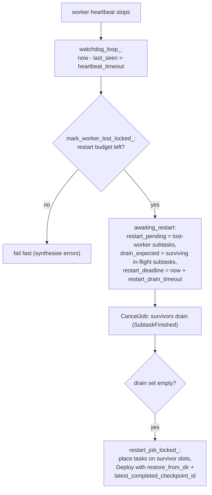
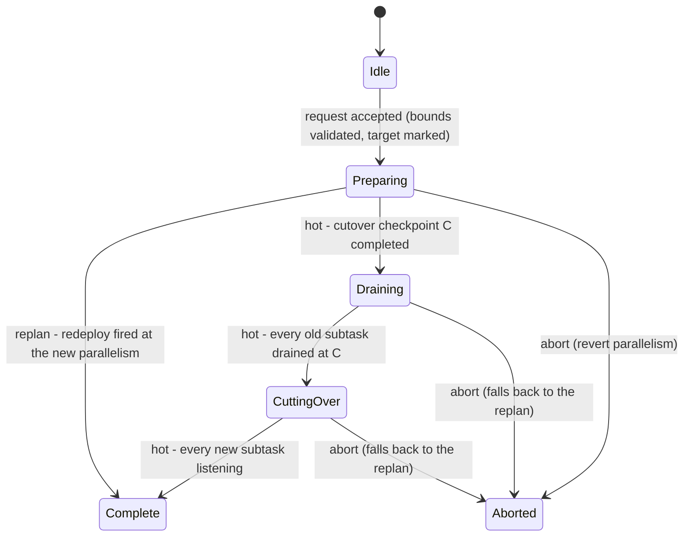

# Fault tolerance, rescale and schema evolution

> How clink recovers a job after a Worker is lost, changes a running operator's parallelism, and migrates keyed state across a schema change, all anchored on completed checkpoints.

## Overview

A clink job survives infrastructure failure and reconfiguration by redeploying its operators from a previously completed checkpoint rather than from scratch. Three related mechanisms share that foundation. Restart-from-checkpoint failover detects a lost Worker (worker), drains the survivors, and redeploys the affected subtasks. Rescale repartitions keyed state across a new subtask count using key groups, scaling up or down by integer factors. State schema evolution lets a job whose state layout has changed restore from an older savepoint by running each stored value through a registered migration before any operator reads it. All three depend on the checkpoint machinery (see [./checkpointing.md](./checkpointing.md)) and the keyed-state backends (see [./state-and-backends.md](./state-and-backends.md)).

## Where it lives

| Area | Files |
| --- | --- |
| Failover and the watchdog | `src/cluster/coordinator.cpp` (`watchdog_loop_`, `mark_worker_lost_locked_`, `restart_job_locked_`), `include/clink/cluster/coordinator.hpp` (`Coordinator::Config`) |
| Restart policy resolution | `include/clink/cluster/protocol.hpp` (`CheckpointConfig`, `effective_max_restarts`, `kRestartAuto`, `kDefaultSelfHealRestarts`) |
| Key groups (rescale partitioning) | `include/clink/runtime/key_groups.hpp` |
| Operator-level rescale state machine | `include/clink/cluster/rescale_coordinator.hpp`, `src/cluster/rescale_coordinator.cpp` |
| Identity translation + index blocks + parent mapping | `include/clink/cluster/rescale_dispatch.hpp`, `src/cluster/rescale_dispatch.cpp` |
| Hot cutover: planner | `plan_hot_cutover` in `include/clink/cluster/job_planner.hpp`, `src/cluster/job_planner.cpp` |
| Hot cutover: choreography | `src/cluster/coordinator.cpp` (`try_begin_hot_cutover_locked_` and the `hot_cutover_*_locked_` family) |
| Hot cutover: data-plane seams | `include/clink/runtime/cutover_gate.hpp`, `include/clink/runtime/union_rebind.hpp`, `SwappableBridgeSink` in `include/clink/runtime/network/network_bridge.hpp` |
| Whole-job rescale | `src/cluster/coordinator.cpp` (`rescale_job`, `restart_job_locked_` rescale branch) |
| Schema version trait + maps + migration registry | `include/clink/state/schema_version.hpp`, `src/state/schema_version.cpp` |
| Restore-time migration + compatibility check | `include/clink/state/state_migration_on_restore.hpp`, `src/state/state_migration_on_restore.cpp`, `src/runtime/local_executor.cpp` |
| Pre-deploy compatibility gate | `include/clink/cluster/restore_compat_gate.hpp`, `src/cluster/restore_compat_gate.cpp`, `tools/clink_check_savepoint.cpp` |
| Savepoints (online + offline) | `src/cluster/coordinator.cpp` (`take_savepoint`), `include/clink/state_processor/savepoint.hpp` |

## How it works

### Restart-from-checkpoint failover

Every registered worker heartbeats the Coordinator. A watchdog thread (`Coordinator::watchdog_loop_`) wakes every `watchdog_interval` (default 100ms) and marks any worker whose last message is older than `heartbeat_timeout` (default 2000ms) as lost via `mark_worker_lost_locked_`. Healthy workers are expected to heartbeat at roughly `heartbeat_timeout / 3` so a single dropped message does not trigger a false positive.

When a worker is declared lost, `mark_worker_lost_locked_` walks every job that had a subtask on that worker and decides, per job, whether to restart. The decision is gated on `effective_max_restarts(job.checkpoint)`:

- A non-empty `checkpoint_dir` and `job.restart_attempts < effective_max_restarts(...)` means the job can recover. It is moved into the `awaiting_restart` state.
- Otherwise the coordinator fails fast: it synthesises a `worker lost (heartbeat timeout)` error per pending subtask, counts them toward completion, and surfaces the failure to the client.

On the recovery path the coordinator must first drain the surviving subtasks before it can safely redeploy. The lost-worker subtasks go into `restart_pending`; the still-in-flight subtasks on surviving workers go into `restart_drain_expected`. The loss path then broadcasts `CancelJob` to every surviving worker hosting that job. This applies both when the watchdog declares a worker lost and when a restarted process re-registers under the same stable worker id before the watchdog fires. In the latter case the replacement session is healthy, so a later watchdog sweep will never supply the missing broadcast. Each survivor's role handler is expected to observe `was_cancelled()`, exit, and report a normal `SubtaskFinished`, which is credited into `restart_drained_keys` - draining COVERS the expected set rather than emptying it. Readiness is one predicate, `restart_drain_covered_` (every expected key credited; an empty set is trivially ready), used by the drain-credit path and by the watchdog's per-tick kick alike. The distinction is load-bearing: a second worker lost during the drain is FOLDED (its keys erased from both sets), and when the survivor's ack lands before that fold, the expected set shrinks to keys that already drained - covered but not empty, with no further ack ever coming to re-evaluate it. A kick keyed on emptiness left exactly that restart unfired until the drain deadline failed the job with a phantom "survivors did not drain" (the soak's three-CI-sighting wedge; pinned deterministically by `tests/test_restart_drain_readiness.cpp`). The same file scripts the fast same-id replacement and proves that survivors receive `CancelJob` before redeployment. Once coverage holds, `restart_job_locked_` runs and rebuilds the deployment.


```mermaid
flowchart TD
  HB["worker heartbeat stops"] --> WD["watchdog_loop_:<br/>now - last_seen &gt; heartbeat_timeout"]
  WD --> ML{"mark_worker_lost_locked_:<br/>restart budget left?"}
  ML -->|no| FF["fail fast (synthesise errors)"]
  ML -->|yes| AR["awaiting_restart:<br/>restart_pending = lost-worker subtasks,<br/>drain_expected = surviving in-flight subtasks,<br/>restart_deadline = now + restart_drain_timeout"]
  AR --> CJ["CancelJob: survivors drain (SubtaskFinished)"]
  CJ --> DE{"drain set empty?"}
  DE -->|yes| RJ["restart_job_locked_:<br/>place tasks on survivor slots,<br/>Deploy with restore_from_dir +<br/>latest_completed_checkpoint_id"]
```

`restart_job_locked_` rebuilds a `DeploymentTask` template per subtask (preserving `role`, `subtask_idx`, `extra_config`, and peer topology while clearing resolved host/port), places the tasks round-robin across survivor workers with free slots, resets the job's transient coordination state, and emits one `DeployMsg` per worker. The restore handle on every Deploy is the coordinator's own coordination directory and last acknowledged id:

```cpp
deploy_msg.restore_from_dir = job.checkpoint.checkpoint_dir;
deploy_msg.restore_from_checkpoint_id = job.latest_completed_checkpoint_id;
```

If no survivor has a free slot, the restart is aborted with a `no slot available` error per subtask and the job is failed.

The drain is bounded. When a job enters `awaiting_restart` the coordinator sets `restart_deadline = now + restart_drain_timeout` (default 30000ms). A watchdog scan that runs every tick, independent of any new worker loss, fails any job whose drain has outrun its deadline. This catches a survivor that is hung but still heartbeating, so it neither acks the cancel nor dies. Failing is the safe escalation here, because force-restarting could double-run a slow-but-alive subtask against shared state.

Two edge cases are handled explicitly. A second worker lost while the job is already draining folds its subtasks into the in-progress restart (they move from `restart_drain_expected` to `restart_pending`) without consuming an extra restart attempt, since it is the same restart now covering both losses. A subtask error or a bounded-source end-of-stream final-checkpoint timeout follows the same `awaiting_restart` machinery but redeploys the full topology from `tasks_by_worker` rather than just the in-flight set, because the failing subtask may have peers that already finished.

#### The restart-policy default

`CheckpointConfig::max_restarts_on_worker_loss` defaults to the sentinel `kRestartAuto`. `effective_max_restarts` resolves it at every restart decision:

- `kRestartAuto` with a `checkpoint_dir` set resolves to `kDefaultSelfHealRestarts` (10): the job self-heals up to ten times before failing loudly rather than looping forever.
- `kRestartAuto` with no `checkpoint_dir` resolves to 0: fail fast, because there is no checkpoint to restore from.
- An explicit `0` forces fail-fast even with checkpointing.
- An explicit `N` caps the attempts at `N`.

Storing the sentinel rather than the resolved value means the user's intent (auto versus explicit) round-trips through HA recovery.

### Rescale: changing parallelism on a running job

Rescale relies on key groups (`include/clink/runtime/key_groups.hpp`). Every keyed record is bucketed into one of `kNumKeyGroups = 128` groups by a stable FNV-1a hash of its serialised key:

```
key_group = fnv1a_64(key_bytes) mod 128
subtask   = key_group * parallelism / 128
```

`subtask_for_key_group` gives every subtask a contiguous slice of groups, and `key_group_range_for_subtask` is its inverse. Because groups, not raw keys, are the unit of ownership, changing parallelism redistributes whole slices rather than rehashing individual keys, and the snapshot loader can read or filter exactly the state that belongs to a new subtask's range.

clink has two rescale paths that share this math. **Per-operator rescale is the supported way to change a running job's parallelism**; whole-job rescale by role predates it and is limited to single-operator jobs (see below).

**Whole-job rescale** (`Coordinator::rescale_job`) changes the parallelism of one or more roles at once. It requires a `checkpoint_dir` and at least one completed checkpoint, validates that each new parallelism is an integer multiple (scale-up) or divisor (scale-down) of the current value, and checks free slot capacity if the change net-grows usage.

It then stages `rescale_overrides`, marks the job `awaiting_restart`, sets the drain deadline, and broadcasts `CancelJob`. The same drain-then-`restart_job_locked_` machinery used by failover fires, but now the rescale branch resizes the per-role template set, rewrites peer fan-out for the new subtask count, and tags each new subtask with its restore mapping and key-group range. The per-subtask restore mapping is:

- **Scale-up** (`new_p > old_p`): `k = new_p / old_p` new subtasks per parent. `restore_from_subtask_idx = new_idx / k`, `restore_from_parent_count = 1`. Each new subtask reads its parent's snapshot and filters it down to its own key-group slice on read.
- **Scale-down** (`new_p < old_p`): `k_down = old_p / new_p` parents per new subtask. `restore_from_subtask_idx = new_idx * k_down`, `restore_from_parent_count = k_down`. The snapshot loader concatenates the `k_down` contiguous parent slices into one merged state.

Whole-job rescale refuses the shared role on a multi-operator job, and that refusal is the difference between this path working and destroying the job. The planner deploys every subtask of every operator under one role, `kGenericSubtaskRole` ("__clink_subtask"), so on a job with more than one operator "the role's parallelism" is the job's total subtask count, not any operator's parallelism. Asking for N therefore keeps the templates for subtask indices below N and prunes the rest - and since a template's operator identity lives in its packed `OperatorChainSpec` (`extra_config`), which the rescale branch does not rewrite, the surviving templates are N clones of whichever chains happened to sit at those indices. Peer fan-out is rewritten at the `peers` level, but the chain spec inside `extra_config` still names input and output edges to subtask indices that are no longer deployed. Measured on a 3-operator job asked to scale to 1: the redeployed task failed with `missing resolved peer for edge`, every restart attempt failed identically until the restart budget was exhausted, and the job finished FAILED having committed 3 of its 240 records - while the CLI had reported `ok=1 "rescale initiated"`. Reproduced on a second, unrelated job (4 subtasks, restart budget 10) with the same failure at every attempt. The coordinator now refuses that combination up front. A single-operator job, where the role's parallelism and the operator's parallelism are the same number, is unaffected and is the case this path handles.

**Per-operator rescale** changes one operator's parallelism on a running job. `clink rescale-op --job-id=N --op=<operator id> --parallelism=P`, or the equivalent HTTP surface, or the autoscaler.

There are two mechanisms behind one request. An **eligible operator cuts over in place at a checkpoint barrier - the hot cutover - and the rest of the job never stops**; anything ineligible, and any hot attempt that fails at any stage, falls back to the **replan**, which stops the whole job and restarts it from its last completed checkpoint. Hot when possible, correct always. The decision and every phase of the cutover are visible in the coordinator log (`hot cutover armed / checkpoint triggered / rebind dispatched / deploy / complete`, or `hot cutover not taken (<reason>)` followed by the replan lines).

#### The hot cutover (design record [008](../design/008-hot-rescale.md))

Eligibility, decided before anything is disturbed: hot rescale enabled in the coordinator config, every edge into **and** out of the operator fan-shaped (keyed, or parallelism-mismatched) both before and after the change - a forward 1:1 premise does not survive a parallelism change - and a full `plan_hot_cutover` that validates the translation of every edge and restore directive against the deployed layout. One barrier is the boundary throughout:

1. **Arm.** The cutover checkpoint id C is reserved (the periodic trigger sweep is already gated off the job under the same lock hold, so no other id can intervene), and `BeginRescale{op, target, C}` goes to every worker hosting the operator or its neighbours - *before* C is triggered, because stopping at a barrier that has already passed would stop nothing. Arming reaches three kinds of task: the operator's own subtasks (their input relays - or the source itself, for a source operator - will end their streams after forwarding barrier C), the tasks *feeding* it (their output groups' `GroupCutoverGate`s arm: the group's split will broadcast C and then hold), and the tasks it *feeds* (their union input stages hold open across the coming membership gap). Each worker replies with `BeginRescaleAck` naming what it actually armed; a shortfall - a task built through a path that does not register the cutover hooks, such as a join side - aborts to the replan before C is triggered.
2. **Cut.** C is triggered exactly like a savepoint. The operator's old subtasks process through barrier C, snapshot, ack, forward it, and end: nothing after C ever leaves them. The feeding groups broadcast C to their branches and hold - records keep arriving from upstream and queue behind the held split, which is ordinary backpressure. Every other subtask acks C as normal and keeps running.
3. **Drain -> rebind -> deploy.** The old subtasks' exits are counted as drained acks (translated from the shared role to the operator through the deploy-time identity records). The fed tasks then bind one new inbound listener per post-cutover subtask (`CutoverRebind`) and report the ports via mid-run `SubtaskListening`s - the same shape as the at-deploy report, so peer resolution is unchanged. The validated plan deploys the new subtasks: job-global indices *appended* past the deployed allocation (append-only - no other task's index, key-group range or state directory changes, and nothing else redeploys), restoring from C in the same state generation, each mapped onto its parents' deployed directories by the same `rescale_parent_mapping` arithmetic the replan uses.
4. **Complete.** The new subtasks get a targeted `PeerUpdate` (the one-shot at-deploy path never re-fires), the feeders get per-task `CutoverPeerUpdate` endpoint lists that swap their branch endpoints and release the held splits with the new live divisor (plus a re-broadcast of the group's current watermark, so downstream event time does not stall), the retained graph is rewritten to the new parallelism (it is what every future replan and HA recovery plans from), and the operator's old block is retained in `stale_layout_blocks` through C so a whole-job failure inside [Complete, first post-cutover checkpoint] still translates its restore. The checkpoint clock resumes: C is the last checkpoint of the old layout, its successor the first of the new, and no checkpoint ever mixes the two.

The cost is a stall on the rescaled operator's edges - bounded by drain plus deploy plus state restore - while sources do not rewind, unaffected operators do not restart, and sink transaction cycles do not reset. Those non-stopping properties are asserted, not assumed: the `HotRescaleTest` family (`tests/integration/test_rescale_exactly_once.cpp`) gates on the coordinator's own `hot cutover complete` line, the *absence* of `replanned`, the absence of the test source's restore diagnostic on every worker, exactly-once output equality, per-key order, and - unlike the replan tests, which can only report it - the checkpoint participant-set invariant, gated because rule 5 leaves no unexplained window. The same family holds each phase window open with a coordinator-side fault point (`rescale.hot_before_trigger`, `rescale.hot_cutting_over`, `rescale.hot_before_complete`) and kills a worker mid-cutover to prove the abort lands on the replan and stays exactly-once.

Aborts at every stage - an ack shortfall, a phase deadline (watchdog-swept, because the failure mode is precisely that no more messages arrive), an unplaceable deploy, a missing rebind port, a worker loss - stage the replan at the *requested* parallelism, so the rescale still lands, just not seamlessly.

The data-plane machinery under this lives in three seams, each unit-tested with latches and mutation checks: the feeding side's gated split with `SwappableBridgeSink` branches sized to the downstream's declared `max_parallelism` (`include/clink/runtime/cutover_gate.hpp` and the eligible branch of `attach_typed_group_output`); the operator's own armed stop (`JobConfig::drain_at_checkpoint` in the source runners, `NetworkBridgeSource`'s armed relay stop for mid-dag chains, and a runner-owned commit gate that keeps an armed 2PC sink alive until its cutover commit ran); and the fed side's union rebind (`include/clink/runtime/union_rebind.hpp`, `MultiInputAlignment::add_input`, and the hold-open that bridges the gap between the old inputs closing and the new subtasks existing to splice).

#### The replan (the fallback, and the path ineligible requests take)

The replan stops the job and re-derives it:

1. Validate the request against the job's retained graph - the operator exists, it declares `[min_parallelism, max_parallelism]` bounds and the target is inside them, the target is an integer multiple or divisor of what the operator currently runs, a checkpoint has completed, and the cluster has slots for any growth. Everything answerable from the request and the graph is answered before anything is disturbed, because the next step stops the job.
2. Drain the job. `CancelJob` goes to every worker hosting a task; the existing `awaiting_restart` machinery collects the acks.
3. When the last ack lands, `restart_job_locked_` parses `graph_json`, sets the requested parallelism on that operator, and runs `plan_job` over the result using the job's own registries. The plan is the post-rescale task set in full - chain specs, edge fan-out, key-group ranges - derived the same way a fresh submit derives them.
4. Redeploy from `latest_completed_checkpoint_id`, with each new subtask told which parent's snapshot it inherits.

Why replan rather than resize the deployed task set: a task's operator identity lives inside its packed `OperatorChainSpec`, and cloning a `DeploymentTask` does not rewrite it. That is what the role-based path does, and on a multi-operator job it produced clones of one chain with edges naming subtasks that were no longer deployed (F41). A replanned task set cannot contain that by construction, and `JobPlannerReplan.EveryPeerReferenceNamesATaskThatExists` asserts it without needing a cluster.

**The replan is a stop.** The job stops and starts again from its last completed checkpoint. Exactly-once across it therefore rests on the same two things exactly-once across a failover rests on - a source that replays from a checkpointed offset, and a sink that only publishes at a completed checkpoint - and not on the rescale being transparent. In-flight records between the checkpoint and the drain are reprocessed. This is exactly the cost the hot cutover exists to avoid, and exactly why it remains the fallback: its correctness argument needs nothing from the cutover machinery.

**Restore addressing, and why every task gets a directive.** A snapshot lives at `<checkpoint_dir>/<subtask_idx>/`, addressed by the job-global index, and the planner allocates global indices as one contiguous block per operator in graph order. Change one operator's parallelism and every *later* operator's block moves. So a replan cannot leave the untouched operators on the default "restore from my own index" - that directory now belongs to a different operator. The coordinator therefore records, per deployed task, which operator hosts it and which of that operator's subtasks it is (`JobState::task_op_identity`), and for every task in the new plan it:

- takes the operator's old block base and old parallelism from that record;
- maps the task's index *within the operator* onto a parent index via `rescale_parent_mapping` (`rescale_dispatch.hpp`);
- sets `restore_from_subtask_idx` to `old_base + parent_idx` and `restore_from_parent_count` to the number of parents to merge.

Using the job-global index for that mapping instead of the index within the operator is the same class of error as F38, so the helper's parameter is named `subtask_idx_in_op` and refuses an index outside the new parallelism rather than silently returning parent 0.

**The `RescaleCoordinator` state machine** (`include/clink/cluster/rescale_coordinator.hpp`) is the status record, not the mechanism, and both paths walk it. The hot cutover drives the full sequence: `Preparing` on accept, `Draining` when the cutover checkpoint completes, `CuttingOver` when the last old subtask's drained ack lands (translated from the shared role to the operator through the identity records), `Complete` when every new subtask reports listening. The replan short-cuts it: `Preparing` on accept, `mark_replan_complete` when the redeploy fires, because its old and new subtasks never coexist. `operator_rescale_status` and the HTTP surface read it, and the autoscaler's cooldown depends on it not sitting at `Preparing` for a rescale that has finished.


```mermaid
stateDiagram-v2
  [*] --> Idle
  Idle --> Preparing: request accepted (bounds validated, target marked)
  Preparing --> Draining: hot - cutover checkpoint C completed
  Draining --> CuttingOver: hot - every old subtask drained at C
  CuttingOver --> Complete: hot - every new subtask listening
  Preparing --> Complete: replan - redeploy fired at the new parallelism
  Preparing --> Aborted: abort (revert parallelism)
  Draining --> Aborted: abort (falls back to the replan)
  CuttingOver --> Aborted: abort (falls back to the replan)
```

#### Sources as operator state

Key-group filtering only narrows keyed state. State with no key, source offsets and broadcast slots, is operator-list state and carries the reserved leading byte `kOperatorStateKeyPrefix = 0xFF` (deliberately `>= kNumKeyGroups` so it can never collide with a real key group). The rescale restore filter narrows a row only when its first byte is a valid key group, so any key carrying the operator-state prefix is exempt and every new subtask restores it whole. That gives broadcast and union semantics for free, but it also means source offset state is not repartitioned across a parallelism change the way keyed state is. Source replay correctness across a rescale depends on the source implementation, the same caveat that applies to plain restart (see the connector notes in [../connectors/README.md](../connectors/README.md)).

### State schema evolution

When the byte layout of a state value changes, an old savepoint's bytes are no longer directly readable by the new operator. clink resolves this with versioned migration applied at restore time, before any operator reads its state.

**Versioning.** `SchemaVersionTrait<T>` is a compile-time trait, defaulting to version 1, that a user specialises to bump the version on a breaking shape change. At snapshot time the engine stamps each `(operator, state_type, slot)` with its version into a `StateVersionMap`. The map is packed into the Arrow IPC schema metadata of the snapshot under the key `clink.state_versions` (see `src/state/in_memory_state_backend.cpp`). A v1-format snapshot has no such metadata, and restore tolerates its absence by treating an unstamped entry as version 1.

**Migration registry.** `StateMigrationRegistry` stores single-step migration functions keyed by `(state_type, from_version)`. A migration function is pure: it maps input bytes to output bytes and never touches the live state map. `migrate()` plans a chain of single steps via BFS over the registered edges, so a v1-to-v3 migration composes a v1-to-v2 and a v2-to-v3 step automatically. The registry also supports Arrow-aware auto-migration: if both versions of a `state_type` have a registered Arrow schema and the change is additive (new fields nullable, existing fields preserved or widened to a non-narrowing integer), the registry synthesises the migration without user code.

**Restore-time migration.** `migrate_restored_state` (`src/state/state_migration_on_restore.cpp`) is called from `LocalExecutor::start` after the backend has restored but before any operator runs. For each expected `(op, state_type)` whose stored version differs from the expected version, it scans the operator's state, runs each value through the registry chain, and writes the migrated values back. It is slot-aware: an entry naming a slot filters the backend scan by that slot's key prefix so a sibling slot under the same operator stays byte-identical. The migrated versions are then re-stamped onto the backend (merged, not replaced, so sibling slots the current generation left unchanged keep their stamps) so the next snapshot records the new versions and a re-restore is a no-op. On a fresh start with no restore, the expected versions are simply stamped so future snapshots record them.

**Two layers of safety.** The same per-`(op, state_type)` comparison feeds both a pre-deploy gate and the restore-time migrator, so the two cannot drift:

```
              StateVersionMap (stored)   StateVersionMap (expected)
                        \                     /
                         v                   v
                   check_restore_compatibility(stored, expected, registry)
                        |                          |
            (pre-deploy gate, fail fast)     (restore-time migrator)
                        |                          |
   check_restore_compatibility_via_plugins   migrate_restored_state
   at SubmitJob / HA-recovery in coordinator          in LocalExecutor::start
```

`check_restore_compatibility` returns a list of `(op, state_type, from, to)` pairs the registry cannot bridge; an empty list means the restore is compatible. The coordinator calls `check_restore_compatibility_via_plugins` at job submission: it reads subtask 0's stored version map and asks each job `.so` (where the job's `StateMigrationRegistry` lives) whether it can migrate to its expected versions, rejecting the deploy on a definite incompatibility. This gate is best-effort by design: if it cannot read the savepoint, load a `.so`, or find the exported check, it returns empty and lets the deploy proceed, since `migrate_restored_state` still guarantees correctness (or throws) at restore. The offline `clink check-savepoint` CLI exposes the same inspection for operators without a running coordinator. This machinery is what carries a rolling engine upgrade: [QUAL-08](../qualification/qual-08-rolling-upgrade.md) qualified a real revision pair end to end - savepoint in 2 seconds, restore on the new engine in 2 seconds, 114 seconds of downtime, and exactly-once accounting across the whole boundary under the fault battery.

### Savepoints

A savepoint is a checkpoint taken on demand and intended to be restored from later. `Coordinator::take_savepoint` assigns a fresh checkpoint id, registers a pending ack for every subtask, broadcasts `TriggerCheckpoint`, and blocks until `latest_completed_checkpoint_id` advances past it (default timeout 30000ms). It requires a `checkpoint_dir`. The resulting `.snap` blob is the same Arrow-IPC snapshot format the runtime produces during periodic checkpointing.

Because the format is shared, clink also exposes an offline State Processor API (`include/clink/state_processor/savepoint.hpp`). `Savepoint::load_from_file` reads a `.snap` blob into an in-memory backend; typed `keyed_state<K, V>(op, slot, kc, vc)` views read and mutate the stored entries; `write_to_file` persists a new savepoint a later job can restore from. This is the path for bulk state migration across a schema change, offline inspection or audit, and seeding a fresh job with pre-populated state. The v1 scope is deliberately tight: keyed state only (broadcast and operator-list state are not surfaced, and timers live in the timer service, not the backend), the whole savepoint is materialised in RAM while open, and there is no schema check on the codec pair, so the codecs must match the originating job's.

### State diff and inspection (time travel)

`include/clink/state_processor/state_diff.hpp` layers a comparison primitive over the Savepoint: `collect_entries` scans a savepoint into a structured `op -> slot -> (key -> entry)` model (parsing the stored-key layout `[key-group byte][slot]['|'][user-key bytes]`), `merge_entries` unions the per-subtask files of one checkpoint (key groups are disjoint across subtasks), and `diff_entries` reports per-slot added/removed/changed keys with bounded concrete samples, alongside `diff_versions` for state-schema stamp changes.

Two CLI verbs ride it. `clink state-diff --a=<f.snap> --b=<f.snap>` (or `--dir=<checkpoint-root> --from=N --to=M`, merging every subtask file per id) prints exactly which keys appeared, vanished or changed between two checkpoints or savepoints of a job - keys and values rendered readably (an 8-byte key doubles as its little-endian int64 reading, printable bytes as text, the rest as hex), `--json` for machines, exit code 0 identical / 1 differs / 2 error, diff(1)-style. `clink state-cat` dumps one snapshot's contents the same way. Both read the canonical Arrow-IPC snapshot blobs (checkpoints and savepoints from the file-backed default), accept a RocksDB checkpoint DIRECTORY wherever a snapshot file is accepted (rendered through the RocksDB Arrow export, RocksDB-linked builds), and accept CHANGELOG snapshots, replayed to the canonical form on load - a changelog+rocksdb external-materialisation snapshot resolves its handles through `--materialisation-store=<rocksdb path>`. `clink state-export --from=<snapshot-or-rocksdb-dir> --out=<file> [--format=arrow|parquet]` writes the state as an open dataset, validated by loading it before writing. `arrow` (the default) is the canonical IPC stream - exact fidelity, restorable, openable by any Arrow consumer or clink state tool. `parquet` (inferred when `--out` ends in `.parquet`) is the analytics projection: the DECODED entry table (`op_id`, `key_group`, `slot`, `user_key`, `value_bytes`, one row per entry, versions in the file metadata) via `state_processor::write_state_parquet` (`include/clink/state_processor/parquet_export.hpp`), directly queryable in DuckDB / Spark / pyarrow with slot names and user keys as first-class columns. `--format=iceberg` (Iceberg-linked builds) commits the same decoded table as ONE snapshot of an Apache Iceberg table via `clink::iceberg::export_state_iceberg` - `--warehouse` and `--table` replace `--out`, the table is created when missing, and repeated exports accumulate as snapshots, so the lake table's own history time-travels across exports. All formats also take `--job=<id> [--coordinator=host:port]` to fetch a RUNNING job's whole keyed state through the coordinator's live-export route (per-subtask atomic view, not a checkpoint-consistent cut), and `--dir=<root> --id=N` instead of `--from`, merging every subtask's `checkpoint-N.snap` into one export via `merge_snapshot_bytes` (key groups are disjoint across subtasks, so the keyed union is exact; a duplicated operator-state offset row resolves to the greater value, the scale-down restore policy). `clink state-query --from=<snapshot-or-rocksdb-dir> --sql="SELECT ..."` (SQL-frontend builds; also `--dir/--id`) runs SQL over the state IN-PROCESS through the embedded engine: the decoded entries are rendered to a temp Parquet (`write_state_query_parquet`: `op_id`, `key_group`, `slot`, `user_key` as text with an `0x`-hex fallback, `key_int`/`value_int` as the 8-byte int64 readings, `value` as text) and exposed as a table named `state`; results print as NDJSON with retracting plans (GROUP BY, DISTINCT) netted client-side to their final rows, multiplicity preserved.

Its first demonstration exposed a real restore-correctness gap - the default (non-async) SQL `GROUP BY` held its accumulators only in operator memory, so checkpoints carried no aggregate state and any restore silently zeroed the running totals - fixed by the write-behind flush described in the SQL frontend's aggregate operator (dirty buckets persist to the `agg` KeyedState slot in the runner's pre-snapshot hook, and reload at `open()`).

### Record capture (the flight recorder)

`include/clink/runtime/record_capture.hpp` adds the input side of time travel: when a job names a capture directory (`CheckpointConfig.capture_dir`; embedded: `clink run --capture-dir`), every single-input operator runner tees what it hands the operator into a bounded per-epoch buffer and, as each checkpoint barrier passes, writes the epoch to `<capture_dir>/op-<id>/subtask-<idx>/epoch-<checkpoint id>.cap` (the terminal end-of-stream barrier's tail lands in `final.cap`). Epoch N therefore holds exactly what flowed between checkpoint N-1 and checkpoint N - restore checkpoint N-1, feed epoch N, and the operator reproduces its path to checkpoint N: the deterministic-replay contract `clink replay` builds on.

The epoch payload (format v2) is an ordered EVENT stream, not just records: data records, watermarks (with idleness), and the clock positions at which the runner fired due processing-time timers (recorded only when a timer was actually due, so quiet loops record nothing). That is what makes replay full-fidelity - watermark-driven window fires and timer fires reproduce at their true stream positions. v1 files (records only) remain readable and replay data-only. Data records are bounded by `capture_records` (default 10,000); control events get their own 4x budget so a truncated epoch keeps its watermark spine. Past a cap the epoch keeps counting but stops storing, and the file header records both the truncation and the true data count, so a replay can tell a complete epoch from a sampled one. The plain record framing is shared with the unaligned-checkpoint in-flight capture (`Dag::serialize_records_` delegates to it); capture config rides the existing checkpoint plumbing (`CheckpointConfig -> DeployMsg -> RunnerContext -> JobConfig`, trailing wire fields), and both the single-op runner path and the fused-chain DagBuilder path arm the tee. Capture is best-effort by design - a write failure disarms that runner's capture, never the job. `clink capture-cat` inspects epochs (codec-agnostic framing walk renders watermark/clock events inline; `--dir` lists every epoch under a root with counts).

### Deterministic replay (`clink replay`)

The capture layer also writes each armed operator's build spec next to its epochs (`op.json`: factory type, params, channels, uid), which makes replay self-contained. `clink replay --capture-dir=<d> --checkpoint-dir=<d> --op=<id> --epoch=N` rebuilds that one operator from its sidecar via the operator registry, restores its keyed state from checkpoint N-1 through the state-processor Savepoint (`--epoch=1` starts fresh; `--epoch=final` takes `--state-from`), puts the operator's TimerService on a manual clock, then feeds the captured event stream through the production paths: data and watermarks via `process()` (the operator's own dispatch runs its real watermark logic), captured clock positions via `fire_due_timers` (the runner's between-pops poll, reproduced at the captured position). Every emission prints (changelog kinds prefixed, like the print sink). Two runs are byte-identical - the record-level "explain why this output happened" loop, offline, no cluster.

Omitting `--op` replays the WHOLE JOB: every captured operator (and every subtask) for the epoch, each from its own captured input - which embeds the production interleaving, so the sweep stays deterministic even around multi-input stages - with a per-operator summary and loud skips. `--verify` composes with both forms: each selected epoch replays twice and the emissions byte-compare (the determinism gate; see [replay-determinism.md](./replay-determinism.md)). The engine is a library, `clink::sql::EpochReplay` (`include/clink/sql/replay.hpp`): `load()` resolves the capture/state once, `run()` replays it any number of times, so tools and tests share one implementation.

Cross-version A/B ("what would the fix have produced?"): `--out=<file>` dumps every emission one-per-line, `--plugin=<so>` dlopens a candidate job plugin first (ABI-gated by the same `PluginLoader` a cluster deploy uses) so the operator rebuilds from THAT build, and `clink replay-diff <a> <b>` compares two dumps - identical (exit 0) or the first divergence plus every differing emission index (exit 1). Replay the epoch through the current build and through the candidate, diff, and the behavioural delta of the change on real production bytes is explicit before anything deploys.

Incident to regression test in one command: `--emit-test=<dir>` materialises a self-contained bundle - the epoch's capture, the starting snapshot, the golden emissions as of now, a `bundle.json` manifest, and a generated gtest source whose whole body is one call to `clink::sql::run_replay_regression(bundle_dir)`, so the emitted test can never drift from the replay implementation. Check the bundle in, add the `.cpp` to a test target linking `clink::sql`, and the production incident is a permanent, byte-exact regression test.

Retention: `clink capture-push --dir=<capture-root> --to=<uri>` ships a capture tree (layout preserved) to any Arrow-filesystem URI - `s3://bucket/jobs/<job>/capture` beside the checkpoints is the natural home - and `clink capture-fetch --from=<uri> --dir=<local>` pulls it back onto any machine for replay. `--epoch=N` narrows either direction to one epoch's `.cap` files (`op.json` sidecars always ride along), which is both the "reproduce THIS incident on my laptop" fetch and the retention policy that keeps interesting epochs only. S3 lifecycle follows the engine's single owner (`ensure_arrow_s3_initialised` + explicit finalise before exit). Verified live against MinIO: push, epoch-filtered fetch, byte-identical tree, deterministic replay of the fetched capture.

Scope and honesty: Row-channel operators (the SQL frontend's set - GROUP BY, windowed GROUP BY, filter, project, DISTINCT, TOP-N, the keyer). v2 captures replay watermark-driven window fires and processing-time timer fires at their production positions; v1 captures (recorded by older builds) replay data records only, and the tool says so. A truncated epoch replays its stored prefix and says so. Multi-input operators (joins) and non-Row channels are rejected with a clear message. `--flush` opts into the end-of-stream flush.

## Key types and APIs

| Type / function | Responsibility |
| --- | --- |
| `Coordinator::watchdog_loop_` | Periodic liveness scan; declares workers lost, drives restart drains and the drain-timeout escalation |
| `Coordinator::mark_worker_lost_locked_` | Per-job restart-or-fail decision on worker loss; builds the drain and redeploy sets |
| `Coordinator::restart_job_locked_` | Rebuilds the deployment from templates, places tasks on survivor slots, emits Deploy frames pointing at the last completed checkpoint |
| `effective_max_restarts(CheckpointConfig)` | Resolves `kRestartAuto` to self-heal (10) with checkpointing or fail-fast (0) without |
| `key_group_for_key` / `subtask_for_key_group` / `key_group_range_for_subtask` | The 128-group partitioning primitive and its inverse used by rescale restore |
| `Coordinator::rescale_job` | Whole-job parallelism change via the drain-then-restart machinery |
| `RescaleCoordinator` | Per-operator rescale state machine (`Idle`/`Preparing`/`Draining`/`CuttingOver`/`Complete`/`Aborted`) |
| `plan_operator_cutover` | Computes new-subtask key-group ranges, restore mapping, and worker placement for an operator cutover |
| `SchemaVersionTrait<T>` / `StateVersionMap` | Compile-time version trait and the `(op, state_type, slot) -> version` map stamped into snapshots |
| `StateMigrationRegistry` | Registers single-step migrations, plans multi-step chains, and synthesises additive Arrow migrations |
| `check_restore_compatibility` / `migrate_restored_state` | The shared compatibility decision and the in-place restore-time transform |
| `check_restore_compatibility_via_plugins` | coordinator-side best-effort pre-deploy gate |
| `Coordinator::take_savepoint` | On-demand checkpoint a later run can restore from |
| `clink::state_processor::Savepoint` | Offline read/transform/write API over a savepoint's keyed state |

## Configuration and knobs

| Knob | Where | Default | Effect |
| --- | --- | --- | --- |
| `watchdog_interval` | `Coordinator::Config` | 100ms | How often the watchdog re-evaluates worker liveness |
| `heartbeat_timeout` | `Coordinator::Config` | 2000ms | A worker is declared lost after this much silence |
| `restart_drain_timeout` | `Coordinator::Config` | 30000ms | Upper bound on the `awaiting_restart` drain; on expiry the watchdog fails the job |
| `max_restarts` | `Coordinator::Config` | 0 | Per-failing-task retry budget (distinct from worker-level restarts) |
| `max_restarts_on_worker_loss` | `CheckpointConfig` | `kRestartAuto` | Resolves to 10 (self-heal) with a checkpoint dir, 0 (fail-fast) without; explicit `N` caps attempts |
| `checkpoint_dir` | `CheckpointConfig` | empty | Required for any restart-from-checkpoint, rescale, or savepoint |
| `interval_ms` | `CheckpointConfig` | 0 | Periodic-checkpoint cadence; operator rescale requires it `> 0` |
| `restore_from_dir` / `restore_from_checkpoint_id` | `CheckpointConfig` | empty / 0 | Resume a fresh job from a prior completed checkpoint or savepoint |
| `min_parallelism` / `max_parallelism` | `OperatorSpec` | 0 / 0 | `0/0` means not scalable; otherwise bound a rescale request |
| `kNumKeyGroups` | `key_groups.hpp` | 128 | Partition count; tunable in the range 16 to 1024 without protocol changes |
| `kDefaultSelfHealRestarts` | `protocol.hpp` | 10 | Self-heal attempt cap when `max_restarts_on_worker_loss` is auto |

## Guarantees and caveats

- **Recovery is checkpoint-anchored.** Restart, rescale, and savepoint-restore all require a `checkpoint_dir`. Without one a worker loss fails the job. Keyed state is preserved across a restart; source replay correctness depends on the source implementation (see [../connectors/README.md](../connectors/README.md)).
- **Self-heal is bounded and the default.** With checkpointing, a job self-heals up to `kDefaultSelfHealRestarts` (10) times by default, then fails loudly. An explicit `0` keeps the strict fail-fast behaviour. The restart drain is itself bounded by `restart_drain_timeout`; a hung-but-heartbeating survivor causes the job to fail rather than risk a double-run.
- **Rescale is integer-factor only.** Both the whole-job and operator paths require the new parallelism to be an integer multiple (scale-up) or divisor (scale-down) of the current value. Non-integer factors would leave key groups straddling parents and are not supported.
- **Operator rescale needs periodic checkpointing.** `request_operator_rescale` rejects the request unless `checkpoint_dir` is set and `interval_ms > 0`, because the cutover is gated on a checkpoint landing.

- **A per-operator rescale stops the job.** It drains, replans and redeploys from the last completed checkpoint. There is no seamless cutover, so a rescale costs a restart's worth of latency and reprocesses whatever was in flight past the checkpoint. Exactly-once across it depends on a replayable source and a transactional sink, exactly as a failover does.

- **An operator must declare rescale bounds to be scalable.** `min_parallelism == 0 && max_parallelism == 0` means "nobody said what range is safe", and the request is refused rather than guessed at. Declare them with `.rescalable(min, max)` on the stream or on the `OperatorSpec`.

- **Whole-job rescale by role is for single-operator jobs.** On a multi-operator job the shared role covers every subtask, so a single parallelism for it cannot express the job graph; the request is refused. Use per-operator rescale.

- **Exactly-once across a rescale is demonstrated for the file 2PC sink only.** `RescaleExactlyOnceTest` scales a keyed operator up (1 to 4) and down (4 to 1) on a running job and asserts the committed multiset is exactly the input, with a keyed operator that checks its own per-key counters and reports a mismatch as visible output. Other sinks have commit tests, not rescale runs.

- **The source is not rescaled by these tests.** Source offsets are operator-list state, restored whole by every subtask (above), so rescaling a source's parallelism redistributes no offsets and its replay correctness is entirely the source's own affair. The covered case is rescaling a keyed operator downstream of a parallelism-1 source.
- **Operator-list state is not repartitioned.** Source offsets and broadcast slots carry the `0xFF` operator-state prefix and are restored whole by every subtask on rescale, not split by key group.
- **Migration must stay name-stable.** Schema migration looks state up by `(op, state_type)` and filters by slot name, so both the `state_type` tag and the slot name must stay stable from the generation that wrote a savepoint to the one that restores it. Renaming a tag or slot across a restore is unsupported and needs an explicit transform step first. An absent stamp is assumed v1, which is safe only when the tag is genuinely new.
- **TTL slots cannot be migrated in v1.** A TTL-enabled slot stores values as `[8B expire-at][user bytes]`; the migrator hands the full stored value to the migration function, which expects raw user bytes, so do not bump the schema version of a TTL slot.
- **The pre-deploy gate is best-effort.** It only blocks on a definite incompatibility verdict; an unreadable savepoint or missing `.so` lets the deploy proceed, relying on `migrate_restored_state` to enforce correctness (or throw) at restore.
- **The State Processor API is v1-scoped.** Keyed state only; broadcast/operator-list state and timers are not surfaced; the savepoint is held in RAM while open; there is no codec schema check.

## Related

- [./checkpointing.md](./checkpointing.md) - barriers, alignment, and the completed-checkpoint markers every recovery path restores from
- [./state-and-backends.md](./state-and-backends.md) - keyed state, slots, TTL, and the backend snapshot/restore contract
- [./distributed-runtime.md](./distributed-runtime.md) - the coordinator/worker control plane, heartbeats, and deploy messaging
- [./jobs-and-scheduling.md](./jobs-and-scheduling.md) - slots, placement, and the job graph the restart path rebuilds from
- [./task-lifecycle.md](./task-lifecycle.md) - `LocalExecutor::start`, where restore-time migration runs before operators open
- [../connectors/README.md](../connectors/README.md) - per-connector source replay and exactly-once caveats across a restart or rescale
