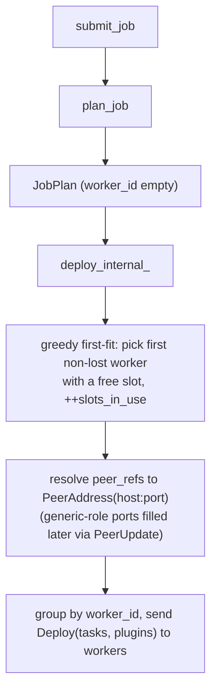

# Jobs, parallelism and scheduling

> How a logical job graph is described, planned into parallel subtasks routed by key group, and placed onto Worker slots by the Coordinator.

## Overview

A clink job starts life as a logical DAG of operators and ends as a set of independent subtasks, each running on a slot somewhere in the cluster. Three layers do the translation. The submitter builds a `JobGraphSpec`, a serialisable list of `(op_type, params)` operator chains with per-op parallelism. The planner (`plan_job`) expands that spec into a `JobPlan` of one `OperatorChainSpec` per subtask, fixing the routing of every inter-operator edge (forward, rebalance, or hash-partitioned shuffle). The Coordinator then resolves placement: it assigns each subtask to a Worker slot, resolves the peer addresses of every data edge, and ships the deployment. Per-subtask isolation is the invariant that makes parallelism correct: every subtask gets its own `OperatorId` and its own `RuntimeContext`, so keyed state never bleeds across subtasks, and records that belong to a key always reach the one subtask that owns that key's state.

## Where it lives

- `include/clink/cluster/job_graph.hpp`, `src/cluster/job_graph.cpp` - `JobGraphSpec` / `OperatorSpec`: the wire-shaped logical job, its JSON and line formats, and `validate()` (unique ids, resolvable inputs, no cycles).
- `include/clink/job/register_job.hpp` - the job-as-plugin C-ABI (`CLINK_REGISTER_JOB`): how a compiled `.so` produces a `JobGraphSpec` JSON via a build function.
- `include/clink/cluster/job_planner.hpp`, `src/cluster/job_planner.cpp` - `plan_job`, `OperatorChainSpec`, `ChainOp`, `SubtaskEdge`, `SubtaskOutputGroup`: spec to `JobPlan` translation, chaining, fusion, edge routing.
- `include/clink/cluster/coordinator.hpp`, `src/cluster/coordinator.cpp` - `Coordinator`, `JobPlan`, `PlannedTask`: slot model, greedy first-fit placement, peer-address resolution, deployment.
- `include/clink/runtime/key_groups.hpp` - `kNumKeyGroups`, `key_group_for_key`, `subtask_for_key_group`, `key_group_range_for_subtask`: the partitioning primitive.
- `include/clink/runtime/key_group_partitioner.hpp` - `make_key_group_partitioner`: routes records to the subtask that owns their key group, consistent with state placement.
- `include/clink/runtime/dag.hpp` - `Dag::add_parallel_{source,operator,operator_shuffled,sink}` and `wire_stage_`: the in-process side that builds per-subtask runners, channels, and emitters.
- `include/clink/cluster/rescale_coordinator.hpp` - `RescaleCoordinator`: the per-operator rescale state machine driven during a parallelism change.

## How it works

### The logical job: JobGraphSpec

A `JobGraphSpec` is a flat vector of `OperatorSpec`. Each op carries:

- `type`: the factory key looked up in the operator registry on the Worker.
- `id`: a graph-local stable id, referenced by downstream ops in `inputs`.
- `inputs`: the upstream op ids this op reads from. Empty marks a source. The input grammar allows a `.N` suffix for a split branch (`splitter.0`) and a `::tag` suffix for a named side output (`emitter::errors`).
- `parallelism`: how many subtasks this op expands into (default 1).
- `out_channel`: the element channel type emitted, used to pick the wire codec.
- `key_by`: when non-empty, names a key extractor and declares the op keyed, forcing hash-partitioned input edges.
- `min_parallelism` / `max_parallelism`: optional autoscaling bounds; both zero means the op does not autoscale.
- `uid`, `display_name`, `side_outputs`: stable state identity, a human label, and named side-output declarations.

`JobGraphSpec::to_json` / `from_json` are the submission format; `serialize` / `parse` are a terser line format kept for hand-written specs and round-trip tests. `from_json` auto-runs `validate()`, so a parsed spec is always known well-formed: ids are unique, every `inputs` ref (after stripping the `.N` / `::tag` suffix) resolves to a real op, and a Kahn topological sort proves the graph is acyclic. The cross-field autoscale invariants are enforced here too (both bounds set or neither; `min <= parallelism <= max`).

A job is authored as a shared library. `CLINK_REGISTER_JOB(name, version, description, build_fn)` emits the plugin C-ABI: the submitter dlopens the `.so`, `clink_plugin_register` runs the user's `build_fn` once under `std::call_once` against a `Pipeline`, and `clink_job_build` hands back the resulting `JobGraphSpec` JSON. The same `.so` is shipped to each Worker, which dlopens it so the inline operator registrations (for example `_inline_map_<n>`) that ran in the submitter fire again in the worker process and resolve. See `include/clink/job/register_job.hpp` for the determinism caveat: `build_fn` must register operators in a stable order across processes.

### Planning: spec to subtasks

`plan_job(graph, registry, runner_registry)` turns the spec into a `JobPlan`. The steps:

1. **Validate and classify.** Re-runs `graph.validate()`, then walks `inputs` to count consumers per op and classify each op as source (no inputs), sink (no consumers), operator, join, or co-operator. Every op's factory is verified to exist in the registry for its declared `(type, in_channel, out_channel)` triple, so a missing factory fails at plan time, not at runtime.

2. **Chaining.** Adjacent operator-kind ops are greedily grouped into chains so they run in one thread with no channel between them. The eligibility rules: both ops are operator-kind (sources and sinks are not chained), the upstream's main output has exactly one consumer, the downstream has exactly one input, and the two share the same parallelism. Splits, joins, and co-operators are not chained. A keyed downstream op cannot be folded into an upstream's chain when parallelism is greater than 1, because that would short-circuit the hash partitioner that must run on the inbound edge; at parallelism 1 every key resolves to subtask 0, so chaining across a `key_by` boundary is safe. Chains have a length cap of `kMaxChainLength` (64). Each chain becomes one logical subtask role; followers are folded into the lead's `OperatorChainSpec.ops` list and do not get their own subtask.

3. **Source/sink fusion (opt-in).** When `CLINK_PLAN_FUSE_PAR1=1`, a parallelism-1 chain can additionally absorb its upstream source and downstream sink into the chain task's thread (`fused_source` / `fused_sink` on `OperatorChainSpec`), removing the inter-thread channel hops at each end. Off by default, which preserves the per-op subtask layout that tooling assumes.

4. **Subtask allocation.** Each chain lead is given `parallelism` consecutive subtask indices via a single monotonically increasing counter (`next_idx`). Every op in the chain shares those indices. So the global subtask index space is a flat numbering over all chain leads' parallel units.

5. **Edge routing.** For each subtask the planner records `input_edges` (inbound) and `output_groups` (outbound, one group per downstream consumer). The routing mode of each edge is decided by parallelism and keyedness:

   - **Forward** when the downstream op has the same parallelism as the upstream and is not keyed: subtask `i` feeds the same-indexed downstream subtask, a single 1:1 edge.
   - **Rebalance** when parallelism differs and the downstream is not keyed: records round-robin across all downstream subtasks; watermarks and barriers broadcast to all of them.
   - **Hash** when the downstream op is keyed (`key_by` set): the group carries the named `key_extractor_fn`, and an edge is emitted to every downstream subtask. The same key always lands on the same subtask, which is what makes keyed state at parallelism greater than 1 correct.

   A keyed chain head likewise listens on an edge from every upstream subtask, since each upstream is hash-routing per record and this subtask receives whatever slice fell into its hash bucket. Split tails set the chain's `output_routing` to `Split` and order the groups by branch index; broadcast (the default) tees every record to every group.

Each `PlannedTask` is created with an empty `worker_id` (placement is the Coordinator's job), the sentinel role `kGenericSubtaskRole` (`"__clink_subtask"`), its global `subtask_idx`, a list of `peer_refs` derived from the output edges, and the serialised `OperatorChainSpec` JSON in `extra_config`. On the Worker a single generic-role handler parses that JSON, instantiates the ops via the registry, wires a network bridge per input and output edge, and runs the resulting `Dag` through the local executor (see `./task-lifecycle.md`).

```
JobGraphSpec (logical)            JobPlan (physical, one task per subtask)
  ops: [src, map, agg(keyed)]       task[0] role=__clink_subtask sub=0  src
         p=1   p=2     p=2           task[1]                      sub=1  map/0
                                     task[2]                      sub=2  map/1
                                     task[3]                      sub=3  agg/0  (hash in)
                                     task[4]                      sub=4  agg/1  (hash in)

  edges:                            map->agg routing = Hash (agg is keyed)
    src -> map  (rebalance, 1->2)     each map subtask emits an edge to every
    map -> agg  (hash, keyed)         agg subtask, partitioned by key group
```

### Key groups and assignment

Keyed routing is built on key groups, defined in `include/clink/runtime/key_groups.hpp`. There are a fixed `kNumKeyGroups = 128` groups. Every keyed record is bucketed by a stable hash of its key bytes, and the owning subtask is derived from the group and the current parallelism:

```
key_group = fnv1a_64(key_bytes) mod 128
subtask   = key_group * parallelism / 128
```

`subtask_for_key_group` uses the multiply-then-divide form on purpose: it gives each subtask a contiguous range of key groups (`key_group_range_for_subtask` is the ceiling-division inverse). As long as parallelism is fixed, this is identical to `hash(key) mod parallelism`, so the same key reaches the same subtask. The payoff is rescale: when parallelism changes, each new subtask inherits a new contiguous range of key groups, and on restore reads exactly the state for the groups it now owns, with no record-by-record reshuffle. Groups in the overlap of the old and new ranges stay put. 128 is a tunable middle ground (the comment notes anything from 16 to 1024 works without changing the protocol), small enough that a group's serialised state is cheap to seek and large enough that scaling N to 2N gives every new subtask a clean range.

Operator state that has no key (source offsets, broadcast slots) is marked with a reserved leading byte `kOperatorStateKeyPrefix = 0xFF`. Because `0xFF` is `>= kNumKeyGroups`, the rescale restore filter never mistakes it for a real key group, so such state is exempt from the group filter and every subtask restores it whole.

`make_key_group_partitioner` (`include/clink/runtime/key_group_partitioner.hpp`) closes the gap between record routing and state placement: it routes a record to the same subtask that owns its key group's state. Its contract is strict: build it with `parallelism == output_count` of the emitter it feeds, since `subtask_for_key_group` already returns an index in `[0, parallelism)`. A mismatch silently mis-routes records to a subtask that does not own their key's state.

When a job is deployed, the Coordinator stamps each subtask's `[key_group_first, key_group_last)` range from the role's initial parallelism using the same `key_group_range_for_subtask` formula (`src/cluster/coordinator.cpp`), so queryable-state routing works on the first deploy without waiting for a rescale. For non-keyed operators the range fields are simply unread.

### Per-subtask isolation

Parallelism is correct only because each subtask is independent. In `include/clink/runtime/dag.hpp`, every parallel stage builder gives each subtask its own operator instance (operators are supplied as a `factory(subtask_idx)` so per-subtask state cannot be shared), its own `OperatorId` derived from a per-subtask name, and at execution time its own `RuntimeContext` and therefore its own keyed-state namespace. The four parallel builders:

- `add_parallel_source(factory, parallelism)`: one runner per subtask. Most sources are parallelism 1 in this iteration; partition-aware parallel sources need connector-specific assignment.
- `add_parallel_operator(upstream, factory, parallelism)`: forward layout. Parallelism must equal the upstream's; subtask `i` reads a single 1:1 channel from upstream subtask `i`. No downstream alignment needed.
- `add_parallel_operator_shuffled(upstream, factory, parallelism, partitioner)`: hash-shuffle layout. Allocates an `N x M` channel grid; each upstream subtask attaches all M outputs to its `SubtaskEmitter` with the partitioner, and each downstream subtask reads from N inputs and aligns watermarks and barriers across them via `MultiInputAlignment`. Pass `make_key_group_partitioner` here to get key-consistent routing.
- `add_parallel_sink(upstream, factory, parallelism)`: forward (`M == N`) or fan-in (`M == 1`) only. Fan-in has the single sink subtask read from all N upstream channels and align over them.

`wire_stage_` is the shared body of the two operator variants: it allocates the edge channels (N for forward, `N x M` for shuffle), attaches the upstream emitters, and builds the per-subtask runners with their input channels and a fresh `SubtaskEmitter` for the next stage to wire onto.

`OperatorId` derivation matters for state survival. With a uid set (`derive_id_from_uid_`), the id is a hash of `"uid/" + uid`, stable across topology edits so keyed state restores even when ops are renamed or reordered. Without a uid the legacy path hashes `"stage<idx>/<name>"`, which changes when upstream ops change, silently abandoning stale state. A uid is strongly recommended for any stateful op; duplicate uids within a `Dag` throw.

### The slot model and deployment

A Worker advertises a `slot_count` (its `Config::slot_count` defaults to 1; the `clink_node --slots` flag defaults to 4; the Coordinator treats a reported `slot_count` of 0 as 1). One subtask consumes one slot. The cluster's free-slot count is the sum of `slot_capacity - slots_in_use` over all non-lost workers (`Coordinator::free_slots`).

Submission checks slots before planning: `total_subtask_count(graph)` (the sum of parallelism across ops) must be satisfiable. `Config::submit_wait_for_slots` controls how long `SubmitJob` waits for spare slots before rejecting; 0 means reject immediately.

Placement happens in `Coordinator::deploy_internal_` (`src/cluster/coordinator.cpp`) and is greedy first-fit: for each task whose `worker_id` is still empty, the coordinator scans registered workers in map order and picks the first non-lost worker with `slots_in_use < slot_capacity`, incrementing its `slots_in_use`. If no worker has a free slot, deployment throws. The legacy in-process API can pre-set `worker_id` and a non-zero `data_port`, in which case those tasks are taken as-is.

After placement, the coordinator builds a `(role, subtask_idx) -> (worker_id, data_port)` index and resolves each task's `peer_refs` into concrete `host:port` `PeerAddress` entries, the host coming from the peer worker's `data_host`. Generic-role subtasks bind their data ports ephemerally and report back via `SubtaskListening`, so their peer ports start at 0 and are filled in later via `PeerUpdate` once the listening handshake completes. The coordinator groups the tasks by `worker_id` into `DeploymentTask` lists, records them in `JobState`, stamps each with its key-group range, and sends a `Deploy` to each affected worker carrying the tasks and any plugin binaries. The distributed control-plane mechanics (registration, heartbeats, listening handshake, the watchdog) are covered in `./distributed-runtime.md`.



### Rescale

Changing an operator's parallelism on a running job is coordinated by the `RescaleCoordinator` (`include/clink/cluster/rescale_coordinator.hpp`), a per-operator state machine: `Idle -> Preparing -> Draining -> CuttingOver -> Complete`, with `Aborted` reachable from any in-flight state. A request transitions the op to `Preparing`; the next checkpoint gates the cutover (`mark_checkpoint_ready` records the checkpoint id and moves to `Draining`); old subtasks emit a `DrainMarker` downstream and ack via `mark_old_drained`; once every old subtask has drained, new subtasks come online from the checkpoint and ack via `mark_new_ready`; when all are ready, `current_parallelism` is set to the target and the rescale is `Complete`. The coordinator is the state record; the actual dispatch (sending `BeginRescale`, deploying new subtasks, claiming and releasing slots) lives in the dispatch layer. An op participates in autoscaling only when it declares non-zero `[min, max]` bounds; manual rescale via the CLI works regardless. The state mechanics, key-group restore on the new parallelism, and the known limits live in `./fault-tolerance-and-rescale.md`.

### Density envelope

Each operator subtask runs on its own thread (`LocalExecutor`, one `std::jthread` per operator), so a job of `W` operator roles at parallelism `P` uses about `W * P` threads. On a machine with `C` physical cores, that is fine while `W * P <= C`; past it the threads oversubscribe the cores and throughput degrades - this is the thread-per-operator ceiling.

Measured with `benchmarks/density_envelope.py` on a Release build (2026-07-12, 12-core Apple Silicon), a bounded keyed GROUP BY over a 2M-row file source (source + shuffle + aggregate + sink, so `W = 4` at `P > 1`) into a blackhole sink:

| parallelism | threads | threads / core | throughput |
|---|---|---|---|
| 1 | 3 | 0.25x | 1.19M rows/s |
| 2 | 8 | 0.67x | 1.39M rows/s (peak) |
| 4 | 16 | 1.33x | 731k rows/s |
| 8 | 32 | 2.67x | 316k rows/s |
| 12 | 48 | 4.0x | 144k rows/s |
| 16 | 64 | 5.33x | 84k rows/s |
| 24 | 96 | 8.0x | rejected (needs 96 slots, 64 available) |

Throughput peaks around `threads ~= cores` (here at parallelism 2, before the shuffle and thread overhead outweigh the gain on this light workload) and then falls off roughly in step with the oversubscription ratio - each doubling of parallelism past the cores roughly halves throughput. The embedded engine also has a fixed slot count (64), so a job whose `W * P` exceeds it is rejected up front rather than thrashing.

The supported envelope, therefore: size total threads (`operators x parallelism`, summed across the chains placed on one machine) at or below that machine's physical cores. Scale beyond one machine's cores by adding Workers - each subtask lands on a slot on some machine and runs its own thread there - not by raising parallelism on a single box. For an embedded or single-machine bounded workload the parallelism sweet spot is low (often 1-2); parallelism earns its keep when the per-key work is heavy enough that sharding it across cores repays the shuffle, and when the subtasks are spread across machines rather than stacked on one.

Decision (roadmap C5): a cooperative / shared-thread scheduler is **not** built now. The current thread-per-operator model is optimal inside its envelope, and the target embedded-first and moderate-cluster workloads sit inside it (run parallelism up to roughly `cores / operators-per-chain` per machine and scale out with machines). A scheduler rewrite would only pay off for a workload that must stack many oversubscribed operators on a single box - which the data above says to avoid regardless - so it is deferred until such a workload is a real target, and would be measured against this benchmark before any code.

## Key types and APIs

| Type / function | Responsibility |
|---|---|
| `JobGraphSpec`, `OperatorSpec` (`job_graph.hpp`) | The logical job: serialisable `(type, params)` op chains with parallelism, inputs, `key_by`, side outputs. `validate()` proves unique ids, resolvable inputs, acyclicity. |
| `CLINK_REGISTER_JOB` (`register_job.hpp`) | Emits the job-as-plugin C-ABI; `build_fn` produces the `JobGraphSpec` JSON via `Pipeline`. |
| `plan_job` (`job_planner.hpp`) | Expands a spec into a `JobPlan`: validates factories, chains/fuses ops, allocates subtask indices, fixes edge routing. |
| `OperatorChainSpec`, `ChainOp`, `SubtaskEdge`, `SubtaskOutputGroup` | The per-subtask deployment record packed into `PlannedTask.extra_config`: the ops in the chain, inbound edges, outbound groups with `RoutingMode` (Forward / Rebalance / Hash), optional `fused_source` / `fused_sink`. |
| `JobPlan`, `PlannedTask` (`coordinator.hpp`) | A plan is a flat list of tasks; each has `worker_id` (empty until placed), role, `subtask_idx`, `data_port`, `peer_refs`, and the chain-spec JSON. |
| `kNumKeyGroups`, `key_group_for_key`, `subtask_for_key_group`, `key_group_range_for_subtask` (`key_groups.hpp`) | The 128-group partitioning primitive and its rescale-friendly contiguous-range assignment. |
| `make_key_group_partitioner` (`key_group_partitioner.hpp`) | A `SubtaskEmitter` partitioner that routes records to the subtask owning their key group's state. |
| `Dag::add_parallel_{source,operator,operator_shuffled,sink}` (`dag.hpp`) | In-process construction of per-subtask runners, channels, and emitters; per-subtask `OperatorId` and `RuntimeContext`. |
| `Coordinator::submit_job`, `free_slots`, `deploy_internal_` | Slot accounting, greedy first-fit placement, peer resolution, deployment. |
| `RescaleCoordinator` (`rescale_coordinator.hpp`) | Per-operator rescale lifecycle state machine. |

## Configuration and knobs

- `OperatorSpec.parallelism` (default 1): subtasks per op. Set via the fluent API's `set_parallelism(n)` / per-descriptor `parallelism`.
- `OperatorSpec.min_parallelism` / `max_parallelism` (default 0/0, no autoscaling): the bounds the autoscaler may move the op within.
- `CLINK_PLAN_FUSE_PAR1=1` (default off): enables source/sink fusion into a parallelism-1 chain task during planning.
- `Worker Config::slot_count` (default 1 in the struct; `clink_node --slots` default 4): how many subtasks a worker can host. A reported value of 0 is treated as 1 by the coordinator.
- `Coordinator Config::submit_wait_for_slots` (default 0, reject immediately): how long `SubmitJob` waits for spare slots.
- `Coordinator Config::autoscaler` (default `nullopt`, disabled): when set, jobs with `[min, max]`-bounded ops get a per-job autoscaler.
- `Coordinator Config::max_restarts`, `restart_drain_timeout`, `heartbeat_timeout`: failover policy that interacts with redeployment (detailed in `./distributed-runtime.md` and `./fault-tolerance-and-rescale.md`).

## Guarantees and caveats

- Same key, same subtask. With a hash-partitioned edge (a keyed downstream op), every record for a given key reaches the one subtask that owns that key's group, and keyed state is isolated per subtask. This is the correctness basis for parallelism greater than 1.
- The partitioner contract is unchecked at the call site: `make_key_group_partitioner` must be built with parallelism equal to the emitter's output count, or records silently mis-route. The planner wires this correctly for graph-driven jobs; hand-built `Dag`s must honour it.
- Parallel sources are largely parallelism 1 in this iteration. Partition-aware parallel sources need connector-specific partition assignment, which is not yet wired; see `../connectors/README.md`.
- Placement is greedy first-fit in worker map iteration order, not load-aware or locality-aware. It only checks slot availability.
- Chaining requires equal parallelism and a single-consumer/single-input edge, and never chains across a keyed boundary at parallelism greater than 1. Only ops resolvable in the operator registry are chained; registry-only ops (inline-lambda or plugin ops) run in their own subtasks rather than being folded in.
- Source/sink fusion is off by default and only applies to parallelism-1 chains.
- Rescale restores keyed state by key group without a full replay, but per the root README it carries a caveat: sources must store offsets as operator-state to survive a rescale. The `RescaleCoordinator` itself is only the state machine; dispatch correctness depends on the surrounding layer.
- A uid is required for stable state across topology edits. Without one, the stage-index id changes when the graph changes and stale keyed state is silently abandoned.

## Related

- `./operator-model.md` - the operator and DAG model the spec describes.
- `./task-lifecycle.md` - how a deployed subtask is built from its `OperatorChainSpec` and run.
- `./distributed-runtime.md` - registration, heartbeats, the listening/peer-update handshake, and the control plane that carries `Deploy`.
- `./network-stack.md` - the network bridges that realise forward / rebalance / hash edges across workers.
- `./state-and-backends.md` - keyed state and how key groups map onto backend storage.
- `./checkpointing.md` - barriers, alignment, and the checkpoint that gates a rescale cutover.
- `./fault-tolerance-and-rescale.md` - the rescale state machine in full, key-group restore, and failover redeployment.
- `../connectors/README.md` - source and sink connectors, including parallel-source partitioning limits.
