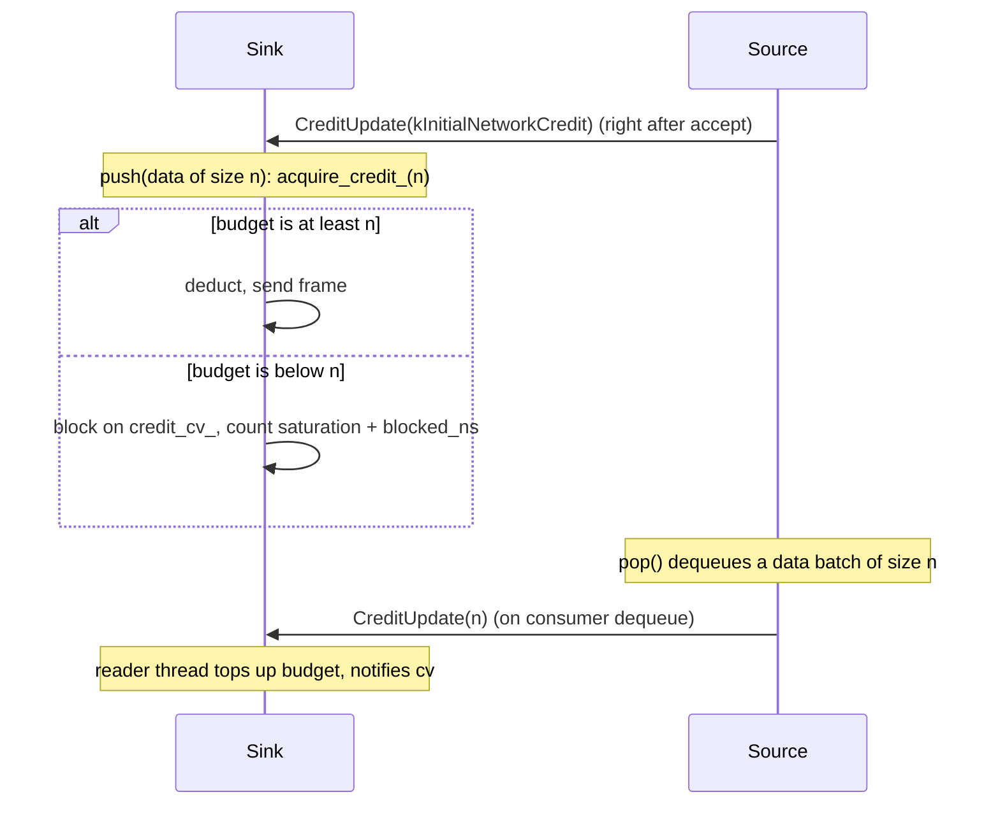

# Network stack and data exchange

> The transport that carries `StreamElement<T>`s, watermarks, drain markers and checkpoint barriers between operators, in-process over bounded channels and across TaskManagers over a length-prefixed Arrow-IPC TCP wire.

## Overview

Every edge in a clink DAG is a channel. Within one process, an operator hands elements to the next operator through a `BoundedChannel<StreamElement<T>>`; across TaskManagers, the same elements are serialised onto a TCP socket and reconstructed on the far side. Both ends present the same interface (push an element, pop an element) so operator code never needs to know whether its peer is local or remote. Backpressure, framing, the Arrow-IPC data format, control frames and multi-input alignment are all handled by this layer, leaving operators to do data work only.

The same logical channel can also short-circuit: when sender and receiver are colocated on one TaskManager, the cross-TM path is bypassed entirely and elements are pushed straight into the receiver's queue with no serialisation, no TCP loopback and no Arrow IPC. The socket path remains the fallback for genuinely remote hops.

## Where it lives

| File | Contents |
| --- | --- |
| `include/clink/runtime/bounded_channel.hpp` | `BoundedChannel<T>`: the thread-safe bounded MPMC queue that is the unit of backpressure. |
| `include/clink/runtime/network/wire.hpp` | The wire protocol: frame layout, `Kind` enum, big-endian put/read helpers, `kInitialNetworkCredit`. |
| `include/clink/runtime/network/network_channel.hpp` | `NetworkChannelSink<T>` / `NetworkChannelSource<T>`: the TCP send and receive halves, credit-based backpressure, and the local fast path. |
| `include/clink/runtime/network/network_bridge.hpp` | `NetworkBridgeSink<T>` / `NetworkBridgeSource<T>`: operator-interface adapters wrapping the channel halves. |
| `include/clink/runtime/network/local_data_plane.hpp` | `LocalDataPlane`: process-wide registry that lets a colocated sink find a colocated source's queue. |
| `include/clink/runtime/network/network_socket.hpp` | `NetworkSocket`: thin POSIX socket wrappers (connect, listen, accept, send_all, recv_all, half-close). |
| `include/clink/runtime/network/connection.hpp` | `Connection`: the cluster control-plane transport abstraction (plain TCP or TLS). |
| `include/clink/runtime/multi_input_alignment.hpp` | `MultiInputAlignment`: per-input watermark-min and Chandy-Lamport barrier alignment for union and co-operators. |
| `include/clink/core/arrow_batcher.hpp` | `ArrowBatcher<T>`: the Batch-to-RecordBatch seam, built-in columnar batchers, the binary fallback, and the IPC serialise/parse helpers. |

## How it works

### Bounded channels and backpressure

`BoundedChannel<T>` (`bounded_channel.hpp`) is the primitive everything sits on. It is a mutex-and-condition-variable bounded queue with a fixed `capacity_`. `push(T)` blocks while the queue is full and not closed; `pop()` blocks while it is empty and not closed. This blocking is the backpressure: a slow consumer fills the queue, which stalls the producer's `push`, which stalls that producer's own upstream, and so on back to the source.

Closing is one-way. After `close()`, `pop()` drains any remaining queued elements and then returns `std::nullopt`; that terminal `nullopt` is how a downstream operator learns its input has ended. There are non-blocking (`try_push` / `try_pop`) and timed (`pop_for`) variants, and a `high_water_mark()` for diagnostics. If a `push` or `pop` stays blocked past `kStuckWarnInterval` (3 seconds) the channel prints a greppable `BOUNDED_CHANNEL_STUCK` line to stderr with its name, depth, capacity and waiter counts, which is the first thing to look for when diagnosing a backpressure deadlock.

Intra-process operator edges in the DAG are `BoundedChannel<StreamElement<T>>` created by `Dag` (`dag.hpp`) with `default_channel_capacity_`, which defaults to 1024 elements. The cross-TM receive side uses a smaller queue (see below).

### NetworkBridge over NetworkChannel

For cross-TaskManager edges there are two layers. The outer layer, `NetworkBridgeSink<T>` and `NetworkBridgeSource<T>` (`network_bridge.hpp`), implements the operator `Sink<T>` / `Source<T>` interface so a bridge slots into a DAG like any other operator. The inner layer, `NetworkChannelSink<T>` and `NetworkChannelSource<T>` (`network_channel.hpp`), owns the socket and the wire protocol.

The pairing is single-connection: one sink talks to one source. An `N`-to-`M` shuffle in the distributed runtime is realised as each upstream subtask owning one sink per downstream subtask, with the symmetric story on the receive side.

The lifecycle is deliberately two-phase so the listener is up before anyone connects:

```
source side                              sink side
-----------                              ---------
prepare_listen()  -> bind, listen,
                     register in LocalDataPlane,
                     return bound port
        (bound port communicated out-of-band, e.g. by the JM)
                                         open() -> connect() to (host, port)
open() -> accept() (spawns recv thread)
                                         on_data/on_watermark/on_barrier -> push frames
                                         close() -> Close frame + shutdown_write
produce() -> pop() drains until nullopt
```

`NetworkBridgeSource::prepare_listen()` returns the actually-bound port, so callers may pass port 0 and discover the OS-assigned port. `NetworkBridgeSource::emit_terminal_barrier_on_exit()` returns false: a bridge is a relay, so any terminal barrier the original source produced is already in the byte stream and must not be re-synthesised, which would make a two-phase-commit sink commit twice.

### Length-prefixed framing

Every frame on the socket is:

```
[u32 frame_length_be][frame_payload]
   frame_payload = [u8 kind][kind-specific bytes]
```

The 4-byte big-endian length prefix lets the receiver read exactly one frame at a time (`recv_all` of 4 bytes, then `recv_all` of that many). All multi-byte integers in the clink framing are big-endian (network byte order), encoded with the `put_*_be` / `read_*_be` helpers in `wire.hpp`. The one exception is the Arrow IPC payload inside an `ArrowBatch` frame, which carries Arrow's own encoding with an embedded endianness flag.

The length prefix also gives forward and backward compatibility for trailing optional bytes. A barrier frame, for example, may carry an extra alignment-mode byte after the checkpoint id; a peer that does not know about it reads the right number of bytes anyway and ignores the tail, and a peer that does reads either the 8-byte legacy or the 9-byte mode-bearing form, defaulting an absent mode to `Aligned`.

### Frame kinds

The `Kind` enum (`wire.hpp`) tags each frame:

| Kind | Value | Payload | Meaning |
| --- | --- | --- | --- |
| `Data` | 0 | (legacy) | Pre-Arrow per-record framing. No longer emitted; the receiver treats an arriving `Data` frame as a stale-peer hard error and closes. The value is reserved so packet captures can still name the byte. |
| `Watermark` | 1 | `[i64 ts_be]` | An active watermark. |
| `Barrier` | 2 | `[u64 ckid_be][u8 mode?]` | A non-terminal checkpoint barrier; trailing mode byte optional. |
| `Close` | 3 | empty | End-of-stream from the sender. |
| `CreditUpdate` | 4 | `[u32 delta_be]` | Reverse-direction frame: the receiver grants the sender `delta` more records of send credit. |
| `Terminal` | 5 | `[u64 ckid_be][u8 mode?]` | Terminal barrier; same shape as `Barrier`, flag-distinguished so 2PC sinks know to commit. |
| `WatermarkIdle` | 6 | `[i64 ts_be]` | Idle-watermark variant; downstream alignment excludes this input from the running min. |
| `ArrowBatch` | 7 | Arrow IPC stream | The data carrier. Payload is a complete Arrow IPC stream (schema + record batch + EOS) for one `Batch<T>`. |
| `Drain` | 8 | `[u32 subtask_be][u32 target_par_be]` | Rescale marker announcing that an upstream subtask is winding down and its key-groups are moving to peers. |

### The Arrow IPC data path and the ArrowBatcher seam

All data rides `Kind::ArrowBatch`. The conversion between `Batch<T>` and an `arrow::RecordBatch` is the `ArrowBatcher<T>` seam (`arrow_batcher.hpp`), a triple of closures: `schema()`, `build(Batch<T>)` and `parse(RecordBatch)`. On send, `NetworkChannelSink::push_remote_` calls `batcher_.build(batch)`, serialises the result with `arrow_batch_to_ipc`, and writes one `ArrowBatch` frame. On receive, `recv_loop_` calls `arrow_batch_from_ipc`, optionally validates the decoded schema against `batcher_.schema()`, then calls `batcher_.parse` to rebuild the `Batch<T>`.

There are two flavours of batcher behind one wire kind:

- Typed columnar schemas. Built-in types get one, for example `int64` becomes `{event_time:int64(nullable), value:int64}` and `string` becomes `{event_time:int64(nullable), value:utf8}`. There are also keyed and other primitive batchers (`int64_keyed_arrow_batcher`, `string_keyed_arrow_batcher`, `int32`/`uint32`/`uint64`). A user struct gets one too, with no hand-written batcher, by describing its fields once with `CLINK_ARROW_FIELDS(T, a, b, ...)`; `make_columnar_arrow_batcher<T>()` then synthesises a `{event_time, a, b, ...}` typed schema. These columnar forms are materially faster on the wire.
- Binary fallback. A `T` with no typed batcher and no field description rides `make_default_arrow_batcher<T>(codec)`, a 2-column schema `{event_time:int64(nullable), value_bytes:binary}` whose binary column carries the per-record `Codec<T>::encode` output verbatim and is decoded back with `Codec<T>::decode`. No columnar win, but every type rides unified Arrow framing automatically.

Selection is automatic. `make_auto_arrow_batcher<T>(codec)` is the single policy point: it returns the generated typed batcher when `HasArrowFields<T>` (the `CLINK_ARROW_FIELDS` opt-in), else the binary fallback. The codec-only registration paths (`TypeRegistry::register_typed`, `PluginRegistry::register_type`) and the codec-only `NetworkChannelSink`/`Source` constructors all route through it, so a described struct gets typed columns through the ordinary API with no separate columnar-register call, and both ends of a channel derive the same schema. The explicit `register_columnar_typed` / `register_columnar_type` helpers remain as a statement of intent (and a hard compile error if the type was never described). Pass an explicit `ArrowBatcher<T>` to the 3-arg registration or full channel constructor to override.

The `Codec<T>` is therefore not retained on the wire data path; the codec-only constructors build the auto-selected batcher once at construction and discard the codec. The receiver dispatches on the embedded Arrow schema, not on a separate kind byte, and rejects a frame whose schema does not match its registered batcher.

The wider columnar-execution story (when the columnar form is preserved end-to-end versus materialised back to rows) is covered in [./columnar-execution.md](./columnar-execution.md).

### Credit-based backpressure on the socket path

The socket path cannot rely on `BoundedChannel` blocking alone, so it adds an explicit credit scheme over the reverse direction of the same connection. Credit is counted in records.



The receiver bootstraps a fresh connection with one `CreditUpdate(kInitialNetworkCredit)` (2048 records, `wire.hpp`) immediately after `accept`. The sender's `acquire_credit_` deducts the batch size before each data frame and blocks on a condition variable when the budget is too small; a dedicated reader thread in the sink consumes incoming `CreditUpdate` frames and tops the budget back up. Crucially the receiver issues credit in `pop()`, that is, on consumer dequeue, not at parse time. Crediting at parse time would pace the sender only to socket throughput and miss the real backpressure signal when the consumer itself is slow. The sink exposes `credit_remaining()`, `blocked_ns_total()`, `saturation_events()` and `grants_received()` for backpressure dashboards. Watermarks, barriers, drain markers and close frames are not credit-gated; only data frames are.

### The local fast path (LocalDataPlane)

When two subtasks are colocated on one TaskManager, the socket path is pure overhead. `LocalDataPlane` (`local_data_plane.hpp`) is a process-wide registry keyed by `(host, port)`. When a `NetworkChannelSource` calls `listen()`, it also registers its receive queue (`local_channel_`, a `LocalEndpointChannel<T>` which is just a `BoundedChannel<StreamElement<T>>` of capacity `kLocalChannelCapacity = 256`) under the port it bound. When a `NetworkChannelSink` calls `connect()`, it first does a typed `lookup_endpoint<T>` against the registry. On a hit it keeps the queue and routes every `push` directly into it, skipping codec encode, Arrow IPC, the TCP loopback and the decode on the other side; the `BoundedChannel`'s own blocking push provides backpressure in place of credit grants. On a miss it opens the socket.

Both pathways feed the same queue, so `pop()` is uniform regardless of how an element arrived. Lookups are type-checked via a stored `std::type_index`; a type mismatch returns null. The registry can be disabled at runtime via `set_enabled(false)` (or the RAII `ScopedDisableLocalDataPlane`), which tests use to force the cross-process socket path; production leaves it enabled.

### Shutdown and the close-versus-shutdown subtlety

Teardown has a portability hazard worth knowing. On the colocated fast path no TCP peer ever connects, so the source's `recv_loop_` sits blocked in `accept_one`. To wake it, `shutdown_recv` and the destructor do both `shutdown_read` and `close` on the listener fd: `shutdown_read` wakes a blocked `accept()` on Linux, `close` wakes it on macOS/BSD, and both are needed. Omitting the shutdown would hang subtask teardown (and therefore the job's completion signalling) on Linux. A `CloseOnExit` guard in `recv_loop_` ensures the local channel is closed on every exit path so a blocked `pop()` always unblocks. The sink's `close_send()` sends a `Close` frame and half-closes the send side; on the local path it simply closes the queue.

### Multi-input alignment

Operators with more than one input (union, co-operators, joins) must merge watermarks and align barriers across inputs. `MultiInputAlignment` (`multi_input_alignment.hpp`) is the per-input bookkeeping that owns this. It is driven by the operator runner calling `on_watermark`, `on_barrier`, `on_input_closed` and `refresh_watermark`, and returns a small advance struct telling the runner whether to forward something downstream and which inputs to pause.

Watermark merging is a running minimum. The forwarded watermark is `min` over all inputs' latest watermarks; an input only advances downstream time once every input has caught up.

- An idle watermark (`WatermarkIdle`) sets that input's contribution to `Watermark::max()` so a quiet partition cannot stall downstream time.
- When a previously-idle input becomes active again, its effective watermark is clamped to at least the currently-emitted global watermark so time cannot regress.
- When every alive input is idle, a single idle marker is emitted (not repeated). Closed inputs are also pinned to `Watermark::max()` and so drop out of the min.

Barrier alignment follows Chandy-Lamport, and the policy is carried per-barrier by the barrier's stamped `Mode`:

```
Aligned barrier across inputs 0,1,2:

  input 0 ---B(ck=7)----------------|  paused after delivering B
  input 1 ----------B(ck=7)---------|  paused after delivering B
  input 2 -----------------B(ck=7)--|  last to deliver
                                    ^
                          all alive inputs delivered ck=7
                          -> forward B downstream, unpause all
```

In `Aligned` mode each input that delivers a barrier is paused (`paused_[i] = true`) so it is not polled again until the barrier completes; once every alive input has delivered, the barrier is forwarded and all inputs unpause. Closed inputs implicitly satisfy any in-flight barrier. The first-delivery timestamp feeds a `barrier_align_wait_ns` metric.

In `Unaligned` mode the first delivery forwards the barrier immediately and never pauses; the advance carries `unaligned_first = true`, which tells the runner to capture the still-pending inputs' in-flight records into the snapshot. Subsequent deliveries of the same id are absorbed. `pending_inputs_for(ck_id)` enumerates the inputs that have not yet delivered a given barrier so the operator knows which channels to drain. The mode is pinned per checkpoint id on first delivery so aligned and unaligned semantics never mix mid-checkpoint. The interaction with the checkpointing protocol is detailed in [./checkpointing.md](./checkpointing.md).

### Cluster control plane transport

Operator data and watermarks use the channel/bridge stack above. The cluster control plane (JobManager to TaskManager: deploy, cancel, heartbeat, frame readers) instead uses the `Connection` abstraction (`connection.hpp`), a transport interface with `send_all` / `recv_all` / `shutdown_write` / `shutdown_read` / `close`, implemented over plain TCP (`make_plain_connection`, `connect_plain`) or TLS. This keeps the dozens of control-plane call sites ignorant of whether a given peer is TLS. See [./distributed-runtime.md](./distributed-runtime.md).

## Key types and APIs

| Type / function | Responsibility |
| --- | --- |
| `BoundedChannel<T>` | Thread-safe bounded MPMC queue; the unit of backpressure. Blocking and non-blocking push/pop, one-way close, stuck-warnings. |
| `NetworkChannelSink<T>` | TCP send half. `connect()`, `push()` (with credit gating), `close_send()`; runs a reader thread for `CreditUpdate` grants. |
| `NetworkChannelSource<T>` | TCP receive half. `listen()`, `accept()`, `pop()`; runs a recv thread that parses frames into the local channel and issues credit on dequeue. |
| `NetworkBridgeSink<T>` / `NetworkBridgeSource<T>` | Operator-interface adapters wrapping the channel halves; `prepare_listen()`, `open()`, `produce()`, `cancel()`. |
| `ArrowBatcher<T>` | `schema()` / `build()` / `parse()` closures converting `Batch<T>` to/from `arrow::RecordBatch`; columnar for built-ins and `CLINK_ARROW_FIELDS` structs (auto-selected via `make_auto_arrow_batcher`), binary fallback otherwise. |
| `arrow_batch_to_ipc` / `arrow_batch_from_ipc` | Serialise/deserialise one `RecordBatch` as an Arrow IPC stream blob. |
| `Kind` | Wire frame tag (Data, Watermark, Barrier, Close, CreditUpdate, Terminal, WatermarkIdle, ArrowBatch, Drain). |
| `LocalDataPlane` | Process-wide `(host, port)` to typed-queue registry enabling the colocated fast path. |
| `NetworkSocket` | POSIX socket wrappers (connect, listen, accept, send_all, recv_all, shutdown_read/write, close). |
| `Connection` | Control-plane transport abstraction (plain TCP or TLS). |
| `MultiInputAlignment` | Per-input watermark-min and Chandy-Lamport barrier alignment; `on_watermark`, `on_barrier`, `on_input_closed`, `pending_inputs_for`. |

## Configuration and knobs

- `CLINK_DATA_BIND_HOST` (env var; `network_socket.hpp` via `default_data_bind_host()`): bind host for data-plane sources. Defaults to `127.0.0.1` (loopback only). Multi-host deployments set it to `0.0.0.0` so subtask data ports are reachable across containers or nodes. Binding non-loopback exposes the port to the network; pair with TLS for any deployment beyond a trusted local network.
- `kInitialNetworkCredit` (`wire.hpp`): initial send credit a fresh connection is bootstrapped with, in records. Default 2048. Sized so single-batch jobs and tests with no replenishment can still finish. It is a compile-time constant in the source.
- `Dag` default channel capacity (`dag.hpp`, `set_default_channel_capacity`): intra-process operator-edge queue depth in elements. Default 1024.
- `NetworkChannelSource::kLocalChannelCapacity` (`network_channel.hpp`): receive-side queue depth for both the socket and local fast paths. 256.
- `LocalDataPlane::set_enabled(bool)`: runtime kill-switch for the colocated fast path; on by default. Forcing it off routes colocated peers through the socket+codec path (used by tests).
- `kStuckWarnInterval` (`bounded_channel.hpp`): seconds a blocked push/pop waits before logging a `BOUNDED_CHANNEL_STUCK` line. 3.

## Guarantees and caveats

- Backpressure is end-to-end. A bounded queue (local edges and the local fast path) or the credit scheme (the socket path) propagates pressure from a slow consumer back to the source. Only data frames are credit-gated; control frames flow freely.
- The data wire is Arrow IPC only. `Kind::Data` (the old per-record framing) is no longer emitted; a receiver that sees one treats it as a stale-peer hard error and closes the connection. There is one data kind for all types; the columnar-versus-binary distinction lives entirely in the embedded Arrow schema, which the receiver validates against its registered batcher before parsing.
- The bridge pairing is one sink to one source over a single TCP connection. A shuffle is built from many such pairs, not multiplexed over one socket.
- Framing tolerates trailing-byte additions (length-prefixed), which is how the optional barrier-mode byte and the idle-watermark kind were added without breaking older peers; absent fields default (mode to `Aligned`).
- Watermark merging guarantees downstream monotonicity even across idle and re-activating inputs (the idle-to-active clamp prevents regression).
- Barrier alignment is per-barrier by stamped mode, not chosen once at startup. `Unaligned` mode requires the operator runner to capture in-flight records on pending inputs on the `unaligned_first` advance; getting that capture wrong is a snapshot-correctness bug, not just a latency issue. See [./checkpointing.md](./checkpointing.md).
- TLS applies to the cluster control plane via `Connection`. The data-plane `NetworkChannel` path described here uses `NetworkSocket` plain TCP, so binding a data port on a non-loopback interface exposes unencrypted record traffic on that interface.
- Teardown correctness depends on doing both `shutdown_read` and `close` on the listener fd. This is a real cross-platform hazard: `close` alone leaves `accept()` blocked on Linux, which previously hung subtask teardown for colocated (local-fast-path) jobs.

## Related

- [./operator-model.md](./operator-model.md) - the operator interface the bridges adapt to, and `StreamElement<T>`.
- [./task-lifecycle.md](./task-lifecycle.md) - how a subtask's runner drives sources, sinks and the alignment state machine.
- [./jobs-and-scheduling.md](./jobs-and-scheduling.md) and [./distributed-runtime.md](./distributed-runtime.md) - how shuffles are wired into a deployed job and the control-plane transport.
- [./checkpointing.md](./checkpointing.md) - barrier injection, aligned and unaligned snapshots, terminal barriers and 2PC sinks.
- [./time-and-windowing.md](./time-and-windowing.md) - watermark semantics and idleness.
- [./columnar-execution.md](./columnar-execution.md) - when the Arrow columnar form survives end-to-end versus being materialised back to rows.
- Connectors (external sources and sinks) are documented at [../connectors/README.md](../connectors/README.md).
