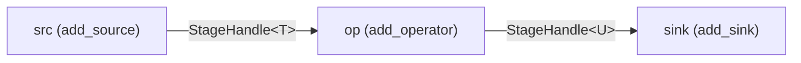
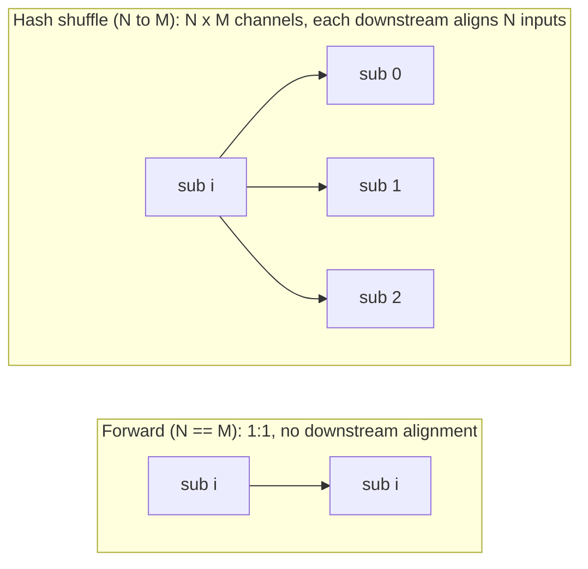

# The operator model and DAG

> The set of typed operator interfaces, the in-band stream element that flows between them, and the `Dag` builder that wires them into a runnable topology.

## Overview

A clink job is a directed graph of operators. Records, watermarks, checkpoint barriers and rescale-drain markers all travel down the same channels as a single tagged envelope, `StreamElement<T>`, so that time, checkpointing and rescaling stay ordered with respect to the data. Operators are plain C++ classes implementing one of a handful of typed interfaces (`Source<Out>`, `Operator<In, Out>`, `CoOperator<In1, In2, Out>`, `Sink<In>`). The `Dag` builder owns the operators, the inter-operator channels, and a set of type-erased *runner* closures that drive each operator from its inputs into its `Emitter`. Each operator reaches state, timers, metrics and its own identity through a single `RuntimeContext` handed to it before `open()`.

This page covers the data model and the topology builder. How those runner closures are actually scheduled onto threads is in [./task-lifecycle.md](./task-lifecycle.md); how parallelism maps to subtasks across a cluster is in [./jobs-and-scheduling.md](./jobs-and-scheduling.md).

## Where it lives

| File | Contents |
| --- | --- |
| `include/clink/core/stream_element.hpp` | `StreamElement<T>`, its `Kind` enum, `DrainMarker` |
| `include/clink/core/record.hpp` | `Record<T>`, `Batch<T>` (with the optional Arrow sidecar) |
| `include/clink/core/types.hpp` | `OperatorId` (a `StrongId`), `operator_id_from_uid` |
| `include/clink/operators/operator_base.hpp` | `Emitter<Out>`, `Source`, `Operator`, `CoOperator`, `Sink`, `ChainedOperator` |
| `include/clink/runtime/dag.hpp` | `Dag`, `StageHandle<T>`, `ParallelStageHandle<T>`, the `detail::OperatorRunner` struct, and all the `add_*` / `fork` / `union_streams` builders |
| `include/clink/runtime/runtime_context.hpp` | `RuntimeContext`, `Accumulator` |
| `include/clink/runtime/key_groups.hpp` | `kNumKeyGroups`, `KeyGroup`, key-group hashing |
| `include/clink/api/pipeline.hpp` | the fluent `Pipeline` / `DataStream<T>` front end |

## How it works

### The stream element

Everything on an operator channel is a `StreamElement<T>`, a tagged union over four kinds (`include/clink/core/stream_element.hpp`):

```
StreamElement<T>::Kind
  Data       -> Batch<T>          a batch of user records
  Watermark  -> Watermark         event-time progress
  Barrier    -> CheckpointBarrier a checkpoint barrier
  Drain      -> DrainMarker       this upstream subtask is winding down (rescale)
```

The element is constructed through static factories (`StreamElement<T>::data(...)`, `::watermark(...)`, `::barrier(...)`, `::drain(...)`) and read either through the `is_*`/`as_*` accessors or through `visit()`, which dispatches on the underlying `std::variant`. The deliberate design choice is that all four kinds share one channel. Sending watermarks out of band would break alignment; sending barriers out of band would break exactly-once; sending the drain marker out of band would break the ordering between an upstream's tail records and its retirement. Keeping them in band makes that ordering automatic.

`DrainMarker` carries the draining `subtask_idx` and the `target_parallelism` the rescale is moving towards. It is emitted by a source (or stateful intermediate) runner when the cluster signals a rescale at that operator, immediately before the subtask closes its outputs. See [./fault-tolerance-and-rescale.md](./fault-tolerance-and-rescale.md).

### Records and batches

A `Batch<T>` is the unit of data flow, a sequence of `Record<T>`. A `Record<T>` is a value plus an optional `EventTime`. `Batch<T>` also carries an optional `arrow::RecordBatch` sidecar (`include/clink/core/record.hpp`): a columnar-native producer sets the sidecar and leaves the row vector empty, and `is_columnar()` lets a columnar-aware operator opt into a vectorized fast path. `size()` and `empty()` answer from the sidecar without decoding rows; the first row-API access lazily materialises the sidecar into rows. A pure-row batch (no sidecar) behaves as a plain vector of records. The columnar path is detailed in [./columnar-execution.md](./columnar-execution.md).

### Operator interfaces

There is no single base class. Operators implement the interface that matches their arity:

- `Source<Out>` produces autonomously. The runtime drives it by calling `produce(Emitter<Out>&)` until it returns `false` (exhausted) or the source is cancelled. `is_bounded()` (default `false`) and `split_count()` (default `1`) describe boundedness and natural parallelism. Checkpointable sources override `snapshot_offset` / `restore_offset`.
- `Operator<In, Out>` is single-input, single-output. The core method is `process(const StreamElement<In>&, Emitter<Out>&)`. Default `open()`/`close()` are no-ops.
- `CoOperator<In1, In2, Out>` is two-input. Each input has its own typed dispatch, `process_element1` and `process_element2`, sharing one `Emitter<Out>`. The runtime aligns the two inputs: downstream watermark is the min across inputs and barriers are aligned across both.
- `Sink<In>` terminates the graph: `on_data(const Batch<In>&)` (with a move-friendly `on_data(Batch<In>&&)` overload) and produces nothing.

All four expose lifecycle hooks (`open`/`close`), time hooks (`on_watermark`, `on_barrier`, `on_processing_time_timer`, `on_event_time_timer`), a `flush(...)` hook called once after the input drains, identity setters (`set_id`, `set_uid`, `set_display_name`), and `attach_runtime(RuntimeContext*)`. The default `on_watermark` fires any due event-time timers and forwards the watermark unchanged; an operator that overrides it (windows, the process-function adapter) must call `fire_due_event_time_timers` itself if it wants timer semantics.

Operators opt in to two execution variants with `[[nodiscard]]` predicates that default off:

- Columnar (`supports_columnar()` + `process_columnar(...)`). When the operator opts in and an incoming data element carries an Arrow sidecar, the runner calls `process_columnar` instead of `process`. The contract is strict: return `false` only *before* emitting anything, because the runner re-runs `process()` on a `false` return.
- Async state (`supports_async()` + `process_async(...)`, with finer opt-ins `coalesce_reads()`, `deadline_aware()`, and the `fires_*_timers` flags). Active only when the operator opts in *and* the bound backend can defer reads. See [./async-state-execution.md](./async-state-execution.md).

### The emitter

`Emitter<Out>` (`include/clink/operators/operator_base.hpp`) is the operator-side handle for sending downstream. It has three construction modes, all presenting the same API to the operator:

1. Single-channel: pushes every element onto one `BoundedChannel`. The 1:1 form for parallelism-1 stages.
2. Multi-output: wraps a `SubtaskEmitter` owning N downstream channels, routing data via a partitioner and broadcasting watermarks / barriers. Used by parallel stages.
3. Forwarding: wraps a callable that receives the element and dispatches it, typically by calling the next operator's `process()` directly. This is the zero-channel operator-chaining path.

`emit_data` / `emit_watermark` / `emit_barrier` / `emit_drain` are the typed entry points. The emitter is also the single choke point for per-operator output metrics (`records_out_total`, `side_output_records_total`, the output watermark gauge) and for stamping a `CheckpointBarrier::Mode` (`set_default_barrier_mode`), which is how a source runner translates the job-global aligned/unaligned policy onto every barrier without the user source knowing about modes.

### Operator chaining

`ChainedOperator<A, B, C>` fuses two adjacent operators `op_a: A->B` and `op_b: B->C` into a single `Operator<A, C>`. Its `process()` builds a forwarding `Emitter<B>` whose `emit()` calls `b_->process()` directly, so the second operator runs from inside the first operator's `emit()` with no channel and no thread switch in between. Watermarks, barriers, timer firing and the end-of-stream flush all forward through the same direct path, and `open`/`close` cascade in declaration order. Each inner operator gets its own `RuntimeContext` (minted lazily in `open()` from the parent context) so their `TimerService`s stay isolated; timer checkpoint slots are namespaced per inner op (`"0"`, `"1"`, recursively for nested chains).

### The Dag builder



Each `add_*` call:

- mints an `OperatorId`
- allocates the output `BoundedChannel`
- captures the operator and channels into a `detail::OperatorRunner`
- returns a `StageHandle<Out>` carrying the output channel and runner index

`Dag` (`include/clink/runtime/dag.hpp`) is the topology builder. Each `add_*` method allocates the operator's output channel, derives its `OperatorId`, and pushes a `detail::OperatorRunner` onto the DAG. A runner is a type-erased struct holding the operator's name and id, its `run` closure (given a `RuntimeContext&` and a `should_stop` predicate), a `cancel` closure, and channel-introspection callbacks for metrics. The methods return a `StageHandle<T>` carrying the new stage's output channel and its runner index, which the next `add_*` consumes as its upstream.

The single-input `add_operator` runner closure is where most of the per-record machinery lives. It restores checkpointed timers, calls `open()`, builds the emitter, and then loops: fire due timers, size the input-pop timeout from the next timer deadline, pop one element, and dispatch it. Data elements try the columnar fast path then fall to `process()`; barriers trigger a state snapshot (only by the chain's checkpoint owner) before forwarding; watermarks and barriers route through the async controller when async mode is on. At end-of-stream it fires residual timers, calls `flush()` then `close()`, and closes the output and any side-output channels. The barrier and async details belong to [./checkpointing.md](./checkpointing.md) and [./async-state-execution.md](./async-state-execution.md).

The builder offers these topology shapes:

| Builder | Shape |
| --- | --- |
| `add_source` / `add_operator` / `add_sink` | linear source -> op -> sink |
| `add_co_operator` | two heterogeneous inputs -> one output |
| `fork` | tee one stream to N branches (data, watermarks, barriers all copied) |
| `add_split` | route each record to exactly one of N branches by a selector; control events broadcast |
| `union_streams` | merge N same-type streams into one; barriers Chandy-Lamport aligned |
| `interval_join` | keyed time-windowed two-stream join (inner / outer / semi / anti) |
| `broadcast_connect` / `broadcast_process` | a high-volume main stream plus a broadcast control stream over `BroadcastState` |
| `iterate_stream` / `close_with` | cyclic dataflow with a feedback edge |
| `add_sharded_keyed` | one keyed operator fanned across N share-nothing state shards |
| `add_blocking_exchange` | a fully-materialised (spillable) stage boundary for batch execution (Arrow builds) |

Multi-input shapes (`union_streams`, `interval_join`, broadcast, the shuffled parallel stage) share `MultiInputAlignment`: data forwards immediately, downstream watermark is the running min, and a barrier delivered on one input pauses that input until every other input delivers the same barrier, at which point it forwards. Records on slower inputs are still processed during alignment because they belong to the same checkpoint epoch. The aligner only marks an input closed once its channel is both closed and fully drained, which is the fix for an earlier startup-race deadlock at higher parallelism.

### Parallel stages and shuffles

`add_parallel_source` / `add_parallel_operator` / `add_parallel_operator_shuffled` / `add_parallel_sink` build N-way parallel stages, each subtask in its own runner with its own operator instance and its own `RuntimeContext` (hence its own keyed-state namespace). Operators are supplied as factories `(subtask_idx) -> shared_ptr<...>` so per-subtask state stays isolated. A `ParallelStageHandle<T>` carries the per-subtask `SubtaskEmitter`s and subtask ids. There are three edge layouts:



Fan-in (N to 1) is a degenerate shuffle with M = 1: a single downstream aligns N inputs.

`add_parallel_operator` requires `parallelism == upstream.parallelism` and installs the forward layout. A cross-parallelism edge requires `add_parallel_operator_shuffled` with a partitioner, which allocates the N×M channel grid; each upstream subtask's emitter is attached with the partitioner to choose the destination, and each downstream subtask reads from N inputs through `MultiInputAlignment`.

### OperatorId and stable identity

`OperatorId` is a `StrongId` over `std::uint64_t` (`include/clink/core/types.hpp`), a non-convertible wrapper that prevents id types being mixed up. The DAG derives ids two ways (`derive_id_with_uid_`):

- If the operator carries a non-empty `uid` (set via `set_uid(...)` before `add_*`), the id is `operator_id_from_uid(uid)`, which hashes `"uid/" + uid`. This is stable across topology edits, so keyed state restores correctly even when operators are renamed, reordered, or added and removed around this one. Recommended for any stateful operator that should survive a savepoint.
- Otherwise the id is a hash of `"stage<index>/<name>"`, so changing the topology shifts ids and stale state is abandoned. Fine for stateless operators, fragile for stateful ones.

A value of `0` is reserved (the default-constructed sentinel), so derivation maps a hash of 0 to 1. The DAG rejects duplicate uids (`assigned_uids_`). The same `operator_id_from_uid` transform is used by the fluent front end when it records a job's expected state versions, so both the runtime that stamps state-version metadata and the job's declared expectations agree on keys. The hash is `std::hash<std::string>`, which is only stable within one process build, which is sufficient because the plugin ABI gate pins the same toolchain and commit across the submit and deploy processes. Identity semantics and why a stateful op must set a uid are in [./state-and-backends.md](./state-and-backends.md) and [./fault-tolerance-and-rescale.md](./fault-tolerance-and-rescale.md).

### RuntimeContext: how an operator reaches state

`RuntimeContext` (`include/clink/runtime/runtime_context.hpp`) is the only sanctioned way for an operator to reach state, timers, metrics or its own identity. The executor owns it for the whole run; the operator holds a non-owning pointer via `attach_runtime`. It exposes:

- Keyed state: `keyed_state<K, V>(slot, key_codec, value_codec)`, with a TTL overload. It throws if no state backend is configured. State is scoped to the operator's `OperatorId` and the slot name. Keys are encoded with a leading key-group byte (`key_group_for_key`, with `kNumKeyGroups = 128` from `include/clink/runtime/key_groups.hpp`), which is what makes rescale partition state by key group. Also `list_state`, `map_state`, `aggregating_state`, `reducing_state`.
- Broadcast state: `broadcast_state<V>(slot, value_codec)`, the per-operator state read by every key, used by `broadcast_process`.
- Per-operator processing-time `TimerService` (always present), the checkpoint-ack callback, the bounded-source end-of-stream final-checkpoint hooks, the aligned/unaligned flag, the restore key-group range (`restore_key_group_range`, default `{0, kNumKeyGroups}`), the per-operator barrier-mode override, side-output channels (`side_output<T>(tag)`), a named user `Accumulator` (`accumulator(name)`), a logging seam (`log_info` and friends, which must be used in preference to the global logger because a dlopen'd plugin sees private singletons otherwise), and the dead-letter-queue seam (`report_bad_record`).

### The fluent front end

`Pipeline` and `DataStream<T>` (`include/clink/api/pipeline.hpp`) are the user-facing builder. `env.source<T>(...)` returns a `DataStream<T>`; `.map`, `.flat_map`, `.filter`, `.process`, `.assign_timestamps_*`, `.key_by`, `.side_output` chain it; `.name(...)` and `.uid(...)` attach a display name and the stable identity. `key_by` returns a `KeyedDataStream<T>` whose subsequent operators carry a `key_by` field that signals the planner to hash-route the incoming edge. The fluent layer produces an `OperatorSpec` graph that the planner compiles into a `Dag` per subtask; it does not build the `Dag` directly. Connectors are anchored through descriptors, documented in [../connectors/README.md](../connectors/README.md).

## Key types and APIs

| Type / function | Responsibility |
| --- | --- |
| `StreamElement<T>` | the in-band envelope: data / watermark / barrier / drain |
| `Batch<T>`, `Record<T>` | the data unit and a single value-with-event-time, with an optional Arrow sidecar |
| `Emitter<Out>` | operator-side send handle; single-channel, multi-output, or forwarding; metrics + barrier-mode choke point |
| `Source<Out>` | autonomous producer; `produce`, `is_bounded`, `split_count`, offset snapshot/restore |
| `Operator<In, Out>` | single-input operator; `process`, columnar + async opt-ins, timer + barrier hooks |
| `CoOperator<In1, In2, Out>` | two-input operator; `process_element1/2`, shared emitter, aligned inputs |
| `Sink<In>` | terminal consumer; `on_data`, `on_commit`/`on_abort` for 2PC, commit groups |
| `ChainedOperator<A, B, C>` | fuses two adjacent operators with zero-channel forwarding |
| `OperatorId` / `operator_id_from_uid` | stable strong-typed operator identity |
| `Dag` | owns operators, channels and runners; the `add_*` topology builders |
| `StageHandle<T>` / `ParallelStageHandle<T>` | builder return values carrying the output channel and runner index(es) |
| `detail::OperatorRunner` | type-erased per-operator drive closure (`run`, `cancel`, channel introspection) |
| `RuntimeContext` | per-operator handle to state, timers, metrics, identity, side outputs |

## Configuration and knobs

| Knob | Default | Effect |
| --- | --- | --- |
| `Dag(default_channel_capacity)` constructor arg | `1024` | capacity of every inter-operator `BoundedChannel` |
| `kNumKeyGroups` (`key_groups.hpp`) | `128` | number of key groups; the rescale partitioning unit |
| `CLINK_DISABLE_COLUMNAR=1` | unset | forces the row path even where a columnar fast path exists; diagnostic / benchmark only, never a correctness change |
| `CLINK_EOS_FINAL_CKPT_TIMEOUT_MS` | `30000` | how long a bounded source waits at clean end-of-stream for its final coordinator-coordinated checkpoint to commit before throwing (drives watchdog restart) |
| `IterationConfig::max_records` | `0` (no cap) | safety cap on records through an iteration head |
| `IterationConfig::idle_threshold` | `100` (~100 ms) | consecutive idle polls before an iteration loop decides it is quiescent |
| `Pipeline::set_parallelism(n)` | `1` | default per-operator parallelism floor in the fluent API |

## Guarantees and caveats

- All four element kinds are in-band on one channel, by design, so ordering between data, time, checkpoints and rescale-drain is preserved.
- Keyed-state restore is stable only if a stateful operator sets a `uid`. Without it the id is derived from `"stage<index>/<name>"`, so any topology edit silently abandons that operator's state. This is the single most important correctness contract in this file.
- `OperatorId` derivation uses `std::hash`, which is stable only within one process build. Cross-process agreement relies on the plugin ABI gate pinning the toolchain and commit.
- The columnar `process_columnar` contract requires returning `false` *before* emitting anything; emitting and then returning `false` double-emits, because the runner re-runs `process()`.
- The async-state and read-coalescing paths are inert unless the operator opts in *and* the bound backend can defer reads. A single-input async operator force-aligns at a barrier (drains to quiescence) even under unaligned mode, which is lossless for one input. Declaring both `coalesce_reads()` and `deadline_aware()` makes the deadline ordering silently inert; the runner logs a warning. See [./async-state-execution.md](./async-state-execution.md).
- Checkpoint barriers in `iterate_stream` cycles are not injected through the feedback path in v1: barriers flow through the body once and in-flight iterations do not fully settle until the next checkpoint, acceptable for fixed-point / training loops where the eventual state is what matters.
- `interval_join` holds its join buffers in memory with an optional persistent mirror (active only when all required codecs and a state backend are supplied); the comment notes a port onto `KeyedState` as a follow-up.
- `broadcast_process` requires a state backend (it throws on `open()` without one) and does not enforce that the main-stream callback treats broadcast state as read-only in v1.
- Real partition-aware parallel *sources* are not built in this version; `add_parallel_source` defaults to parallelism 1, and partition assignment is connector-specific.

## Related

- [./architecture.md](./architecture.md) - where the operator model sits in the component stack
- [./task-lifecycle.md](./task-lifecycle.md) - how runner closures are scheduled onto threads
- [./jobs-and-scheduling.md](./jobs-and-scheduling.md) - parallelism, subtasks and the job graph
- [./network-stack.md](./network-stack.md) - what happens at a cross-process stage boundary
- [./time-and-windowing.md](./time-and-windowing.md) - watermarks, timers, windows and CEP
- [./state-and-backends.md](./state-and-backends.md) - keyed and broadcast state, key groups, backends
- [./checkpointing.md](./checkpointing.md) - barriers, alignment, snapshot ownership
- [./fault-tolerance-and-rescale.md](./fault-tolerance-and-rescale.md) - drain markers, uid stability, rescale
- [./columnar-execution.md](./columnar-execution.md) - the Arrow sidecar and `process_columnar`
- [./async-state-execution.md](./async-state-execution.md) - `process_async`, coalescing, deadlines
- [./sql-frontend.md](./sql-frontend.md) - how SQL lowers onto these operators
- [../connectors/README.md](../connectors/README.md) - source and sink connectors
