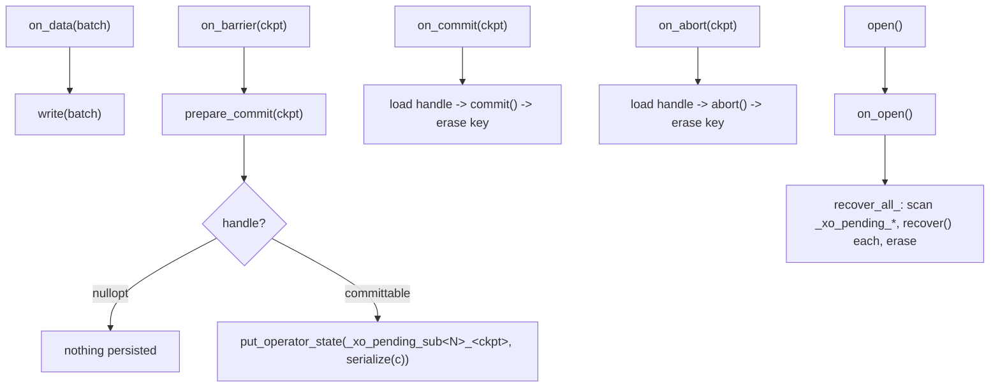

# The sink committer framework

How clink gives a connector exactly-once (or honest effectively-once) delivery
without each sink hand-rolling the two-phase-commit protocol.

The base is `CommittingSink<In, Committable>`
(`include/clink/connectors/committing_sink.hpp`). A connector supplies only the
verbs; the base owns the choreography, the durable per-checkpoint bookkeeping,
and recover-and-re-commit at open.

## What the connector supplies

| Verb | Purpose |
| --- | --- |
| `on_open()` | Create resources / initialise an external transaction. Runs before recovery. |
| `write(batch)` | Buffer or stage the records. |
| `prepare_commit(ckpt)` | Flush to a durable-but-uncommitted state; return a `Committable` handle, or `std::nullopt` when there is nothing to commit this checkpoint. |
| `commit(committable)` | Finalise atomically. Must be idempotent. |
| `abort(committable)` | Roll back. Must be idempotent. |
| `recover(committable)` | Finalise a handle found still-pending at startup. Defaults to `commit`. |
| `serialize` / `deserialize` | Codec for the persisted handle (must round-trip across a crash - keep it instance-free). |

## What the base owns

The base seals the lifecycle so a connector cannot get the choreography wrong:

Key points:

- The committable is persisted in **operator state** (not keyed state), keyed by
  checkpoint id under `_xo_pending_sub<N>_<ckpt>`. Operator state is restored
  whole per subtask (broadcast/union semantics), so a rescale never drops a
  pending handle. (The pre-framework 2PC sinks used raw keyed state, which is
  key-group-filtered on restore - a latent rescale bug the migration fixed.)
- The barrier snapshot captures the `put` made inside `on_barrier`, so a
  persisted handle survives a crash and is replayed by `recover_all_()` at the
  next `open()`.
- `on_commit` / `on_abort` fire from the same JobManager-driven path as any
  sink: the JM's commit-group gate collects every group member's pre-commit ack,
  then broadcasts `CommitCheckpoint` (or `AbortCheckpoint`); the TaskManager
  invokes the registered callbacks. See [checkpointing](checkpointing.md).
- `pending_committables()` exposes the persisted-but-unfinalised handles so a
  connector can reconcile an external registry at `on_open()` (e.g. an XA sink
  rolling back prepared transactions that are not in the restored set).

## Three delivery shapes

A connector's storage reality decides the shape; the framework serves all three.

| Shape | Mechanism | Committable | Adopters |
| --- | --- | --- | --- |
| **A. Staged artifact** | Stage durably at the barrier, publish atomically at commit | staging path / object key / multipart handle | file (`FileSink2PC`), Parquet (`ParquetSink2PC`, `ParquetFsSink2PC`), raw S3 (`S3Sink2PC`, multipart-complete-on-commit) |
| **B. External transaction (XA)** | Prepare a distributed txn at the barrier, commit-prepared at commit | global txn id | Postgres (`PREPARE TRANSACTION` / `COMMIT PREPARED`), Kafka (broker transaction, its own path) |
| **C. Idempotent upsert** | Write keyed by a declared PRIMARY KEY so replays collapse | none (the key is the identity) | Postgres / MySQL / Cassandra / Redis `mode='upsert'` |

Shapes A and B ride `CommittingSink` directly. Shape C does not use 2PC at all:
it is a changelog-aware sink (upsert on insert/update_after, delete-by-key on
delete/update_before, netted by key within a flush), selected by
`mode='upsert'` + a PRIMARY KEY.

## Guarantee labelling (be precise)

- `delivery_guarantee='exactly_once'` means **true two-phase commit** end to end,
  and is offered only where a real 2PC (or atomic-publish) mechanism exists:
  file, Kafka, Parquet, S3/object-store Parquet, raw S3, and Postgres. The SQL
  binder rejects it for any other connector.
- `mode='upsert'` (+ PRIMARY KEY) is **effectively-once on the sink table**, for a
  stable primary key and a deterministic defining query: every applied statement
  is keyed and idempotent, so a replay converges the table (or keyspace) to the
  same final state. It is explicitly **not** two-phase commit, and the two are
  mutually exclusive. This is what lets a retracting query (GROUP BY, TOP-N,
  outer join) maintain a Postgres / MySQL / Cassandra / Redis table.

Everything else is at-least-once.

## SQL selection

`src/sql/physical_plan.cpp` maps a sink table to a factory:
`delivery_guarantee='exactly_once'` selects the connector's 2PC variant (e.g.
`postgres_2pc_sink`, `s3_2pc_string_sink`, `file_2pc_sink_row`); `mode='upsert'`
with a PRIMARY KEY selects the changelog-aware variant (e.g.
`postgres_upsert_sink`, `mysql_upsert_sink`, `redis_upsert_sink`,
`cassandra_upsert_sink_string`), threading the key columns through as
`key_columns`. The binder validates that `mode='upsert'` has a PRIMARY KEY and
that the SELECT projects it.

## Per-connector notes

- **Postgres 2PC**: buffers rows into an open transaction, `PREPARE TRANSACTION`
  under a deterministic gid `clink_<uid>_sub<N>_<ckpt>` at the barrier,
  `COMMIT PREPARED` on commit. `on_open` reconciles orphaned prepared
  transactions (rolls back any of its own gids not in the restored set), so they
  never accumulate holding locks. Requires the server's
  `max_prepared_transactions > 0`.
- **S3 raw 2PC**: uploads the interval as the parts of an S3 multipart upload at
  the barrier; the object does not exist until `CompleteMultipartUpload` at
  commit. An upload orphaned by a crash before the checkpoint became durable
  produces no visible object and is left for an S3 lifecycle rule to expire.
- **Cassandra upsert**: CQL has no multi-row IN over a composite key, so deletes
  are per-row `DELETE ... WHERE k=<literal>`; `__row_kind` is stripped before
  `INSERT ... JSON` (Cassandra rejects an unknown column).
- **Redis upsert**: a key-value view (`SET`/`DEL` by the PK-derived key), distinct
  from the append-only Streams sink.

## Source

- Base: `include/clink/connectors/committing_sink.hpp`
- Adopters: `include/clink/connectors/{file_2pc_sink,parquet_2pc_sink,parquet_fs_2pc_sink}.hpp`,
  `impls/postgres/.../postgres_json_sink_2pc.hpp` + `postgres_json_upsert_sink.hpp`,
  `impls/s3/.../s3_sink_2pc.hpp`, `impls/mysql/.../mysql_json_upsert_sink.hpp`,
  `impls/redis/.../redis_upsert_sink.hpp`,
  `impls/cassandra/.../cassandra_upsert_sink.hpp`
- SQL wiring: `src/sql/physical_plan.cpp`, `src/sql/binder.cpp`
- Shared SQL builders: `include/clink/connectors/sql_json_builder.hpp`
