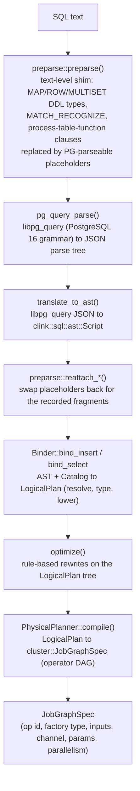

# SQL frontend internals

> How a SQL statement is turned into a `JobGraphSpec` operator DAG: text rewrite, parse, AST, bind, optimise, physical plan.

## Overview

The SQL frontend is a compile-time pipeline. It takes SQL text and produces a `clink::cluster::JobGraphSpec`: a list of operator specs (factory name, inputs, params, channel) that the job manager can submit and run. Nothing in this layer executes records; it only decides which operators to wire together and with what parameters. The pipeline is staged so each stage has one job, and the only runtime dependency, the PostgreSQL grammar in vendored libpg_query, is confined to a single translation unit so the rest of the layer works against clink's own AST. The frontend supports an intentionally narrow but growing subset of streaming SQL; constructs outside the subset are rejected at compile time with a source position, not at deploy or run time.

## Where it lives

| Path | Role |
| --- | --- |
| `include/clink/sql/parser.hpp`, `src/sql/parser.cpp` | `parse()` entry point; wraps preparse + libpg_query + ast_builder; defines `ParseError` / `TranslationError` |
| `include/clink/sql/preparse.hpp`, `src/sql/preparse.cpp` | Text-level rewrite shim for constructs libpg_query cannot grammar-parse |
| `include/clink/sql/ast.hpp` | clink's parser-agnostic AST (`ast::Script`, `Statement`, `SelectStmt`, expression variant) |
| `include/clink/sql/ast_builder.hpp`, `src/sql/ast_builder.cpp` | `translate_to_ast()`: libpg_query JSON parse tree to `ast::Script` |
| `include/clink/sql/catalog.hpp`, `src/sql/catalog.cpp` | `Catalog` and `TableDef`: table name to schema + connector properties |
| `include/clink/sql/type.hpp`, `src/sql/type.cpp` | `sql_type_to_arrow()`: SQL type name to Arrow `DataType` |
| `include/clink/sql/binder.hpp`, `src/sql/binder.cpp` | `Binder`: AST + catalog to `LogicalPlan` (name/type resolution, lowering) |
| `include/clink/sql/logical_plan.hpp`, `src/sql/logical_plan.cpp` | The logical relational node hierarchy |
| `include/clink/sql/expr_lowering.hpp` | Public surface over the binder's expression / predicate / type lowering (shared with the Table API) |
| `include/clink/sql/optimizer.hpp`, `src/sql/optimizer.cpp` | `optimize()`: rule-based rewrite of the logical plan |
| `include/clink/sql/join_reorder.hpp` | Cost-based join reordering used by the optimiser |
| `include/clink/sql/physical_plan.hpp`, `src/sql/physical_plan.cpp` | `PhysicalPlanner::compile()`: logical plan to `JobGraphSpec`; connector mapping |
| `include/clink/sql/install.hpp`, `src/sql/install.cpp` | Registers the Row channel type plus the Row source/sink/operator factories the planner names |
| `include/clink/sql/row.hpp` | `Row` value type, its `Codec<Row>`, and the NDJSON text formats |
| `include/clink/sql/row_kind.hpp` | The `__row_kind` changelog convention on a `Row` |
| `tools/clink_submit_sql.cpp` | The CLI driver that runs the pipeline statement by statement |
| `include/clink/operators/udf_language_registry.hpp` | `UdfLanguageRegistry`: `LANGUAGE` name to loader; `CREATE FUNCTION` resolves through it |
| `impls/wasm/` | The `wasm` UDF language runtime: wasmtime-backed sandboxed scalar functions (`CLINK_WITH_WASM`) |

## How it works

### Pipeline at a glance

`parse()` (in `src/sql/parser.cpp`) glues the first four stages: it preparses, calls `pg_query_parse`, runs `translate_to_ast`, then runs the three reattach passes, freeing the libpg_query result on every path. The driver in `tools/clink_submit_sql.cpp` then walks the returned `ast::Script` statement by statement: `CREATE TABLE` registers a `TableDef` in the `Catalog`; `INSERT INTO ... SELECT` runs bind, then `optimize`, then `compile`; `CREATE [OR REPLACE] VIEW` registers a logical view via `register_view` (`src/sql/view.cpp`); `ALTER TABLE` (ADD COLUMN / DROP COLUMN / ALTER COLUMN TYPE / SET / RESET options) mutates the table's catalog declaration via `Catalog::alter_table`; `ALTER TABLE ... RENAME TO` / `RENAME COLUMN` (a separate libpg_query `RenameStmt`) re-keys the table or renames a column via `rename_object` (`Catalog::rename` plus a dependent-view safety check); `DROP TABLE` / `DROP MATERIALIZED VIEW` / `DROP VIEW` (object-kind matched via `Catalog::drop_object`, so each DROP refuses the wrong object kind), `SHOW TABLES`, `ANALYZE` and `CREATE MATERIALIZED VIEW` have their own handling. A bare `SELECT` only binds (for `--explain`); it has no stdout sink.

`ALTER TABLE` is a catalog operation: a streaming table is a declaration over an external source/sink with no stored data to rewrite, so `Catalog::alter_table` just edits the `TableDef` (v1: `ADD COLUMN` / `DROP COLUMN` / `ALTER COLUMN ... TYPE` / `SET (...)` / `RESET (...)`, applied atomically and re-persisted). It refuses a non-table target (view / materialized view), refuses dropping the event-time column, a primary-key column, or the last column, and refuses a `USING` transform on a type change (no stored rows to cast). A type change is a catalog-level swap of the column's declared Arrow type (`sql_type_to_arrow` validates it); it changes how the source decodes and how downstream binds, with no data to rewrite. `SET (k='v', ...)` writes (last-write-wins) into the `TableDef`'s WITH-option bag and `RESET (k, ...)` removes keys; because those options drive the source/sink binding and the binder's typed fields, a SET/RESET re-lifts the derived fields (e.g. `primary_key`) and takes effect on the next compile. Commands within one `ALTER` apply in order, so a `SET (primary_key=...)` before a `DROP COLUMN` in the same statement frees the old key column. The change takes effect for subsequent compilations. `ALTER TABLE ... RENAME` renames the table (re-keying the catalog and the persisted JSON) or a column; a column rename cascades to the `event_time_column` and `primary_key` references that name it. The driver applies it through `rename_object` (`src/sql/view.cpp`), which guards dependent logical views: it records which views currently bind, applies the rename, re-binds them, and if any broke it rolls the rename back (its own inverse restores the in-memory state and the persisted files) and rejects the statement naming the affected view(s). A logical view is stored by name and re-bound on reference, and a blind AST rewrite cannot soundly retarget references through CTE scoping and subqueries (`SubLink`), so the safe behaviour is to reject the rename and have the user drop/recreate the view, not silently leave it un-bindable. Column constraints are not supported: `ALTER COLUMN ... SET`/`DROP NOT NULL` and `SET`/`DROP DEFAULT` are deliberately rejected (not silently accepted), because clink has no column-nullability model - every column is nullable on the wire and in storage, `CREATE TABLE ... NOT NULL` is likewise ignored - and no decode-time default-injection path, so a constraint the engine cannot enforce would mislead.

A logical (non-materialized) view has no storage and no job: `register_view` binds the defining `SELECT` once to derive the view's output columns, then stores a `TableDef` tagged `view_kind='logical'` plus the defining query in the catalog (`Catalog::register_logical_view`; session-scoped, not persisted in v1). Every FROM-table resolution funnels through `Binder::make_table_plan`, which for a logical view re-binds the stored query as a sub-plan in place of a scan - so a view is pure query rewrite reaching every reference site (single FROM, joins, subqueries). The view's query binds with the referencing query's WITH-CTE scope saved and cleared, and an `expanding_views_` guard rejects a reference cycle. An optional `CREATE VIEW v (a, b, ...)` column-alias list renames the output columns positionally (arity-checked, duplicate-checked); the aliased names become the view's declared columns, and `make_table_plan` reconciles the re-bound sub-plan to them with a thin renaming projection so every reference sees the declared names. `WITH CHECK OPTION` is v1-rejected.

### Stage 1: the preparser shim

libpg_query parses the PostgreSQL 16 grammar, which does not accept a handful of streaming-SQL constructs. Rather than fork the grammar, `preparse::preparse()` runs over the raw SQL text first. It scans for those constructs as balanced-bracket islands, skipping over string literals, dollar-quotes and comments so it never false-matches text inside them, replaces each island with a PG-parseable placeholder, and records the parsed clink fragment in a `PreparseResult`:

- Composite DDL column types `MAP<k,v>`, `ROW<f t, ...>`, `MULTISET<t>` (with nesting and trailing `[]` array dims) become a placeholder type name `__clink_ctype_N`, an identifier libpg_query accepts as an unknown type. The recorded `ast::TypeName` carries the composite structure in its `params` / `field_names`.
- A `<table> MATCH_RECOGNIZE (...)` FROM-clause island becomes a placeholder table reference `__clink_mr_N`. The clause body is parsed structurally into an `ast::MatchRecognizeClause`, with the expression sub-fragments (DEFINE predicates, MEASURES expressions) kept as raw SQL text for the binder to parse later through the normal expression path.
- A `name(TABLE t PARTITION BY ...)` process-table-function island becomes a placeholder table reference `__clink_ptf_N`, recorded as an `ast::ProcessTableFunctionClause`.

After `translate_to_ast` produces the AST, `reattach_composite_types`, `reattach_match_recognize` and `reattach_process_table_functions` walk the `ast::Script` and swap each placeholder back for its recorded fragment. libpg_query and `ast_builder` are otherwise untouched, so the shim is a no-op for SQL that uses none of these constructs.

### Stage 2: parse and AST translation

`pg_query_parse` returns a JSON string parse tree (or an error with a cursor position, surfaced as `ParseError`). `translate_to_ast()` (in `src/sql/ast_builder.cpp`) parses that JSON and walks the `stmts` array, building the clink `ast::Script`. The AST in `include/clink/sql/ast.hpp` is the contract every later stage works against; the libpg_query JSON never escapes `ast_builder.cpp`, which keeps the parser swappable. A statement is an `ast::Statement` variant (`CreateTableStmt`, `SelectStmt`, `InsertStmt`, `DropTableStmt`, `ShowTablesStmt`, `CreateMaterializedViewStmt`, `AnalyzeStmt`, `ExplainStmt`); expressions are an `ast::Expression` variant with `Loc` source positions on every node. A syntactically valid construct that is outside clink's subset is reported as a `TranslationError` (distinct from a `ParseError`), carrying the offending node's 1-based byte offset where libpg_query localised it.

### Stage 3: the catalog and the type bridge

`CREATE TABLE` is not a relational plan, so the binder does not handle it. The driver calls `Catalog::register_table` directly, which translates the `ast::CreateTableStmt` to a `TableDef` and resolves each column type through `sql_type_to_arrow()` (`src/sql/type.cpp`). libpg_query normalises keyword spellings (`BIGINT` to `int8`, `TEXT` to `text`); the bridge maps those canonical names onto Arrow's type system, which is clink's type system on the wire and in storage.

A `TableDef` (`include/clink/sql/catalog.hpp`) holds the column list plus the `WITH (...)` connector properties as a string-to-string map. Convenience accessors read well-known keys: `connector`, `mode` (`append` default, or `upsert`, `cdc`), `delivery_guarantee` (`at_least_once` default, or `exactly_once`), `primary_key`, `commit_group`, plus discriminators for a `connector='lookup'` enrichment table (`is_lookup()`, `lookup_function()`) and a materialised view (`is_materialized_view()`). The catalog is in-memory by default; `set_persistence_dir()` makes register / drop auto-save one JSON file per table under that directory, and `load_from_dir()` reloads them.

### Stage 4: the binder

`Binder` (`src/sql/binder.cpp`) turns an `ast::Statement` into a rooted `LogicalPlan`. `bind_insert()` resolves the sink `TableDef` from the catalog, binds the SELECT subplan, validates that the projected schema is INSERT-compatible with the sink (column count and per-column type, including DECIMAL assignment coercions), and roots the result in a `LogicalSink`. `bind_select()` returns the un-sinked subplan. The binder's responsibilities are:

- Resolve FROM-clause table names against the catalog, and column names against the resolved table's schema. Unknown tables/columns and ambiguous references throw `TranslationError` with the AST position. WITH-clause CTEs are pre-bound and registered as synthetic tables for the lifetime of the outer SELECT (each CTE is at-most-once).
- Infer the Arrow type of every expression and aggregate output. The lowering helpers are exposed through `include/clink/sql/expr_lowering.hpp` so the programmatic Table API lowers through the exact same code.
- Lower expressions to a JSON-IR the runtime evaluator consumes. A value expression becomes a `{"col"|"lit"|"op"}` tree (`lower_value_expr`); a boolean predicate becomes an `eq/lt/and/or/not/...` tree (`lower_predicate`) matching the format the runtime's `filter_row_predicate` / `json_predicate` op expects.
- Pattern-match SQL shapes onto specific logical nodes. Beyond `LogicalScan` / `LogicalProject` / `LogicalFilter` / `LogicalSink`, the binder produces `LogicalAggregate` (unbounded GROUP BY), `LogicalWindowAggregate` (TUMBLE / HOP / SESSION / CUMULATE window TVFs), `LogicalEquiJoin` and `LogicalIntervalJoin` and `LogicalLookupJoin`, `LogicalSemiJoin` and `LogicalScalarBroadcast` / `LogicalScalarProject` (IN / EXISTS / scalar subqueries), `LogicalOverAggregate` and `LogicalLastNAgg` (OVER aggregates), `LogicalTopNPerKey` (the `ROW_NUMBER() OVER (...) WHERE rn <= N` shape), `LogicalTopN` / `LogicalLimit`, `LogicalDistinct`, `LogicalUnion` / `LogicalSetOp`, `LogicalAsyncMap`, `LogicalMatchRecognize` and `LogicalProcessTableFunction`. Each node carries its own `schema()` and exposes children via `inputs()`.

Bind timing and counters are recorded through `clink::metrics::sql` (`clink_sql_binds_total`, `clink_sql_bind_errors_total`, `clink_sql_bind_duration_ns`).

### Stage 5: the rule-based optimiser

`optimize()` (`src/sql/optimizer.cpp`) is a sequence of semantics-preserving rewrites on the `LogicalPlan` tree, applied in this order:

1. Predicate pushdown: relocate single-side WHERE conjuncts below an INNER equi/interval join, or below the probe side of a lookup join, into the matching scan, de-aliased to the raw column. The residual conjuncts stay in the original filter (an empty `and` is the vacuously-true pass-through).
2. Cost-based join reordering (`join_reorder.hpp`), using per-relation cardinality that reflects the pushed-down predicates.
3. Projection pushdown: walk top-down, union the columns each consumer references, and annotate the source `LogicalScan` with that set via `set_projected_columns()`. The physical planner threads this through as a `projected_columns` connector param; the Row file source drops unreferenced columns at decode. The analysis always unions the table's `event_time_column` and preserves the synthetic `__row_kind` marker so narrowing never starves a downstream op.

The optimiser never throws on a valid bound plan. A pass that throws is a planner bug: `optimize()` catches it, increments `clink_sql_optimize_errors_total`, logs a warning, and returns the un- or partially-optimised plan (still valid and runnable). The single residual case, a `std::bad_alloc` mid-reorder that leaves a null child, is rejected later by the physical planner's null-child backstop as a clean compile error rather than a crash.

### Stage 6: the physical planner

`PhysicalPlanner::compile(const LogicalSink&)` (`src/sql/physical_plan.cpp`) walks the logical tree and emits a `cluster::JobGraphSpec`. It first runs `require_no_null_children` as a backstop, then `decide_channel` picks the wire channel from the source-side scan and cross-checks it against the sink, then `compile_node` recurses, then `mark_changelog_producers` runs a post-pass, then `spec.validate()`.

Every operator on one chain speaks the same channel. `channel_for_table` chooses it: a table with `format='json'` or more than one column uses `Channel::Row` (the dynamic-schema `Row` value type); a single TEXT/VARCHAR column with no `format='json'` uses `Channel::String`. A multi-column table without `format='json'`, or a multi-column string-channel table, is a compile error. The channels are registered in `install.cpp`: the `"row"` channel binds `Row` to `row_json_codec()` (per-record JSON wire) and `make_row_wire_batcher`.

`compile_node` dispatches on `node.kind()`. Each node emits one or more `OperatorSpec`s (a unique id, a factory `type` name, the upstream input ids, an `out_channel`, and a string param map) and returns the id of its output op so the parent can wire its `inputs`. Examples of the mapping: `LogicalProject` to `project_row`, `LogicalFilter` to `filter_row_predicate` (params carry the lowered predicate JSON), `LogicalAggregate` to `aggregate_row`, a window aggregate to the window op, a join to `equi_join_row` / the interval join op, keyed nodes to a `row_compute_key` keyer plus `key_by` on the stateful op. When a source table declares an `event_time_column`, `maybe_emit_assign_timestamps` inserts an `assign_timestamps_row` op right after the scan, threading `watermark_lag_ms` through as `out_of_order_ms` and `idle_timeout_ms` through to the assigner's idleness (a quiet source/partition stops pinning the watermark).

#### Connector mapping and the row/JSON bridge

A `LogicalScan` / `LogicalSink` names a connector via its `connector='...'` property. The planner maps that name to a registered factory:

- On the string channel, `string_source_factory_for` / `string_sink_factory_for` return the factory name directly, for example `connector='file'` to `file_text_source` / `file_text_sink`, `connector='kafka'` to `kafka_source_string` / `kafka_sink_string`, and so on for the other connectors. The factory must be linked into the runtime; an unknown connector is a compile error, and a missing-but-known connector fails at deploy time.
- On the Row channel, `row_source_binding_for` / `row_sink_binding_for` return a `RowConnectorBinding`: the connector op factory name, that op's channel, and an optional `bridge_op`. When the connector natively speaks Row (for example `file_json_source` / `file_json_sink`, or the typed-columnar `parquet_row_source`) the bridge is empty. When the connector is string-backed (Kafka, RabbitMQ, NATS, Pulsar, Kinesis, Redis, the JDBC and CDC sources, and so on) the planner emits the native string-channel op and then a `json_string_to_row` Map op to decode each JSON body into a `Row` (and `row_to_json_string` on the sink side). A Kafka table can set `columnar_decode='true'` to swap the bridge for `json_string_to_row_columnar`, which attaches an Arrow sidecar so the columnar fast paths can fire.

`Row` itself (`include/clink/sql/row.hpp`) is a JSON object of column name to value; its codec is plain UTF-8 JSON on the per-record wire, which keeps the wire schema-decoupled and human-readable. The `connector='...'` WITH-options the planner does not consume itself are passed through to the op as build params.

#### The `__row_kind` changelog convention

Changelog-producing operators (TOP-N-per-key, retracting aggregates, CDC sources) tag each emitted `Row` with a synthetic `__row_kind` field whose value is `insert` / `delete` / `update_before` / `update_after` (`include/clink/sql/row_kind.hpp`). Records without the field are implicit inserts. Pass-through ops that copy the whole `Row` preserve it; `project_row` special-cases it so a projection that does not list it still carries it through. After `compile_node`, `mark_changelog_producers` walks back from each changelog-consuming op (a netting/upsert sink, a retraction-aware join, or a stacked aggregate) through changelog-preserving pass-throughs and sets `emit_changelog=true` on the first `aggregate_row` it reaches, so an aggregate whose output only ever reaches append sinks is left emitting plain snapshots.

### MATCH_RECOGNIZE lowering onto the CEP engine

`MATCH_RECOGNIZE` is recognised structurally by the preparser, reattached as an `ast::MatchRecognizeClause`, then lowered in two steps. `Binder::bind_match_recognize` resolves the input table, validates the PARTITION BY and ORDER BY columns, builds the pattern step list (each `PatternVar` carries `min_count` / `max_count` from the quantifier), parses each DEFINE predicate through the normal expression path and lowers it to `json_predicate` IR, and resolves each MEASURES expression to a `FIRST` / `LAST` of a `var.col` reference. ONE ROW PER MATCH means the output schema is the partition-key columns followed by the measure columns. The result is a `LogicalMatchRecognize`.

The physical planner lowers that node to a `row_compute_key` keyer (when PARTITION BY is present) feeding a `match_recognize_row` op, with the pattern, defines and measures serialised into the op's params as JSON arrays. At runtime (`src/sql/install.cpp`) the `match_recognize_row` factory rebuilds a `clink::cep::Pattern<Row>` from those params and drives a `clink::cep::CepOperator<Row, Row>`: the DEFINE predicates become the per-variable accept conditions, the quantifiers become the pattern's repetition, and a select function emits one `Row` per match carrying the partition keys and the resolved FIRST/LAST measures. The v1 subset (PARTITION BY columns, a single event-time ORDER BY column, a linear greedy PATTERN with `+ * ? {n} {n,m}` quantifiers, simple per-row DEFINE predicates, ONE ROW PER MATCH, AFTER MATCH SKIP PAST LAST ROW) is documented in `ast.hpp`. The process-table-function clause lowers the same way onto a registered keyed `KeyedProcessFunction`-style op (`process_table_function_row`).

### SQL-native AI: CREATE MODEL, ML_PREDICT, VECTOR_SEARCH

Three constructs bring model inference and vector search into the SQL surface. None is a new engine abstraction: `ML_PREDICT` and `VECTOR_SEARCH` are FROM-clause islands that ride the same preparse-shim + reattach + synthetic-derived-table path as MATCH_RECOGNIZE / the PTF, and `CREATE MODEL` is a whole-statement rewrite. libpg_query parses none of them (no `MODEL` / `DESCRIPTOR` grammar), so all three are recognised structurally in `preparse.cpp`.

- **`CREATE MODEL name INPUT (...) OUTPUT (...) WITH ('provider'=..., ...)`**. `rewrite_create_model` detects a leading `CREATE MODEL` statement, parses it into an `ast::CreateModelStmt`, and swaps the text for a placeholder `CREATE TABLE __clink_model_N (...)`; `reattach_create_models` then replaces the whole `Statement`. The driver registers it as a catalog `ModelDef` (name + INPUT/OUTPUT `ColumnSpec`s + provider properties). A model is pure declaration - no C++ factory - so it lives beside a `TableDef` in the catalog, not in a registry. Models persist to a `models/` subdir of the catalog dir (kept separate from the flat per-table files; `Catalog::to_json`/`model_from_json` are the format), so a `CREATE MODEL` survives a JobManager restart / HA takeover the same way a table does. The JM registers a `CREATE MODEL` submitted over `/api/v1/jobs/sql` into its persistent catalog, which is what lets a scheduled full-refresh REFRESH of an `ML_PREDICT` view re-bind against the model on the JM (the CLI keeps the model in its own `--catalog-dir` and re-plans client-side).
- **`SELECT ... FROM ML_PREDICT(TABLE t, MODEL m, DESCRIPTOR(feature_col, ...))`**. The `ML_PREDICT` / `VECTOR_SEARCH` islands share one generalised `rewrite_table_functions` scanner that dispatches on the leading function name (so the generic PTF path does not swallow them first). `Binder::bind_ml_predict` resolves the model from the catalog, checks the DESCRIPTOR arity + per-column type against the model INPUT, and builds a derived table whose schema is the input columns followed by the model OUTPUT columns; it produces `LogicalMlPredict` (which also carries the model's provider properties). The physical planner lowers it to `ml_predict_row`, threading the model's provider config as namespaced `model.<key>` params so a TaskManager (which has no catalog) can build the provider from the `JobGraphSpec` alone. The `ml_predict_row` factory (`install.cpp`) builds a `ModelProvider` from the `provider` option via `ModelProviderRegistry::global()` and then picks the operator by the provider's `is_async()`:

- A **batched** provider (`max_batch_size() > 1`, e.g. an HTTP model server) drives `MlPredictBatchRowOp`, which buffers up to `max_batch_size` input rows and applies the model to the whole buffer in one `provider->predict_batch(features)` call, then emits one output row per input row. This amortises the per-request (HTTP + model-load) overhead over the batch - the single biggest throughput lever for remote inference. The buffer flushes on a full buffer, a watermark, a barrier (so no buffered row crosses a checkpoint unemitted), a drain, and end-of-input; per-record event-times are preserved. Batching takes priority over async, since one batched request beats many concurrent single requests for a batch-capable endpoint.
- A **synchronous** provider (CPU-bound, e.g. local ONNX) drives `MlPredictRowOp`, a flatmap that per row extracts the feature columns, calls `provider->predict(features)`, and merges the OUTPUT columns into the row - one inference at a time.
- An **async** provider (slow-I/O, e.g. an HTTP endpoint with no batching) drives an `AsyncLookupOperator<Row,Row>`. The factory owns a `ThreadPoolCompletionExecutor` and the LookupFn is a single coroutine that submits `provider->predict(features)` to the pool, then polls an atomic ready-flag with `co_await std::suspend_always{}` until the worker completes. The operator thread is the ONLY thread that resumes the coroutine (the worker just flips the flag), so there is no cross-thread resume and no nested-coroutine hazard; `max_in_flight` (default 64) bounds concurrency and `ordered=true` preserves input order. When `is_async()` is true, `predict()` must be safe to call concurrently (the HTTP provider builds a fresh client per call, since cpp-httplib's keep-alive client is single-connection).

The choice is made at build time from the actual provider, so the physical plan and `JobGraphSpec` stay provider-agnostic (the op type is `ml_predict_row` either way). Providers are supplied by name: the built-in HTTP provider (`impls/http_connector`, `make_http_model_provider`, `is_async()=true`, a POST of the feature JSON with the response mapped into OUTPUT columns; declaring `max_batch_size` > 1 opts it into the batching operator, where one request carries a JSON array of feature objects and returns a JSON array of predictions in the same order), a local ONNX Runtime provider (`impls/onnx`, `provider='onnx'` + `model_path='...'`, synchronous, which loads the ONNX graph once at operator open. Each model INPUT tensor is fed by matching its name to a feature column (a JSON array column becomes a vector tensor, a scalar a `[1,1]`/`[1]` tensor honouring the declared rank); an input with no matching column takes the whole DESCRIPTOR feature vector (the common single-input case). Values are coerced to each input tensor's dtype - float32/float64/int64/int32/string. Outputs: if any OUTPUT column name matches a model output tensor, every column is read by name and typed (float/double to number, int to integer, string to string); otherwise the float outputs are flattened into the OUTPUT columns positionally. This covers named multi-input models, integer class-id / string-label outputs, and string (tokeniser-style) I/O), plus any C++ closure a job registers (`make_closure_provider` sync, `make_async_closure_provider` async). The ONNX impl is opt-in (`CLINK_WITH_ONNX`, default OFF): AUTO uses a locally-discoverable ONNX Runtime and never downloads, ON fetches a pinned prebuilt runtime for the platform; its headers/runtime are PRIVATE-linked so ONNX Runtime never reaches a public clink header or the plugin ABI. Resilience: the model's `on_error` WITH-option is `fail` (default - a failed inference propagates and the operator aborts) or `null` (the row is emitted with null OUTPUT columns instead, so a flaky endpoint does not kill a long-running job); it is applied uniformly across the sync, async and batching operators. The HTTP provider additionally retries transient failures (transport error / 5xx / 429) with exponential backoff (`max_retries`, `retry_backoff_ms` WITH-options), so most blips never reach the `on_error` policy, and it leases clients from a thread-safe keep-alive connection pool (`conn_pool_size`, default 16) rather than building a fresh client per request, so a fanned-out async operator reuses warm connections instead of paying a TCP/TLS handshake per inference. In-flight inferences are not checkpointed (a failure loses them and the job restarts from the last checkpoint).
- **`SELECT ... FROM VECTOR_SEARCH(TABLE t, query_col, vector_table, DESCRIPTOR(index_col), top_k [, metric='cosine'])`**. `Binder::bind_vector_search` validates the query + index columns are array types with matching element types and the metric is one of cosine/l2/dot, then builds a derived table = input columns + vector-table columns + a synthetic `score DOUBLE`, producing `LogicalVectorSearch` (holding a `const TableDef*` for the vector table). The physical planner resolves the vector table through `row_scan_source_spec` (so a string-backed / bridged connector is rejected up front, the same bounded-Row-source restriction ANALYZE uses) and threads the resolved source factory + namespaced `vector_table.<key>` build params. `vector_search_row` (`impls/vector_search`) is a synchronous flatmap: at `open()` it bounded-drains the vector table into an in-memory index using the same local-scan pattern as `analyze_table`, then per input row emits its top_k nearest corpus rows + score. The distance kernels (dot/cosine/l2) use header-only SimSIMD (runtime AVX2/AVX-512/NEON dispatch, scalar fallback), and the index is exact brute force or, for large corpora, approximate usearch HNSW - both header-only, PRIVATE-linked so neither touches the plugin ABI. Only `index='flat'` is exact; HNSW is approximate. The corpus index is derived state (rebuilt from the bounded corpus, not checkpointed). By default it is fixed at `open()`; the `corpus_refresh_ms` trailing option (`VECTOR_SEARCH(..., corpus_refresh_ms='60000')`) makes the operator re-scan and rebuild the index inline (on its own thread, when the next row arrives after the interval elapses), so a slowly-changing reference table is picked up without a job restart. A remote / incrementally-mutable vector index remains an async follow-on. Embeddings today ride the JSON Row array (`vector_from_row`, `vector_value.hpp`); the Row columnar batcher now also carries a `list<float32>` column as a contiguous Arrow list across the wire (rather than a stringified JSON array), and `vector_from_list_cell` decodes such a column straight to `float32` with no JSON round-trip. Wiring the operator to read that sidecar directly (a columnar process path skipping row materialisation) is the remaining follow-on; until then the operator materialises rows and uses `vector_from_row`.

### Scalar UDFs in SQL: CREATE FUNCTION ... LANGUAGE wasm

A scalar UDF has two entry points. A C++ closure registers directly into `ScalarFunctionRegistry` (typically from a compiled job plugin, so it exists in every process that dlopens the `.so`). `CREATE FUNCTION` adds a SQL-declared path on top: the statement names a language, and a per-language **loader** turns the declaration into a `ScalarFunctionRegistry` entry. From that point on the function is indistinguishable from a C++ UDF - the binder types the call through `ScalarFunctionRegistry::return_type()`, and `json_value_expr` invokes it through the same SQLOPT-3 registry fallback at evaluation time.

- **Statement path.** libpg_query parses `CREATE [OR REPLACE] FUNCTION f(x BIGINT, ...) RETURNS <type> LANGUAGE <lang> AS '<definition>' [, '<definition>']` natively (no preparse shim). `translate_create_function_stmt` (`ast_builder.cpp`) normalises it to `ast::CreateFunctionStmt` (name, typed IN parameters, return type, language, the AS definition strings). The script runner maps the SQL types to Arrow with `sql_type_to_arrow`, rejects a duplicate name unless `OR REPLACE` is given, and hands a `UdfLanguageRegistry::FunctionDecl` to the language's loader.
- **`UdfLanguageRegistry`** (`include/clink/operators/udf_language_registry.hpp`) is the small seam between the DDL and the runtimes: `register_language(name, loader)` at impl install time, `load(language, decl)` from the script runner. An unknown language fails with an actionable error (`no loader registered for LANGUAGE 'x' (is the impl built? e.g. wasm needs -DCLINK_WITH_WASM=ON)`).
- **The wasm runtime** (`impls/wasm`) registers the `wasm` language. It embeds wasmtime through its C API; the build is opt-in on the ONNX pattern (`CLINK_WITH_WASM`: `OFF` default, `AUTO` uses a locally-discoverable wasmtime and never downloads, `ON` fetches the pinned prebuilt c-api, v46.0.1). Headers and library are PRIVATE-linked, so wasmtime never reaches a public clink header or the plugin ABI. The AS clause carries the module path first and optionally the export name second (default: the function name).
- **Sandbox contract.** Modules must be self-contained: instantiation passes zero imports, so any module that declares an import is rejected at load. Every call runs under a fuel budget (default 100M instructions per call), so a runaway loop fails that call with an error instead of hanging the operator thread. The value model is `BIGINT`/`INTEGER`/`DOUBLE`/`REAL` mapped to wasm `i64`/`i32`/`f64`/`f32`, plus `TEXT` via guest memory (below); the export's actual wasm signature is validated against the declared SQL types at load time, not at first call. SQL `NULL` in yields `NULL` out without entering the module.
- **Strings (guest-memory ABI).** wasm has no string scalar, so `TEXT` rides the module's linear memory. A `TEXT` argument expands to an `(i32 ptr, i32 len)` pair in the export's signature; a `TEXT` result is one `i64` packing `(ptr << 32) | len`. A string-bearing module must export its linear memory as `memory` and an `alloc(i32 size) -> i32 ptr` (the host calls it to place each argument's bytes, then writes through one post-alloc data pointer - alloc may grow the memory, which invalidates earlier pointers). `dealloc(i32 ptr, i32 size)` is optional: when exported (validated as `(i32, i32) -> ()` at load) the host calls it for every argument buffer and for the result buffer after copying it out, so a real allocator does not leak per call; zero-length buffers are never allocated or freed. Bytes are UTF-8 verbatim, no transcoding. Safety: every guest pointer is bounds-checked host-side before any read or write (a hostile `(ptr, len)` fails the call, it is never read), and the whole per-call sequence - argument allocs, the call, deallocs - runs under the one fuel budget, so a module cannot smuggle unbounded work into its allocator. Missing `memory`/`alloc` exports fail the CREATE FUNCTION with an actionable message.
- **Threading.** A UDF is one compiled module plus a pool of instances (wasmtime stores are single-threaded, so concurrency comes from instances, not sharing). A call borrows an idle instance - or instantiates a fresh one from the compiled module; the JIT work happened once at compile - runs the whole guest sequence on it exclusively, and returns it. A failed call discards its instance instead of returning it, so a trapped or fuel-exhausted module (whose allocator state is suspect) never poisons later calls. Pool size is bounded by the peak number of concurrent callers. Instances are interchangeable by contract: a UDF is a pure function and must not rely on cross-call global state.
- **Install points.** `clink::wasm::install(reg)` registers the loader; it is linked into `clink_node` (with the other linked impls) and into the embedded engine (`CLINK_EMBED_LINKED_WASM`), so `clink run`, `EmbeddedEngine`, and libclink all resolve `LANGUAGE wasm` when the impl is built.
- **Cluster shipping.** A registration is process-local, so a job submitted to a cluster carries its declarations with it. After a successful load the language's **packager** (the loader's counterpart in `UdfLanguageRegistry`; for wasm, read-the-module-file, capped at 32 MiB so an oversized module fails the CREATE, not a later deploy) produces the shippable bytes; the script runner attaches every declaration the compiled plan references to the spec (`JobGraphSpec::udfs`, payload base64) - reference detection is a substring scan of op params, which over-approximates (an unused declaration may ship; a used one is never missed). The JM captures the packed list on the job and re-sends it in every Deploy (initial, failover restore, rescale; `DeployMsg.udfs_packed`, a trailing wire field), and each TaskManager registers the functions at deploy time, before any subtask operator runs - a failure there (unknown language, bad payload) fails the subtask with the loader's message. The TM instantiates from the shipped bytes, never the `AS` path, so the cluster needs no access to the submitting machine's filesystem. Because the UDF list rides the spec JSON, it also survives HA takeover with the persisted graph. The declaring CLI needs the impl linked (`clink run`, `clink_submit_sql`, and `clink_node` all install the loader when built with `CLINK_WITH_WASM`).
- **Catalog persistence and DROP.** A declaration registers into the catalog as a `FunctionDef` (name, language, Arrow-ToString type names, the AS definitions, the packaged payload base64) and, when the catalog has a persistence dir, persists to `functions/<name>.json` - so it survives a restart like a table or model, and the reload never depends on the original module path still existing. The script runner re-registers any catalog function the process does not know at script start (a warning, not a failure, when its language impl is not linked here). `DROP FUNCTION [IF EXISTS] f [, g]` removes the declaration, its persisted file, and this process's registration; TaskManagers that registered it from an earlier deploy keep theirs for the process lifetime, like C++-registered UDFs, and a later same-name deploy replaces it - name functions uniquely across concurrently-running jobs.

### Materialized views: continuous and full-refresh arms

A `CREATE MATERIALIZED VIEW` desugars (in `materialized_view.cpp`) to a backing `TableDef` registered in the catalog plus a maintenance plan; the `FRESHNESS` WITH-option picks the arm (`parse_freshness`). `freshness='0'` / `'continuous'` keeps the **continuous** arm: a live streaming `INSERT INTO <backing> <SELECT>` job (a keyed GROUP BY auto-derives an upsert backing). A positive interval (`'5m'`, `'1h'`, ...) selects the **full-refresh** arm: the backing is tagged `refresh_arm='full'`, `freshness_ms`, and `write_mode='overwrite'`, and the plan runs as a **bounded** recompute rather than a live job. Because a full recompute must terminate, `reject_unbounded_sources` walks the bound plan and rejects a defining query whose sources are not bounded-readable (file / parquet / clickhouse); an unbounded stream (kafka, CDC) is rejected with an actionable error. A full refresh covers both append-only and keyed-aggregate defining queries. A keyed GROUP BY auto-derives an upsert backing (`mode='upsert'`, `primary_key` = the group keys) on the full arm just as on the continuous arm: the bounded recompute's changelog is netted by primary key and the whole netted relation is written atomically on flush - `file_json_upsert_sink` writes its full state to `<path>.tmp` and renames over `<path>`, so an upsert backing IS a full atomic overwrite (the `write_mode='overwrite'` set for the full arm is a no-op for that sink). A stale key present in a prior refresh but absent from the recompute simply does not appear in the new file (a full recompute, not a merge). A global (ungrouped) aggregate has no key to materialise and is rejected on both arms (add a GROUP BY or declare an explicit `mode='upsert'` + `primary_key`). `partition_by` with an aggregating full-refresh is rejected in v1 because `partition_overwrite_sink` does not net by primary key (per-partition upsert netting is a follow-on).

The overwrite is a staged atomic swap in `FileSink<T>` (`file_sink.hpp`): with `write_mode=overwrite` the sink writes to `<path>.staging` during the job and, on clean end-of-input (`flush()`), atomically renames it over `<path>`. A reader of `<path>` sees the previous snapshot for the whole job and then the new one after a single rename - never a torn file; a mid-job failure tears down through `close()` without the rename, leaving the old snapshot intact (the next run clears the stale staging at open). Overwrite is single-file, so the maintenance job runs at parallelism 1. `CREATE` of a full-refresh view submits an initial bounded population (`refresh_<name>`); `REFRESH MATERIALIZED VIEW <name>` (parsed natively by libpg_query as a `RefreshMatViewStmt`) re-runs the same recompute via `plan_materialized_view_refresh`, which re-parses the stored `definition_sql` and rebuilds `INSERT INTO <backing> <SELECT>` against the already-registered overwrite backing. The JM-side `RefreshScheduler` (`refresh_scheduler.hpp`, an autoscaler-style loop) fires that recompute automatically every freshness interval: the JM registers each full-refresh view (with a recompute callback that submits + awaits a bounded job) when its `CREATE` is submitted over `/api/v1/jobs/sql`. Refreshes run sequentially and re-arm `interval` after completion, so a slow refresh runs back-to-back rather than overlapping. The schedule survives failover: full-refresh backings persist `refresh_arm`/`freshness_ms`/`definition_sql` to `--sql-catalog-dir`, and a new leader reloads the catalog + re-registers every full-refresh view (`reregister_full_refresh_views`) in its HA takeover callback (and a non-HA node does the same at startup for a persisted catalog). A full-refresh backing with a `partition_by` WITH-option (bucketing) routes to the `partition_overwrite_sink` instead of the single-file overwrite: it writes one file per distinct partition value into `<dir>.staging/<key>` (multi-column keys percent-encoded and joined with `.`) and, on clean end-of-input, publishes the whole partitioned set by atomically replacing the `<dir>` directory with the staging directory. A reader listing `<dir>` sees the previous partitioned snapshot for the whole job and then the new one after the swap; a mid-job failure leaves the staging dir orphaned and `<dir>` untouched. Every `partition_by` column must exist in the view's output (validated at plan time in `plan_materialized_view`, else a `TranslationError`). Like the single-file overwrite the partitioned sink runs at parallelism 1. A partitioned (or full-refresh) backing can be read straight back into a downstream query: `connector='file'` with a directory `path` auto-detects the directory and reads every file under it (a `DirectoryFileSource`, in `include/clink/connectors/directory_file_source.hpp`) in a stable filename-sorted order, so `CREATE TABLE t WITH (connector='file', format='json', path='<backing_dir>')` chains a materialized view as a source. `DirectoryFileSource` is the multi-file companion to `FileSource`; it replays exactly-once by `(file_index, line_index)` and assumes the directory is stable for the job (a backing is only republished wholesale by an atomic swap, not edited in place).

## Key types and APIs

| Type / function | Responsibility |
| --- | --- |
| `clink::sql::parse(std::string_view)` | Full text-to-AST front: preparse, libpg_query, ast_builder, reattach |
| `preparse::preparse()` / `reattach_*` | Text-level island rewrite and post-parse restore |
| `ast::Script`, `ast::Statement`, `ast::Expression` | The parser-agnostic AST |
| `Catalog`, `TableDef`, `ColumnSpec` | Table name to schema + connector properties |
| `sql_type_to_arrow()` | SQL canonical type name to Arrow `DataType` |
| `Binder::bind_insert()` / `bind_select()` | AST + catalog to a rooted / un-rooted `LogicalPlan` |
| `lowering::value_expr` / `predicate` / `expr_type` | Expression / predicate / type lowering shared with the Table API |
| `LogicalPlan` and subclasses | Logical relational algebra; each node has `kind()`, `schema()`, `inputs()`, `explain()` |
| `optimize(std::unique_ptr<LogicalPlan>)` | Predicate pushdown, join reorder, projection pushdown |
| `PhysicalPlanner::compile(const LogicalSink&)` | Logical plan to `cluster::JobGraphSpec` |
| `Row`, `row_json_codec()`, `kChannelRow` | The dynamic-schema row value, its wire codec, and its channel id |
| `kRowKindField`, `set_row_kind()`, `row_kind_of()` | The `__row_kind` changelog convention |
| `ParseError` / `TranslationError` | Syntax error vs out-of-subset error, both with a cursor position |
| `UdfLanguageRegistry`, `FunctionDecl` | `CREATE FUNCTION` language dispatch: declaration (name, Arrow-typed args, return type, AS definitions, optional shipped module bytes) to a per-language loader; the per-language packager produces the bytes a job ships |
| `cluster::UdfSpec`, `pack_udf_specs()` | The declaration's wire form on `JobGraphSpec::udfs` / `DeployMsg.udfs_packed` (types as Arrow ToString() names, module payload base64) |
| `FunctionDef`, `Catalog::register_function()` | The declaration's catalog form; persists to `functions/<name>.json` and reloads with the catalog |

## Configuration and knobs

- `PhysicalPlanner::set_async_state_for_aggregation(bool)` (default off). When on, unbounded GROUP BY `aggregate_row` ops are marked `async_state=true`, so they hold per-group state in keyed state and take the async-read path when the backend can defer reads. See [./async-state-execution.md](./async-state-execution.md).
- Table `WITH (...)` options the planner reads: `connector` (required), `format='json'` (forces the Row channel), `event_time_column`, `watermark_lag_ms` and `idle_timeout_ms` (emit `assign_timestamps_row`; the last enables idle-source/idle-partition handling), `allowed_lateness_ms` and `late_records_to_dlq` (late-data handling on a downstream window op; see below), `mode` (`append` / `upsert` / `cdc`), `delivery_guarantee` (`at_least_once` / `exactly_once`), `primary_key`, `commit_group`, `partition_by` (file partitioning sink), and `columnar_decode='true'` on a Kafka Row source.
- Late-data options on a windowed query are declared on the **source table** and threaded to the window op by the planner (`first_source_property` walks the plan subtree to the first scan, and `build_params` strips both from the source op so they do not leak into its connector params):
  - `allowed_lateness_ms` (default 0) holds a fired window open for a grace band: the window/session fires **once** when the watermark passes `window_end + allowed_lateness_ms` (sessions: `end + gap + allowed_lateness_ms`), with every late-but-within-band record already folded in. This is fire-once-after-band, not re-fire-per-record.
  - `late_records_to_dlq='true'` (default off) routes a record dropped as fully-late to the dead-letter channel (`connector = sql_window` / `sql_session_window`) instead of a silent drop. The fully-vectorised WS6 columnar session fold drops silently regardless (it has no per-record row to report).
- `clink_submit_sql` driver flags: `--file` / `-e`, `--catalog-dir` (load + auto-persist the catalog), `--parallelism` / `-p` (uniform per-op parallelism, applied after compile), `--explain` (print the bound `LogicalPlan` instead of the spec), `--jm-host` / `--jm-port` (POST the spec to a running job manager rather than printing it), `--name` (job display name), and `--state-backend <uri>` (per-job state backend URI overriding the cluster default, sent as a percent-encoded `?state_backend=` query on the spec POST; a disaggregated tier such as `remote-read://...` activates the async KeyedState path). The `/api/v1/jobs/spec` handler reads that query into the job's `CheckpointConfig.state_backend_uri`; an empty value falls back to the cluster `--default-state-backend`.
- `CLINK_WITH_WASM` (`OFF` default / `AUTO` / `ON`) builds the `wasm` UDF language runtime (`impls/wasm`); `ON` fetches the pinned wasmtime c-api. `register_wasm_udf(...)` also exposes a per-UDF fuel limit for direct C++ registration.
- Metrics under `clink::metrics::sql`: `clink_sql_parses_total`, `clink_sql_parse_errors_total`, `clink_sql_binds_total`, `clink_sql_bind_errors_total`, `clink_sql_optimizes_total`, `clink_sql_optimize_errors_total`, `clink_sql_physical_plans_total`, plus the `*_duration_ns` pairs for bind / optimise / physical-plan timing.

## Guarantees and caveats

- The supported SQL subset is narrow and deliberately so. Any syntactically valid construct outside it is rejected at compile time as a `TranslationError` with a source position, never silently accepted or deferred to runtime.
- Schema-qualified table and column names are rejected by the binder.
- Channel typing is strict: source and sink tables of one query must agree on string vs Row channel; there are no implicit conversions, and the planner errors before deploy if they differ. A multi-column table must declare `format='json'`.
- Unbounded stateful operators retain state with no TTL in v1. The stream-stream `LogicalEquiJoin` keeps every record seen on each side forever; `LogicalDistinct` and unbounded GROUP BY keep their per-key state unbounded. These are suited to bounded sources or snapshot-style joins; long-running streams need TTL or changelog semantics that are not yet wired.
- `LogicalLimit` is per-subtask: at parallelism greater than one each subtask may emit up to `n` records, so global `LIMIT` semantics require a single-source pipeline.
- The optimiser is best-effort and self-protecting: a buggy pass falls back to the valid (un- or partially-optimised) plan rather than failing the query, and the worst case (OOM mid-reorder) surfaces as a clean compile error via the null-child backstop, never a crash.
- A named connector factory must be linked into the runtime. The planner emits the correct factory name, but if the impl is not linked, submission fails at job-deploy time, not at compile time.
- The `Row` wire format is per-record JSON. It is debuggable and schema-decoupled but is not the columnar fast path; the columnar fast paths fire only from a columnar-native source or a Kafka source with `columnar_decode='true'`. See [./columnar-execution.md](./columnar-execution.md).
- MATCH_RECOGNIZE and the process-table-function clause require the Row channel (`format='json'`); they are rejected on the string channel.
- `CREATE FUNCTION` declarations are not catalog-persisted; a submitted job ships the declarations it references (module payload included) in its spec and TaskManagers register them at deploy. A TM registration persists for the process lifetime, and a later same-name declaration replaces it - functions shared by concurrent jobs should agree on their definition.

## Related

- [./operator-model.md](./operator-model.md) - the operator and DAG model the `JobGraphSpec` targets
- [./time-and-windowing.md](./time-and-windowing.md) - watermarks, window TVFs, and the CEP engine that MATCH_RECOGNIZE lowers onto
- [./columnar-execution.md](./columnar-execution.md) - the Arrow-native columnar path and where the Row channel does or does not use it
- [./async-state-execution.md](./async-state-execution.md) - the async-state aggregation path enabled by `set_async_state_for_aggregation`
- [./state-and-backends.md](./state-and-backends.md) - keyed state behind the stateful logical nodes
- [../connectors/README.md](../connectors/README.md) - the source and sink connectors the `connector='...'` mapping targets
