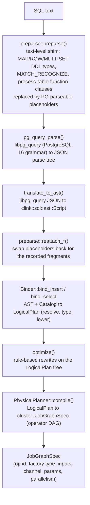

# SQL frontend internals

> How a SQL statement is turned into a `JobGraphSpec` operator DAG: text rewrite, parse, AST, bind, optimise, physical plan.

## Overview

The SQL frontend is a compile-time pipeline. It takes SQL text and produces a `clink::cluster::JobGraphSpec`: a list of operator specs (factory name, inputs, params, channel) that the job manager can submit and run. Nothing in this layer executes records; it only decides which operators to wire together and with what parameters. The pipeline is staged so each stage has one job, and the only runtime dependency, the PostgreSQL grammar in vendored libpg_query, is confined to a single translation unit so the rest of the layer works against clink's own AST. The frontend supports an intentionally narrow but growing subset of streaming SQL; constructs outside the subset are rejected at compile time with a source position, not at deploy or run time.

## Where it lives

| Path | Role |
| --- | --- |
| `include/clink/sql/parser.hpp`, `src/sql/parser.cpp` | `parse()` entry point; wraps preparse + libpg_query + ast_builder; defines `ParseError` / `TranslationError` |
| `include/clink/sql/preparse.hpp`, `src/sql/preparse.cpp` | Text-level rewrite shim for constructs libpg_query cannot grammar-parse |
| `include/clink/sql/ast.hpp` | clink's parser-agnostic AST (`ast::Script`, `Statement`, `SelectStmt`, expression variant) |
| `include/clink/sql/ast_builder.hpp`, `src/sql/ast_builder.cpp` | `translate_to_ast()`: libpg_query JSON parse tree to `ast::Script` |
| `include/clink/sql/catalog.hpp`, `src/sql/catalog.cpp` | `Catalog` and `TableDef`: table name to schema + connector properties |
| `include/clink/sql/type.hpp`, `src/sql/type.cpp` | `sql_type_to_arrow()`: SQL type name to Arrow `DataType` |
| `include/clink/sql/binder.hpp`, `src/sql/binder.cpp` | `Binder`: AST + catalog to `LogicalPlan` (name/type resolution, lowering) |
| `include/clink/sql/logical_plan.hpp`, `src/sql/logical_plan.cpp` | The logical relational node hierarchy |
| `include/clink/sql/expr_lowering.hpp` | Public surface over the binder's expression / predicate / type lowering (shared with the Table API) |
| `include/clink/sql/optimizer.hpp`, `src/sql/optimizer.cpp` | `optimize()`: rule-based rewrite of the logical plan |
| `include/clink/sql/join_reorder.hpp` | Cost-based join reordering used by the optimiser |
| `include/clink/sql/physical_plan.hpp`, `src/sql/physical_plan.cpp` | `PhysicalPlanner::compile()`: logical plan to `JobGraphSpec`; connector mapping |
| `include/clink/sql/install.hpp`, `src/sql/install.cpp` | Registers the Row channel type plus the Row source/sink/operator factories the planner names |
| `include/clink/sql/row.hpp` | `Row` value type, its `Codec<Row>`, and the NDJSON text formats |
| `include/clink/sql/row_kind.hpp` | The `__row_kind` changelog convention on a `Row` |
| `tools/clink_submit_sql.cpp` | The CLI driver that runs the pipeline statement by statement |

## How it works

### Pipeline at a glance

`parse()` (in `src/sql/parser.cpp`) glues the first four stages: it preparses, calls `pg_query_parse`, runs `translate_to_ast`, then runs the three reattach passes, freeing the libpg_query result on every path. The driver in `tools/clink_submit_sql.cpp` then walks the returned `ast::Script` statement by statement: `CREATE TABLE` registers a `TableDef` in the `Catalog`; `INSERT INTO ... SELECT` runs bind, then `optimize`, then `compile`; `DROP TABLE` / `DROP MATERIALIZED VIEW` (object-kind matched via `Catalog::drop_object`, so DROP TABLE refuses a materialized view and vice versa), `SHOW TABLES`, `ANALYZE` and `CREATE MATERIALIZED VIEW` have their own handling. A bare `SELECT` only binds (for `--explain`); it has no stdout sink.

### Stage 1: the preparser shim

libpg_query parses the PostgreSQL 16 grammar, which does not accept a handful of streaming-SQL constructs. Rather than fork the grammar, `preparse::preparse()` runs over the raw SQL text first. It scans for those constructs as balanced-bracket islands, skipping over string literals, dollar-quotes and comments so it never false-matches text inside them, replaces each island with a PG-parseable placeholder, and records the parsed clink fragment in a `PreparseResult`:

- Composite DDL column types `MAP<k,v>`, `ROW<f t, ...>`, `MULTISET<t>` (with nesting and trailing `[]` array dims) become a placeholder type name `__clink_ctype_N`, an identifier libpg_query accepts as an unknown type. The recorded `ast::TypeName` carries the composite structure in its `params` / `field_names`.
- A `<table> MATCH_RECOGNIZE (...)` FROM-clause island becomes a placeholder table reference `__clink_mr_N`. The clause body is parsed structurally into an `ast::MatchRecognizeClause`, with the expression sub-fragments (DEFINE predicates, MEASURES expressions) kept as raw SQL text for the binder to parse later through the normal expression path.
- A `name(TABLE t PARTITION BY ...)` process-table-function island becomes a placeholder table reference `__clink_ptf_N`, recorded as an `ast::ProcessTableFunctionClause`.

After `translate_to_ast` produces the AST, `reattach_composite_types`, `reattach_match_recognize` and `reattach_process_table_functions` walk the `ast::Script` and swap each placeholder back for its recorded fragment. libpg_query and `ast_builder` are otherwise untouched, so the shim is a no-op for SQL that uses none of these constructs.

### Stage 2: parse and AST translation

`pg_query_parse` returns a JSON string parse tree (or an error with a cursor position, surfaced as `ParseError`). `translate_to_ast()` (in `src/sql/ast_builder.cpp`) parses that JSON and walks the `stmts` array, building the clink `ast::Script`. The AST in `include/clink/sql/ast.hpp` is the contract every later stage works against; the libpg_query JSON never escapes `ast_builder.cpp`, which keeps the parser swappable. A statement is an `ast::Statement` variant (`CreateTableStmt`, `SelectStmt`, `InsertStmt`, `DropTableStmt`, `ShowTablesStmt`, `CreateMaterializedViewStmt`, `AnalyzeStmt`, `ExplainStmt`); expressions are an `ast::Expression` variant with `Loc` source positions on every node. A syntactically valid construct that is outside clink's subset is reported as a `TranslationError` (distinct from a `ParseError`), carrying the offending node's 1-based byte offset where libpg_query localised it.

### Stage 3: the catalog and the type bridge

`CREATE TABLE` is not a relational plan, so the binder does not handle it. The driver calls `Catalog::register_table` directly, which translates the `ast::CreateTableStmt` to a `TableDef` and resolves each column type through `sql_type_to_arrow()` (`src/sql/type.cpp`). libpg_query normalises keyword spellings (`BIGINT` to `int8`, `TEXT` to `text`); the bridge maps those canonical names onto Arrow's type system, which is clink's type system on the wire and in storage.

A `TableDef` (`include/clink/sql/catalog.hpp`) holds the column list plus the `WITH (...)` connector properties as a string-to-string map. Convenience accessors read well-known keys: `connector`, `mode` (`append` default, or `upsert`, `cdc`), `delivery_guarantee` (`at_least_once` default, or `exactly_once`), `primary_key`, `commit_group`, plus discriminators for a `connector='lookup'` enrichment table (`is_lookup()`, `lookup_function()`) and a materialised view (`is_materialized_view()`). The catalog is in-memory by default; `set_persistence_dir()` makes register / drop auto-save one JSON file per table under that directory, and `load_from_dir()` reloads them.

### Stage 4: the binder

`Binder` (`src/sql/binder.cpp`) turns an `ast::Statement` into a rooted `LogicalPlan`. `bind_insert()` resolves the sink `TableDef` from the catalog, binds the SELECT subplan, validates that the projected schema is INSERT-compatible with the sink (column count and per-column type, including DECIMAL assignment coercions), and roots the result in a `LogicalSink`. `bind_select()` returns the un-sinked subplan. The binder's responsibilities are:

- Resolve FROM-clause table names against the catalog, and column names against the resolved table's schema. Unknown tables/columns and ambiguous references throw `TranslationError` with the AST position. WITH-clause CTEs are pre-bound and registered as synthetic tables for the lifetime of the outer SELECT (each CTE is at-most-once).
- Infer the Arrow type of every expression and aggregate output. The lowering helpers are exposed through `include/clink/sql/expr_lowering.hpp` so the programmatic Table API lowers through the exact same code.
- Lower expressions to a JSON-IR the runtime evaluator consumes. A value expression becomes a `{"col"|"lit"|"op"}` tree (`lower_value_expr`); a boolean predicate becomes an `eq/lt/and/or/not/...` tree (`lower_predicate`) matching the format the runtime's `filter_row_predicate` / `json_predicate` op expects.
- Pattern-match SQL shapes onto specific logical nodes. Beyond `LogicalScan` / `LogicalProject` / `LogicalFilter` / `LogicalSink`, the binder produces `LogicalAggregate` (unbounded GROUP BY), `LogicalWindowAggregate` (TUMBLE / HOP / SESSION / CUMULATE window TVFs), `LogicalEquiJoin` and `LogicalIntervalJoin` and `LogicalLookupJoin`, `LogicalSemiJoin` and `LogicalScalarBroadcast` / `LogicalScalarProject` (IN / EXISTS / scalar subqueries), `LogicalOverAggregate` and `LogicalLastNAgg` (OVER aggregates), `LogicalTopNPerKey` (the `ROW_NUMBER() OVER (...) WHERE rn <= N` shape), `LogicalTopN` / `LogicalLimit`, `LogicalDistinct`, `LogicalUnion` / `LogicalSetOp`, `LogicalAsyncMap`, `LogicalMatchRecognize` and `LogicalProcessTableFunction`. Each node carries its own `schema()` and exposes children via `inputs()`.

Bind timing and counters are recorded through `clink::metrics::sql` (`clink_sql_binds_total`, `clink_sql_bind_errors_total`, `clink_sql_bind_duration_ns`).

### Stage 5: the rule-based optimiser

`optimize()` (`src/sql/optimizer.cpp`) is a sequence of semantics-preserving rewrites on the `LogicalPlan` tree, applied in this order:

1. Predicate pushdown: relocate single-side WHERE conjuncts below an INNER equi/interval join, or below the probe side of a lookup join, into the matching scan, de-aliased to the raw column. The residual conjuncts stay in the original filter (an empty `and` is the vacuously-true pass-through).
2. Cost-based join reordering (`join_reorder.hpp`), using per-relation cardinality that reflects the pushed-down predicates.
3. Projection pushdown: walk top-down, union the columns each consumer references, and annotate the source `LogicalScan` with that set via `set_projected_columns()`. The physical planner threads this through as a `projected_columns` connector param; the Row file source drops unreferenced columns at decode. The analysis always unions the table's `event_time_column` and preserves the synthetic `__row_kind` marker so narrowing never starves a downstream op.

The optimiser never throws on a valid bound plan. A pass that throws is a planner bug: `optimize()` catches it, increments `clink_sql_optimize_errors_total`, logs a warning, and returns the un- or partially-optimised plan (still valid and runnable). The single residual case, a `std::bad_alloc` mid-reorder that leaves a null child, is rejected later by the physical planner's null-child backstop as a clean compile error rather than a crash.

### Stage 6: the physical planner

`PhysicalPlanner::compile(const LogicalSink&)` (`src/sql/physical_plan.cpp`) walks the logical tree and emits a `cluster::JobGraphSpec`. It first runs `require_no_null_children` as a backstop, then `decide_channel` picks the wire channel from the source-side scan and cross-checks it against the sink, then `compile_node` recurses, then `mark_changelog_producers` runs a post-pass, then `spec.validate()`.

Every operator on one chain speaks the same channel. `channel_for_table` chooses it: a table with `format='json'` or more than one column uses `Channel::Row` (the dynamic-schema `Row` value type); a single TEXT/VARCHAR column with no `format='json'` uses `Channel::String`. A multi-column table without `format='json'`, or a multi-column string-channel table, is a compile error. The channels are registered in `install.cpp`: the `"row"` channel binds `Row` to `row_json_codec()` (per-record JSON wire) and `make_row_wire_batcher`.

`compile_node` dispatches on `node.kind()`. Each node emits one or more `OperatorSpec`s (a unique id, a factory `type` name, the upstream input ids, an `out_channel`, and a string param map) and returns the id of its output op so the parent can wire its `inputs`. Examples of the mapping: `LogicalProject` to `project_row`, `LogicalFilter` to `filter_row_predicate` (params carry the lowered predicate JSON), `LogicalAggregate` to `aggregate_row`, a window aggregate to the window op, a join to `equi_join_row` / the interval join op, keyed nodes to a `row_compute_key` keyer plus `key_by` on the stateful op. When a source table declares an `event_time_column`, `maybe_emit_assign_timestamps` inserts an `assign_timestamps_row` op right after the scan, threading `watermark_lag_ms` through as `out_of_order_ms`.

#### Connector mapping and the row/JSON bridge

A `LogicalScan` / `LogicalSink` names a connector via its `connector='...'` property. The planner maps that name to a registered factory:

- On the string channel, `string_source_factory_for` / `string_sink_factory_for` return the factory name directly, for example `connector='file'` to `file_text_source` / `file_text_sink`, `connector='kafka'` to `kafka_source_string` / `kafka_sink_string`, and so on for the other connectors. The factory must be linked into the runtime; an unknown connector is a compile error, and a missing-but-known connector fails at deploy time.
- On the Row channel, `row_source_binding_for` / `row_sink_binding_for` return a `RowConnectorBinding`: the connector op factory name, that op's channel, and an optional `bridge_op`. When the connector natively speaks Row (for example `file_json_source` / `file_json_sink`, or the typed-columnar `parquet_row_source`) the bridge is empty. When the connector is string-backed (Kafka, RabbitMQ, NATS, Pulsar, Kinesis, Redis, the JDBC and CDC sources, and so on) the planner emits the native string-channel op and then a `json_string_to_row` Map op to decode each JSON body into a `Row` (and `row_to_json_string` on the sink side). A Kafka table can set `columnar_decode='true'` to swap the bridge for `json_string_to_row_columnar`, which attaches an Arrow sidecar so the columnar fast paths can fire.

`Row` itself (`include/clink/sql/row.hpp`) is a JSON object of column name to value; its codec is plain UTF-8 JSON on the per-record wire, which keeps the wire schema-decoupled and human-readable. The `connector='...'` WITH-options the planner does not consume itself are passed through to the op as build params.

#### The `__row_kind` changelog convention

Changelog-producing operators (TOP-N-per-key, retracting aggregates, CDC sources) tag each emitted `Row` with a synthetic `__row_kind` field whose value is `insert` / `delete` / `update_before` / `update_after` (`include/clink/sql/row_kind.hpp`). Records without the field are implicit inserts. Pass-through ops that copy the whole `Row` preserve it; `project_row` special-cases it so a projection that does not list it still carries it through. After `compile_node`, `mark_changelog_producers` walks back from each changelog-consuming op (a netting/upsert sink, a retraction-aware join, or a stacked aggregate) through changelog-preserving pass-throughs and sets `emit_changelog=true` on the first `aggregate_row` it reaches, so an aggregate whose output only ever reaches append sinks is left emitting plain snapshots.

### MATCH_RECOGNIZE lowering onto the CEP engine

`MATCH_RECOGNIZE` is recognised structurally by the preparser, reattached as an `ast::MatchRecognizeClause`, then lowered in two steps. `Binder::bind_match_recognize` resolves the input table, validates the PARTITION BY and ORDER BY columns, builds the pattern step list (each `PatternVar` carries `min_count` / `max_count` from the quantifier), parses each DEFINE predicate through the normal expression path and lowers it to `json_predicate` IR, and resolves each MEASURES expression to a `FIRST` / `LAST` of a `var.col` reference. ONE ROW PER MATCH means the output schema is the partition-key columns followed by the measure columns. The result is a `LogicalMatchRecognize`.

The physical planner lowers that node to a `row_compute_key` keyer (when PARTITION BY is present) feeding a `match_recognize_row` op, with the pattern, defines and measures serialised into the op's params as JSON arrays. At runtime (`src/sql/install.cpp`) the `match_recognize_row` factory rebuilds a `clink::cep::Pattern<Row>` from those params and drives a `clink::cep::CepOperator<Row, Row>`: the DEFINE predicates become the per-variable accept conditions, the quantifiers become the pattern's repetition, and a select function emits one `Row` per match carrying the partition keys and the resolved FIRST/LAST measures. The v1 subset (PARTITION BY columns, a single event-time ORDER BY column, a linear greedy PATTERN with `+ * ? {n} {n,m}` quantifiers, simple per-row DEFINE predicates, ONE ROW PER MATCH, AFTER MATCH SKIP PAST LAST ROW) is documented in `ast.hpp`. The process-table-function clause lowers the same way onto a registered keyed `KeyedProcessFunction`-style op (`process_table_function_row`).

## Key types and APIs

| Type / function | Responsibility |
| --- | --- |
| `clink::sql::parse(std::string_view)` | Full text-to-AST front: preparse, libpg_query, ast_builder, reattach |
| `preparse::preparse()` / `reattach_*` | Text-level island rewrite and post-parse restore |
| `ast::Script`, `ast::Statement`, `ast::Expression` | The parser-agnostic AST |
| `Catalog`, `TableDef`, `ColumnSpec` | Table name to schema + connector properties |
| `sql_type_to_arrow()` | SQL canonical type name to Arrow `DataType` |
| `Binder::bind_insert()` / `bind_select()` | AST + catalog to a rooted / un-rooted `LogicalPlan` |
| `lowering::value_expr` / `predicate` / `expr_type` | Expression / predicate / type lowering shared with the Table API |
| `LogicalPlan` and subclasses | Logical relational algebra; each node has `kind()`, `schema()`, `inputs()`, `explain()` |
| `optimize(std::unique_ptr<LogicalPlan>)` | Predicate pushdown, join reorder, projection pushdown |
| `PhysicalPlanner::compile(const LogicalSink&)` | Logical plan to `cluster::JobGraphSpec` |
| `Row`, `row_json_codec()`, `kChannelRow` | The dynamic-schema row value, its wire codec, and its channel id |
| `kRowKindField`, `set_row_kind()`, `row_kind_of()` | The `__row_kind` changelog convention |
| `ParseError` / `TranslationError` | Syntax error vs out-of-subset error, both with a cursor position |

## Configuration and knobs

- `PhysicalPlanner::set_async_state_for_aggregation(bool)` (default off). When on, unbounded GROUP BY `aggregate_row` ops are marked `async_state=true`, so they hold per-group state in keyed state and take the async-read path when the backend can defer reads. See [./async-state-execution.md](./async-state-execution.md).
- Table `WITH (...)` options the planner reads: `connector` (required), `format='json'` (forces the Row channel), `event_time_column` and `watermark_lag_ms` (emit `assign_timestamps_row`), `mode` (`append` / `upsert` / `cdc`), `delivery_guarantee` (`at_least_once` / `exactly_once`), `primary_key`, `commit_group`, `partition_by` (file partitioning sink), and `columnar_decode='true'` on a Kafka Row source.
- `clink_submit_sql` driver flags: `--file` / `-e`, `--catalog-dir` (load + auto-persist the catalog), `--parallelism` / `-p` (uniform per-op parallelism, applied after compile), `--explain` (print the bound `LogicalPlan` instead of the spec), and `--jm-host` / `--jm-port` (POST the spec to a running job manager rather than printing it).
- Metrics under `clink::metrics::sql`: `clink_sql_parses_total`, `clink_sql_parse_errors_total`, `clink_sql_binds_total`, `clink_sql_bind_errors_total`, `clink_sql_optimizes_total`, `clink_sql_optimize_errors_total`, `clink_sql_physical_plans_total`, plus the `*_duration_ns` pairs for bind / optimise / physical-plan timing.

## Guarantees and caveats

- The supported SQL subset is narrow and deliberately so. Any syntactically valid construct outside it is rejected at compile time as a `TranslationError` with a source position, never silently accepted or deferred to runtime.
- Schema-qualified table and column names are rejected by the binder.
- Channel typing is strict: source and sink tables of one query must agree on string vs Row channel; there are no implicit conversions, and the planner errors before deploy if they differ. A multi-column table must declare `format='json'`.
- Unbounded stateful operators retain state with no TTL in v1. The stream-stream `LogicalEquiJoin` keeps every record seen on each side forever; `LogicalDistinct` and unbounded GROUP BY keep their per-key state unbounded. These are suited to bounded sources or snapshot-style joins; long-running streams need TTL or changelog semantics that are not yet wired.
- `LogicalLimit` is per-subtask: at parallelism greater than one each subtask may emit up to `n` records, so global `LIMIT` semantics require a single-source pipeline.
- The optimiser is best-effort and self-protecting: a buggy pass falls back to the valid (un- or partially-optimised) plan rather than failing the query, and the worst case (OOM mid-reorder) surfaces as a clean compile error via the null-child backstop, never a crash.
- A named connector factory must be linked into the runtime. The planner emits the correct factory name, but if the impl is not linked, submission fails at job-deploy time, not at compile time.
- The `Row` wire format is per-record JSON. It is debuggable and schema-decoupled but is not the columnar fast path; the columnar fast paths fire only from a columnar-native source or a Kafka source with `columnar_decode='true'`. See [./columnar-execution.md](./columnar-execution.md).
- MATCH_RECOGNIZE and the process-table-function clause require the Row channel (`format='json'`); they are rejected on the string channel.

## Related

- [./operator-model.md](./operator-model.md) - the operator and DAG model the `JobGraphSpec` targets
- [./time-and-windowing.md](./time-and-windowing.md) - watermarks, window TVFs, and the CEP engine that MATCH_RECOGNIZE lowers onto
- [./columnar-execution.md](./columnar-execution.md) - the Arrow-native columnar path and where the Row channel does or does not use it
- [./async-state-execution.md](./async-state-execution.md) - the async-state aggregation path enabled by `set_async_state_for_aggregation`
- [./state-and-backends.md](./state-and-backends.md) - keyed state behind the stateful logical nodes
- [../connectors/README.md](../connectors/README.md) - the source and sink connectors the `connector='...'` mapping targets
