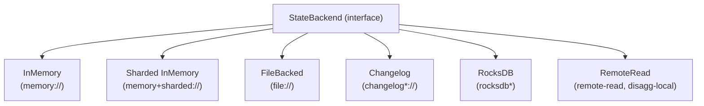
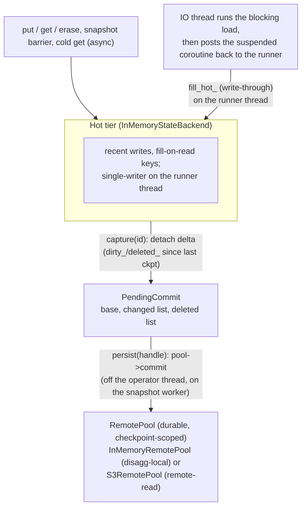

# Keyed state and state backends

> How operators store per-key and per-operator state, the pluggable backends that hold it, and how that state is snapshotted, restored, queried and disaggregated.

## Overview

State in clink is keyed: every keyed operator (window, join, aggregate, custom) reads and writes a value per key. The runtime models all state as opaque serialized byte strings behind a single `StateBackend` interface, and operators reach it through typed views (`KeyedState<K,V>`, `BroadcastState<V>`, and the collection types in `typed_state.hpp`) that own `Codec<T>`s and (de)serialize on the way in and out. Several backends implement the interface with different durability and performance characteristics, selected by URI scheme through a process-wide factory. Snapshots are Apache Arrow IPC streams for the in-memory family and native checkpoint dirs for RocksDB. A two-tier `RemoteReadBackend` adds a hot in-memory tier over a durable remote pool so working state can exceed RAM, and a queryable-state layer exposes a slot for external reads over HTTP.

## Where it lives

| Path | What |
| --- | --- |
| `include/clink/state/state_backend.hpp` | The `StateBackend` abstract interface: put/get/erase, scan, snapshot/restore, the async read and async-persist hooks, operator-state prefixing |
| `include/clink/state/keyed_state.hpp` | `KeyedState<K,V>` typed view, key encoding, TTL, `get_async`/`get_many_async` |
| `include/clink/state/broadcast_state.hpp` | `BroadcastState<V>` over the operator-state path |
| `include/clink/state/typed_state.hpp` | `ListState`, `MapState`, `AggregatingState`, `ReducingState` (thin wrappers over a `KeyedState` slot) |
| `include/clink/state/in_memory_state_backend.hpp`, `src/state/in_memory_state_backend.cpp` | Default backend; Arrow IPC snapshot format |
| `include/clink/state/sharded_in_memory_state_backend.hpp` | Key-group-sharded in-memory variant (`memory+sharded://`) |
| `include/clink/state/file_backed_state_backend.hpp` | In-memory working copy with on-disk Arrow IPC snapshots |
| `include/clink/state/changelog_state_backend.hpp`, `src/state/changelog_state_backend.cpp` | Write-ahead log + periodic materialisation |
| `impls/rocksdb/include/clink/state/rocksdb_state_backend.hpp` | RocksDB backend with native SST checkpoints |
| `include/clink/state/remote_read_backend.hpp` | Two-tier hot + remote backend |
| `include/clink/state/remote_pool.hpp` | `RemotePool` durable tier interface + `InMemoryRemotePool` |
| `include/clink/state/snapshot_store.hpp` | `SnapshotStore` seam for where checkpoint dirs are published |
| `include/clink/state/coalescing_backend.hpp` | Read-coalescing decorator (`CoalescingBackend`) |
| `include/clink/state/state_backend_factory.hpp`, `src/state/state_backend_factory.cpp` | URI-scheme -> backend builder registry |
| `include/clink/state/schema_version.hpp` | `StateVersionMap`, `SchemaVersionTrait`, `StateMigrationRegistry` |
| `include/clink/runtime/runtime_context.hpp` | `RuntimeContext::keyed_state`/`broadcast_state`/`list_state`/... factories operators call in `open()` |
| `include/clink/runtime/key_groups.hpp` | Key-group hashing and ranges (the rescale partitioning primitive) |
| `include/clink/queryable_state/` | HTTP registry (`registry.hpp`), TM routes (`server.hpp`), JM routing (`jm_routes.hpp`), binding helpers (`bind.hpp`) |

## How it works

### The backend interface

`StateBackend` (`state_backend.hpp`) is the one abstraction over keyed-state storage. The core surface is per-`(OperatorId, key)`:

```
put(op, key, value)            get(op, key) -> optional<Value>
erase(op, key)                 scan(op, visitor)
snapshot(id) -> Snapshot       restore(snapshot, kg_filter)
```

Keys and values are byte strings (`std::string_view` in, `std::vector<std::byte>` out); the backend is deliberately schema-agnostic, so the typed layer above it owns all (de)serialization. `OperatorId` namespaces every entry so one backend instance can hold the state of several fused operators.

Two opt-in extensions sit on the base interface, both default-off so a plain backend works unchanged:

- An asynchronous read surface: `supports_async_get()`, `get_async()` (single key, plus a deadline-aware 3-argument overload tagging the read with an `order_key`), and `get_many_async()` (batched). The base `get_async` is `co_return get(op, key)`, so every backend is async-correct in a single resume with no override. Backends whose reads can genuinely block override these and return `true` from `supports_async_get()`. The runner wires completion hand-back via `set_async_resume_scheduler` / `set_deadline_resume_scheduler`. See [./async-state-execution.md](./async-state-execution.md) for the execution mechanics.
- An asynchronous checkpoint split: `supports_async_persist()`, `capture(id)` (cheap, on the operator thread, produces a detached `CaptureHandle`), and `persist(handle)` (slow durable write, off-thread on the snapshot worker). The invariant is that a checkpoint is only ack'd as durable after `persist()` returns, never after `capture()` alone. `snapshot()` must remain equal to `persist(capture(id))` for callers that do not use the split. See [./checkpointing.md](./checkpointing.md).

### Operator-state vs keyed state

State with no key (source offsets, broadcast slots) goes through `put_operator_state` / `get_operator_state` / `scan_operator_state`, which store under the same primitives but prepend a reserved leading byte `kOperatorStateKeyPrefix` (`0xFF`, defined in `key_groups.hpp`). Because that byte is `>= kNumKeyGroups` it can never be mistaken for a key group, so the rescale restore filter (below) never narrows operator-state rows: every subtask restores them whole, which is the broadcast/union semantics those rows need. `get_operator_state` also falls back to the raw (unprefixed) key so checkpoints taken before prefixing still load.

### Typed views and key encoding

`KeyedState<K,V>` (`keyed_state.hpp`) is what operators hold. It owns a key codec, a value codec, a slot name, and an optional `TtlConfig`. The stored key layout is:

```
[ kg_byte ][ slot_name ][ '|' ][ user_key_bytes ]
```

The leading byte is the FNV-1a-derived key group computed over the user key bytes only (`key_group_for_key`). A single-byte compare therefore lets any backend filter by key-group range at restore without knowing the user codec or slot names. The `'|'` separates the slot namespace from the user key, so several keyed-state slots in one operator never collide; slot names containing `'|'` or `'\n'` are rejected (`validate_slot_name_`) because both are reserved delimiters. The hot put/get path reuses `thread_local` scratch buffers and a codec `encode_into` to avoid per-record heap allocation.

TTL is per-slot. When enabled, each value is stored as `[8B expire-at-ms LE][user value bytes]`; `refresh_on_write` (the default) resets the expiry on every put, `refresh_on_read` also resets it on get. Expired entries are not reported by get/scan and are lazy-purged on first observation; there is no background sweep.

`BroadcastState<V>` stores a single value at the fixed key `<slot>|` through the operator-state path. The collection types in `typed_state.hpp` (`ListState`, `MapState`, `AggregatingState`, `ReducingState`) are thin wrappers over one `KeyedState` slot that serialize the whole collection as a single value per key, so add/put is a read-modify-write that is O(collection size). They inherit key encoding, TTL and snapshot/restore from `KeyedState` unchanged.

Operators never construct these directly: they call `RuntimeContext::keyed_state<K,V>(slot, kc, vc)` (and the `broadcast_state` / `list_state` / `map_state` / `aggregating_state` / `reducing_state` variants) in `open()`. Those throw if no state backend is configured for the job.

### The backends



- **InMemoryStateBackend** (`memory://`, the default): a nested hash map under one mutex, with heterogeneous (string_view) lookup so the hot path never builds a `std::string` just to probe. `snapshot()`/`restore()` are Arrow IPC (see below). Fine for tests, examples and small workloads; state is lost on process death unless a wrapping backend persists it.
- **ShardedInMemoryStateBackend** (`memory+sharded://`): splits state across `kNumShards = 16` independent `InMemoryStateBackend` shards, routed by the leading key byte (the key group), each with its own mutex, removing the single-mutex contention for concurrent keyed access. Snapshots are byte-compatible with the mono backend (it merges the per-shard Arrow blobs), so it is a drop-in. A skewed key set still serializes on one shard.
- **FileBackedStateBackend** (`file://<dir>` or a bare path): delegates put/get/erase/scan to an inner `InMemoryStateBackend` and persists snapshots to `<dir>/checkpoint-<id>.snap`. `restore()` reads that file back; a missing file leaves the backend empty. Writes go through `write_fsync_rename` (a temp file, fsync, atomic rename, dir fsync) so a crash mid-write can never leave a partial checkpoint that restore would load. It supports the async-persist split: `capture()` serialises a detached blob, `persist()` does the durable write off-thread.
- **ChangelogStateBackend** (`changelog://`, `changelog+file://<dir>`, `changelog+rocksdb`): wraps an inner backend and keeps a write-ahead log of every mutation. A snapshot embeds the most-recent materialisation plus the log delta since it; reads pass straight through to the inner backend (the log is write-side only). Materialisation fires automatically when the log byte estimate crosses `materialization_threshold_bytes` (default 64 KiB) or on `materialize_now()`. Two materialisation storage modes: in-blob (materialisation and log both inside the `Snapshot` bytes, the default) and external store (the inner snapshot bytes go to an `ExternalMaterializationStore` and only the handle is embedded, keeping snapshots small as state grows). Optional in-place log compaction (default on) makes a repeated mutation to the same key replace its log entry instead of appending.
- **RocksDBStateBackend** (`rocksdb`, `changelog+rocksdb`): keyed state in a RocksDB instance. Always built (bundled via `FetchContent`). Checkpoints are RocksDB-native, not Arrow: `snapshot()` hard-links the live immutable SSTs into a per-checkpoint dir, so unchanged SSTs share one physical file across checkpoints (incremental space cost) and each checkpoint dir is a complete, openable instance. `last_snapshot_stats()` exposes the per-checkpoint SST list and the shared-SST count for sizing incremental storage. State-as-data: `export_arrow_snapshot()` renders the live contents as the canonical Arrow IPC snapshot stream (point-in-time via a RocksDB snapshot, ops ascending, keys in byte order), and the free function `rocksdb_checkpoint_to_arrow(dir)` does the same for a checkpoint directory opened read-only - so RocksDB-held state is readable by any Arrow consumer and by every snapshot-format tool, while the native SST checkpoint path stays untouched. When CMake cannot find RocksDB the `.cpp` compiles a stub that throws on construction; the public ABI is identical either way.
- **RemoteReadBackend** (`remote-read://...` on S3, `disagg-local://`): the two-tier disaggregated backend, covered in its own section below.

### The Arrow IPC snapshot format

The format is a stable public contract, documented in full (key encoding, metadata, derived projections, evolution policy) in [./state-snapshot-format.md](./state-snapshot-format.md); this section summarises it.

InMemory, Sharded, FileBacked and Changelog all share one on-disk snapshot encoding. `InMemoryStateBackend::snapshot()` writes an Arrow IPC stream of one RecordBatch with three columns:

```
op_id        : uint64    (operator id)
key_bytes    : binary    (full encoded key: kg byte + slot|user-key)
value_bytes  : binary    (raw value bytes, opaque to the backend)
```

One row per `(op, key)` entry; an empty backend produces a valid zero-row stream. The schema's `arrow::KeyValueMetadata` carries an optional `clink.state_versions` entry holding the packed `StateVersionMap` so any Arrow consumer (and tooling such as `clink_check_savepoint`) can read the versions. Because it is plain Arrow IPC the files are readable by pyarrow, DuckDB, Polars and the like. `ChangelogStateBackend` uses the same encoding with an extra leading `row_kind : uint8` column distinguishing materialisation (0), put (1) and erase (2); restore replays the materialisation first then applies log rows in order. FileBacked stores the inner InMemory blob in its `.snap` file. Every producer of the format routes through one writer (`SnapshotArrowWriter`, `include/clink/state/snapshot_arrow_writer.hpp`), so the bytes agree by construction. RocksDB checkpoints remain native SST directories (incremental hard-link cost is the point), but its live backend and any checkpoint dir render to this same format on demand via the Arrow export above - so there is no state a standard Arrow reader cannot open. The `StateVersionMap` rides RocksDB checkpoints too: `set_state_versions` writes the packed map under a reserved key in the DEFAULT column family (which the keyed path never touches), so every checkpoint carries it, restore recovers it, and both Arrow exports embed it in the stream's schema metadata - `check-savepoint` and migrate-at-restore see real stamps on RocksDB-backed jobs.

### Key groups and rescale restore

Rescale partitioning lives in `key_groups.hpp`. Every keyed record is bucketed into one of `kNumKeyGroups = 128` groups by `key_group_for_key` (FNV-1a mod 128), and the owning subtask is `key_group * parallelism / kNumKeyGroups` (contiguous ranges, so a rescale moves only the groups in the non-overlapping slices). `restore()` takes a `KeyGroupRange{first, last}` filter; the default `{0, kNumKeyGroups}` accepts every group (plain same-parallelism restore), while a rescale narrows it so each new subtask loads only its assigned slice. Because the key group is the leading byte of every stored keyed key, a backend filters with a single byte compare; operator-state rows (leading byte `0xFF >= kNumKeyGroups`) are always kept. `combine_snapshots` folds several parent snapshots into one for scale-down (InMemory merges the IPC streams, RocksDB joins the checkpoint dirs). The factory and runtime drive these paths; see [./fault-tolerance-and-rescale.md](./fault-tolerance-and-rescale.md).

### The factory and URI schemes

`StateBackendFactory` (`state_backend_factory.hpp`) is a process-wide registry mapping a URI scheme to a builder closure. It consumes a `StateBackendSpec` (working `uri`, `subtask_idx`, `restore_uri`, `restore_checkpoint_id`, and the rescale knobs `restore_from_subtask_idx` / `restore_from_parent_count`) and returns a `BuiltStateBackend` (the `shared_ptr<StateBackend>` plus an optional `restore_from` Snapshot the caller forwards to `JobConfig::restore_from`). A bare path is treated as `file://`; an empty URI is `memory://`. Core pre-registers `memory`, `memory+sharded`, `file`, `changelog`, `changelog+file` and `disagg-local`; the RocksDB impl adds `rocksdb` and `changelog+rocksdb` via `register_scheme` at startup, and the S3 impl adds `remote-read`. The file builder mints a per-subtask sub-directory (`<base>/<subtask_idx>`) and, on rescale, copies and merges the assigned parents' snapshot files (unioning operator-state rows from the other parents) into the new working dir before restore.

### RemoteReadBackend: the two-tier disaggregated model

`RemoteReadBackend` (`remote_read_backend.hpp`) holds state in two tiers: a hot `InMemoryStateBackend` (recent writes plus filled-on-read keys) and a cold remote tier. A hot key reads immediately; a cold key is fetched from the remote tier. It has two constructions:

- Loader-only: cold reads run a pluggable `RemoteLoader`; snapshot/restore capture the hot tier only, with no durable remote write-back. Used for read-through caching over an external loader and for tests.
- Pool-backed (production disaggregation): state lives in a durable `RemotePool` (`remote_pool.hpp`). The `disagg-local://` scheme uses a process-local `InMemoryRemotePool`; the `remote-read://` scheme uses the S3-backed pool. Cold reads fetch `(op, key)` from the pool as-of the current committed checkpoint, a snapshot commits only the delta since the last checkpoint (state is off the checkpoint-barrier path), and restore is lazy (cold reads serve the restored checkpoint, nothing is loaded eagerly), which is the fast-recovery and fast-rescale win.



The async-persist split is the production lever. `capture(id)` runs on the operator thread under the backend mutex and detaches the delta (the `dirty_` and `deleted_` sets since the last checkpoint) into a `PendingCommit` keyed by checkpoint id, pinning the captured keys (ref-counted `persisting_dirty_` / `persisting_deleted_`) so a read during the commit window still sees this checkpoint's effect rather than cold-loading the stale pre-delta value. `persist(handle)` does the slow `pool->commit` off the operator thread on the snapshot worker, then advances `last_ckpt_` (the checkpoint cold reads load from) and releases the pins. Two counters separate the windows: `last_captured_` (the next delta's base, advanced in `capture`) and `last_ckpt_` (the committed checkpoint, advanced in `persist`); they differ exactly during an in-flight async persist.

The single backend instance is shared by every runner of a fused subtask, so the state writer and the checkpoint owner can be different threads; `sync_mu_` guards the working set (`hot_`, `dirty_`, `deleted_`, the LRU bookkeeping) so the owner's snapshot cannot race a writer's `dirty_` inserts and silently drop them. The async cold-read path never holds that lock across the blocking load: the IO thread only runs the loader (touching `pool_` and `last_ckpt_`, never the guarded set), and the write-through (`fill_hot_`) re-takes the lock back on the runner thread, keeping the hot tier single-writer.

Hot-tier eviction makes working state genuinely exceed RAM. With a non-zero `hot_max_bytes` budget, once over budget the LRU clean keys (those already durable in the pool at the last committed checkpoint) are evicted and re-fetched on next read. Dirty and pinned keys are never evicted, because the pool does not yet hold their latest value, so eviction never loses state; if every over-budget key is pinned the tier transiently exceeds budget and the next snapshot reclaims it. The futile skip-scan past pinned keys is capped at `kMaxPinnedSkips = 256` so a write burst stays O(n) on the runner thread rather than O(n^2); productive evictions are uncapped.

`RemotePool::commit` takes `(id, base, changed, deleted)` and builds each checkpoint incrementally: unchanged keys are inherited from `base`. `read`/`read_many` run on the backend's IO threads and must be thread-safe. `prepare_restore(restore_cp, kg)` lets a pool materialise a checkpoint under this subtask's own location on a rescale or cross-location relocate (merge the parent checkpoints, key-group-filter, relocate objects, write the merged manifest) so the first post-restore incremental commit inherits the full assigned state.

### Queryable state

Queryable state exposes keyed operator state for external reads over HTTP - a serving surface for live state, not just plumbing. Two tiers:

**Byte-level slots** (custom operators, codecs agreed out of band):

- `queryable_state::Registry` (`registry.hpp`): a process-wide map from slot name to a byte-level `Lookup` closure (`key bytes -> optional value bytes`). `register_slot` / `unregister_slot` / `lookup` / `has_slot` / `slots`, guarded by a shared mutex; the closure is copied out before it runs so it can take its own locks. `Registry::global()` is the instance the TaskManager's routes serve; operators bind into it.
- `bind_keyed_state` (`bind.hpp`): wires a `KeyedState<K,V>` into a registry slot; the closure decodes the inbound key bytes via the K codec, hits the slot through the operator's encode-key path, and encodes the value back via the V codec. `bind_keyed_state_for_subtask` composes a `(role, subtask_idx, slot)` triple so subtasks of one op on the same TM do not collide.
- `register_routes` (`server.hpp`): adds TM HTTP routes. `GET /api/v1/queryable_state` lists byte and JSON slots; `GET /api/v1/queryable_state/:slot?key=<hex>` looks one up; a subtask-scoped route mirrors it under `/op/:role/subtask/:subtask/slot/:slot`. Key and value bytes are lowercase-hex on the wire.
- `register_jm_routes` (`jm_routes.hpp`): JM-side discovery and key routing. `/job/:job_id/tms` lists the TMs hosting the job; `/job/:job_id/op/:role/route?key=<hex>` computes `key_group_for_key` and returns the single subtask responsible (host, port, subtask_idx) plus a `topology_version`; `/job/:job_id/topology_version` is a cheap poll clients use to detect rescales and invalidate cached routes.

**JSON serving slots** (the zero-code surface SQL state uses):

- `Registry` holds a parallel map of `JsonLookup` closures (`key string -> optional JSON document`): `register_json_slot` / `lookup_json` and friends. No codec agreement, no hex.
- The SQL `aggregate_row` operator (unbounded GROUP BY, in-memory path) **binds automatically**: at `open()` it registers a JSON slot at `(deployment role, global subtask, "agg")` when the runner identity is present, and unregisters at `close()`. The served value is the key's current FINALISED output row (group columns + aggregate results) - what a downstream consumer would see - built on demand from the live bucket. Lookups run on the TM's HTTP thread against operator-thread state, so the fold paths and the closure share a serving mutex the hot path takes once per batch (not per record). Keys are the operator's composite group-key string; for the common single-TEXT-key GROUP BY the closure also accepts the bare string (it retries it JSON-quoted).
- TM route: `GET /api/v1/queryable_state/op/:role/subtask/:subtask/json/:slot?key=<string>` returns `{"key":"...","value":{...}}`.
- JM one-call serving route: `GET /api/v1/queryable_state/job/:job_id/op/:role/json/:slot?key=<string>` fans the lookup out across the role's subtasks (in subtask order) and relays the first hit - correct at any parallelism without reproducing the shuffle's key hashing JM-side; the key-group `/route` fast path remains for latency-sensitive clients. Keys must be URL-safe.
- Scans (state-as-table): the registry's `JsonScan` closures return up to `limit` (key, value) entries plus a `truncated` flag. TM route `.../json/:slot/scan?limit=N` (default 1000, clamped to 100000 - a scan holds the operator's serving lock for its duration, so reads are bounded snapshots, not cursors); the JM's `.../op/:role/json/:slot/scan` merges every subtask's scan in subtask order. The SQL source `connector='queryable_state'` reads the JM scan route and emits one Row per key, so one job can SELECT from (or join against) another job's live state - see [the built-in connectors page](../connectors/builtin.md).
- Arrow bulk reads (`arrow_scan.hpp`): the same scans as ONE Arrow IPC stream over plain HTTP - `.../scan.arrow?limit=N` on both the TM (subtask-scoped) and the JM (fanned out and merged). The body is directly readable by pyarrow / polars / duckdb (`Content-Type: application/vnd.apache.arrow.stream`; truncation rides the `X-Clink-Truncated` header since the body is binary). Schema: `__key` utf8 plus the value documents' fields, kinds inferred from the first entry (number -> float64 - JSON numbers are doubles - bool -> bool, string -> utf8, anything else -> utf8 of the serialised JSON; a missing or differently-kinded field in a later row becomes null). Deliberately NOT Arrow Flight: serving state adds no gRPC dependency. The routes register via `register_arrow_scan_route` / `register_jm_arrow_scan_route`, kept out of `server.hpp`/`jm_routes.hpp` so only Arrow-serving binaries pay for the Arrow includes.
- Live whole-job export (`live_export.hpp`): `GET /api/v1/state/export/job/:job_id` on the TM merges every hosted subtask backend's live Arrow export for the job into one canonical state-snapshot stream (`TaskManager::export_job_state_arrow`, served off the checkpoint-registered `per_job_backends_`); the same path on the JM fans out across every TM hosting the job (`tms_hosting_job`) and merges their streams. Per-subtask atomic, NOT a checkpoint-consistent global cut (no barrier alignment) - use a savepoint where cross-subtask consistency matters. The pool-backed `RemoteReadBackend` exports its COMPLETE live view - the last durably-committed pool checkpoint enumerated via `RemotePool::scan_checkpoint` (implemented by the in-memory and S3 pools; one object GET per distinct content hash on S3), overlaid with the hot tier's dirty writes and masked by erased keys, mirroring `get()`'s precedence exactly. Only the loader-only construction refuses (no enumerable durable tier); refusals are counted in the TM response's `X-Clink-Skipped-Subtasks` header rather than silently omitted. `clink state-export --job=<id> [--jm=host:port]` and `clink state-query --job/--jm` consume the JM route.
- Identity plumbing: the DeploymentTask role + global subtask index travel `RunnerContext.runner_role` -> `JobConfig` -> `RuntimeContext::set_runner_identity`, so an operator binds under exactly the address the JM routes clients to. In-process/legacy paths carry no role and operators skip binding.
- Production wiring: `clink_node` registers the TM routes (against `Registry::global()`) and the JM routes whenever `--http-port` is set.

## Key types and APIs

| Type / function | Responsibility |
| --- | --- |
| `StateBackend` | Abstract keyed-state storage: put/get/erase, scan, snapshot/restore, optional async read + async-persist hooks, operator-state prefixing |
| `KeyedState<K,V>` | Typed per-key view with codecs, slot namespace, key-group key encoding, TTL, sync `get`/`put` and async `get_async`/`get_many_async` |
| `BroadcastState<V>` | Single value per `(operator, slot)` over the operator-state path |
| `ListState` / `MapState` / `AggregatingState` / `ReducingState` | Collection state wrappers over one `KeyedState` slot |
| `RuntimeContext::keyed_state` (and friends) | Operator-facing factories that construct the typed views in `open()` |
| `InMemoryStateBackend` | Default backend; Arrow IPC snapshot/restore; `operator_ids`, `merge_snapshot_bytes`, `extract_operator_state_bytes` for the State Processor and rescale paths |
| `ShardedInMemoryStateBackend` | 16-shard in-memory backend, snapshot-compatible with the mono backend |
| `FileBackedStateBackend` | On-disk Arrow IPC snapshots via `write_fsync_rename`; async-persist split |
| `ChangelogStateBackend` | WAL + materialisation; in-blob or external-store modes; async-persist when a working dir is set |
| `RocksDBStateBackend` | RocksDB keyed state; hard-linked incremental SST checkpoints; `SnapshotStore` seam for object-store publishing; `export_arrow_snapshot()` / `rocksdb_checkpoint_to_arrow()` render contents as the canonical Arrow stream |
| `RemoteReadBackend` | Hot in-memory tier over a durable `RemotePool`; async cold reads; incremental commit; lazy restore; LRU eviction |
| `RemotePool` / `InMemoryRemotePool` | Durable, checkpoint-scoped, incrementally-committed remote tier; `commit`/`read`/`read_many`/`purge`/`prepare_restore` |
| `SnapshotStore` / `LocalSnapshotStore` | Where a backend's checkpoint dirs are published and fetched; `defers_durable_write()` drives the async split |
| `CoalescingBackend` | Decorator coalescing per-record `get_async` reads into one `get_many_async` batch |
| `StateBackendFactory` | URI-scheme -> builder registry; `build`, `register_scheme`, `has_scheme` |
| `SnapshotArrowWriter` | The one canonical writer of the Arrow snapshot format (in-memory family snapshots, operator-state extraction, RocksDB export) |
| `StateVersionMap` / `SchemaVersionTrait` / `StateMigrationRegistry` | Schema-version stamping and migrate-at-restore |
| `queryable_state::Registry` / `register_routes` / `register_jm_routes` / `bind_keyed_state` | External read access and JM key routing |

## Configuration and knobs

| Knob | Where | Default |
| --- | --- | --- |
| State backend URI scheme | `StateBackendSpec::uri` / `JobConfig::state_backend` | `memory://` (empty URI) |
| Built-in schemes | `state_backend_factory.cpp` | `memory`, `memory+sharded`, `file`, `changelog`, `changelog+file`, `disagg-local`; plus `rocksdb` / `changelog+rocksdb` (RocksDB impl) and `remote-read` (S3 impl) |
| `kNumKeyGroups` | `key_groups.hpp` | 128 (compile-time; protocol allows 16-1024) |
| `ShardedInMemoryStateBackend::kNumShards` | `sharded_in_memory_state_backend.hpp` | 16 |
| Changelog materialisation threshold | `set_materialization_threshold_bytes` | 64 KiB |
| Changelog log compaction | `set_log_compaction_enabled` | on |
| `TtlConfig.ttl` / `refresh_on_write` / `refresh_on_read` | per `keyed_state` slot | 0 (disabled) / true / false |
| `RemoteReadBackend` `hot_max_bytes` | ctor / `?hot_max_bytes=` | `default_remote_hot_max_bytes()` = 25% physical RAM (floor 64 MiB, fallback 256 MiB); `?hot_max_bytes=0` forces unbounded |
| `RemoteReadBackend` `io_threads` | ctor / `?io_threads=` | `async::kDefaultIoThreads` |
| `kMaxPinnedSkips` (eviction skip-scan cap) | `remote_read_backend.hpp` | 256 (compile-time) |
| `remote-read://` query params | S3 scheme | `endpoint`, `region`, `anonymous`, `hot_max_bytes`, `io_threads` |
| fsync of file checkpoints | `write_fsync_rename` | on; `CLINK_STATE_FSYNC=0` disables (per the README Status) |
| Queryable-state `treat_missing_as_404` | `register_routes` | true |

## Guarantees and caveats

- The factory only registers `rocksdb` / `changelog+rocksdb` and `remote-read` when the respective impls are linked and call `register_scheme` at startup; an unregistered scheme throws at `build()` time.
- The in-memory family (`memory`, `memory+sharded`) and the RAM-only `changelog://` and `disagg-local://` schemes are not durable across a process restart. `disagg-local://` keeps state in process RAM, so there is no cross-process failover or rescale, and reads hit RAM, so it overlaps no remote IO latency: it is a correctness/dev path for the disaggregated execution code, not a throughput win over `memory://`.
- Async persist (capture on the operator thread, persist + ack off-thread) is available for FileBacked, disk-backed Changelog, RocksDB-with-a-deferring-`SnapshotStore`, and pool-backed `RemoteReadBackend`. In-memory and RAM-only changelog stay fully synchronous (`supports_async_persist()` is false). A persist failure is non-lossy: the checkpoint is never ack'd, so the job rolls back to the last completed checkpoint and sources replay.
- A failed `RemotePool::commit` propagates: the runner fails the checkpoint, triggering whole-job rollback and source replay.
- The typed collection state (`ListState`/`MapState`) stores the whole collection as one value per key, so add/put is O(collection size); a true O(1) incremental append would need a backend merge operator and is not implemented.
- TTL has no background sweep: expired entries are skipped on read/scan and lazy-purged on first observation, so a key that is never read again keeps occupying its slot until the next snapshot drops it.
- Queryable state is read-only (no write-through, no delete) and byte-level (the client agrees the value codec out of band). The TM-side registered closure captures references to the operator's state, so the operator should unregister in `close()` if the registry outlives the backend. JM-side key routing returns the single subtask owning a key's key group; without it a client must query each TM.
- Rescale of file / RocksDB / changelog backends repartitions by key group without full replay (scale-up and scale-down); sources must store offsets as operator-state to survive rescale (see the README Status section and [./fault-tolerance-and-rescale.md](./fault-tolerance-and-rescale.md)).

## Related

- [./checkpointing.md](./checkpointing.md) - barriers, the snapshot worker, and the capture/persist split that drives async persist
- [./fault-tolerance-and-rescale.md](./fault-tolerance-and-rescale.md) - key-group rescale, restore, and schema evolution
- [./async-state-execution.md](./async-state-execution.md) - the async execution path that `RemoteReadBackend`'s `get_async` and the `CoalescingBackend` ride
- [./task-lifecycle.md](./task-lifecycle.md) - how the executor wires a backend onto each operator's `RuntimeContext`
- [./distributed-runtime.md](./distributed-runtime.md) - the JM/TM cluster the queryable-state JM routes run on
- [./columnar-execution.md](./columnar-execution.md) - the Arrow stack the IPC snapshot format reuses
- [../connectors/README.md](../connectors/README.md) - sources and sinks, including the S3 and RocksDB impls that register state-backend schemes
