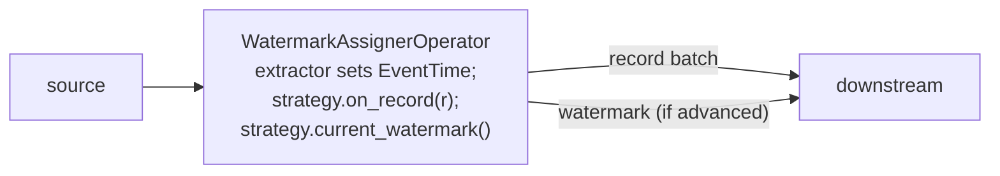
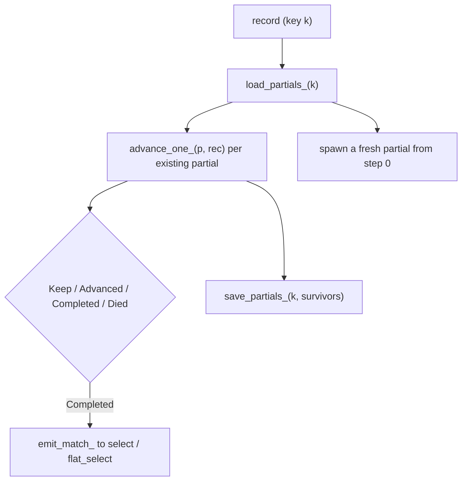

# Time, watermarks, windows and CEP

> The event-time subsystem: how the engine tracks event-time progress through watermarks, fires keyed windows, and matches patterns over per-key event sequences.

## Overview

clink processes records on the event-time axis: the time at which an event occurred in the source system, not when the engine sees it. Event time is carried per record as a 64-bit millisecond count since the Unix epoch (`EventTime`). A `Watermark` is the engine's lower bound on event-time progress on a stream, and it is what lets stateful operators decide that "no further records earlier than `t` will arrive", so a window can fire or an expired pattern partial can be pruned. Watermarks are assigned by a dedicated operator from a pluggable strategy, then travel in-band alongside data through the operator DAG. Window operators and the CEP operator consume those watermarks to drive their firing and eviction logic.

This page covers the watermark machinery, the four window operators (tumbling, sliding, session, evicting), the trigger and evictor abstractions, late-data handling, and the NFA-based complex-event-processing operator.

## Where it lives

| Path | What |
|------|------|
| `include/clink/time/event_time.hpp` | `EventTime` (millis-since-epoch wrapper) |
| `include/clink/time/watermark.hpp` | `Watermark` (timestamp + idle flag) |
| `include/clink/time/watermark_strategy.hpp` | `WatermarkStrategy<T>` and the built-in strategies |
| `include/clink/time/alignment_group.hpp` | `AlignmentGroup` + registry for watermark alignment |
| `include/clink/operators/watermark_assigner_operator.hpp` | `WatermarkAssignerOperator<T>` |
| `include/clink/runtime/multi_input_alignment.hpp` | `MultiInputAlignment` (watermark min + barrier alignment across N inputs) |
| `include/clink/operators/window_trigger.hpp` | `Trigger`, `TriggerContext`, `TimeWindow`, built-in triggers |
| `include/clink/operators/window_state.hpp` | `WindowEntry`, `SessionRow`, `BufferEntry` and their codecs |
| `include/clink/operators/window_evictor.hpp` | `Evictor`, `CountEvictor`, `TimeEvictor` |
| `include/clink/operators/tumbling_window_operator.hpp` | `TumblingWindowOperator<Key,Value,Agg>` |
| `include/clink/operators/sliding_window_operator.hpp` | `SlidingWindowOperator<Key,Value,Agg>` |
| `include/clink/operators/session_window_operator.hpp` | `SessionWindowOperator<Key,Value,Agg>` |
| `include/clink/operators/evicting_tumbling_window_operator.hpp` | `EvictingTumblingWindowOperator<Key,Value,Out>` |
| `include/clink/operators/async_window_operator.hpp` | async-state variants (tumbling/sliding) on the disaggregated path |
| `include/clink/core/pane_info.hpp` | `PaneInfo` (per-emission timing metadata) |
| `include/clink/cep/pattern.hpp` | `Pattern<T>` DSL, `Step`, `EdgeKind`, `SkipStrategy` |
| `include/clink/cep/cep_operator.hpp` | `CepOperator<T,U>` (NFA matcher) |
| `include/clink/cep/cep.hpp`, `include/clink/cep/pattern_stream.hpp` | `cep::pattern(...)` entry points and `PatternStream<T>` |

## How it works

### Event time and watermarks

A record may carry an `EventTime`. The `WatermarkAssignerOperator<T>` is a pass-through operator inserted into the stream that does two things per data element: it stamps event time on any record that lacks one (via a user-supplied extractor) and it feeds every record to a `WatermarkStrategy<T>`. The strategy is purely observational: `on_record(...)` updates its internal state and `current_watermark()` reports the current watermark if it advanced since the last query, otherwise `std::nullopt`. The assigner is the only component that actually emits watermarks; in the current cadence it queries the strategy once per batch and emits a watermark element downstream if one is available.

Three strategies ship in `watermark_strategy.hpp`:

- `MonotonicWatermarkStrategy<T>`: watermark = max event time observed. Out-of-order arrivals are tolerated but never regress the watermark.
- `BoundedOutOfOrdernessStrategy<T>`: watermark = (max event time observed) minus a configured `bound` in milliseconds. Events arriving up to `bound` late are still in-window.
- `PartitionAwareBoundedOutOfOrdernessStrategy<T>`: tracks the max event time per `Record::source_partition`, then emits (min across partitions) minus `bound`, so the watermark advances only as fast as the slowest partition. Records with no partition fold into one global bucket, making it byte-identical to the bounded strategy for non-partitioned sources. Its documented v1 limitation: a partition that goes quiet mid-stream keeps pinning the min low, because its per-partition max never advances.

The assigner also forwards (but does not re-feed) upstream watermarks: deriving event-time progress at this boundary is the assigner's responsibility. Its `flush()` emits the strategy's final watermark at end of stream.

### Idleness

A `Watermark` carries an `idle` flag in addition to its timestamp. Calling `.with_idleness(duration)` on the assigner arms a processing-time probe (registered on `open()` and re-scheduled at half the idleness interval) so the assigner can detect that no record has arrived for `duration` even when zero records, watermarks, or barriers are flowing through `process()`. When that happens it emits `Watermark::idle(...)`. The timestamp on an idle marker is informational; downstream alignment keys off `is_idle()`. When a record next arrives, the operator transitions back to active and the next watermark is non-idle.

### Multi-input alignment

When an operator has N inputs (a union or a join), `MultiInputAlignment` tracks per-input watermark state and computes the downstream watermark as the running min of all inputs. Idle inputs are special-cased: an idle input's watermark is set to `Watermark::max()` so it cannot hold the min back, and an input transitioning from idle back to active is clamped to at least the currently-emitted global watermark so the global watermark never regresses. If every alive input is idle, a single idle marker is forwarded; if all inputs close, the min naturally becomes `max()` (end of time). The same class also drives Chandy-Lamport barrier alignment across the inputs (see [./checkpointing.md](./checkpointing.md)).

### Watermark alignment groups

Separate from multi-input alignment, `AlignmentGroup` lets several `WatermarkAssignerOperator`s (typically one per source) coordinate so the fastest is back-pressured when it runs too far ahead of the slowest. Enrol via `.with_watermark_alignment(group_name, max_drift, max_wait)`. Each member publishes its watermark into a shared, process-wide `AlignmentGroupRegistry`-resolved group; before processing a data element the assigner blocks (bounded by `max_wait`) while its own watermark exceeds `group_min + max_drift`. Blocking at the assigner back-pressures the upstream source through the channel. The drift computation guards the `Watermark::min()` (INT64_MIN) sentinel against integer overflow by treating it as max drift.

### Window operators

The aggregate window operators (`TumblingWindowOperator`, `SlidingWindowOperator`, `SessionWindowOperator`) share a common shape: they are keyed (`Operator<pair<Key,Value>, pair<Key,Agg>>`), they fold each value into a per-window aggregate using a user `initial()` + `combiner()`, and they fire windows when the watermark crosses the window end. `TimeWindow` is a half-open interval `[start, end)` on the event-time axis (`window_trigger.hpp`).

Window assignment differs per operator:

- Tumbling: one window, `start = (ts / size) * size`.
- Sliding: a record fans out to up to `size/slide` overlapping windows (`window_starts_for_`). The constructor validates that `size` is a positive multiple of a positive `slide`.
- Session: each record establishes a provisional window `[ts, ts + gap]`; overlapping sessions for the same key merge (min start, max end, aggregates combined via a third user function `merger`). Sessions are kept in a per-key sorted `std::map<start, Session>`.

Each operator's `process()` dispatches on element kind: data records go through `ingest_one_` (window assignment + late-data routing), watermarks call `on_watermark_advance_` / `fire_due_sessions`, and barriers go through `on_barrier`. The `flush()` hook synthesises a max watermark at end of stream so any still-open windows fire before the job ends.

#### Firing, panes and the earliest-window-end fast path

On a watermark advance, the tumbling and sliding operators walk their active windows, and for each unfired window whose end the watermark has crossed they dispatch the trigger's `on_event_time` and, if it fires, emit the aggregate. Each emission carries a `PaneInfo` describing timing (`Early` / `OnTime` / `Late`), a monotonic `pane_index`, and `is_first` / `is_last` flags. On-time fires are accumulated into a single batch before being pushed downstream to avoid one channel lock per fired window.

The tumbling operator keeps an `earliest_window_end_` watermark over its active state. When the incoming watermark is below it, no window can fire or purge yet, so the full state scan is skipped. This turns the common "watermark advanced but crossed no window boundary" tick into a single comparison; it is recomputed after a batch of fires/purges.

#### Triggers

When (not just whether) a window emits is decided by a `Trigger<T, TimeWindow>`. A trigger returns a `TriggerResult`: `Continue`, `Fire`, `Purge`, or `FireAndPurge` (helpers `should_fire` / `should_purge`). The default is `EventTimeTrigger`, which fires when the watermark crosses `window.end` and deliberately returns `Fire` (not `FireAndPurge`) so the operator's allowed-lateness logic owns purging. Built-ins also include `ProcessingTimeTrigger` (fires on wall-clock crossing `window.end`) and `CountTrigger` (fires after N records). Triggers see the engine's time signals through a `TriggerContext` (`current_watermark()`, `current_processing_time()`); the operator-side implementation is `detail::OperatorTriggerContext`. The tumbling and sliding operators expose `.with_trigger(...)`. The session operator has no pluggable trigger (it always fires on watermark crossing session end).

Stateful triggers (e.g. `CountTrigger`) hold per-window progress that must survive checkpoint/restore: they override `is_stateful()`, `snapshot_state()`, and `restore_state()`. The window operator persists the blob under a fixed key in a `trigger_state` slot at each barrier (`persist_trigger_state_`) and feeds it back on `open()` (`restore_trigger_state_`). Stateless triggers leave all of this as zero-cost no-ops. Trigger state is operator-level (one blob, not per-user-key), so on rescale it lands in a single key-group and only one post-rescale subtask restores it; a same-parallelism restart restores it fully.

#### Allowed lateness and the late side output

`.allowed_lateness(duration)` configures how long after `window.end` state is retained to accept late records. The window-entry `fired` flag (in `WindowEntry<Agg>`) distinguishes the on-time fire from late re-fires:

- A record arriving within `[window.end, window.end + allowed_lateness]` updates the aggregate and immediately re-emits a `Late` pane.
- A window is purged when the watermark reaches `window.end + allowed_lateness`, or when a trigger returns `Purge` / `FireAndPurge`. The lateness deadline overrides the trigger (the cleanup wins).

`.late_output_tag(tag)` opts in to routing records that arrive *after* the purge deadline to a side output (typed on `Value`, preserving event time), instead of the historic behaviour of silently creating a fresh bucket. Records still within the lateness band are not routed to the side output; only records past the deadline are. The default (no tag) is unchanged for back-compatibility. Side outputs are obtained from `RuntimeContext::side_output<Value>(tag)`.

#### Evicting windows and evictors

`EvictingTumblingWindowOperator<Key,Value,Out>` buffers raw records per `(window, key)` so an `Evictor<Value, TimeWindow>` can pre-filter them before a user `ProcessFn` runs over the surviving records. The interaction order is: on `Fire`/`FireAndPurge`, run `evict_before`, then the process function, then `evict_after`, then emit; on `Purge`, drop the buffer without running the process function. Built-in evictors are `CountEvictor` (keep the most recent N records) and `TimeEvictor` (keep records within `max_age` of the most recent record). Evictors exist because you cannot un-combine an aggregate to drop an old record, so the evicting operator is a separate type that retains the raw buffer. Evictors are not supported on the aggregate window operators.

#### Durability of window state

Each operator has an in-memory constructor and a persistent constructor that additionally takes codecs. In persistent mode, window state is mirrored to `KeyedState`:

- Tumbling: `KeyedState<pair<window_start,Key>, WindowEntry<Agg>>` in slot `"windows"`.
- Sliding: `KeyedState<pair<window_start,Key>, WindowEntry<Agg>>` in slot `"sliding_windows"` (write-through; the hot path reads/writes the backend directly).
- Session: one `KeyedState<Key, vector<SessionRow<Agg>>>` row per key in slot `"session_windows"`, so a merge is a single atomic put of the whole vector.
- Evicting: `KeyedState<pair<window_start,Key>, BufferEntry<Value>>` in slot `"evicting_buffers"`.

The codecs (`window_entry_codec`, `session_row_codec`, `buffer_entry_codec`, `record_codec`) live in `window_state.hpp`; each encodes the `fired` flag and `next_pane_index` so a restored window does not re-emit its on-time pane and late re-fires keep consistent pane numbering. The tumbling, session, and evicting operators treat an in-memory map as the authoritative hot path and rehydrate it from the backend on `open()` via `scan(...)`. They support a write-back cache mode: with `CLINK_WB_STATE_CACHE=1`, per-record puts are skipped and the in-memory working set is flushed to the backend once per barrier in `on_barrier`, before the barrier is forwarded; in strict mode (the default) each record is mirrored through immediately. Because these are stateful operators, a stable `.uid()` must be pinned so state realigns on restore (see [./state-and-backends.md](./state-and-backends.md)). The async-state variants in `async_window_operator.hpp` keep accumulators in `KeyedState` and ride event-time timers in the framework `TimerService` for firing; see [./async-state-execution.md](./async-state-execution.md).

#### Columnar ingest fast path

For `int64` key + `int64` value instantiations only, the tumbling, sliding, and session operators expose `supports_columnar()` + `process_columnar()`. When a columnar batch carrying the 3-column `{event_time, key, value}` Arrow sidecar arrives, the operator folds the columns straight into the per-window accumulators by calling the same `ingest_one_` the row path uses, skipping only the per-record decode, so triggers, late panes, allowed-lateness, and watermark firing stay byte-identical to the row path. All schema guards are checked before any `ingest_one_` runs, so a `false` return never half-processes a batch and the runner can safely fall back to `process()`. The `WatermarkAssignerOperator` has its own columnar fast path (`with_columnar_event_times` / `with_columnar_partitions`) that reads event times (and optionally partitions) from the sidecar and forwards the batch unchanged. See [./columnar-execution.md](./columnar-execution.md).

### Event-time timers

Beyond windows, operators can register event-time and processing-time timers through `RuntimeContext::timer_service()` (`register_event_time_timer(ts, key)` / `register_processing_time_timer(ts, key)`). The base `Operator::on_watermark` default fires every event-time timer whose timestamp is at most the watermark via `fire_due_event_time_timers`, then forwards the watermark. Window operators override `on_watermark` and own their firing directly rather than relying on per-window timers; the assigner's idleness probe uses a processing-time timer.

### Complex event processing

CEP matches a `Pattern<T>` against the per-key event sequence and emits a user value per completed match. Patterns are built fluently from `Pattern<T>::begin(name)` and a chain of steps. Each step carries a name, a predicate (`.where(...)`, simple or iterative), and an `EdgeKind` describing how it connects to the previous step:

- `Begin`: the first step (always present, exactly once).
- `Next`: strict contiguity. The very next event must satisfy the predicate or the partial dies.
- `FollowedBy`: relaxed contiguity. Skip non-matching events until one satisfies the step.
- `NotNext`: strict negation. The very next event must not match; a match kills the partial, a non-match advances past the negative step.
- `NotFollowedBy`: relaxed negation. While waiting for the next positive step, no event may match.

Quantifiers apply to a step after `.where(...)`: `.times(n)`, `.times(min,max)`, `.one_or_more()`, `.optional()`, with `.lazy()` to prefer the shortest match (greedy is the default). `.within(duration)` bounds the event-time span between a partial's first and last events. `.after_match_skip(strategy)` controls what happens to other in-flight partials when one completes (`NoSkip`, `SkipPastLastEvent`, `SkipToNext`, `SkipToFirst(name)`, `SkipToLast(name)`). `Pattern::validate()` runs at operator construction and rejects malformed patterns (empty, misplaced `Begin`, quantifier on a negative step, trailing `NotFollowedBy` without `within`, duplicate step names).

#### The matcher

`CepOperator<T,U>` is an NFA-style matcher. Partial matches are stored per key in `KeyedState<int64_t, vector<PartialMatch<T>>>` under slot `"__cep_partials__"` (one row per user key, keeping routing-by-key correct under parallelism). A `PartialMatch<T>` tracks the captured events, a parallel list of which step captured each event, per-event timestamps, the current step index, and the capture count within the current step (for quantifiers).

`advance_one_` walks steps from the partial's current step, evaluating the predicate (iterative predicates receive a `PatternMatch<T>` view of events captured so far). A positive match captures the event up to `max_count` and auto-advances when the count is met; a non-match either advances (if the quantifier minimum is met) or dies (strict `Next`) or waits (`FollowedBy`). Negative steps do not capture: a match kills the partial, a non-match advances past it. A trailing `NotFollowedBy` stays pending until its `within` window closes, at which point `prune_expired_` completes it as a success (emitted on the operator's main output with the watermark as event time) rather than timing it out.

On watermark advance, `prune_expired_` evicts partials whose `start_ts` is older than `(watermark - within)`. When a timed-out side output is wired (`with_timed_out_output` / `with_timed_out_flat_output`), each pruned partial that is not a pending trailing-negative success is emitted on that tag before being dropped; otherwise it is silently dropped. `flush()` drops incomplete partials at end of stream.

#### Entry points and SQL

`cep::pattern(stream, pattern, codec)` has keyed and non-keyed overloads (`cep.hpp`). The keyed form looks up the typed key extractor registered by `.key_by(...)` so the planner uses hash routing into the operator; the non-keyed form routes all events through sentinel key 0. The returned `PatternStream<T>` materialises the operator on `.select<U>(fn)` (one record per match) or `.flat_select<U>(fn)` (zero or more records per match). CEP is also reachable from SQL `MATCH_RECOGNIZE`: the planner lowers it to a `match_recognize_row` operator (one row per match, append-only) that rebuilds a `Pattern<Row>` from the parsed steps/defines/measures and drives a `CepOperator<Row,Row>`; `PARTITION BY` columns become a `row_compute_key` keyer with hash routing (`src/sql/physical_plan.cpp`). See [./sql-frontend.md](./sql-frontend.md).

## Key types and APIs

| Type / function | Responsibility |
|-----------------|----------------|
| `EventTime` | 64-bit millis-since-epoch event timestamp |
| `Watermark` | event-time lower bound with an idle flag; `idle()`, `min()`, `max()` |
| `WatermarkStrategy<T>` | `on_record` + `current_watermark`; observes records, reports the current watermark |
| `MonotonicWatermarkStrategy` / `BoundedOutOfOrdernessStrategy` / `PartitionAwareBoundedOutOfOrdernessStrategy` | the three built-in strategies |
| `WatermarkAssignerOperator<T>` | stamps event time and emits watermarks; `.with_idleness`, `.with_watermark_alignment`, columnar fast path |
| `AlignmentGroup` / `AlignmentGroupRegistry` | cross-source watermark alignment with bounded drift |
| `MultiInputAlignment` | per-input watermark min + barrier alignment across N inputs |
| `TimeWindow` | half-open `[start, end)` event-time interval |
| `Trigger<T,Window>` / `TriggerContext<Window>` | decide when a window emits; durability hooks for stateful triggers |
| `EventTimeTrigger` / `ProcessingTimeTrigger` / `CountTrigger` | built-in triggers |
| `Evictor<T,Window>` / `CountEvictor` / `TimeEvictor` | pre-filter buffered records in evicting windows |
| `WindowEntry<Agg>` / `SessionRow<Agg>` / `BufferEntry<Value>` | per-window durable state + codecs |
| `PaneInfo` | per-emission timing (`Early`/`OnTime`/`Late`), pane index, first/last flags |
| `TumblingWindowOperator` / `SlidingWindowOperator` / `SessionWindowOperator` | aggregate window operators |
| `EvictingTumblingWindowOperator` | raw-buffer window with an evictor + process function |
| `Pattern<T>` / `Step` / `EdgeKind` / `SkipStrategy` | CEP pattern DSL and compiled IR |
| `CepOperator<T,U>` | NFA matcher; per-key partials in `KeyedState`, timed-out side output |
| `cep::pattern` / `PatternStream<T>` | fluent CEP entry points and `.select` / `.flat_select` |

## Configuration and knobs

- `WatermarkAssignerOperator::with_idleness(duration)`: emit an idle watermark when no record arrives for `duration`. Default 0 (disabled). The idle probe fires at half the idleness interval.
- `WatermarkAssignerOperator::with_watermark_alignment(group, max_drift, max_wait)`: bound cross-source drift; `max_wait` default 1 second per process() call.
- `BoundedOutOfOrdernessStrategy` / `PartitionAwareBoundedOutOfOrdernessStrategy`: `bound` (milliseconds) constructor argument.
- Window operators: `.allowed_lateness(duration)` (default 0, drop late records), `.late_output_tag(tag)` (default unset, late-late records silently dropped), `.with_trigger(...)` (tumbling/sliding; default `EventTimeTrigger`).
- `CLINK_WB_STATE_CACHE=1` (env var): write-back cache mode for the tumbling, session, and evicting operators; defers per-record state puts and flushes once per barrier. Default unset (strict per-record mirroring).
- Columnar ingest fast path: `set_columnar_enabled(bool)` on the window operators (default on; only effective for `int64`/`int64` instantiations and only under `CLINK_HAS_ARROW`).
- `Pattern<T>`: `.within(duration)` (default none, partials live indefinitely), `.after_match_skip(strategy)` (default `NoSkip`), quantifier modifiers, `.lazy()`.

## Guarantees and caveats

- Watermarks are monotonic by contract: an operator forwarding a regressing watermark is a bug, and downstream operators may ignore it. Idle and idle-to-active transitions are clamped in `MultiInputAlignment` so the global watermark never regresses.
- The three watermark strategies are exactly those shipped (monotonic, bounded out-of-orderness, partition-aware bounded). The partition-aware strategy now supports per-partition idleness: the `WatermarkAssignerOperator` tracks each partition's last-activity wall-clock and, on its processing-time probe, calls `set_idle_partitions` so a partition quiet for longer than the idleness duration is excluded from the min (it re-enters the instant it produces again). This is enabled via `with_idleness(...)` on the assigner, reachable from SQL by the source-table `idle_timeout_ms` option, and complements the assigner's existing stream-level idle marker (whole-source quiet) for multi-input alignment.
- Tumbling, sliding, and session windows support `allowed_lateness` and `late_output_tag`. Tumbling and sliding support pluggable triggers; the session operator does not (it fires on watermark crossing session end). Evictors are supported only on the evicting window operator, not on the aggregate operators.
- The SQL windowed-aggregate operators (`WindowRowOp` for `TUMBLE`/`HOP`/`CUMULATE` and `SessionWindowRowOp`, in `src/sql/install.cpp`) are a separate, thinner implementation from the typed operators above. They now **drop late records**: a record whose window has already fired and been purged is dropped instead of re-creating the window and emitting a duplicate, partial row. For `WindowRowOp` the cutoff is "window end at or under the current watermark (less `allowed_lateness_ms_`, default 0)", captured at ingest on every path - sync, columnar, and the async/disaggregated coroutine path (where the fold is deferred, so the ingest-time watermark, not the fold-time one, is the correct cutoff). For `SessionWindowRowOp` (sync + columnar; no async path) the guard is applied only when a record would OPEN a fresh session: if that single-event session is already purged (`ts + gap` at/under the cutoff) it is dropped, whereas a record that MERGES into a still-live session legitimately extends it and always proceeds. Idle-source handling is wired through SQL via the source-table `idle_timeout_ms` option (per-partition + stream-level idleness on the assigner). Still on the SQL path as follow-ups: a SQL knob to raise `allowed_lateness` (with late re-fire) and a late side output.
- Stateful-trigger state and window state are durable in the persistent (codec-bearing) constructors and restore fully on a same-parallelism restart. Operator-level trigger state lands in a single key-group on rescale, so only one post-rescale subtask restores it; full rescale routing of operator-level trigger state (and of the async window operators' timers and `"wm"` slot) is a deferred follow-on. Window operators are stateful and require a pinned `.uid()`.
- The evicting window re-puts the whole record vector per mutation in strict mode (write amplification); `CLINK_WB_STATE_CACHE=1` amortises this to one put per barrier. A true incremental list-state is the longer-term home.
- CEP is a v1 subset: linear patterns, greedy quantifiers by default (lazy available), strict/relaxed contiguity, and the listed negation and skip strategies. Documented gaps (in `pattern.hpp`) include group patterns as addressable units (groups are flattened at construction), group-level repetition, and lazy controls beyond `.lazy()`. A trailing `NotFollowedBy` requires `.within(...)` or the pattern is rejected at validation. CEP partials are durable in `KeyedState` only when a state backend is present; without one the operator falls back to an in-memory shadow that is lost on restart (used by unit tests, not the default cluster wiring).
- The inline fluent CEP `.select` / `.flat_select` capture the user function into the process-wide runner registry, so submitting such a job to a remote TaskManager that lacks the registration fails there; package the operator as a real plugin for cross-process CEP jobs.
- The columnar ingest fast path is limited to `int64` key + `int64` value and the 3-column `{event_time, key, value}` Arrow sidecar; all other instantiations and non-columnar batches take the row path, which is the semantic reference.

## Related

- [./operator-model.md](./operator-model.md) - the operator/DAG model these operators plug into.
- [./task-lifecycle.md](./task-lifecycle.md) - how `open`/`process`/`flush`/`on_barrier` are driven.
- [./state-and-backends.md](./state-and-backends.md) - `KeyedState` and the backends window/CEP state persists into.
- [./checkpointing.md](./checkpointing.md) - in-band barriers, `MultiInputAlignment`, and trigger/window state snapshots.
- [./fault-tolerance-and-rescale.md](./fault-tolerance-and-rescale.md) - restore and the rescale follow-ons noted above.
- [./columnar-execution.md](./columnar-execution.md) - the Arrow columnar path the window/assigner fast paths use.
- [./async-state-execution.md](./async-state-execution.md) - the async window operators and event-time timer firing under disaggregated state.
- [./sql-frontend.md](./sql-frontend.md) - how SQL windowing and `MATCH_RECOGNIZE` lower onto these operators.
- [../connectors/README.md](../connectors/README.md) - sources that set event time / partitions feeding the assigner.
