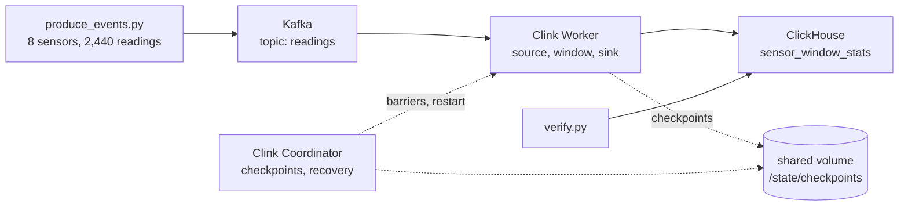

# Your first real Clink pipeline

This tutorial runs a stream-processing pipeline you could plausibly deploy:
sensor readings arrive on a Kafka topic, Clink aggregates them into
ten-second event-time windows per sensor, and the results land in ClickHouse
as they close. Then you kill the process doing the work, while data is still
arriving, and check what survived.

It takes about ten minutes and needs only Docker. Nothing is compiled: the
services are stock Kafka and ClickHouse images and the published Clink
runtime image, which covers amd64 and arm64, so an Apple Silicon laptop runs
the real thing rather than an emulated one.

Everything below lives in
[`examples/kafka-to-clickhouse`](https://github.com/orhaugh/clink/tree/main/examples/kafka-to-clickhouse)
in the repository.

```bash
git clone https://github.com/orhaugh/clink
cd clink/examples/kafka-to-clickhouse
docker compose up -d
```

## What you just started



Five containers, and one that exits:

| Service | What it does |
|---|---|
| `kafka` | A single-node broker. The `readings` topic is created by a one-shot `kafka-init` container, because Clink assigns partitions itself at start-up and needs the topic to exist first. |
| `clickhouse` | Holds the results. A one-shot init script creates the `sensor_window_stats` table. |
| `coordinator` | The Clink control plane: it triggers checkpoints, watches the Worker, and restarts the job from the last completed checkpoint when the Worker dies. |
| `worker` | Where the pipeline actually runs: the Kafka source, the windowed aggregation and the ClickHouse sink, as three subtasks. |
| `submit` | Runs once. It hands `pipeline.sql` to the Coordinator and exits. |

The Coordinator and Worker share a volume mounted at `/state`. Checkpoints go
to `/state/checkpoints`, which is what makes the recovery later possible: a
restarted Worker has to be able to read the state the dead one wrote.

Two Clink roles, rather than one process, because that is the shape recovery
has. Clink will also run this same file in a single process with
`clink run pipeline.sql` and no daemons at all; what a single process cannot
do is have something outside it notice its death and restart the job.

## The workload

Eight temperature sensors report once per second of event time, for five
minutes: 2,440 readings in all. Each reading is one JSON record.

```json
{"sensor_id": "sensor-03", "ts": 1772352000000, "temp_c": 19.1}
```

`ts` is the event time in epoch milliseconds - when the reading was taken,
not when it reached Kafka. The distinction is the point of the next section.

Every value is a pure function of the sensor and the tick, computed in
integer tenths of a degree, so there is no randomness anywhere:
`scripts/workload.py` is the single definition, and both the producer and the
checker read it. That is what lets the verification later be a comparison
against a recomputed expectation rather than against whatever the engine
happened to write.

One sensor is deliberately awkward. `sensor-03`'s readings are held back and
reach Kafka two seconds after the others', so they arrive out of event-time
order. A pipeline that grouped by arrival time would put them in the wrong
window and no reading would be missing to show it.

## The pipeline

`pipeline.sql` is three statements: where the data comes from, where it goes,
and one standing query.

```sql
CREATE TABLE readings (
    sensor_id VARCHAR,
    ts        BIGINT,
    temp_c    DOUBLE
) WITH (
    connector         = 'kafka',
    format            = 'json',
    brokers           = 'kafka:9092',
    topic             = 'readings',
    group_id          = 'clink-tutorial',
    auto_offset_reset = 'earliest',
    event_time_column = 'ts',
    watermark_lag_ms  = '3000'
);
```

`event_time_column='ts'` is what makes this event-time processing rather than
arrival-time processing. `watermark_lag_ms='3000'` states how far out of order
the stream may be: Clink's watermark trails the largest `ts` it has seen by
three seconds, and a window is only closed once the watermark passes its end.
`sensor-03` is two seconds late, comfortably inside that, so its readings land
in the window their timestamp says they belong to.

The sink is the ClickHouse table:

```sql
CREATE TABLE sensor_window_stats (
    sensor_id    VARCHAR,
    window_start BIGINT,
    window_end   BIGINT,
    readings     BIGINT,
    avg_temp_c   DOUBLE,
    min_temp_c   DOUBLE,
    max_temp_c   DOUBLE
) WITH (
    connector = 'clickhouse',
    format    = 'json',
    host      = 'clickhouse',
    port      = '9000',
    database  = 'default',
    table     = 'sensor_window_stats',
    user      = 'clink',
    password  = 'clink',
    batch_rows = '1'
);
```

And the query that connects them:

```sql
INSERT INTO sensor_window_stats
SELECT sensor_id,
       window_start,
       window_end,
       COUNT(*)    AS readings,
       AVG(temp_c) AS avg_temp_c,
       MIN(temp_c) AS min_temp_c,
       MAX(temp_c) AS max_temp_c
FROM readings
GROUP BY TUMBLE(ts, INTERVAL '10' SECOND), sensor_id;
```

`TUMBLE(ts, INTERVAL '10' SECOND)` in the `GROUP BY` is the windowing:
fixed, non-overlapping ten-second windows over event time, one group per
sensor per window. `window_start` and `window_end` are synthetic columns
Clink makes available whenever a window function is present.

This is a standing job, not a query that returns. It was submitted when you
ran `docker compose up`, and it is already waiting for input:

```bash
curl -s localhost:8081/api/v1/jobs
```

```json
{"jobs":[{"id":1,"status":"RUNNING","error_count":0, ...}]}
```

## Stream the readings in

```bash
./scripts/produce_events.py
```

About 50 readings a second, so roughly 50 seconds in total, paced so you can
watch the results appear rather than having them all land at once. The
readings go through the Kafka container's own console producer, so you need
no Kafka client on your machine.

In another terminal, watch the rows arrive:

```bash
watch -n 2 "curl -s -u clink:clink 'http://localhost:8123/' \
  --data-binary 'SELECT count() FROM sensor_window_stats'"
```

Or look at the results themselves:

```bash
curl -s -u clink:clink 'http://localhost:8123/' --data-binary "
  SELECT sensor_id, window_start_ts, readings, round(avg_temp_c, 2) AS avg_c
  FROM sensor_window_stats ORDER BY window_start, sensor_id LIMIT 8
  FORMAT PrettyCompactMonoBlock"
```

```
┌─sensor_id─┬─────────window_start_ts─┬─readings─┬─avg_c─┐
│ sensor-01 │ 2026-03-01 08:00:00.000 │       10 │    18 │
│ sensor-02 │ 2026-03-01 08:00:00.000 │       10 │  18.5 │
│ sensor-03 │ 2026-03-01 08:00:00.000 │       10 │    19 │
...
```

Two things in that output are worth pausing on. Each window has exactly ten
readings, including `sensor-03`'s, whose records arrived two seconds after
everyone else's: they were placed by their timestamps. And the rows appeared
while the stream was still running - each window was written when the
watermark passed its end, not when the job finished. The job has not
finished. It is a stream; it does not intend to.

!!! note "If nothing appears"
    `curl -s localhost:8081/api/v1/jobs/1/operators` names the stage that is
    stuck in one line per operator: `records_out` of zero at
    `kafka_source_string` means nothing is being read from Kafka. There is a
    known intermittent where a fresh stack's source assigns its partition and
    then reads nothing, silently
    ([issue #8](https://github.com/orhaugh/clink/issues/8));
    `docker compose restart worker` clears it, and the aggregates stay exact
    because nothing had been consumed yet.

## Break it

This is the part that separates a stream processor from a script with a
loop. While the producer is still running, in another terminal:

```bash
docker compose kill worker
```

`kill`, not `stop`: SIGKILL, no cleanup, no chance to flush anything. The
process holding every open window's state is gone.

Within about two seconds the Coordinator notices (a Worker heartbeats every
500 ms; three missed beats is a loss) and says so:

```bash
docker compose logs coordinator | grep -iE 'lost|restart|restore'
```

```
[coordinator.watchdog] worker lost: worker-1
[coordinator.watchdog] job_id=1 awaiting_restart (attempt 1/10) drain_expected=0
[coordinator.restart]  job_id=1 restart waiting for capacity: 3 task(s) need slots,
                       0 free; a worker re-registration re-fires this restart
```

The job is not failed and not abandoned. It is waiting for somewhere to run.
Give it somewhere:

```bash
docker compose start worker
```

```
[coordinator.restart] job_id=1 attempt=1 survivors=1 tasks=3
[coordinator.restart] job_id=1 restore point: checkpoint 5
                      (latest_completed=5 latest_confirmed=0 tracked=0)
```

That second line is the whole mechanism in one sentence. The job restarts
from checkpoint 5, the newest checkpoint that completed before the kill. A
checkpoint is a consistent cut across the whole job: the Kafka offsets the
source had read up to, and the contents of every open window at exactly that
point. Restoring it puts the source back to the offsets in that cut and the
windows back to the contents they had in the same cut, so the records between
that checkpoint and the crash are re-read from Kafka and re-aggregated. They
are not lost, and they are not counted twice, because the window state they
are folded into was rewound with them.

Let the producer finish, then check.

## Verify it, independently

```bash
./scripts/verify.py
```

```
verify: 240 / 240 closed windows in ClickHouse
verify: 240 windows compared with the expectation recomputed from workload.py
verify: every window's reading count, min and max match exactly; every average within 1e-6
verify: 240 rows for 240 windows: no duplicates
verify: PASS
```

The check recomputes every window from `scripts/workload.py` - the same
definition the producer used, evaluated independently of anything the engine
wrote - and compares reading counts, minima and maxima exactly, averages to
within 1e-6. It also refuses two things a passing-looking run could hide: a
window that is not part of the workload, and the 31st window, whose end the
watermark never passes and which therefore must not have fired.

## What that proves, and what it does not

**Keyed state and source position recovered on one cut.** Every window has
its correct reading count, minimum, maximum and average after a SIGKILL
mid-stream. No input was lost, and nothing was double-counted inside the
aggregates. That is checkpoint recovery working: source offsets and operator
state restored from the same consistent cut.

**Delivery into ClickHouse is at-least-once, not exactly-once.** Any row
Clink emitted after the last completed checkpoint is emitted again after the
restart - with identical values, because the recomputation is deterministic -
so a window can land in the table twice. Clink's ClickHouse sink has no
two-phase commit (the SQL planner rejects `delivery_guarantee='exactly_once'`
on it outright rather than pretending), and ClickHouse offers no transaction
for an INSERT to enlist in.

The run above shows no duplicates, and that deserves an explanation rather
than credit: with `batch_rows='1'` each fired window is in ClickHouse
immediately, and a checkpoint completes at most two seconds later, so the
gap between "row inserted" and "insert covered by a checkpoint" is thin, and
this kill missed it. The verifier counts every window's copies on every run
and asserts they are identical whenever they appear; the contract stays
at-least-once whether or not a particular kill exercises it.

This is why `clickhouse-init.sql` makes the table a `ReplacingMergeTree`
ordered by `(sensor_id, window_start)`: duplicates with the same key collapse
when ClickHouse merges parts, and `SELECT ... FINAL` collapses them at read
time. Deduplicating on a key the sink cannot help repeating is the ordinary
way to consume an at-least-once stream, and the pipeline gives you an exact
key to do it on.

The Coordinator states this itself at submission time, before any data moves:

```bash
docker compose logs coordinator | grep guarantee
```

```
[coordinator.guarantee] job delivery guarantee:
  STATE_EXACTLY_ONCE_OUTPUT_AT_LEAST_ONCE (limited by sink 'clickhouse_sink')
```

If you need exactly-once output end to end, the sink has to be able to
commit transactionally with the checkpoint. Clink's Kafka sink
(`delivery_guarantee='exactly_once'`), its PostgreSQL sink through
`PREPARE TRANSACTION`, and its staged-commit file, Parquet and S3 sinks do;
each is documented in the
[connector reference](../connectors/README.md), and the guarantees are
measured under continuous fault injection in the
[qualification campaigns](../qualification/README.md). The point of this
section is that Clink tells you which guarantee you have, and the tutorial
does not claim the stronger one.

## Look inside the state

Here is something you cannot usually do. Ask the running job what it is
holding:

```bash
docker compose exec -e CLINK_LOG_LEVEL=off coordinator \
  clink state-query --job=1 --coordinator=coordinator:8081 \
  --sql="SELECT slot, COUNT(*) AS entries FROM state GROUP BY slot"
```

```json
{"entries":2,"slot":"<raw>"}
{"entries":8,"slot":"win"}
```

Eight entries in the window operator's state slot: one per sensor, the open
window still accumulating. The two `<raw>` entries are operator state rather
than keyed state - the Kafka source's per-partition offset, and the window
operator's watermark.

That is not a bespoke debug endpoint. Clink state is
[an Arrow IPC stream with a documented layout](../internals/state-snapshot-format.md),
so it opens in anything that reads Arrow. Export a checkpoint as Parquet:

```bash
docker compose exec coordinator sh -c '
  latest=$(ls /state/checkpoints/v1/0 | sed -n "s/checkpoint-\([0-9]*\)\.snap$/\1/p" | sort -n | tail -1)
  clink state-export --dir=/state/checkpoints/v1 --id=$latest \
    --out=/state/state.parquet --format=parquet'
docker compose cp coordinator:/state/state.parquet .
```

and read it with no Clink involved at all (`pip install duckdb` first, or
use pyarrow or Polars - it is a plain Parquet file):

```bash
python3 -c "
import duckdb
print(duckdb.sql(\"SELECT slot, key_group, decode(user_key) AS sensor \
                  FROM 'state.parquet' WHERE slot = 'win' ORDER BY sensor\"))"
```

```
┌─────────┬───────────┬─────────────┐
│  slot   │ key_group │   sensor    │
│ varchar │   uint8   │   varchar   │
├─────────┼───────────┼─────────────┤
│ win     │        37 │ "sensor-01" │
│ win     │       106 │ "sensor-02" │
│ win     │         7 │ "sensor-03" │
│ win     │        12 │ "sensor-04" │
...
```

`clink state-cat` prints the same thing without Python. The `key_group`
column is how Clink spreads keys across parallel subtasks, which is what you
would look at to find a hot key or explain skew - the sort of question that
normally requires the engine's own console, or a support ticket.

There is more of this: a checkpoint exports to Parquet or as an Apache
Iceberg snapshot (repeated exports accumulate as snapshots, giving you state
history), and `clink state-diff` shows exactly which keys changed between two
checkpoints. The
[state as data example](../consumer-examples/state_as_data/README.md) runs
the whole surface.

## Clean up

```bash
docker compose down -v
```

`-v` removes the volumes too, so a later run starts from an empty topic and
an empty table. Kafka keeps what you send it: running `produce_events.py`
twice against the same stack doubles the input, and the aggregates with it,
which the verification will report as reading counts of 20 where it expected
10.

## The whole thing, unattended

Every step above, including the kill and the restart, runs as one script:

```bash
./run.sh
```

About three minutes, and it removes the stack afterwards even if it fails,
printing container state, logs and query results when it does.
`KEEP_UP=1 ./run.sh` leaves everything running to poke at. This is also what
CI runs, against both the published runtime image and each newly built one,
so the tutorial cannot quietly stop working.

## Going further

**Run it embedded.** The whole engine also runs in one process with no
cluster at all, and a bare `SELECT` prints its stream to your terminal.
While the stack is up, point it at the same topic:

```bash
docker compose run --rm --no-deps coordinator clink run -e "
  CREATE TABLE readings (sensor_id VARCHAR, ts BIGINT, temp_c DOUBLE)
  WITH (connector='kafka', format='json', brokers='kafka:9092',
        topic='readings', group_id='embedded-peek',
        auto_offset_reset='earliest',
        event_time_column='ts', watermark_lag_ms='3000');
  SELECT sensor_id, window_start, COUNT(*) AS readings, AVG(temp_c) AS avg_temp_c
  FROM readings
  GROUP BY TUMBLE(ts, INTERVAL '10' SECOND), sensor_id"
```

```
{"avg_temp_c":18,"readings":10,"sensor_id":"sensor-01","window_start":1772352000000}
{"avg_temp_c":18,"readings":10,"sensor_id":"sensor-01","window_start":1772352010000}
{"avg_temp_c":18,"readings":10,"sensor_id":"sensor-01","window_start":1772352020000}
...
```

The 240 closed windows print as it re-reads the topic under its own consumer
group, then it waits for more input; Ctrl-C stops and drains it. That is the
same engine, planner and operators as the cluster: `clink run pipeline.sql`
runs the whole tutorial pipeline this way, and adding `--coordinator-host`
and `--coordinator-port` submits the same file to a cluster instead. See
[embedded execution](../internals/embedded.md).

**Change the window.** Edit `pipeline.sql` to
`HOP(ts, INTERVAL '30' SECOND, INTERVAL '10' SECOND)` for overlapping
windows, or `SESSION(ts, INTERVAL '5' SECOND)` for gap-closed sessions, then
`docker compose down -v && docker compose up -d` and run the workload again.
`scripts/verify.py` expects tumbling windows and will report the mismatch,
which is the honest response from a checker that was told what to expect.
The [SQL reference](../sql.md) has the full window vocabulary.

**Scale it out.** Give the topic more partitions and submit with
`--parallelism=4`: Clink assigns partitions to source subtasks
deterministically and hash-partitions the keyed shuffle, so the aggregation
stays correct at any parallelism. This pipeline was run that way on a
four-host cluster with a Worker killed mid-stream, and produced the same
verified result.

**Replay an incident.** Add `--capture-dir` to a job and Clink records what
each operator consumed per checkpoint epoch; `clink replay` then re-executes
one operator over exactly those records, offline and byte-identically, and
`--emit-test` freezes the incident into a permanent regression test. It needs
no extra services, but it is a debugging workflow in its own right rather
than a step in this one:
[replay determinism](../internals/replay-determinism.md) has the contract.

## Where to look next

- [SQL reference](../sql.md) - the full statement, type and function surface.
- [Connectors](../connectors/README.md) - twenty-plus sources and sinks, each
  with its delivery semantics stated.
- [Checkpointing](../internals/checkpointing.md) and
  [fault tolerance and rescale](../internals/fault-tolerance-and-rescale.md) -
  how the recovery you just triggered actually works.
- [Qualification](../qualification/README.md) - the same guarantees measured
  on multi-host clusters under continuous fault injection, published only
  when green.
- [Capability catalogue](../capabilities.md) - what the engine can do, with
  the caveats attached.

Clink is young and pre-1.0: its guarantees hold within the published
qualification bounds above rather than through years of third-party
production use, and public APIs may still change between minor releases. The
[CHANGELOG](https://github.com/orhaugh/clink/blob/main/CHANGELOG.md) calls
out every such change.
